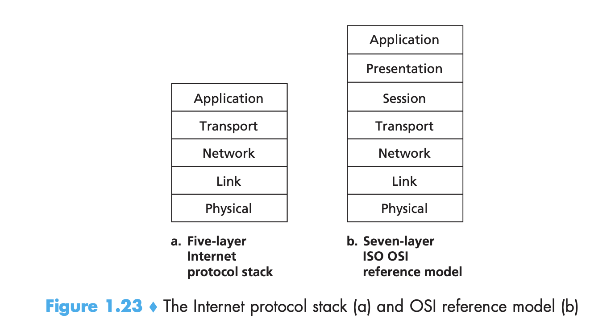
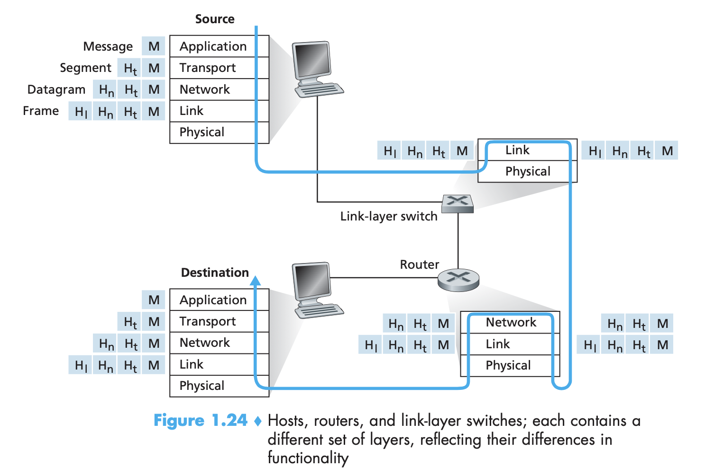
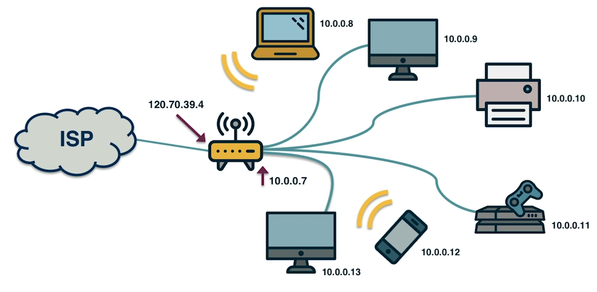
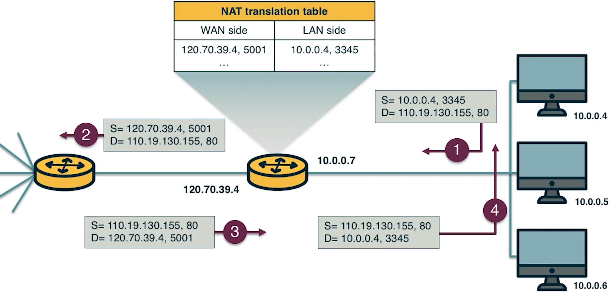
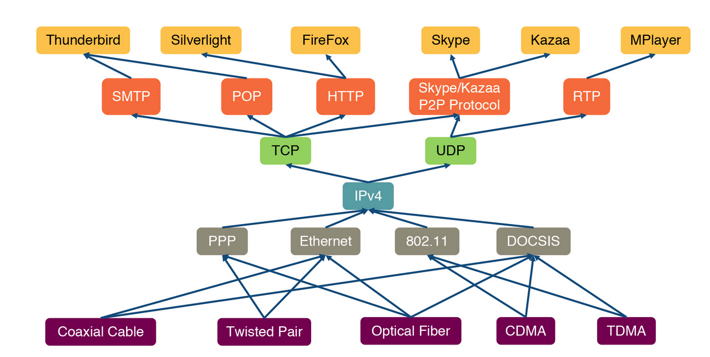
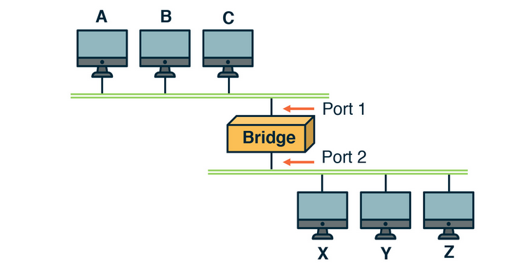
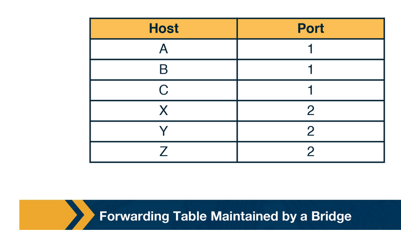
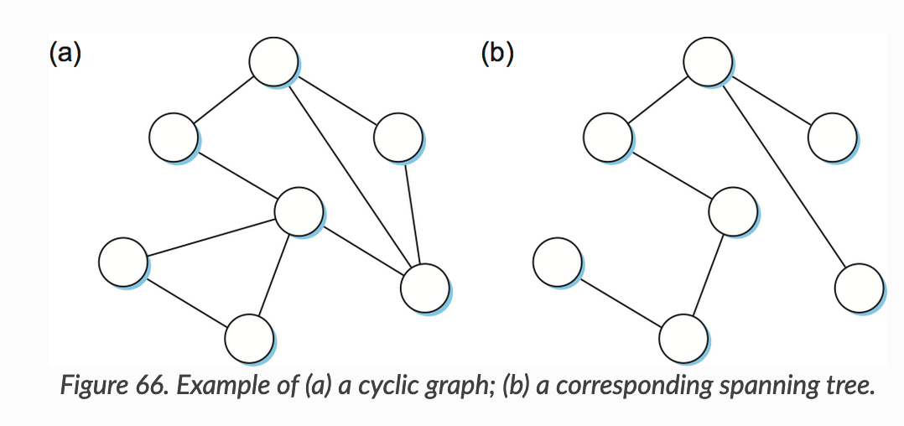

# Week 1 - Introduction to Internet Architecture

Add important dates to google calendar

Week 1 setup

Lesson 1 - History and Internet Architecture

* Video Lectures
* Papers

    * how to read a paper part 1 and 2
    * design of darpa protocols
    * evolution of protocol stacks

Project 1

* VM Setup
    * username and password: mininet

Thoughts: A discombobulated lecture, shallow in some areas and very detailed in others. An odd introduction to computer networks.

**History and Internet Architecture Lectures**

A brief list of important events in computer networking

* 1962 - J Licklider proposes connecting computers so that that data can be accessed quickly
* 1969 - The initial ARPAnet connecting four nodes: UCLA, UCSB, Stanford, and University of Utah was created
* 1973 - To allow individual networks to be independently designed, Bob Kahn and Vint Cerf created TCP/IP
* 1983 - The number of hosts become more than could be held by a single file, so the DNS was created
* 1991 - Tim Berners Lee created the World Wide Web

The** internet uses a****layered architecture** which allows us to discuss a well-defined, specific part of a large and complex system. This simplification itself is of value because it **provides modularity**, making it easier to change the service provided by the labor.

Protocol layers can be implemented in software, in hardware, or in a combination of the two. **Application-layer and transport protocols**--such as HTTP and SMTP -- are almost always **implemented in software** in the end systems. Because the** physical layer and data link layers** are responsible for handling communication over a specific link, they are typically **implemented in a network interface card**. The **network layer** is often a **mixed implementation**.

What are some disadvantages of this stacked model?

* some layers functionality depends on the information from other layers which can violate the goal of layer separation.
* One layer may duplicate lower layer functionalities, for example, error recovery happens on the link basis, but also on higher layers like the transport layer.
* There is overhead in computation because of the abstraction layer between layers.

The **interface between the application layer and the transport****layer** are **sockets**.

Let's briefly summarize the layers

* **Application Layer**
* **Presentation Layer**
* **Session Layer**
* **Transport Layer **
* **Network Layer**
* **Link Layer **
* **Physical Layer**

The figure above shows the physical path that data takes down a protocol stack, through a switch, then a router, and then into a receiving computer. It demonstrates the flow of information through the various layers of the internet, and also an important concept known as **encapsulation**. Encapsulation is the Matryoshka doll enclosing of messages so that they can be properly addressed and handled by the appropriate layers of the internet architecture. You can see how the message M from the source is built-upon to navigate the lower layers of the hierarchy, and finally once it is received at the destination, it is unwrapped and read.

The **End-to-End Principle (e2e)** is the design choice to not build specific application-level functions into the lower layers of the internet architecture. The idea is that the **network core should be simple and minimal while the end systems should carry the intelligence.**

The original goals for the End-to-End principle

* Moving functions and services upward in a layered design
* This increases the flexibility and autonomy of the application designer
* The lower levels are free to focus on their roles

Some violations of the e2e principle are firewalls and NAT (network address translation) boxes.

* **Firewalls**
* **NAT boxes**

If you squint really hard, you can see that the internet architecture is hourglass shaped.

To provide a silly and unwieldy model of this complex ecosystem, some researchers created the evolutionary architecture model that attempts to explain the layered architecture and their evolution in a quantitative manner.

for more information check out [https://gatech.instructure.com/courses/105124/pages/evolutionary-architecture-model?module_item_id=575622](https://gatech.instructure.com/courses/105124/pages/evolutionary-architecture-model?module_item_id=575622)

I will not go into the details of the model because it seems kind of silly, but here are some take aways from the professor. 

* The TCP/IP stack survived and became a vital middle of the internet architecture because it had no competition and applications like FTP, Email and telnet relied on it. It was allowed to grow without being competed against.
* IPv4, TCP, and UDP provide a stable framework through which an ever-expanding set of protocols at the lower layers, as well as new applications and services at the higher levels rely on. The transport layer is also narrow, and it acts as an evolutionary shield for IPv4 because any new protocols that might appear at the transport layer are unlikely to compete with TCP and UDP. By eliminating any new transport protocols, we are eliminating competition with IPv4.
* The model suggests that one way to proactively avoid the hourglass ossification effects is for a network architect to design the functionality of each layer so that the waist is wider, consisting of several protocols that offer largely non-overlapping but general services.

Some researchers have gone as far as deciding that the internet needs to be redesigned for the modern day. 

One research group, known as 4D, envisions the decision-plane has a network wide view of the topology and traffic of the internet, and exerts direct control over the operation of the data plane. 

Another research group is focussed on accountability to provide defenses against malicious actions. The proposed work suggests that source accountability and control-plane accountability could greatly improve the functioning of the internet. They propose the Accountable Internet Protocol (AIP). Source accountability is the ability to trace actions to a particular end host and stop that host from misbehaving. Control-plane accountability is the ability to pinpoint and prevent attacks on routing using origin and path authentication.

**Interconnecting Hosts and Networks**

There are different types of devices that help to provide connectivity between hosts that are in the same network, or help to interconnect networks

**Repeaters and Hubs**: Operate on the **physical layer**. Act on bits, rather than frames. Provide connectivity between hosts that are in the same network. They are simple and inexpensive, but hosts on these devices compete for access to the link.

**Bridges and Layer 2 Switches**: These devices enable communication between hosts that are not directly connected. They operate on the **data link layer** based on MAC addresses. A limitation is the finite bandwidth of the outputs. If the arrival rate of packets is higher than the capacity of the outputs then the packets are temporarily stored.

A bridge is a device with multiple inputs/outputs. It transfers frames from an input to one or multiple outputs. A learning bridge learns, populates and maintains a forwarding table. The bridge consults this table so that it only forwards frames on specific ports. 

A bridge learns by updating the forwarding table whenever it receives a frame.

The preceding strategy works fine until the network has a loop in it, in which case it will fail in a horrible and very stupid way, it will have frames forwarded forever (sad trombone). 

Why would a network have a loop in it? One good reason is that they are built in so that the network has redundancy in the case of failure. Thus, switches should be able to handle loops.

If you think of a network as being represented by a graph that possibly has loops (cycles) then a **spanning tree** is a subgraph of this graph that **covers all the vertices but contains no cycles**.

The **spanning tree algorithm**, is a **protocol used by a set of switches to agree upon a spanning tree for a particular network**. In practice, this means that each switch decides the ports over which it is and is not willing to forward frames. It is by removing ports from the topology that the network is reduced to an acyclic tree. The algorithm is dynamic, meaning that the switches are always ready to reconfigure themselves should a switch in the tree fail.

So **how does it work?**

The switches need to exchange configuration messages with each other and then decide whether or not they are the root or a designated switch based on the messages.

The messages contain:

1. The ID of the switch that is sending the message.
2. The ID for what the sending switch believes to be the root switch
3. The distance, measured in hops, from the sending switch to the root switch

Initially, each switch thinks it is the root, and so it sends a configuration message out on each of its ports identifying itself as the root and giving a distance to the root of 0. Upon receiving a configuration message over a particular port, the switch checks to see if the new message is better than the current best configuration message recorded for that port. The new configuration message is considered better than the currently recorded information if any of the following is true:

* It identifies a root with a smaller ID
* It identifies a root with an equal ID but with a shorter distance
* The root ID and distance are equal, but the sending switch has a smaller ID.

If the new message is better than the currently recorded information, the switch discards the old information and saves the new information.

When a switch receives a configuration message indicating that it is not the root, meaning a message from a switch with a smaller ID, the switch stops generating configuration messages on its own and instead only forwards configuration messages from other switches, after first adding 1 to the distance field. 

Likewise, when a switch receives a configuration message that indicates it is not the designated switch for that port, meaning a message from a switch that is closer to the root or equally far from the root but with a smaller ID, the switch stops sending configuration messages over that port.

Thus, when the system stabilizes, only the root switch is still generating configuration messages, and the other switches are forwarding these messages only over ports for which they are the designated switch. At this point, a spanning tree has been built!
