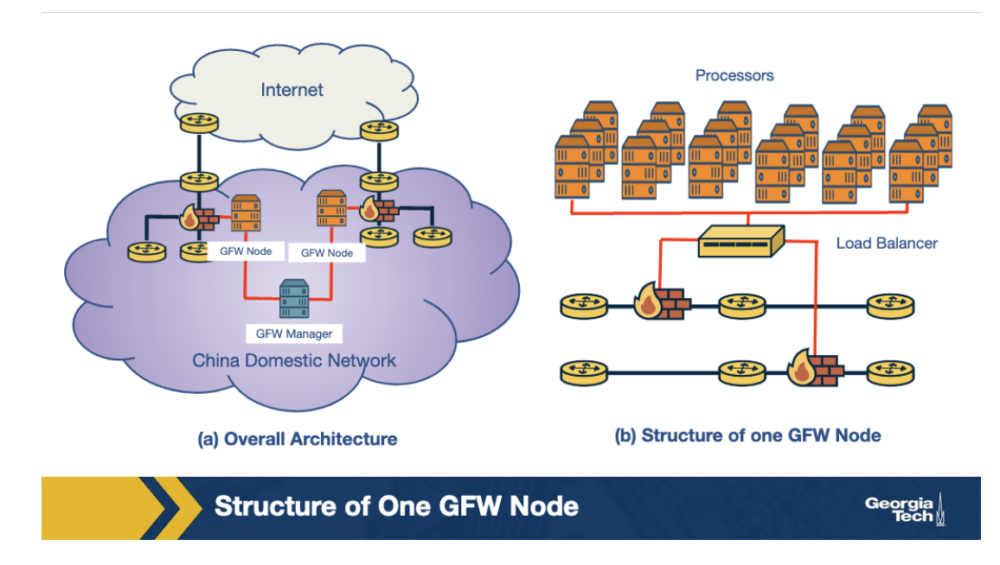
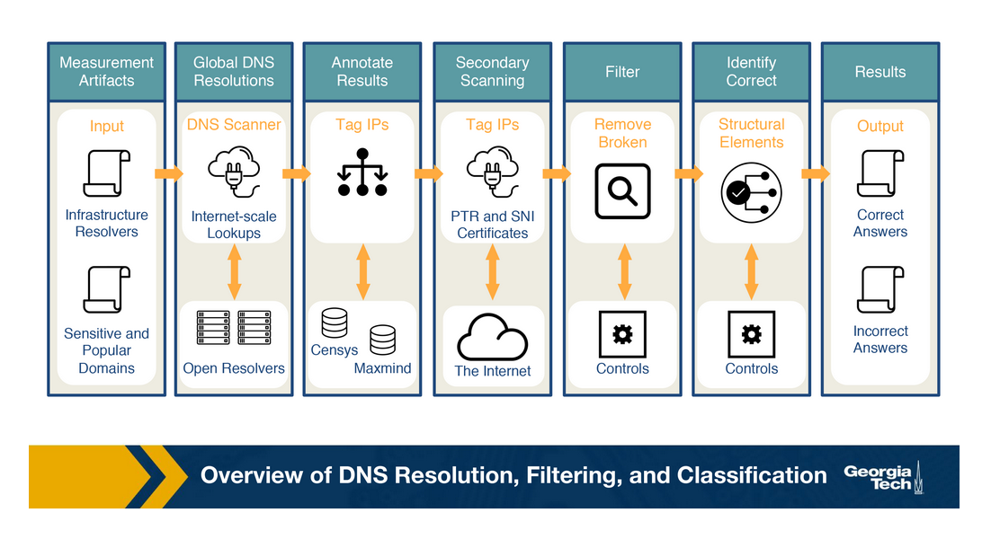
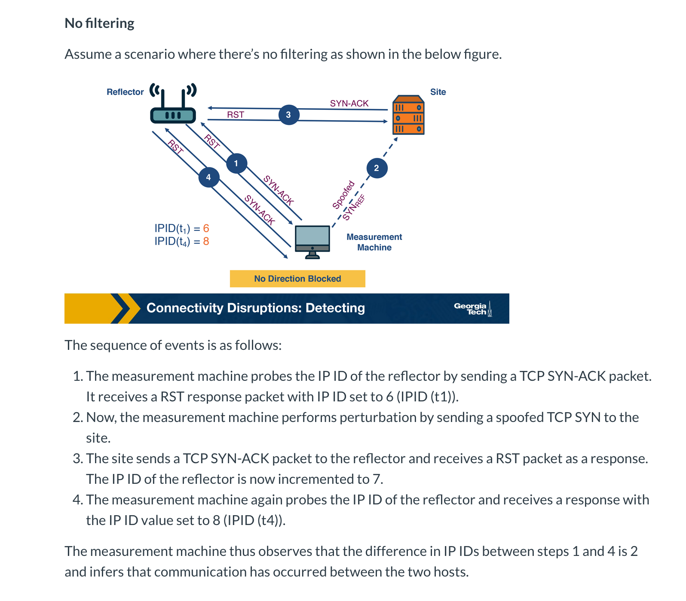
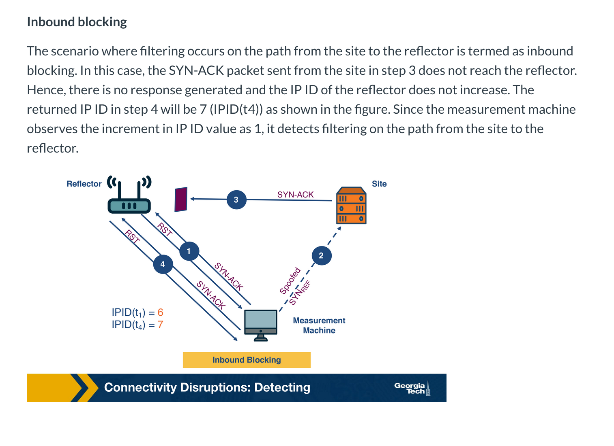
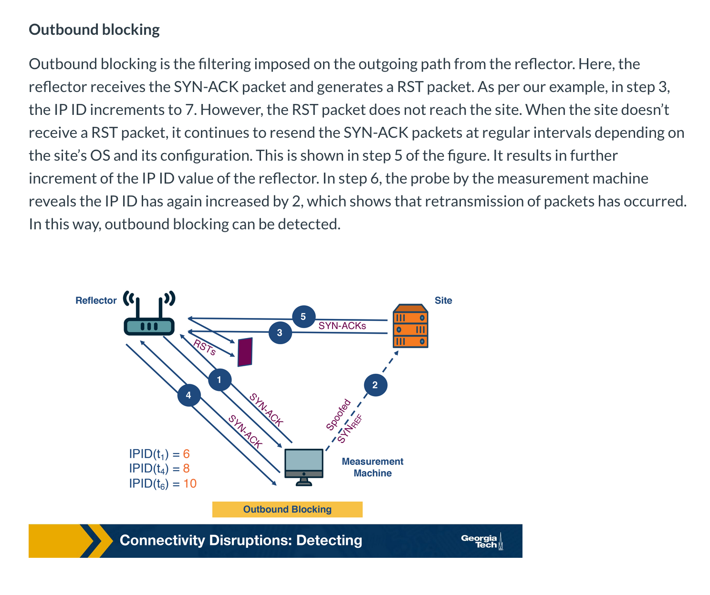

# Week 10 - Internet Surveillance and Censorship

**DNS Censorship**

DNS censorship is a large scale network traffic filtering strategy opted by a network to enforce control and censorship over Internet infrastructure to suppress material which they deem objectionable. The best known example is the Great Firewall (GFW) of China, but I would assume OpenDNS can be seen as this as well.

The GFW works on injecting fake DNS record responses so that access to a domain is blocked. Since the GFW is an opaque system, several different studies have been performed to deduce the actual nature of the system.

1. Locality of GFW nodes: There are two differing notions on whether the GFW nodes are present only at the edge ISPs or whether they are also present in non-bordering Chinese ASes. The majority view is that they are present at he edge.
2. Centralized Management: since the blocklists obtained from distinct GFW locations are the same, there is a high possibility of a central management entity that orchestrates blocklists.
3. Load balancing: GFW load balances between processes based on a source and destination IP address. The processes are clustered together to collectively send injected DNS responses.

**How does DNS injection work?**

The GFW uses a ruleset to determine when to inject DNS replies to censor network traffic. There are two levels of domain blocking: by directly blocking the domain, and the by blocking it based on keywords present in the domain.

**DNS Censorship techniques**

1. **Packet Dropping**

* Strengths
        * Easy to Implement
        * Low cost
    
    * Weaknesses
        * Maintenance of blocklist - it is challenging to stay up-to-date.

1. **DNS Poisoning**
    * Strengths:
        * No overblocking: Since there is an extra layer of hostname translation, access to specific hostnames can be blocked.

2. **Content Inspection**
    * Strengths
        * Precise censorship - a very precise level of censorship can be achieved, down to the level of single web pages or objects within a web page.
        * Flexible - Works well with hybrid security systems
    
    * Weaknesses
        * Not scalable - they are expensive to implement on a large scale network as the processing overhead is large.

3. **Blocking with Resets**

**Why is DNS Manipulation Difficult to Measure?**

Anecdotal evidence suggests that more than 60 countries are currently impacted by control of access to information through the Internet's Domain Name System (DNS) manipulation.

Some challenges are:

1. Diverse Measurements - Filtering can happen at many different layers, we would need diverse and widespread longitudinal measurements to understand global Internet manipulation and the heterogeneity of DNS manipulation across countries, resolvers and domains. 
2. Need for scale - Most measurements come from volunteer behavior. There is need for methods and tools that are independent of human intervention and participation.
3. Identifying the intent to restrict content access - While identifying inconsistent or anomalous DNS responses can help detect misconfiguration, censorship involves intent to block access. Why?
4. Ethics and minimizing risk - There are risks with involving citizens in censorship measurement studies.

**DNS Censorship: a Global Measurement Methodology**

One model for studying global DNS censorship is the system called Iris. 

1. Iris Scans the internet's IPv4 space for open DNS resolvers
2. Identifies infrastructure DNS resolvers
3. Queries thousands of domains across the open resolvers to establish a baseline comparison, including domains under the Iris creator's control
4. Annotate the DNS responses with additional information such as geo-location, AS, and what not.
5. Lastly do additonal PTR and TLS scanning. One IP address could host several websites via virtual hosting

After annotating the dataset, techniques are used to clean the dataset and identify whether DNS manipulation is taking place or not.

**Censorship through connectivity disruption**

The highest level of Internet censorship is completely blocking access. This can be done by manually disconnecting the hardware. However, this is a little more difficult if the infrastructure is distributed over a wide-area.

1. **Routing disruption**
2. **Packet filtering **

**Detecting Connectivity Disruptions**

Augur is a system that tries to detect filtering between hosts. It uses triangulation to accomplish this goal.

The strategy used by Augur takes advantage of the fact that any packet that is sent by a host is assigned a unique 16-bit IP identifier (IP ID), which the destination host can use to reassemble a fragmented packet. This IP ID should be different for the packets that are generated by the same host. 

**Open question: How is IP Id generated? Is it not random?**

**

**

**

****

**
