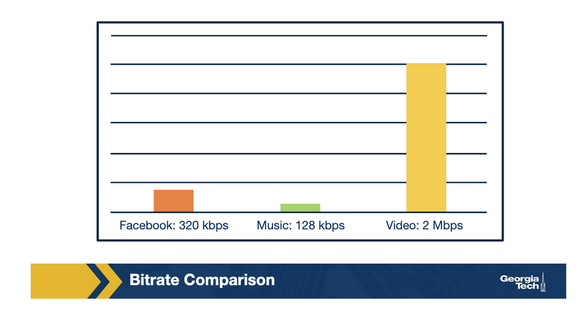
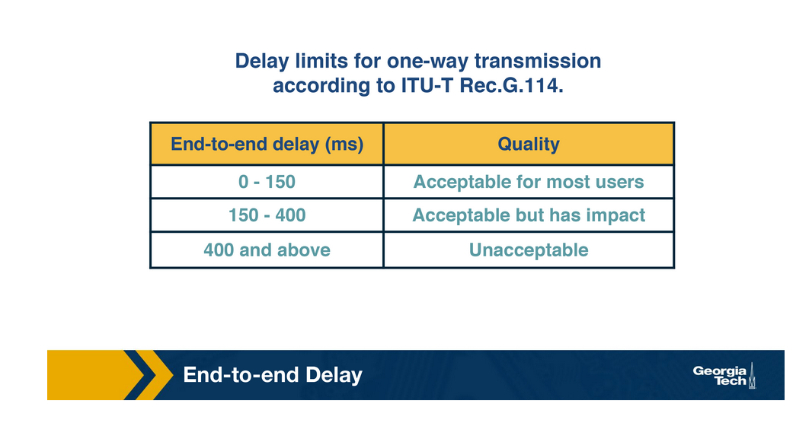
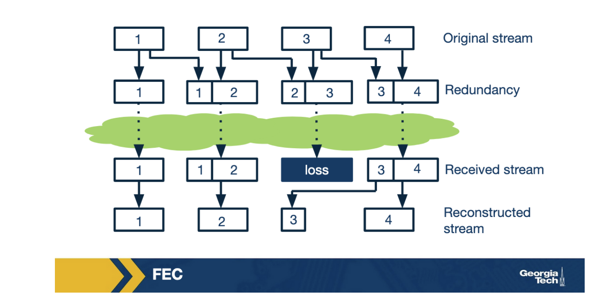
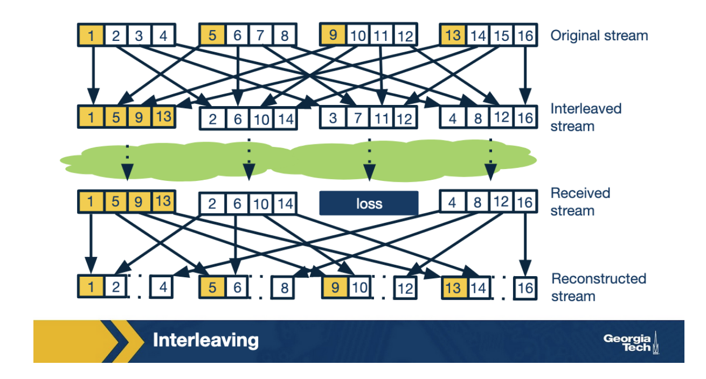
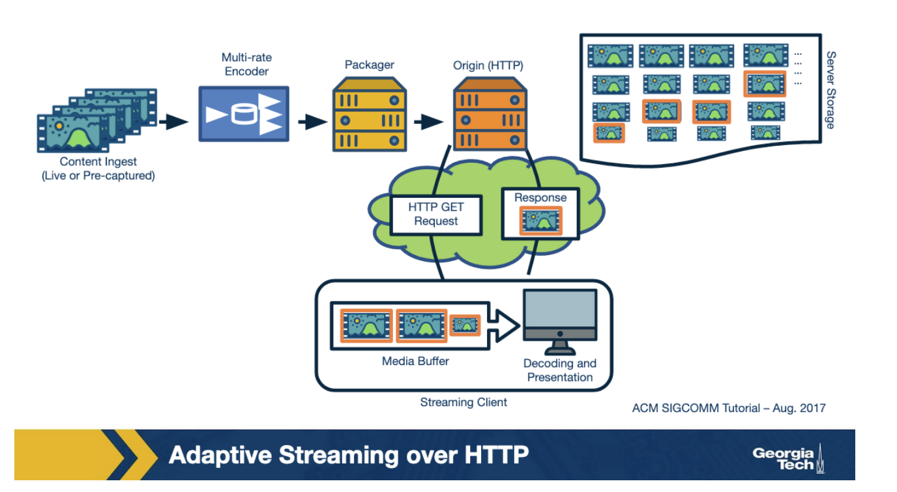
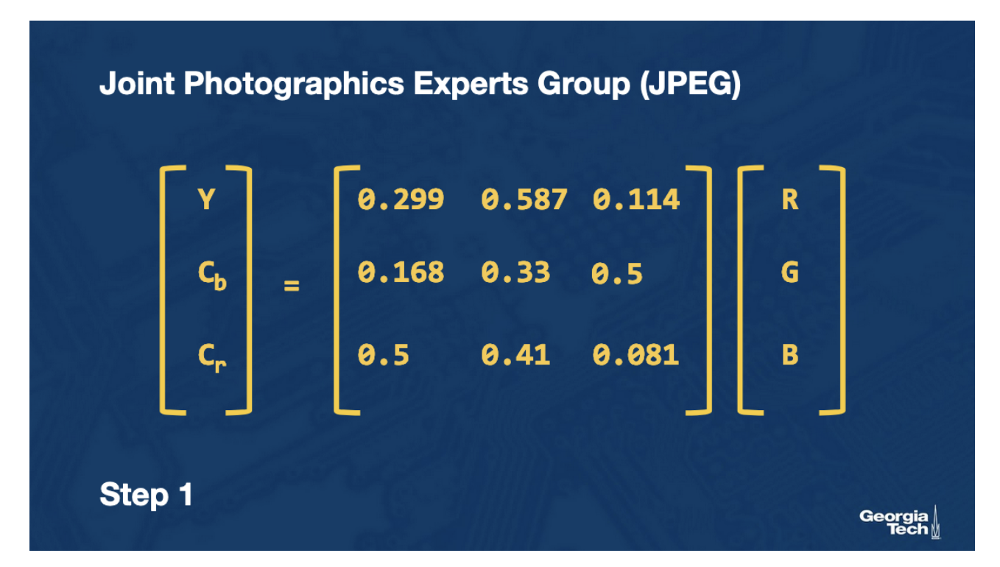
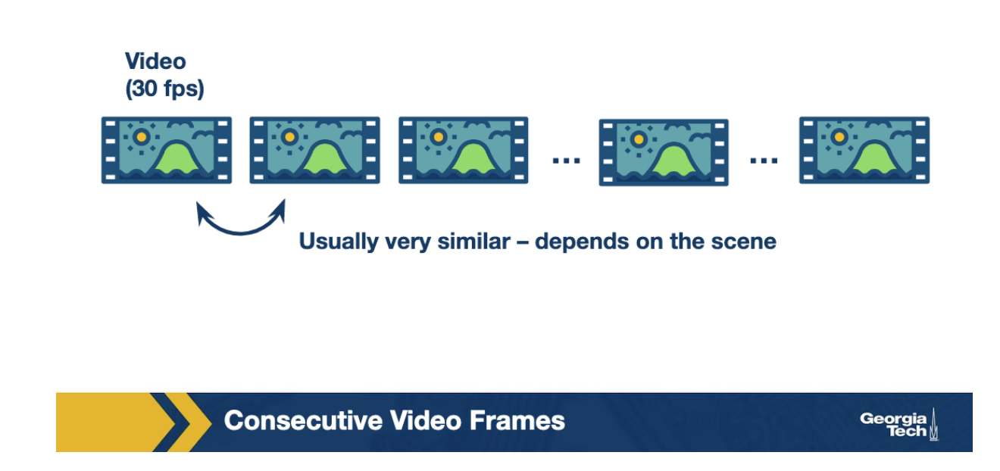
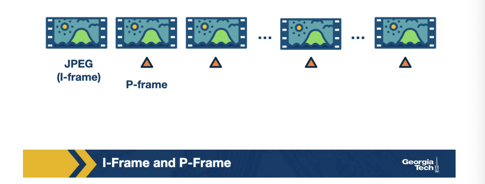
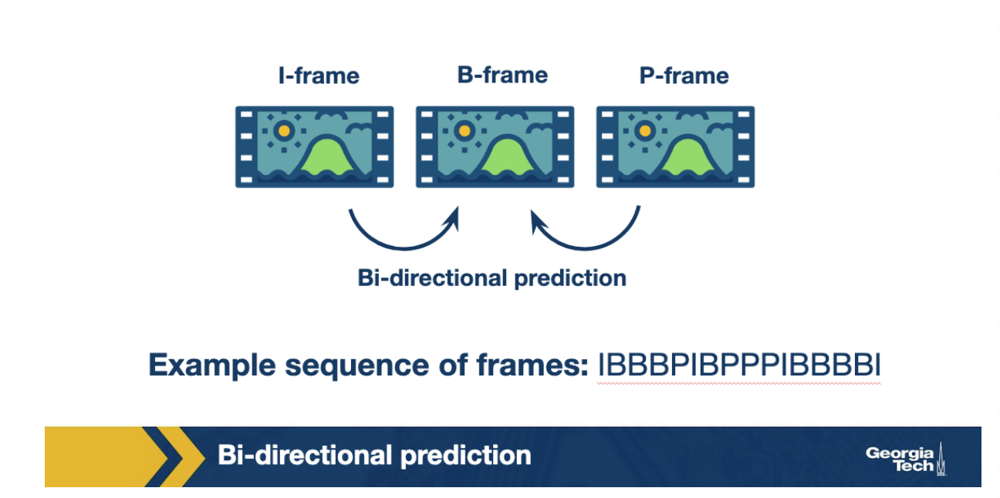
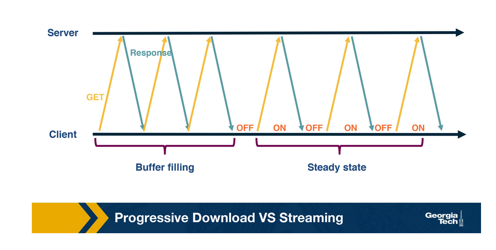

# Week 11 - Application Layer: Video

The defining property for video is **high bit rate** (somewhere between 100kbps to over 3Mbps).

Audio has a lower bit rate than video, but **glitches in audio are generally more noticeable** than glitches in video. For example, it's generally ok if the video cuts out or freezes in teleconferencing, but if the audio is garbled, you'll probably end up having to reschedule the call.

Multimedia applications can be organized into three major categories:

1. **Streaming Stored Audio and Video **
2. **Streaming Live Audio and Video**
3. **Conversational Voice and Video over IP**

**Streaming** stored audio and video is streamed, which means that the** video starts playing within a few seconds of receiving data**, instead of waiting for the entire file to download first. Generally, these files should be stored on a CDN rather than one data center.

Streaming live audio and video, is similar to streaming stored video or audio. Since these applications are live and broadcast-like, there are generally many simultaneous users. These applications are **delay-sensitive**, **but not as much as conversational audio and video **applications are.

VoIP stands for Voice over IP. These types of calls or video conferences are real-time and involve interaction, thus they are **highly delay sensitive**. On the other hand, these applications are loss-tolerant. This means there are techniques that can conceal occasional glitches.

**How Does VoIP work?**

VoIP has the challenge that it is transmitted over the Internet, a "best effort" service.

Analog audio is represented as a continuous wave, therefore digital representations of analog audio are only approximations. **Audio is encoded by taking many (thousands) of samples per second**, and then rounding each sample's value to a discrete number within a particular range (**quantization**).

_Example technique: For example, PCM (Pulse Code Modulation) is one technique used with speech, taking 8000 samples per second, and with each sample’s value being 8 bits long. On the other hand, PCM with an audio CD takes 44,100 samples per second, with each sample value being 16 bits long. You can see how with more samples per second, or a larger range of quantization values, the digital approximation gets closer to the actual analog signal, which means a higher quality when playing it back. But the tradeoff is that it takes more bits per second to play back the audio. _

The **three major categories of encoding schemes are narrowband, broadband, and multimode** (which can operate on either). For VoIP, we want to be able to understand words, but use as little bandwidth as possible.

In traditional telephony, **a signaling protocol **takes care of **how calls are set up and torn down**. They are responsible for four major functions:

1. User Location - the caller locating where the callee is
2. Session Establishment - handling the callee accepting, rejecting or redirecting a call
3. Session Negotiation - the endpoints synchronizing with each other on a set of properties for the session
4. Call participation Management - handling endpoints joining or leaving an existing session.

VoIP also uses signaling protocols, just like telephony, to perform the same functions. The **SIP (Session Initiation Protocol) **is just one example of a signaling protocol used in many VoIP applications.

**QoS for VoIP**

There are three major QoS metrics for VoIP:

1. end-to-end delay
2. jitter
3. packet loss

**End-to-End Delay**

End-to-End delay is the accumulation of sources of delay and VoIP applications are sensitive to these delays. In general, and end-to-end delay of below 150 ms is not noticeable to human listeners. A delay greater than 400ms starts becoming unacceptable, and applications tend to discard any packets that have a delay longer than 400ms, this is known as a **delay threshold**. 

Where does delay come from?

1. The time it takes to encode the audio
2. The time it takes to put encoding audio in packets
3. The normal sources of network delay, such as queueing delay
4. Playback delay from the receiver's playback buffer
5. The time it takes to reconstruct the signal, also called decoding delay

**Delay Jitter**

**Different voice packets can end up with different amount of delays**. This phenomenon is called **jitter**.

The main **mechanism for mitigating jitter** is **maintaining a buffer **to help smooth out and hide the variation in delay between different received packets, by buffering them and playing them out for decoding at a steady rate. 

There's a tradeoff here, a longer jitter buffer reduces the number of packets that are discarded because they were received too late, but that adds to the end-to-end delay. A shorter jitter buffer will not add to the end-to-end delay much, but can lead to more dropped packets.

**Packet Loss**

Packet loss in inevitable because VoIP operates on the Internet, and the Internet is a "best effort" service.

To eliminate packet loss, VoIP protocols could use TCP, but because of delay thresholds, UDP is usually used over TCP.

VoIP protocols have three major methods of dealing with packet loss:

1. Forward Error Correction (FEC)
2. Interleaving
3. Error Concealment

**Forward Error Correction** comes in a few different flavors, but in general, it works by **transmitting redundant data alongside the main transmission**, which allows the receiver to replace lost data with the redundant data.

Think of the redundant data like a spare tire, it is of lower quality, but really helps when you need it! The more redundant data transmitted, the more bandwidth is consumed.

**Interleaving** does not transmit any redundant data, and so it doesn't add extra bandwidth requirements or bandwidth overhead. Interleaving works by** mixing chunks of audio together so that if one set of chunks is lost, the lost chunks aren't consecutive**.

The idea is that many smaller audio gaps are preferable to one large audio gap.

The tradeoff for interleaving is that the receiving side has to wait longer to receive consecutive chunks of audio, and that increases latency. This means it's not very useful for VoIP, it is however every useful for streaming stored audio.

The last technique for dealing with packet loss is called **error concealment**. This is basically just **guessing what the lost audio packet might be**. This is usually possible because with really small audio snippets, there's some similarity between one audio snippet and the next audio snippet. This is the same principle that makes audio compression possible

One simple version of error concealment is simply to repeat a packet. This is computationally cheap and works pretty well.

**Video Streaming**

There are two main types of video streaming: live streaming, and stored streaming. The constraints for streaming live differ. Live streaming cannot be pre-fetched.

1. Raw content is compressed using an encoding algorithm
2. The encoded content is secured using DRM and then hosted.
3. The content is replicated over multliple geographically distributed servers (CDN)
4. The end-users download the video content over the Internet. The video is decoded and rendered onto the user's screen.

**Video Compression**

Video compression consists of reducing the size of the video. The compression can be of two types:

1. **Lossy**
2. **Lossless**

Lossy compression gives higher savings in terms of bandwidth and is more commonly used by video compression algorithms

A video is a sequence of digital pictures, where each picture is a two dimensional sequence of pixels. An efficient compression can be achieved in two ways:

1. Within an image - pixels that are nearby tend to be similar (
2. Across images - in consecutive scenes, pictures are similar (

**Image Compression**

The Joint Photographics Experts Group (JPEG) standard was developed to represent an image using components that can be compressed.

It consists of four steps.

1. Transform an image into color component (cb,cr) and brightness component (Y). This is done because human eyes are more sensitive to brightness and at the same time color can be compressed. We obtain 3 matrices: Y, Cb and Cr.

1. We operate on each of these three matrices independently. We compress and encode them separately. For each of the matrices we perform the following steps.
    1. Divide the image into 8*8 blocks. Apply the discrete cosine transformation to each sub-image to transform it into the frequency domain. The output is a matrix of coefficient, with each element representing the spectral power at that frequency. Why? because the human eye is less sensitive to high-frequency coefficient as compared to low-frequency coefficients
    2. The lossy step. We compress the matrix of the coefficients using a quantization table. Each entry of the coefficient matrix is divided by the quantization table. This table is stored in the image header so that it can be later decoded.
    3. Encode the coefficients.

2. The image is then transferred over the network.

**Video Compression and Temporal Redundancy**

Instead of encoding every image as in JPEG, we encode the first (known as the I-frame) as a JPEG and then **encode the difference between two frames**. The in-between encoded frame is known as predicted or P-frame.

We do not want to use the difference through the entirety of the video. When a scene changes, the frame becomes drastically different from the last frame. In addition, most video players allow the user to skip ahead, if P-frames were always used, the video player would need to download all frames in between the last I-frame and the current frame to decode the video. 

A typical solution is insert an I-frame periodically, typically every 15 frames. All of the frames between two I-frames are known as Group of Pictures (GoP).

An additional way to improve encoding efficiency is to encode a frame as a function of the past and future frames. This is known as a Bidirectional frame, or B-frame. 

In **constant bitrate encoding (CBR)**, the output size of the video is fixed. In **variable bitrate encoding (VBR)**, the output size remains the same on average, but varies based on underlying scene complexity.

The image quality is better in VBR, however VBR is more computationally expensive. Video compression technically requires heavy-computation.

When compression is used, video needs to be decoded at the client. **Decoding might fail if some data is lost**. Because of this, **TCP is typically used to deliver video.**

**Application Layer**

Why was HTTP used as the application-layer protocol for delivering video? 

One conceivable vision of how video streaming works is to have specialized video servers that remember the state of clients In this case, the intelligence would be held by the servers and the clients, which could be diverse, would have to do minimal amount of work.

With HTTP the server is essentially stateless and the intelligence to download the video is stored at the client. A major advantage of this is that content providers can use the already existing CDN infrastructure. It also makes bypassing middleboxes and firewalls easier because they already understand HTTP.

**Progressive download vs Streaming**

Given that the video server is stateless, most of the intelligence to stream video lies in the client.

One way to stream the video would be to send an HTTP GET, and download a video like downloading a file. The server will send data as fast as possible, with the download rate limited only by TCP rate control mechanisms.

This solution has a few problems:

1. Users often leave the video mid-way, downloading the entire file can lead to wasted resources
2. The client would have to store all of the downloaded but not played video. This could be an issue for long videos.

Thus **instead of downloading the content all at once, the client tries to pace** it. This can be done by sending byte-range requests for part of the video instead of requesting the entire video.

To account for variations in network throughput, the client usually **pre-fetches video ahead of time and stores it in a playout buffer**. Streaming in this manner typically has two states:

1. Filling State - when the buffer is empty and the client tries to fill it as soon as possible.
2. Steady State - After the buffer has become full, the client waits for it to become lower than a threshold, after which, the client sends a request for more content.

Single-bitrate encoded video is not the best solution given the diversity of streaming contexts (different devices, variable networks). Instead, content providers **encode their video at multiple bitrates**.

**Bit-rate adaptation** is the ability to switch between different encodings. The client know show to download the different bitrates through use of a manifest file.

These clever ideas have a name: Dynamic Streaming over HTTP or DASH, where dynamic streaming signifies the dynamic bitrate adaptation.

**What are the goals of a bitrate adaptation?**

The ultimate goal is a good user experience. Usually this means:

1. low or zero buffering
2. high quality video
3. low video quality variations
4. low startup latency

Note that many of these goals are conflicting.

The primary input signals for bitrate adaptation algorithms are:

1. network throughput - ideally the bitrate is equal or lesser than the available throughput, bitrate adaptation using this signal is known as 
2. video buffer - if the video buffer is full, then the player can afford to download high-quality chunks, if it is low, the player can download low-quality chunks to quickly fill up the buffer. Bitrate adaptation based on the video buffer is known as
