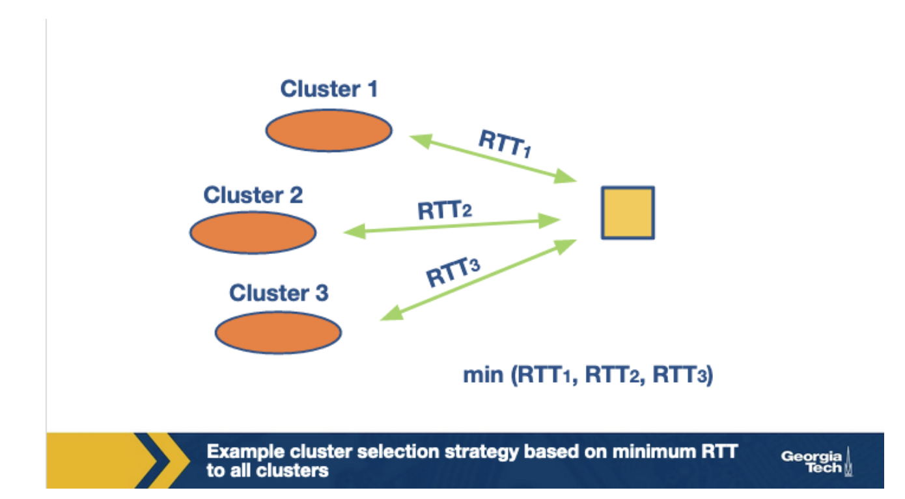

# Week 12 - Application Layer: CDN

The classic way of providing content on the Internet was to put the content on a single, publicly accessible web server. This is pretty straightforward. However, there are three major drawbacks.

1. Users are located all over the globe. No matter where a single, massive datacenter is placed, there's potentially vast geographic distance between the users and the data center. Server to client packets will need to travel a lot of links.
2. What happens when the link goes viral? It's wasteful for a single massive datacenter to repeatedly send the exact same data over the same communication link. It wastes bandwidth and money.
3. It is a single point of failure. If there is a natural disaster or power outage, the entire data center can be taken offline.

The modern solution for most websites is to use **Content Distribution Networks (CDNs)**  which are networks of multiple, geographically distributed servers with copies of content, that direct users to a server that can best serve the user's request.

**Content Delivery Challenges**

1. Peering point congestion - There is business and financial motivation to upgrade the first mile (web hosts) and the last mile (end users), but not for the middle mile, where expensive peering points between networks with no revenue happens. These points end up being bottlenecks causing packet loss and increased latency
2. Inefficient routing protocols - BGP has worked really well over the decades, and the massive growth of best-effort Internet, but it was never designed for modern demands. Between the algorithm only using AS hop count and not taking into account other factors (congestion, latency), and BGP's vulnerabilities, it's not a great inter-domain routing protocol.
3. Unreliable networks - Outages happen all the time. Some are accidents, others are malicious
4. Inefficient communication protocols - Like BGP, TCP was not designed for the demands of the modern Internet. Although it provides reliability and congestion avoidance, there's a lot of overhead. Because it requires an 'Ack' for each window of data packets sent, the distance between the server and the end user becomes the overriding bottleneck.
5. Scalability - scaling internet applications to respond to user demand is expensive and hard to do!
6. Slow rate of adoption - it takes a long time for anyone to adopt anything.

**CDNs and the internet ecosystem**

There are two major shifts that have impacted the evolution of the Internet ecosystem:

1. the transition of the Internet to a device for large scale content delivery.
2. Topological flattening - the traditional hierarchy is being flattened by IXPs.

Both of these shifts mean that we are seeing more traffic being generated and exchanged locally, instead of traversing the complete hierarchy. This process has been driven by major players which have shifted the focus from traditional tier-1 ISPs to the edge and end users.

Running and operating CDNs is not easy, they are expensive because they take up real estate, they use physical devices, they consume a lot of power, they need to be well-connected to the Internet, and someone has to manage them!

Some CDNs are private, and other CDNs are third party.

**CDNs Server Placement Approaches**

CDNs have a lot of server clusters, and they replicate content, whether their own or another providers content. How does a CDN place its clusters in the overall internet topology? We will discuss two strategies.

1. Enter Deep - CDNs place many small server clusters deep into the access networks around the world. Akamai is a good example of a third party CDN with this strategy. The goal with this strategy is to make the distance between a user and a server as small as possible. The downside is that this approach is difficult to manage and maintain!

1. Bring Home - With this philosophy. CDNs place fewer larger server clusters at key points (typically in IXPs, not in access networks). There are fewer server clusters to manager and maintain, but the clusters are farther away from the users.

**How a CDN operates**

CDNs need to intercept user requests and decide, given the location of the user and the load on the servers, which server cluster should service the request.

DNS plays a big role in server selection. Let's walk through an example:

1. User visits 
2. The user's host sends a DNS query for the domain 
3. The DNS query goes to the user's local DNS server, which is in many cases a DNS server in their ISP. 
4. This local DNS server issues an iterative DNS query for "video" to the authoritative DNS server for 
5. The authoritative server knows that the video is stored on Example CDN, so it sends back a hostname to example CDN.
6. The users local DNS server performs an iterative query to the ExampleCDN name server for the the appropriate IP address of a CDN content server.
7. The user's LDNS returns the ExampleCDN IP address to the user.
8. The user's client gets directly connected to the CDN and then sends an HTTP request for the video.

**CDN Server Selection**

There are two main steps in this process, the first step consists of mapping the client to a cluster.

The simplest strategy is to pick the geographically closest cluster. This simple strategy can work well in a lot of cases.  However, this strategy has some limitations:

1. Picking the georaphically closest cluster is actually picking the cluster closest to the users Local DNS. This works fine most of the times, unless a user uses a remote DNS (like OpenDNS).
2. Another important limitation is that this selection might not actually be the best for end-to-end network performance.

This second limitation suggests that relying on a static cluster selection policy can be sub-optimal as the underlying network conditions are dynamic. As such, **cluster selection can be based on more real-time measurements like end-to-end performance metrics**.

There are various performance metrics that can be used here, like delay and available bandwidth or both! A better strategy is to use application layer metrics.

One important question is **how exactly to obtain real-time measurements**?

One way is to use active measurements. This means that the LDNS could probe multiple clusters, like sending a ping request to multiple clusters for monitoring the RTT and then using the closest server. 

The other way is to use passive measurements, where the CDNs name server system keeps track of network conditions and uses this to direct the DNS query.

It's very challenging to have a centralized controller over today's large scale networks.

One strategy is to have two layers:

1. A layer that operates at larger time scales with a global view of client quality measurements
2. A fine grained layer that operates at millisecond timescale. It makes actual decisions upon a client request.

**Policy for Server Selection**

Once a cluster has been selected, the next step is to select a server within the cluster. 

Once content is fetched from an origin server, it is cached and the servers in the cluster can now serve the future requests.

Requests can be **routed based on content**, this happens via **content-based hashing**. This idea has some challenges, the primary being that there are frequent machine failures and load changes. When a machine fails, the hash table needs to be recomputed.

One simple way to address this would be to recompute the hash function for all objects. This however, would be expensive and slow. An ideal solution would be to only move the objects that were hashed to the failed server.

This is achieved via **consistent hashing, **which is an example of a distributed hash table. Consistent hashing tends to balance load, by assigning roughly the same number of content IDs and requires little movement of these Content IDs when nodes join and leave the system.

The main idea of consistent hashing is that servers and content objects are mapped to the same ID space.

This solution yields the least number of re-mapped keys to maintain a load-balanced service. On a side note, this algorithm was proposed for peer-to-peer applications such as BitTorrent and Napster.

**Network Protocols used for Cluster/Server Selections**

**DNS **provides a distributed database implemented over a heirarchy of servers. It is an application layer protocol that allows hosts to query this database and provide the translation of hostnames to IP addresses.

The DNS heirachy consists of the following types of servers:

1. **Root DNS servers**
2. **Top Level Domain servers**
3. **Authoritative DNS servers**
4. **Local DNS servers **

In the **iterative query process**, the querying **host is referred to a different DNS server** in the chain until it can fully resolve the request.

By contrast, in a **recursive query**, the **querying host, and each DNS server in the chain queries the next server** and delegates the query to it. 

DNS is made** fast by DNS caching**. 

DNS servers store the mappings between hostnames and IP addresses as **resource records (RRs)**. 

The four most common type of RRs are

**TYPE=A:** the name is a domain name and value is the IP address of the hostname. ([abc.com](http://abc.com/), 190.191.192.193, A)

**TYPE=NS**: the name is the domain name, and the value is the appropriate authoritative DNS server that can obtain the IP addresses for hosts in that domain. ([abc.com](http://abc.com/), [dns.abc.com](http://dns.abc.com/), NS)

**TYPE=CNAME**: the name is the alias hostname, and the value is the canonical name, ([abc.com](http://abc.com/), [relay1.dnsserver.abc.com](http://relay1.dnsserver.abc.com/), CNAME)

**TYPE=MX**: the name is the alias hostname of a mail server, and the Value is the canonical name of the email server. ([abc.com](http://abc.com/), [mail.dnsserver.abc.com](http://mail.dnsserver.abc.com/), MX)

The first field is an ID for the query that allows the client to match queries with responses.

**Server Selection Strategies: IP Anycast**

The goal of **IP anycast is to route a client to the "closest" server, as determined by BGP.**

This is achieved by assigning the same IP address to multiple servers belonging to different clusters. Each of these servers will use standard BGP to advertise their IP address. Thus multiple BGP routes for the same IP address correspond to different cluster locations will propagate to the Internet.

Now when a BGP router receives multiple route advertisements for this IP address, it will treat them as multiple paths to the same locations.

**

**

IP Anycast enables CDNs to deliver content using the "closest" server to a client. Now a client from AS1 will be routed to the cluster C1, which is only 1 AS hop away from it. For a client belonging to different cluster, AS2, it will be routed to a different cluster as it is the “closest” cluster. 

The server closest to the client in terms of BGP is not always the best server because of the dynamic nature of the Internet. Server selection using Anycast does not take this into account.

One instance where IP Anycasting is used in routing to a DNS server. For instance, Google provides public DNS servers that can be used for resolving domain names to IP address. In order to serve clients from multiple locations, it has multiple DNS servers distributed geographically with all of the servers being assigned the same address.

**Server Selection Strategies: HTTP Redirection**

When a client sends a GET request to a server, say A, it can redirect the client to another server, say B, by sending an HTTP response with a code 3xx and the name of the server.

This essentially means that the client should now fetch the content from this new server. Note that this would incur at least an additional HTTP request, which can correspond to one or more RTTs. This makes this technique inefficient.

One particular case where this strategy is useful is for load-balancing. In that case, the server can send HTTP redirects to some of the clients. One benefit of this method is that it does not require any central coordination. A recent measurement study reports that YouTube uses this kind of mechanism for load balancing. According to the study, YouTube first tries to use HTTP redirection for sharing the load within a cluster, and then can also use it to redirect clients to a different cluster if the former is not enough.
