# Week 2 - Transport and Application Layers

Turn in Project 2

Watch Lectures

* Transport and Application layers

**Introduction**

In this lecture, we are focusing on the logical end-to-end connection between processes that are running on two hosts. We will focus on the TCP protocol, and we will learn about the algorithms that provide important services such as reliability, flow control and congestion control. 

The** transport layer** provides an end-to-end connection **between two applications that are running on different hosts**.

A transport layer protocol provides for logical communication between application processes running on different hosts. by **logical communication**, we mean that from the application's perspective, **it is as if the hosts running the processes were directly connected**. Application processes use the logical communication provided by the transport layer to send messages to each other, **free from the worry of the details of the physical infrastructure**.

**Transport layer protocols are implemented in the end systems** but not in the network routers. 

The transport layer lives just above the network layer in the protocol stack. **Whereas a transport layer provides logical communication between processes running on different hosts, a network-layer protocol provides logical communication between the hosts.**

Within the transport layer, there are two main protocols: User datagram protocol (UDP) and the Transmission Control Protocol (TCP). These protocols differ based on the functionality they offer to the application developers, but they both provide integrity checking through their headers.

* UDP provides very basic functionality and relies on the application layer to implement the remaining. 
* **TCP provides reliable data transfer**

One of the main desired functionalities of the transport layer is the **ability for a host to run multiple applications that use the network simultaneously,** which we refer to as **multiplexing**.

Consider the example of someone reading Stack Overflow while also listening to music on Spotify. Clearly, both of these processes involve communication to two different servers. How do we make sure that the incoming packets are delivered to the correct application? We need an **addressing mechanism to distinguish the many processes sharing the same IP address on the same host**. 

The transport layer solves this problem by using identifiers known as **ports**. Each application binds itself to a unique port number by opening sockets and listening for any data from a remote application.

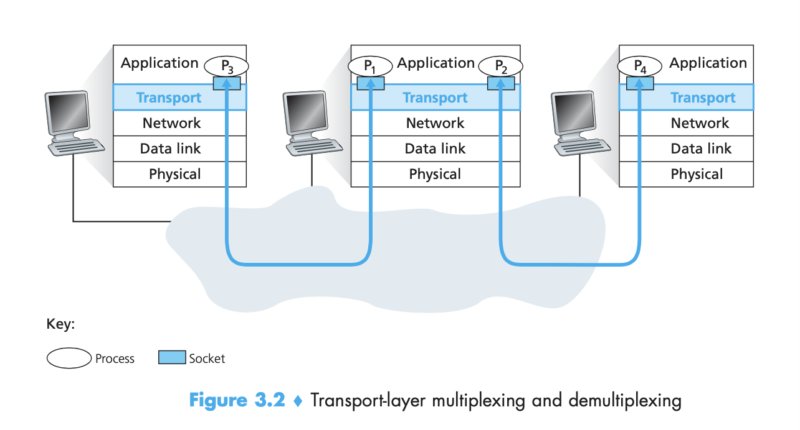

There are two ways in which we can use multiplexing. **Connectionless and connection-oriented multiplexing**.

The job of **delivering data** that are included in a transport-layer segment **to the appropriate socket** is called **demultiplexing**.

**Encapsulating each data chunk with header information** to create segments, and then forwarding the segments to the network layer is called **multiplexing**.

Sockets are identified based on the source port number field and the destination port number field.

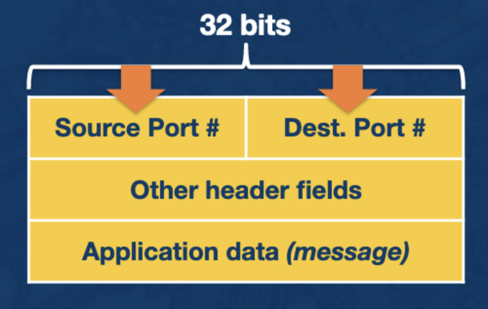

TCP Connections

**TCP sockets** are fully identified by a four tuple consisting of **source IP address, source port number, destination IP address, and destination port number**. The big practical difference here is that unlike UDP, two arriving TCP segments with different source IP addresses of source port numbers will be directed to two different sockets.

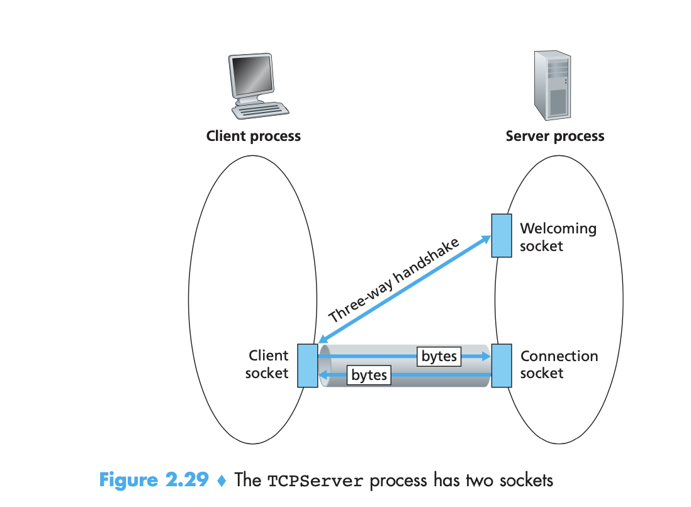

TCP is a **connection-oriented protocol**, this means that before the client and server can start to send data to each other, they first need to handshake and establish the connection.

In order for the server to be able to react to the client's initial contact, the server has to be ready. This means the TCP server must be running as a process, and second the server program must have a special socket that welcomes initial contact.

During the three-way handshake, the client process knocks on the welcome socket of the server process. When the server detects the knocking, it creates a new socket that is dedicated to the client. 

Let's connect this to a practical example. Consider a host running a web server. All clients send segments to the server with the destination of port 80. The server distinguishes the segments from different clients using source IP addresses and source port numbers.

A web server will then spawn a process for each connection. Each process will have its own connection socket through which HTTP requests arrive and HTTP responses are sent.

If the client and the server are using **persistent HTTP**, then throughout the duration of the persistent connection the client and the server **exchange HTTP messages via the same server socket.** If they are using **non-persistent HTTP**, then **a new TCP connection is created and closed for every request/response.** This frequent creating and closing of sockets can severely impact the performance of a busy web server.

UDP Connections

By contrast, UDP is **connectionless** which means that there is no handshaking between sending and receiving transport layer entities before sending a segment.

UDP, does just about as little as a transport protocol can do. Aside from multiplexing/demultiplexing function and some light error checking, it adds nothing to IP.

**UDP sockets are fully identified** by a two-tuple consisting of a **destination IP address and a destination port number**. The source port serves as a "return address".

Why would an application developer choose UDP over TCP?

1. **Finer application-level control over what data is sent and when**
2. **No connection establishment.**
3. **No connection state.**
4. **Network management.**

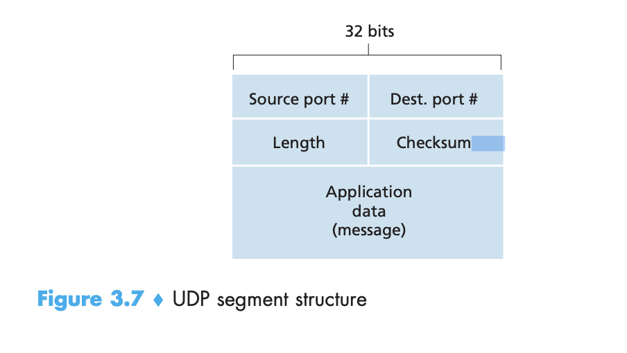

UDP checksum provides for **error detection**. This means that it is used to determine whether bits within the segment have been altered as it moved from source to destination. UDP at the sender side performs the 1s complement of the sum of all the 16-bit words in the segment.

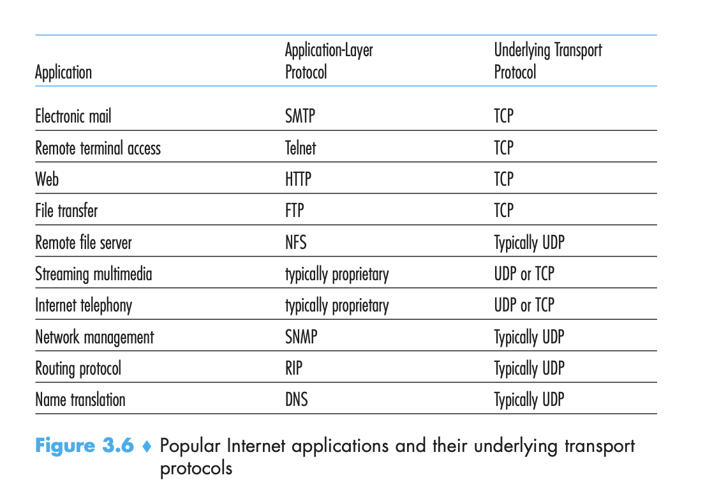

To compute and detect errors, the receiver takes all the bits of the UDP packet and adds them together. If no errors are introduced, than the sum will be 2^16 - 1. Now the CPU doesn't have to check all the bits. Thus using the 1's complement speeds up error-checking. 1-bit errors will be detected, two-bit errors might not be.

TCP Three Way Handshake

**Connection Establishment**

1. The TCP client sends a special segment with the SYN bit set to 1. The client generates an initial sequence number and includes it in the SYN segment
2. The server upon receiving the client packet, allocates the resources required for the connection and sends back the special 'connection-granted' segment which is called SYNACK. This packet has the SYN bit set to 1, the ACK field containing the client's sequence number +1, and a randomly chosen initial sequence number.
3. Finally, the client receives the SYNACK and allocates resources for the connection and sends an ACK back to the host with SYN bit set to 0, and increments the ACK header.

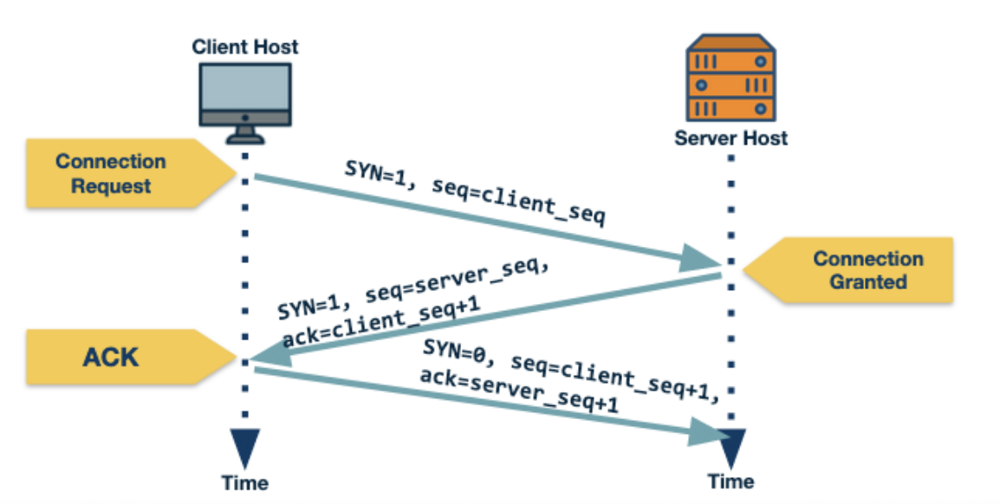

**Connection Teardown**

1. When the client wants to end the connection, it sends a segment with the FIN bit set to 1.
2. The server acknowledges that it has received the connection-closing request and works to close the connection.
3. The server then sends a segment with the FIN bit set to 1, indicating the connection is closed.
4. The client sends an ACK for it to the server. It also waits for sometime to resend the acknowledgement in case the first ACK segment is lost.

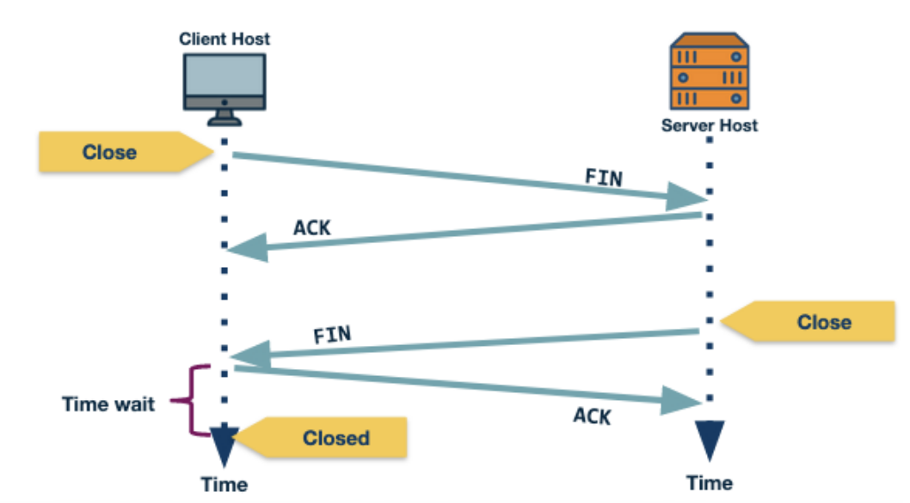

Reliable Transmission

**TCP guarantees in-order delivery of application-layer data without any loss or corruption.**

In order to have reliable communication, the sender should be able to know which segments were received by the remote host and which were lost. One general way of achieving this is called **Automatic Repeat Request**, where the r**eceiver sends acknowledgements that it has received a segment**. If the sender does not receive an acknowledgement within a given time period, the sender assumes the packet is lost and resends it.  

There are a couple of ways to implement Automatic Repeat Request, one way is known as Stop and Wait, whereby a packet is sent, and the sender waits until a timeout expires for the acknowledgment. Figuring out the proper time to wait is tricky, a small timeout can lead to unnecessary re-transmissions and a large value can lead to delays. In most cases, **the timeout value is a function of the estimated round trip time of connection**. 

This isn't very high performance, so in order to solve this problem, the sender can send multiple packets without waiting for acknowledgements. More specifically, **the sender is allowed to send at most N unacknowledged packets** typically referred to as the **window size**.

There are a couple more requirements here:

1. The receiver needs to be able to identify and notify the sender of a 
2. The sender and receiver need to buffer more than one packet. The sender now needs to buffer packets that have been sent but not acknowledged. Similarly, the receiver may need to buffer the packets because the rate of consuming these packets is slower than the rate at which the packets arrive.

One **strategy for notifying the sender of a missing segment** is for the receiver to **send an ACK for the most recently recieved in-order packet**. The **sender would then send all packets from the most recently received in-order packet**, even if some of them have been sent before. The receiver can discard any out-of-order received packets. This is called **Go-back-N**.

Clearly, in Go-back-N, a single packet error can cause a lot of unnecessary retransmissions. To solve this, TCP uses **selective ACKing**. Whereby **the sender retransmits only those packets that it suspects were received in error**. In this case, the receiver would acknowledge a correctly received packet even if it is not in order. The out-of-order packets are buffered until any missing packets have been received at which point the batch of the packets can be delivered to the application layer.

In addition to using timeout to detect loss of packets, TCP also uses **duplicate acknowledgements as a means to detect loss**. A duplicate ACK is additional acknowledgement of a segment for which the **sender has already received an acknowledgement**. **When the sender receives 3 duplicate ACKs** for a packet, it considers the packet to be lost and **will retransmit it** instead of waiting for the timeout. This is known as **fast retransmit**.

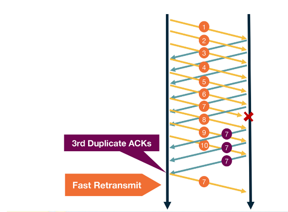

Transmission Control

**Why control the transmission rate? **When sending information over the network to an application that is slow at reading data, the sender can very easily overflow the connection's receive buffer by sending too much data. 

TCP provides a flow-control service to its applications to eliminate this possibility. **Flow-control can be thought of as a speed-matching service **-- matching the rate at which the sender is sending against the rate at which the receiving application is reading.

TCP provides flow control by having **the sender maintain a variable called the receive window**, which informally, is used to give the sender an idea of how much free buffer space is available at the receiver. 

Let's suppose Host A is sending a large file to Host B over a TCP connection. Host B allocates a receive buffer to this connection, it's size is denoted by _RcvBuffer_.

Host B also defines:

1. _LastByteRead_
2. _LastByteRcvd_

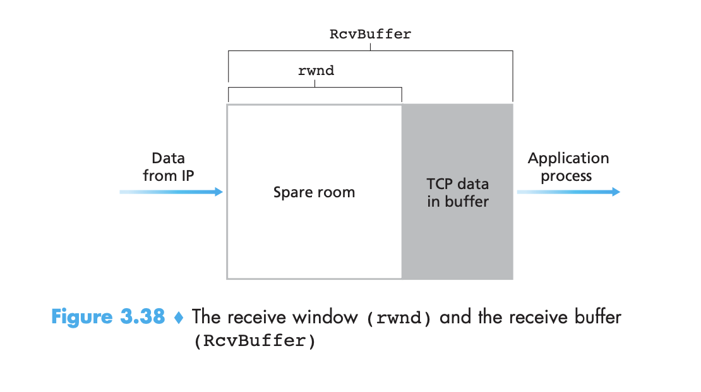

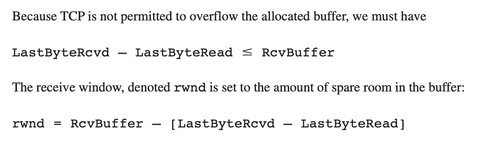

_rwnd_ is a dynamic variable. It is sent in the receive window field of every segment that Host B sends to A.

Host A in turn keeps track of two variables:

1. _LastByteSent_
2. _LastByteAcked_

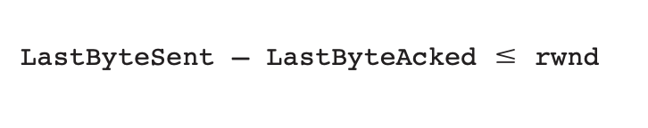

**By keeping the amount of unacknowledged data less than the value of ****rwnd****, Host A is assured that it  is not overflowing the receive buffer at Host B.**

TCP makes the sender continue to send segments of size 1 byte even after _rwnd_ = 0 to prevent deadlocks. When the receiver acknowledges these segments, it will specify the _rwnd_ value and the sender will know as soon as the receiver has some room in the buffer.

Congestion Control

Another important **reason for transmission control is to avoid congestion in the network**. It would be pretty bad if the combined transmission rates of all the senders exceeded the capacity of a transmission link.

The goals of congestion control algorithms are:

1. **Efficiency **
2. **Fairness**
3. **Low delay**
4. **Fast convergence**

There are two approaches to implementing congestion control: 

1. **Network-assisted congestion control**
2. **End-to-end congestion control**

TCP ending up going with the second approach, but some routes in modern networks can provide explicit feedback to the end-host by using protocols such as ECN and WCN. 

There are **two main signals of congestion in TCP**:

1. **Packet delay**
2. **Packet loss**

The approach taken by TCP is to have each sender limit the rate at which it sends traffic into its connection as a function of perceived network congestion. 

The TCP sender **limits the rate at which it sends traffic by maintaining** a variable called the **congestion window**. The congestion window, denoted _cwnd_, imposes a constraint on the rate at which a TCP sender can send traffic into the network. 

Specifically, the amount of **unacknowledged data at a sender may not exceed the minimum of ****cwnd**** or ****rwnd**.

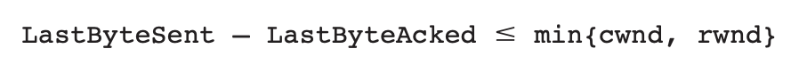

TCP uses a probe and adapt approach in adjusting the congestion window. Under regular conditions, TCP increases the congestion window trying to achieve the maximum available throughput. Once it detects congestion, it backs off the congestion window. 

The algorithm it uses to adjust the window is called **additive increase/multiplicative decrease**.

The connection starts with a constant initial window, typically 2 unacknowledged packets, and increases additively (hence additive increase). 

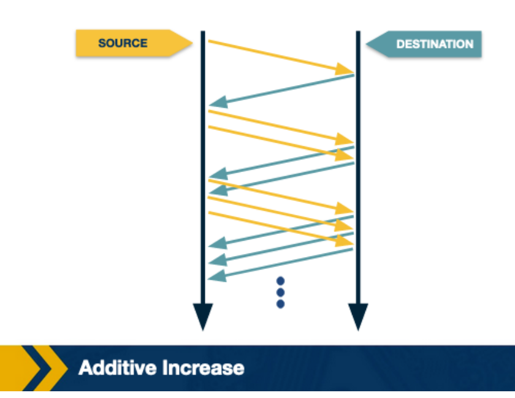

Once TCP detects congestions, it reduces the rate at which the sender transmits. So when the TCP sender detects that a timeout occurred, then it sets the congestion window to half of its previous value. 

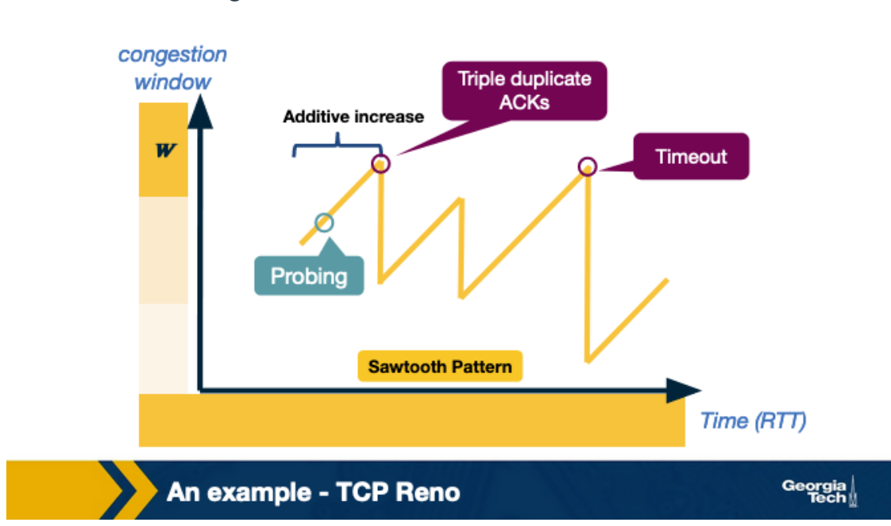

TCP uses two types of packet loss detection as a signal of congestion. First is the triple duplicate ACKs and is considered mild congestion. In this case, the congestion window is reduced to half the original congestion window. 

The second kind of congestion detection is a timeout, when no ACK is received within a specific amount of time.  It is considered a more severe form of congestion, and the congestion window is reset to the initial window value.

TCP continually decreases and increases the congestion window throughout the lifetime of the connection. If we plot the congestion with respect to time, we observe the sawtooth pattern above.

When a connection starts, it can take a while for the sending host to increase the congestion window by using AIMD. So, for a new connection, TCP uses a **Slow start phase** where the congestion window is increased exponentially instead of linearly.

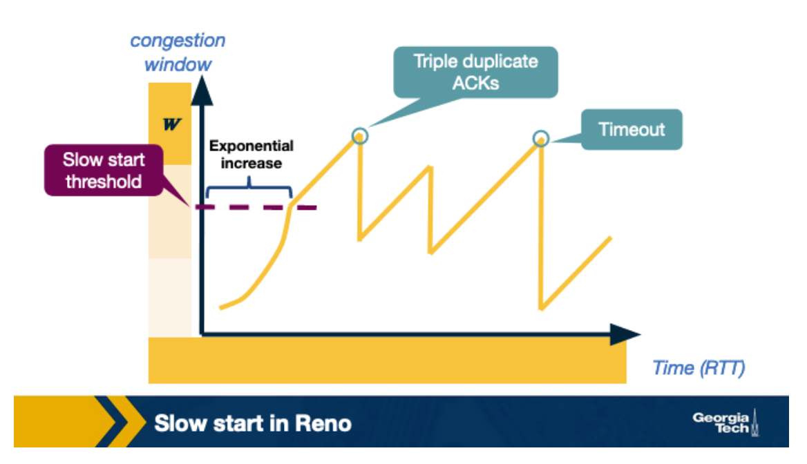

AIMD leads to** fair bandwidth sharing on average**. However, recall that **TCP uses ACK-based adaptation of the congestion window**. Thus, **connections with smaller RTT values increase their congestion window faster than the ones with longer RTT values**. This leads to unequal sharing of bandwidth. 

TCP CUBIC

Improving network speed has called for changes in TCP congestion control mechanisms mainly with a desire to improve link utilization.

TCP CUBIC uses a polynomial as the growth function of the congestion window. 

When TCP CUBIC experiences a triple duplicate ACK, it uses multiplicative decrease. Now, we know that the optimal window size will be between where we just dropped from and where we are now. So **i****nstead of increasing the window size by 1, it is okay to increase the window size aggressively in the beginning**. Once the congestion window approaches the maximum, we should increase the congestion window slowly because that is where we detected a packet loss last time. Assuming no loss is detected, we keep increasing the window a little bit.

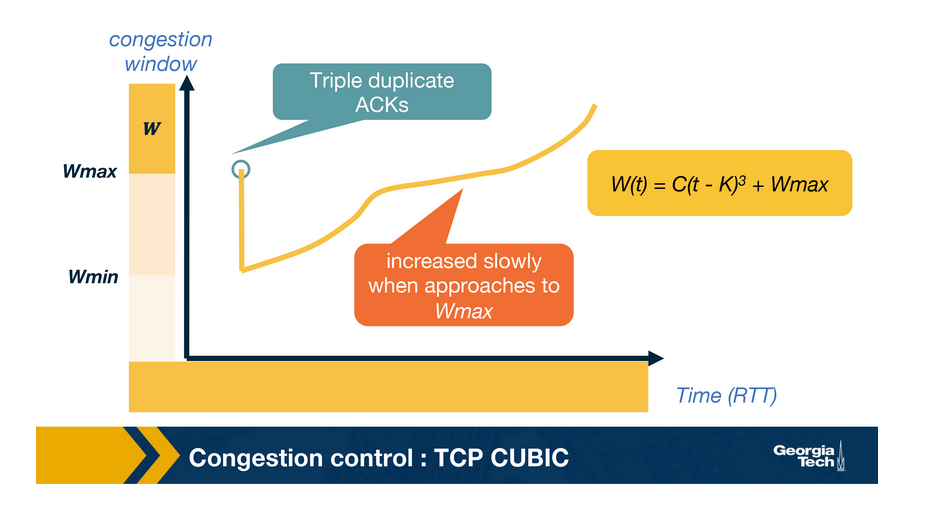

**TCP throughput** is the rate that data is successfully delivered over a TCP connection. It is bounded by two mechanisms, flow control, where receiving hosts can limit the rate of incoming data to what they are able to process, and congestion control, where transmitting hosts limit their outgoing data to moderate their negative impact on the network.

Generally speaking, TCP flow control limits throughput to a value approximating 

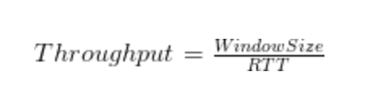

Where _windowsize_ is the amount of data the receiving host is prepared to accept without explicit acknowledgement and RTT is the round-trip-time for the end-to-end network pathl.
