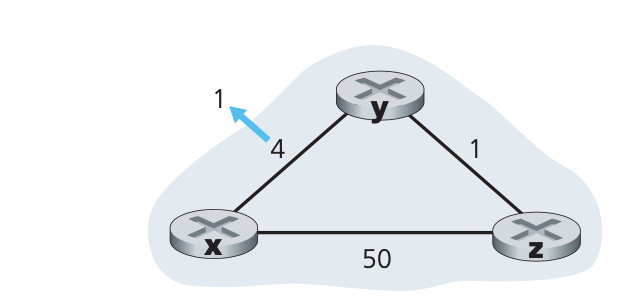
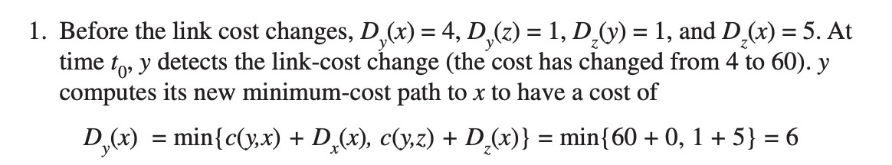
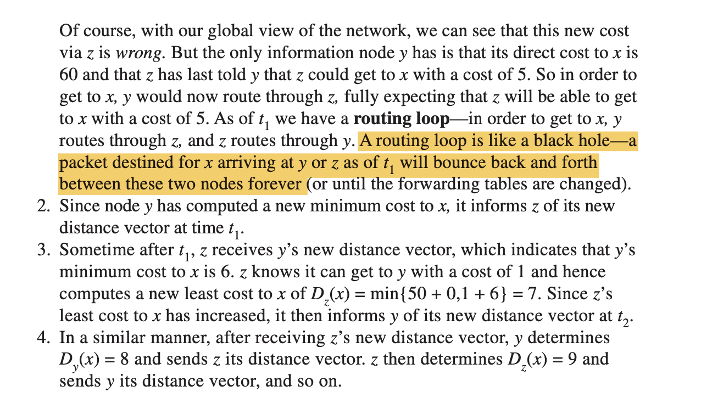

# Week 3 - Intradomain Routing

Project 3 

* Read Assignment

Watch Lectures

* Intradomain Routing

Read OMSCS Notes

* Intradomain Routing

Introduction

In this lecture we are focusing on the network layer and on a specific function of the network layer which is **routing within a single administrative domain**.

In this lecture we will learn about the two flavors of intradomain routing algorithms which are the **link state and distance-vector algorithms**. We'll look at example protocols such as RIP and OSPF.

We will finally look at challenges intradomain routing protocols face in convergence delay.

Routing Algorithms

Let's assume we have two hosts that have established a connection between them using TCP or UDP as we saw in the previous lecture.

Each of the two hosts know where to forward their packet (to their default router), but what happens after that?

A packet travels from sending host to destination host with the help of intermediate routers. When a packet arrives at a router, the router is responsible for **consulting a forwarding table** which **determines the outgoing link interface** it should use to forward the packet.

**Forwarding** is the process of **transferring a packet from an incoming link to an outgoing link** within a **single router.**

**Routing** is how routers work together using routing protocols to determine the good paths, or good routes, over which the packets travel from the source to the destination node.

There are two types of routing:

1. **Intradomain routing**
2. **Interdomain routing**

We will be focusing on the former in this lecture. There are two major classes of intradomain routing algorithms, link-state and distance-vector algorithms. 

**Routing algorithms exchange and compute the information that is used to configure forwarding tables**.  In all of our algorithms, we will use a graph. We will have a set of nodes connected by a collection of edges, where each edge has a value representing its cost. The cost may reflect the physical length of the corresponding link, the link speed, or the monetary cost associated with the link.

The natural **goal of a routing algorithm** is to **identify the least costly path between sources and destinations**.

Link-State Algorithms

A link-state algorithm is an example of a global algorithm. **Global algorithms have complete information about connectivity and link costs**.

In practice, this complete knowledge of the state of the network is accomplished by having each node broadcast link-state packets to all other nodes in the network, with each link-state packet containing the identities and costs of its attached links. The result of the nodes' broadcast is that all nodes have an identical and complete view of the network.

The link-stage algorithm we will look at it is known as **dijkstra's algorithm**. Dijkstra's algorithm **computes the least-cost path from one node (the source) to all other nodes in the network**.

Dijkstra's algorithm is **iterative**. The number of iterations is equal to the number of nodes in the network. Upon termination, the algorithm will have calculated the shortest paths from the source node to every other node in the network.

**Definitions**

* D(v) - cost of the least-cost path from the source node to the destination v, as of this iteration of the algorithm
* p(V) - previous node (neighbor of v) along the current least-cost path from the source to v
* N' - subset of nodes, v is in N' if the least-cost path from the source to v is definitely known.

**Initialization Step: **Initialize all the currently known least-cost paths from the source node to its directly attached neighbors. We know these costs, they are the costs of the immediate links. The rest of the links are initialized with a cost of infinity. We also initialize the set N' to include only the source node. 

**Iteration: ** The algorithm executes the loop for every node in the network. At each iteration, we look at the set of nodes that are not included in N' and we identify the node with the least cost path from the previous iteration. We add that node w into N'. For every neighbor of w, we update D(v) with the new cost which is either the old cost from the source to v, or the known least path cost from the source to w plus the cost of w to v. Whichever is smaller.

**An Example**

**Computational Complexity**

Given n nodes, in the first iteration, we have to search through all n nodes to determine the node not in N' that has the minimum cost. In the second iteration, we need to check n-1 nodes. The complexity is O(n^2).

Distance Vector Routing

Whereas the LS algorithm is an algorithm using global information, **the distance vector algorithm is iterative, asynchronous, and distributed**. 

Being **distributed** means that each node receives some information from one or more of its directly attached neighbors, performs a calculation, and then distributes the results of its calculation back to its neighbors.

It is iterative in that this process continues on until no more information is exchanged between neighbors. 

It is asynchronous in that it does not require all of the nodes to operate in lockstep with each other.

**Definitions**

One important relationship to to discuss before we discuss the distance vector algorithm is the **Bellman-Ford equation** which says

where minv in the equation is taken over all of x's neighbors. Basically all this says is that the least-cost path from x to y, is the least cost path from x to v, plus the least cost path of v to y. 

**Distance Vector Algorithm**

**Initialization: **Each node x begins with Dx(y), an estimate of the cost of the least-cost path from itself to node y, for all nodes in N. 

Each node maintains the following routing information:

1. For each neighbor v, the cost c(x, v) from x to directly attached neighbor v.
2. Node x's distance vector, that is x's estimate of its cost to all destinations, y, in N.
3. The distance vectors of each of its neighbors.

Then asynchronously, each node sends a copy of its distance vector to each of its neighbors. When a node receives a new distance vector from any of its neighbors, it saves the distance vector and then uses the Bellman-Ford equation to update its own distance vector.

If the node's distance vector has changed as a result of this update step, the node will then send its updated distance vector to each of its neighbors.

**An Example**

**

**

**Link-cost changes and Link Failure**

When a node running the DV algorithm detects a change in the link cost from itself to a neighbor, it updates its distance vector and, if there's a change in the cost of the least-cost path, informs its neighbors of its new distance vector.

Let's talk about a scenario where the link cost changes.

Thus, only two iterations are required for the DV algorithm to reach a quiescent state. **The goods news about the decreased cost between x and y has propagated quickly**!

Let's now consider what happens when a link cost increases. Suppose that the link changes from 4 to 60.

This looping will persist for 44 iterations until z finally determines its least cost path to x is via its direct connection. **The result of the bad news about the increase in link cost has traveled very slowly! **This is sometimes referred to as the count-to-infinity scenario.

**Poison Reverse**

A solution to the count-to-infinity problem is called **poison reverse**. Since z reaches x through y, z will advertise to y that the distance to x is infinity. However, z knows that is not true and Dz(x) is 5, but it tells the lie to y as long as it knows that it reaches x through y. Since y assumes that z has no path to x, it won't enter the routing loop with z. It will directly connect to x at the cost of 60. It will in turn send out update messages to x and z. z will update its routing table to route through y directly to x, and then send a message back to y, which will then redirect through z.

Distance Vector Routing Protocol: RIP

RIP(Routing Information Protocol) is an intra-AS routing protocol, which means it is used to determine how routing is performed within an **Autonomous system**. An autonomous system is a group of routers that are all **under the same administrative control**.

Historically, two routing protocols have been used extensively for routing within an autonomous system in the internet: The **Routing Information Protocol (RIP)** and the **Open Shortest Path First (OPSF**).

RIP is a distance-vector protocol that operates in a manner very close to the idealized DV protocol. The first version of RIP, released as part of the BSD version of Unix, uses hop count as a metric. The metric for choosing a path could be shortest distance, lowest cost or a load-balanced path.

In RIP, **routing updates are exchanged** between neighbors periodically, **using a RIP response message**, as opposed to distance vectors in the DV protocols. These messages, called RIP advertisements, **contain information about the sender's distances to destination subnets**. In RIP, routing updates are exchanged between neighbors approximately every 30 seconds.

**RIP Example**

**

**

Each router maintains a RIP table known as a routing table. A router's routing table includes both the router's distance vector and the router's forwarding table.

If we take a look at the Routing Table of Router D, we will see that it has three columns, destination subnet, identification of the next router along the shortest path to the destination subnet, and the number of hops to get to the destination along the shortest path.

Imagine Router D receives a route advertisement from Router A that looks like the following:

This indicates that there is now a path through router A to subnet Z that is shorter than the original path through router B. 

Each node maintains a RIP table, which will have one row for each subnet in the AS. RIP 2 allows subnet entries to be aggregated using route aggregation techniques.

**Implementation**

**

**

If a router does not hear from its neighbors at least once every 180 seconds, that neighbor is assumed to be no longer reachable. Routers send request and response messages over UDP, using port number 520. RIP is implemented as an application-level process called Routed.

Link-State Routing Protocol: OSPF

OSPF routing is widely used for intra-AS routing in the Internet. **OSPF and its closely related cousin, IS-IS, are typically deployed in upper-tier ISPs whereas RIP is deployed in lower-tier ISPs and enterprise networks**.  

At its heart, OSPF is a link-state protocol that uses flooding of link-state information and a Dijkstra least-cost path algorithm. With OSPF, a router constructs a complete topological map of the entire autonomous system. The router then locally runs Dijkstra's shortest-path algorithm to determine a shortest-path tree to all subnets, with itself as the root node.

With OSPF, a router broadcasts routing information to all other routers in the autonomous system, not just to its neighboring routers. It broadcasts whenever there is a change in a link's state as well as broadcasting periodically.

OSPF advertisements are contained in OSPF messages that are carried directly by IP, with an upper-layer protocol of 89 for OSPF. Thus, the OSPF protocol must itself implement functionality such as reliable message transfer and link-state broadcast.

**Hierarchy**

An OSPF autonomous system can be configured hierarchically into areas. Each area runs its own OSPF link-state routing algorithm, with each router in an area broadcasting its link state to all other routers in the area. Within each area, one or more area border routers are responsible for routing packets outside the area.

Exactly one OSPF area in the AS is configured to be the backbone area. The primary role fo the backbone area is to route traffic between the other areas in the AS. The backbone always contains all area border routers.

For packets routing between different areas, it is required that the packet be sent through an area border router, through the backbone and then to the area border router within the destination area, before finally reaching the destination.

**Operation**

First a graph of the entire AS is constructed. Then considering itself as the root node, each router computes the shortest path tree to all subnets by running Dijkstra's algorithm locally. The link costs have been pre-configured by a network administrator. The administrator has a variety of choices while configuring the link costs.

Above is a simple model of a router. It consists of a route processor and interface cards that receive data packets which are forwarded via a switching fabric.

1. Initially, the LS update packets which contain link-state advertisements from a neighboring router reach the current routers OSPF. This is the first trigger for the route processor. As the LS updates reach the router, a consistent view of the topology is being formed and this information is stored in the link-state database.
2. Using the information from the link-state database, the current router calculates the shortest path using the shortest path algorithm. The result of this step is fed to the forwarding information base (FIB).
3. The information in the FIB is used when a data packet arrives at an interface card of the router.

Hot Potato Routing 🥔 

In large networks, routers rely both on interdomain and intradomain routing protocols to route traffic.

The routers within the network use the intradomain routing protocols to find the best path to the route the traffic within the network. In the case where the final destination of the traffic is outside the network, then the traffic will travel towards the networks exist (egress points) before leaving the network. In some cases, there are multiple egress points to choose from.

In hot potato routing, **an AS hands off traffic as fast as possible**. The goal is to minimize the amount of work the AS has to do. In contrast, cold-potato routing, an AS **holds onto the traffic as far as possible in its own network before handing it of**f. This allows for [maximum control of service](https://www.usenix.org/legacy/publications/library/proceedings/usenix02/full_papers/subramanian/subramanian_html/node28.html). 

An example traffic engineering framework

The traffic engineering framework we will be exploring involves three main components, measure, model, and control.

As a first step, the network operator measures the topology of the network and traffic demands. The next step involves predicting the effect of change in IGP (interior gateway protocol) parameters on the traffic flow to evaluate different link weights. Finally, the new values are updated on the routers.

**Measure** - the efficient assignment of link weights depends on the real time view of the network state which includes

* operational routers and links
* the link capacity and IGP parameters configuration

One way to** obtain the status of the network elements** is to use **Simple Network Management Protocol** (SNMP) polling or via SNMP traps. 

The link capacity and the IGP parameters can be gathered from the configuration data of the routers or external DBs that provision the network elements.

In addition to the current network state, the network operator also requires an estimate of the traffic in the network that can either be acquired by prior history or by using the following measurement techniques:

1. Directly from the SNMP Management Information Bases (MIBs)
2. By combining packet-level measurements at the network edge using the information in routing tables
3. Network tomography which involves observing the aggregate load on the links along with the routing data
4. Direct observation of the traffic using new packet sampling techniques.

**Model** - This involves predicting the traffic flow through the network based on the IGP configuration. The best path between two routers is selected by calculating the shortest path between them when all the links belong to the same AS, in the case of large networks with multiple AS's, the path selection among routers in different areas is dependent on the summary information passed across the area boundaries.

**Control** - The new link weights are applied on affected routers by connecting to the router using ssh. Once a router receives a weight change, it updates its link-state database and floods the newly updated value to the entire network. On receiving the updated value, each router in turn updates its link-state database.
