# Week 4 - AS relationships and Interdomain Routing

Watch Lectures

* AS relationships and Interdomain Routing

Plan to prepare for exam

* Review Week 1
* Review Week 2
* Review Week 3
* Review Week 4

Download Project 3 

Read Project 3

* Read Evolution in Internet Architecture

Read Fast Open paper

Post to Extra Credit Thread - Cut off Date is 2/12

**AS relationships an interdomain routing**

The internet is an ecosystem that consists of thousands of independently operated networks. Each of these networks operate in their own interest and the have independent economic and traffic engineering objectives, and yet they must interconnect to provide global connectivity. 

**Autonomous Systems and Internet Interconnection**

Today's internet is a complex ecosystem that is built of a network of networks. The basis of this ecosystem includes Internet Service Providers (ISPs), Internet Exchange Points (IXPs) and Content Delivery Networks.

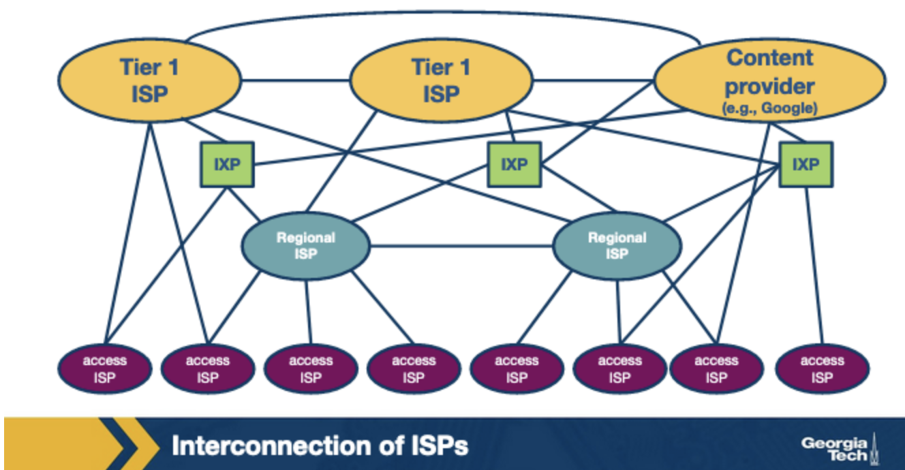

**ISPs** can be categorized into three types:

* access ISPs (tier 3)
* regional ISPs (tier 2)
* global ISPs (tier 1)

There are a dozen large scale **tier-1 ISPs** that operate at a global scale and essentially they **form the "backbone" network over which smaller networks can connect**. Some example Tier-1 ISPs are AT&T, NTT, Level-3, and Sprint.

**IXPs** are **interconnection infrastructures** which provide the physical infrastructure where multiple networks (ISPs, CDNs) can interconnect and exchange traffic locally.

Third, **CDNs are networks that are created by content providers with the goal of having greater control of how the content is delivered** to the end-users, and also to reduce connectivity costs. Some example CDNs include Google and Netflix.

This ecosystem forms a hierarchical structure since smaller networks connect to larger networks. The smaller ISPs are customers of the larger ISPs. This leads to **competition at every level** of the hierarchy. However, competing ISPs need to cooperate to provide global connectivity to their respective customer networks. ISPs deploy multiple interconnection strategies depending on the number of customers in their network and also the geographical location of the networks.

A** PoP (point of presence)** is a group of one or more routers (At the same location) in the provider's network where customer ISPs can connect to the provider ISP. PoPs exist in all levels of the hierarchy, except for the bottom. For a customer network to connect to a provider's PoP, it can lease a high-speed link from a third-party telecommunications provider to directly connect one of its routers to a router at the PoP.

Any ISP (except for tier-1) may choose to **multi-home**, which means to connect to two or more provider ISPs.

Lastly, to reduce costs, a pair of nearby ISPs at the same level can **peer**, which means directly connecting their networks together so that all the traffic between them passes over the direct connection rather than through upstream intermediaries.

Note that the** internet ecosystem is rapidly evolving from a multi-tier hierarchy** built mostly with transit links t**o a dense mesh formed with mostly peering links**.

Each of the types of networks that we talked about above may operate as an Autonomous system (AS). An AS is a **group of routers (and the links between) that operate under the same administrative authority**. Each AS implements its own set of policies.

The** border routers of ASes **use the **Border Gateway Protocol (BGP) **to** exchange routing information** with one another. In contrast, the Internal Gateway Protocols (IGPs), operate within an AS and they are focused on optimizing a path metric within the network. Example IGPs include OSPF, IS-IS and RIP. 

**AS Business Relationships**

1. **Transit (provider-customer)**
2. **Peering **

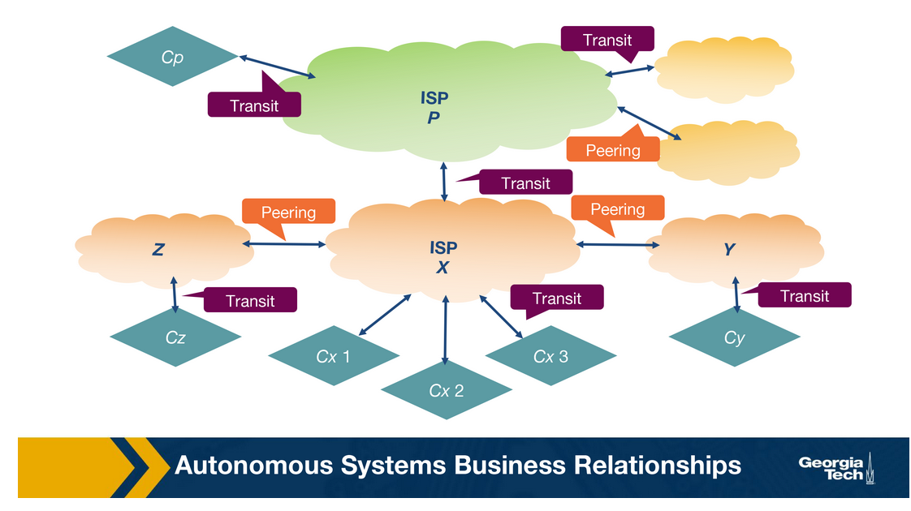

One major factor that determines a provider's revenue is the data rate of an interconnection. A provider usually charges in one of two ways:

1. Based on a fixed price given that the bandwidth used is within a predefined range.
2. Based on bandwidth usage.

**BGP Routing Policies**

AS business relationships drive an ASes routing policies and influence which routes an AS needs to import or export.

Deciding which route to export is an important decision. Advertising a route for a destination to a neighboring AS means that this route may be selected and traffic will flow through on this route. Deciding which routes to advertise is a policy decision and it is implemented through **route filters**, **rules that determine which routes an AS will advertise** to other ASes.

Let's look at a couple of different scenarios for routes:

1. **Routes learned from customers**
2. **Routes learned from providers**
3. **Routes learned from peers**

**ASes are also selective about which routes to import**. When an AS receives multiple route **advertisements towards the same destination** from multiple ASes, then it needs to **rank the route**s before selecting which one to import. The routes that are preferred first are the customer routes, then the peer routes, and then finally the provider routes.

The reasoning behind this ranking is

1. wants to ensure that routes towards its customers do not traverse other ASes unnecessarily generating costs
2. uses routes learned from peers since these are usually “free” (under the peering agreement)
3.  finally resorts to import routes learned from providers as these will add to costs.

**BGP and Design Goals**

BGP provides each AS a means to:

1. Obtain subnet reachability information from neighboring ASes.
2. Propagate the reachibility information to all routers internal to the AS.
3. Determine "good" routes to subnets based on the reachability information and on AS policy.

Importantly, BGP allows each subnet to advertise its existence to the rest of the internet.

**BGP Protocol Basics**

**

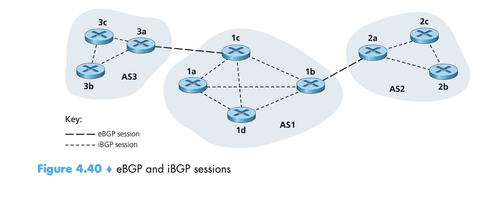

**

In BGP, pairs of border routers exchange routing information over semipermanent TCP connections using port 179. There are also semipermanent TCP connections between routers within an AS.

The TCP connection along with all the messages sent on the connection is called a **BGP session**. A BGP session that **spans two ASes** is called an external BGP (**eBGP**) session, and a BGP session between routers in the **same AS** is called an internal BGP **(iBGP)** session.

To begin a BGP session, a router will send an OPEN message to another router. Then sending and receiving router will exchange announcements from their routing tables. This can take anywhere from seconds to a couple of minutes.

There are two types of BGP messages:

1. **Updates**
    1. **Announcements**
    2. **Withdrawals**

2. **Keepalive**

In BGP,** destinations are not hosts but instead are CIDRized prefixes**, with each prefix representing a subnet or a collection of subnets. Gateway routers running eBGP advertise the subnets they can reach according to the AS's specific export policy. Internal routers run iBGP to propagate the routes received by the gateway routers to other internal iGRP speaking routers.

Advertised BGP routes also consist of a number of **BGP attributes**. Two notable attributes are:

* **AS-PATH**
* **NEXT-HOP**

**iBGP and eBGP**

**

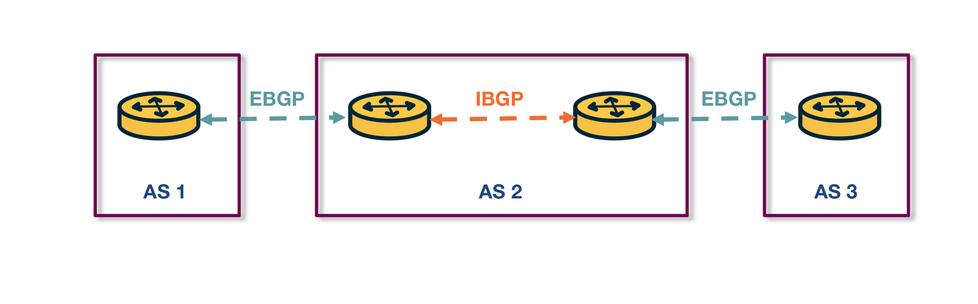

**

Both protocols are used to disseminate routes for external destinations.

The dissemination of routes within the AS is done by establishing a full mesh of iBGP sessions between the internal routers. Each eBGP speaking router has an iBGP session with every other BGP router in the AS.

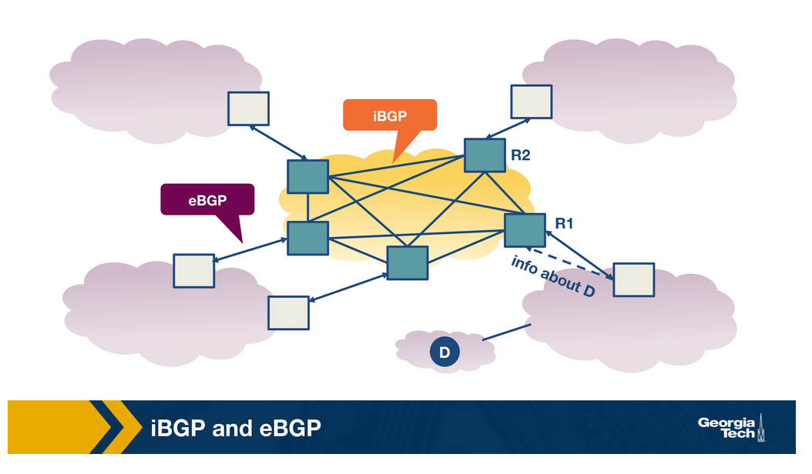

iBGP is not another IGP-like protocol (like RIP or OSPF). IGP-like protocols are used to establish paths between internal routers of an AS based on specific costs within the AS. In contrast, **iBGP is only used to disseminate external routes within the AS**.

**BGP Decision Process: selecting routes at a router**

Because ASes are operated and managed by different administrative authorities, and they can operate with different business goals and network conditions, BGP policies for each will be different. 

Still, routers follow the same process to select routes.

**

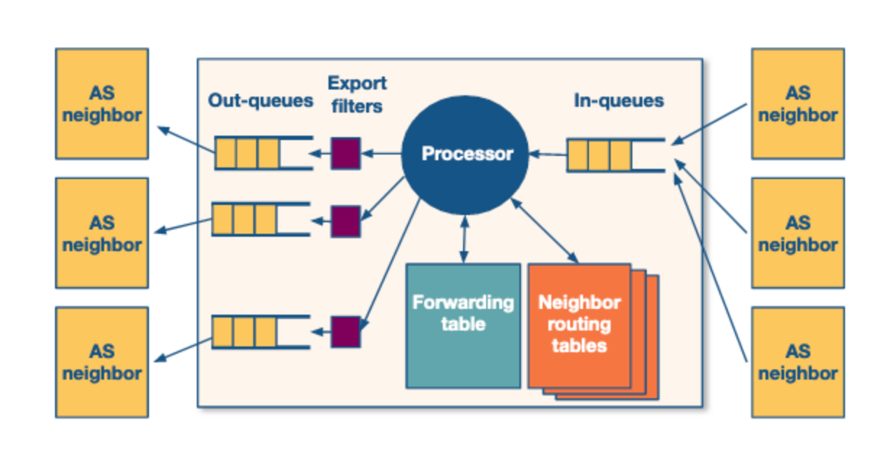

**

A router receives incoming BGP messages and processes them. When a router receives advertisements, **first it applies the import policies to exclude routes **entirely from further consideration.

Then the router i**mplements the decision process to select the best routes that reflect the policy in place**. The new selected routes are **installed in the forwarding table**. Finally, the router decides which neighbors to export the route to, by applying the export policy.

A router implements the decision process by comparing routes. It compares routes by comparing the attributes of each advertisement.

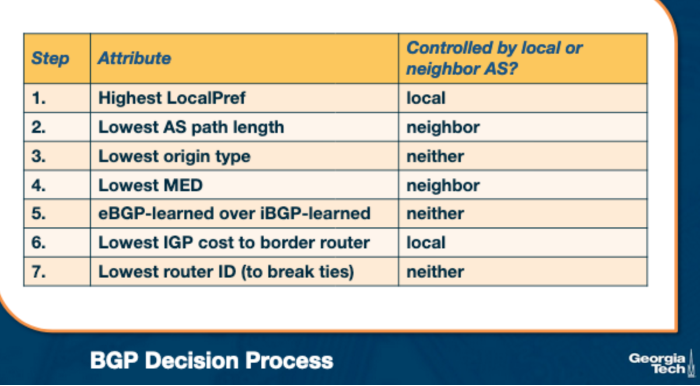

Let's look at the **LocalPref** attribute. This attribute is **used to prefer routes learned through a specific AS** over other ASes (this might be useful for a peering relationship).

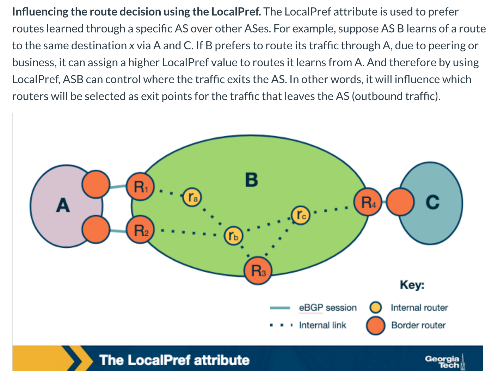

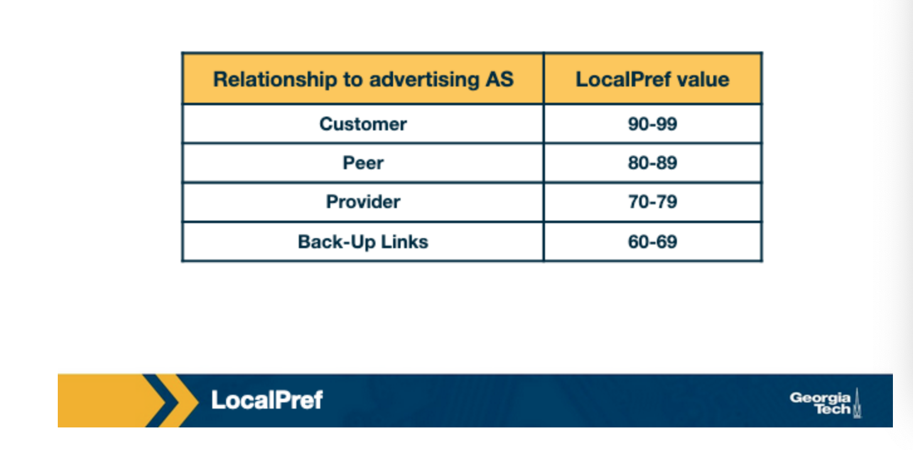

Another attribute is the **MED attribute**. It is used by ASes connected by multiple links to designate which of those links are **preferred for inbound traffic**. The MED value can be used to label relationships between routers.

How are attributes controlled?

1. Locally by the AS
2. By the neighboring AS
3. They are set by the protocol

**Challenges with BGP**

BGP can suffer from two major limitations: misconfigurations and faults. Misconfigurations can lead to excessively large number of updates which in turn can lead to route instability, router processor and memory overloading, outages and router failures.

One way to control these issues to limit the routing table size and also limit the number of routing changes.

An AS **can limit the routing table size using filtering**. They can limit the number of prefixes that are advertised from a single source on a per-session basis. They can even aggregate prefixes and export less specific prefixes.

An AS can limit the number of routing changes by using a mechanism known as **flap damping**.  In this technique, an AS will track the number of updates to a specific prefix over a certain amount of time. If the tracked value reaches a configurable value, the AS can suppress the route until a later time.

**Peering at IXPs**

ASes can either peer with one another directly or they can peer at **Internet Exchange Points** (IXPs) which are infrastructures that **facilitate peering and provide other services**.

The ASes that **interconnect at an IXP** are called **participant ASes**. The physical infrastructure of an IXP is usually a network of switches that are located within the same physical location, or they can be distributed over a region. Typically, the infrastructure has a fully redundant switching fabric that provides fault-tolerance.

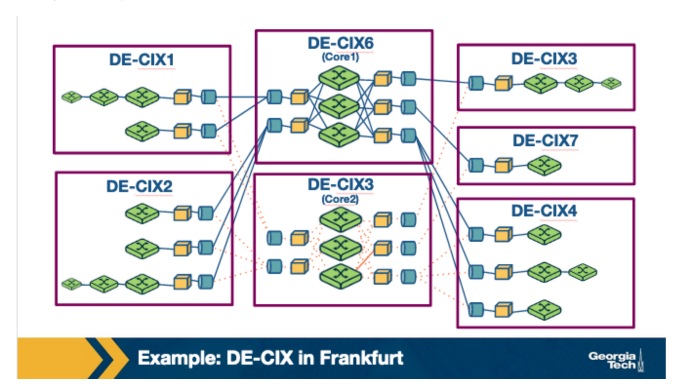

IXPs are becoming important to study because:

1. **They are handling large traffic volumes**
2. **Help mitigate DDoS attacks**
3. **Research Playground**
4. **IXPs are active marketplaces and innovation hubs**

**What are the steps for an AS to peer at an IXP?**

Each participating AS must have a public ASN. Each participant brings a router to the IXP facility. They incur a one-time cost for installing a circuit, and then a monthly bill for their usage.

**Why do networks choose to peer at IXPs?**

* Locality - traffic that is exchanged between networks shouldn't need to travel through other networks.
* Lower costs 
* Improved network performance
* Incentives from big content providers

**IXP Services**

1. **Public peering - **
2. **Private peering - **
3. **Route Servers and Service Level Agreements -**
4. **Remote peering through resellers -**
5. **Mobile peering -**
6. **DDoS blackholing -**
7. **Free value-add services - **

**Peering at IXPs: How does a route server work?**

Generally, the manner in which two ASes exchange traffic through the switching fabric was to utilize a two-way BGP session, called a bilateral BGP session. But since there has been an increasing number of ASes present at an IXP, there has **been a challenge to accommodate all of these sessions**. 

To mitigate this, some IXPs operate a **route server** which helps to make peering more manageable. Route servers **collect and share routing information **from peers or participants. It** executes its own BGP decision process and also re-advertises** the resulting information to all of the RS's peer routers.

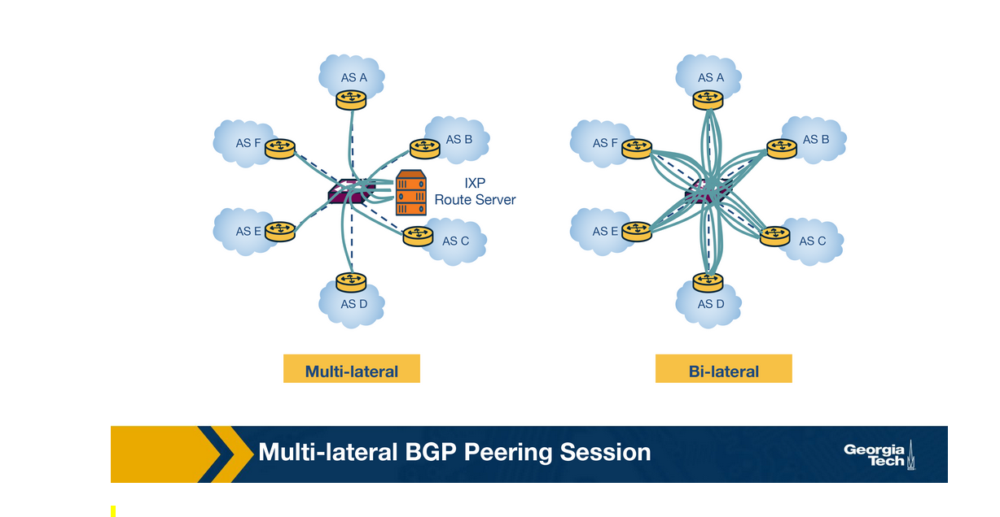

A typical routing server has a routing daemon that maintains a **Routing Information Base (RIB)** which **contains all BGP paths** that it receives from its peers. The route server also maintains AS-specific RIBS to keep track of individual BGP sessions that it maintains with each participant AS.

RSes maintain two types of route filters:

1. **Import filters**
2. **Export filters**

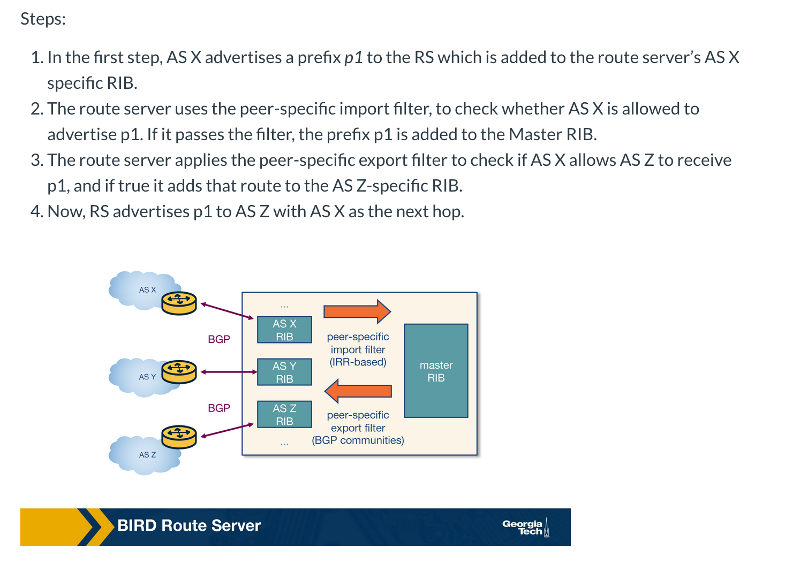

**Remote Peering**

**Remote Peering** (RP) is **peering at the peering point without the physical presence**. A remote peering provider is an entity that sells access to IXPs through their own infrastructure. RP removes the barrier to connecting to IXPs around the world, which in itself can be a more cost-effective solution to localized or regional network operators. 

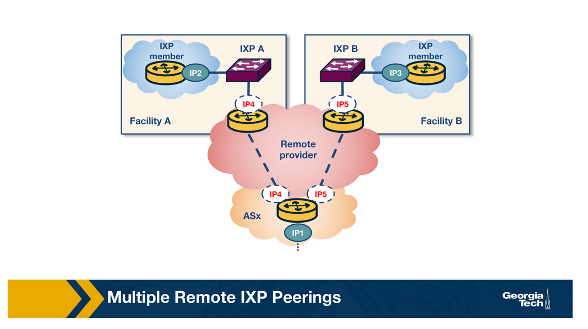
