# Week 5 - Router Design and Algorithms

**Routers** are a critical part of the Internet's physical infrastructure. They are integral because they **forward data** along the path from source to destination. This happens when a router** transfers a received packet from an input link interface to the appropriate output link interface**. It chooses the correct output link interface by consulting a forwarding table.

An increasing number of applications and services don't just require forwarding, but quality of service or security guarantees. This means that routers need to handle packets on multiple criteria. A multitude of algorithms are used in routers to handle these tasks. 

**What's Inside a Router?**

The main job of a router is to implement the forwarding plane functions and the control plane functions.

**Forwarding function** is the router's action to transfer a packet from an **input** link interface **to** the appropriate **output** link interface. Forwarding takes place at very short timescales (typically a few nanoseconds), and is usually **implemented in hardwar**e.

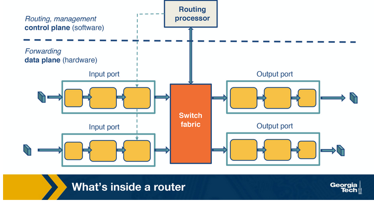

**Input Ports**

Input ports serve several functions:

* The first function is to physically terminate the incoming links to the router.
* The second is to have the data-link processing unit decapsulate the packets.
* The last function is perform the lookup. At this point, the input port consults the forwarding table to ensure that each packet is forwarded to the appropriate output port through the switch fabric.

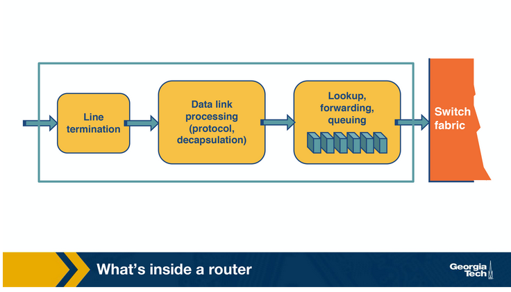

**Switching Fabric**

The switching fabric moves packets from the input to the output ports and it makes the connections between them. There are three types of switching fabrics: memory, bus and crossbar.

**Output Ports**

An important function of the output ports is to receive and queue the packets which come from the switching fabric and send them over to the outgoing link.

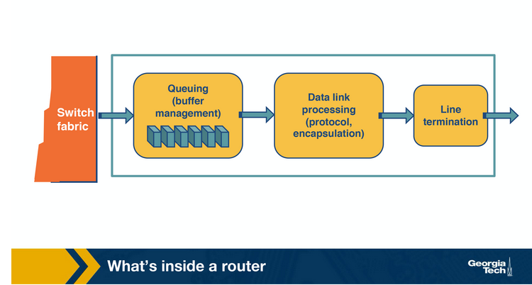

**Control plane**

Implementing routing protocols, maintaining routing tables, and computing the forwarding table are all implemented in software in the routing processor. Another strategy is to have these functions be implemented by a remote controller, that is how SDN works. 

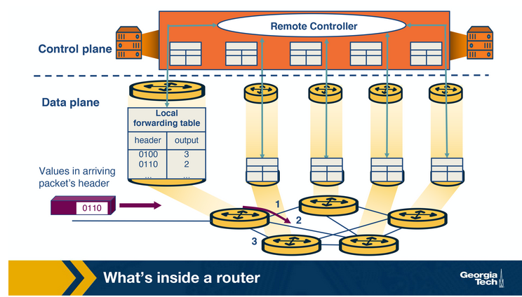

**Router Architecture**

**The main task of a router is to switch a packet from an input link to an output link.** In most diagrams, these links are show separately, but note that in reality they are often put together.

**

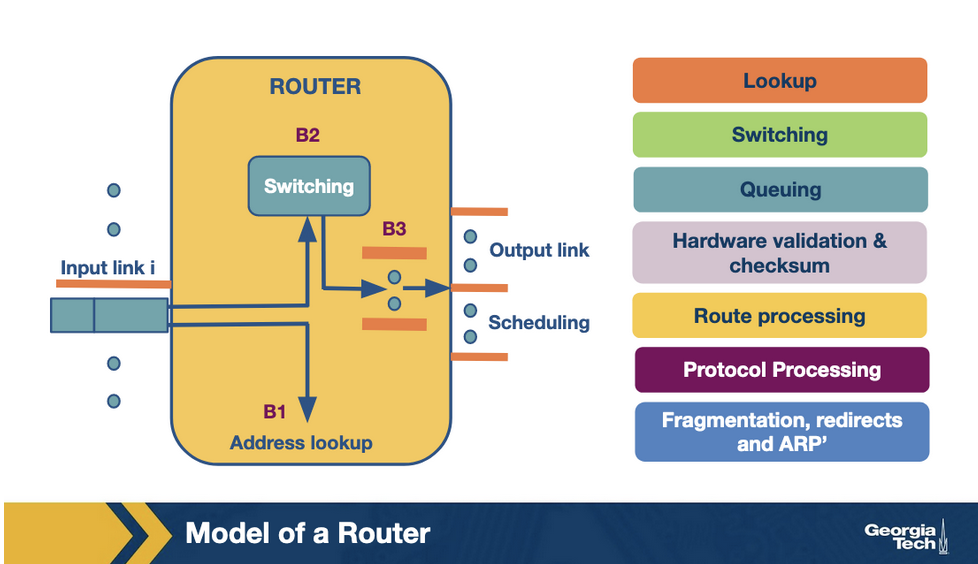

**

**Time Sensitive Routing functions**

1. **Lookup**
2. **Switching**
3. **Queueing**

**Less Time-Sensitive routing functions**

1. **Header validation and checksum**
2. **Route processing**
3. **Protocol processing**
    1. SNMP - simple network management protocol
    2. TCP/UDP - for remote communicatione
    3. ICMP - For sending error messages and TTL exceptions

**Switching Fabrics**

The switching fabric is the brains of the router, it actually performs the main task to switch/forward the packets from an input to an output. There are three main strategies that can be used to implement switching fabrics.

1. **Switching via memory**
2. **Switching via bus**
3. **Switching via interconnection network**

**Challenges that the router faces**

1. **Bandwidth and Internet population scaling **
2. **Services at high speeds **

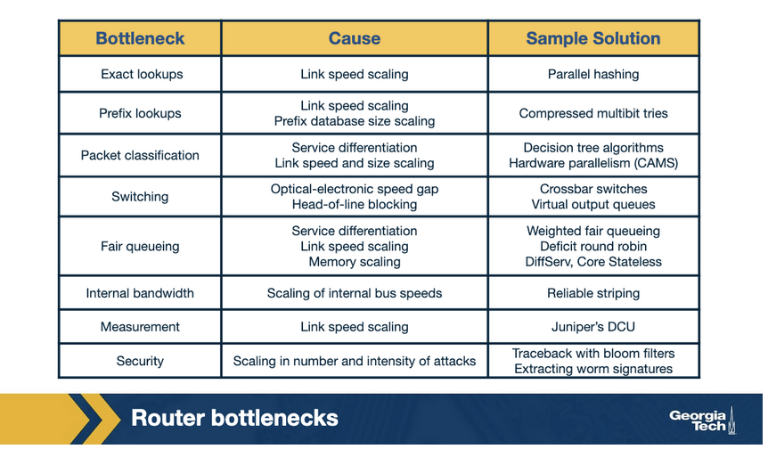

1. **Longest prefix matching**

**Prefix-match lookups**

The internet continues to grow in terms of networks (ASes) and IP addresses. One of the challenges that a router faces is the scalability problem, and one way to help with the scalability problem is to "group" multiple IP addresses by the same prefix.

**Classless Inter-Domain Routing (CIDR)** assigns IP addresses using arbitrary-length prefixes. CIDR has helped to decrease the router table size, but it has also introduced a new problem: longest-matching prefix lookup.

The important element of a lookup algorithm/operation is how fast it is done. A large part of the cost of computation for lookup is **accessing memory**. Measurement studies on network traffic have shown a large number of concurrent flows of short duration. This large number means that a cache solution will not work efficiently. (Really, why? There are too many entries?

**Unibit tries**

To motivate our discussion of prefix-matching algorithms, we will use an example prefix database with nine prefixes as shown below.

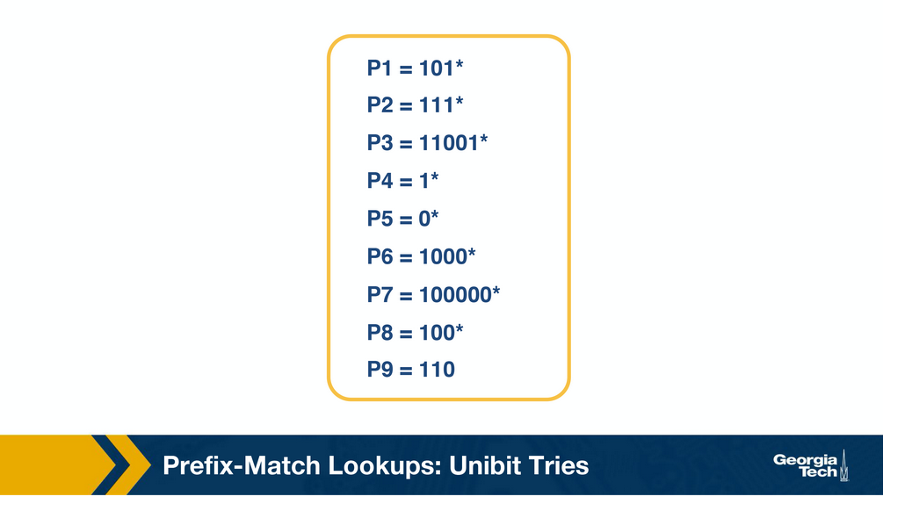

One of the simplest techniques for prefix lookup is the **unibit trie.** The above database would look as follows.

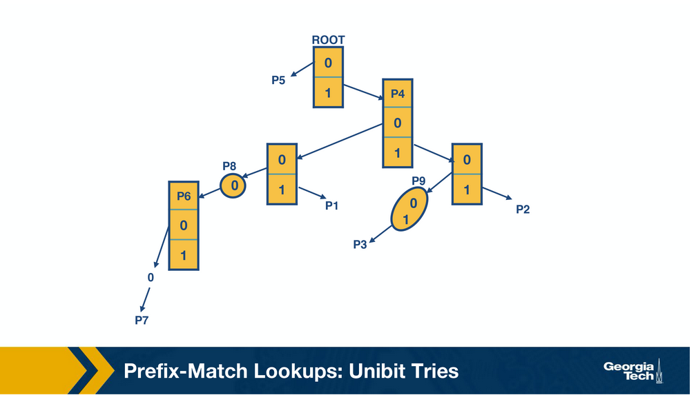

In a unibit trie, every node has a 0 or 1 pointer. Starting with the root, pointer 0 points to a subtrie for all prefixes that start with 0, and similarly pointer 1 points to a subtrie for all prefixes that start with 1. This pattern continues until all entries are represented.

To do prefix matching, we follow the path from the root node down to the trie. 

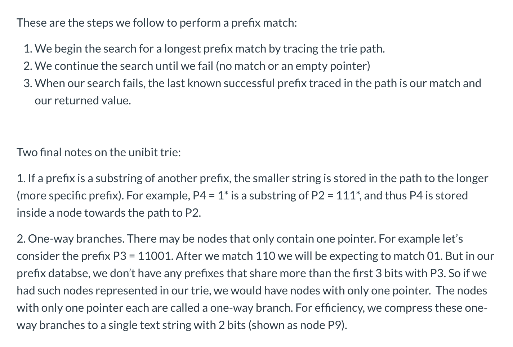

**Multibit tries**

While **unibit tries** are** efficient, fast**, and easy to update, they have a **large number of memory accesses.**

For 32 bit addresses, we might need 32 memory accesses, assuming a 60 nsec latency, the worst case search time is 1.92 microseconds. This could be very inefficient in high speed links.

One way to improve lookups is to use a **stride**, which is a **number of bits that we check** at each step. 

Thus, an alternative to unibit tries are multibit tries where each node has 2K children, where k is the stride. Next we will see we can have two flavors of multibit tries: **fixed-length stride tries**, and **variable length stride tries**. 

**Prefix Expansion**

Consider a prefix such as 101* (length 3) and a stride length of 2 bits. If we search in 2 bit lengths, we will miss out on prefixes like 101*. To combat this, we use a strategy called controlled **prefix expansion**, where we **expand a given prefix to more prefixes**.

We ensure that the expanded prefix is a multiple of the chosen stride length. At the same time we remove all lengths that are not multiples of the chosen stride length. We then end up with a new database of prefixes, which may be larger, but with fewer lengths. So the **expansion gives us more speed with an increased cost of database size**.

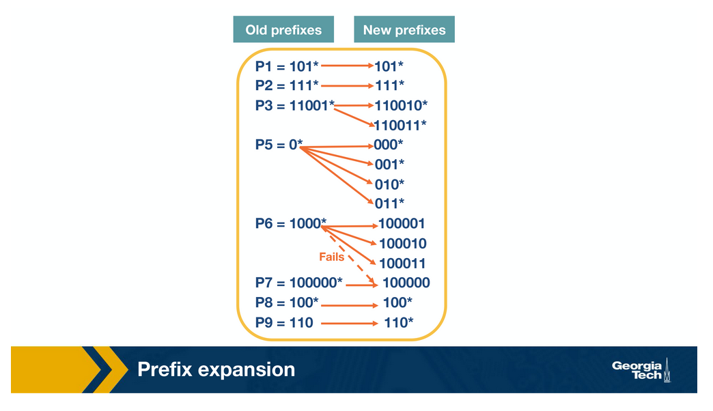

**Originally, we had five prefix lengths. Now we have more prefixes but only two lengths, 3 and 6.** When we expand our prefixes, there may be a collision. In that case the expanded prefix gets dropped. 

**Multibit Tries: Fixed Stride**

We will use the same database from earlier to demonstrate a fixed stride multibit trie. The stride will be of length 3. 

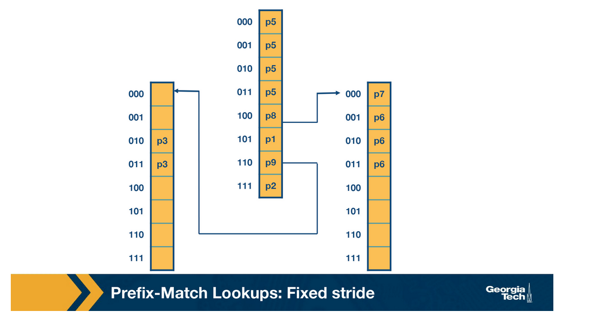

Some key points are:

1. Every element in a trie represents two pieces of information: a pointer and a prefix value.
2. The prefix search moves ahead with preset length in n-bits (3 in this case)
3. When the path is traced by a pointer, we remember the last matched prefix.
4. Our search ends when an empty pointer is met. At that time, we return the last matched prefix as our final prefix match.

Let's consider the memory lookups for this multibit trie compared to our unibit trie. P5 only takes one lookup in both tries, but P7 takes five in the unibit trie and only two in the multibit trie. 

**Variable Stride Multibit Tries**

Variable stride multibit tries are more flexible than their fixed-length counterparts. With this scheme, we can examine a different number of bits every time. 

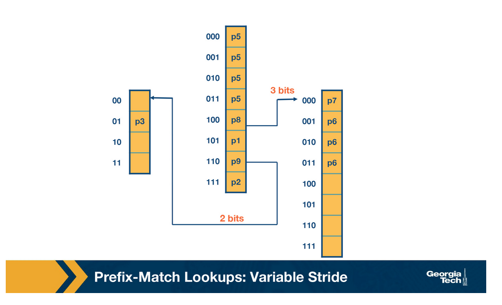

The advantage of this is that we have 4 fewer entries than our fixed stride scheme. This means that by varying stride we can **make our prefix database smaller and optimize for memory.**

Some key points about variable stride:

1. Every node can have a different number of bits to be explored.
2. The optimizations to the stride length for each node are all done in pursuit of saving trie memory.
3. An optimum variable stride is selected using dynamic programming.
