# Week 6 - Router Design and Algorithms (Part 2)

**Introduction to Packet Classification**

As the internet becomes increasingly complex, networks require **quality** of **service** guarantees and security **guarantees for their traffic**. Packet forwarding based on the longest prefix matching of destination IP address is not enough and we need to handle packets based on multiple criteria. We refer to this as **packet classification**.

Some variants of packet classification have already been established:

1. **Firewalls**
2. **Resource Reservation Protocols**
3. **Routing based on traffic type**

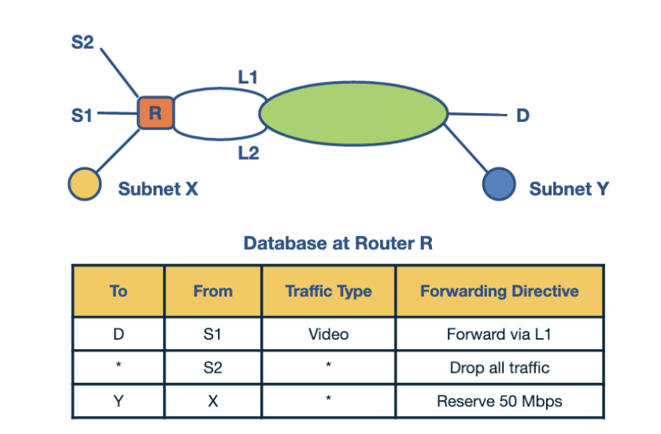

Above is an example of a **traffic-sensitive routing scheme**. 

1. The first rule in the table is for routing video traffic from S1 to D via L1. 
2. The second rule drops all traffic from S2. 
3. The third rule preserves 50 Mbps for traffic from X to Y.

**Simple Solutions to Packet Classification**

Before looking into algorithmic solutions to packet classification, let's look at naive solutions.

1. **Linear Search**
2. **Caching**
    1. The cache-hit rate can be high, but we still need to perform searches for missed hits. Even with high hit rate, a slow linear search will result in poor performance.

3. **Passing Labels**

**Fast Searching Using Set-Pruning Tries**

To inform our discussion let us consider the problem of doing two-dimensional packet classification. Since there are only three distinct approaches to one-dimensional prefix-matching: using tries, binary search on prefix lengths, and binary search on ranges. It is worth looking at generalizations of these approaches. The most efficient is the generalization of tries. 

The generalization of standard prefix tries to two dimensions is called the **grid of tries**. 

**

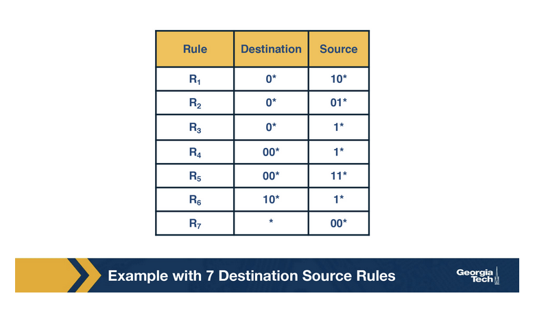

**

Let's use the rule set above to build a trie on the destination prefixes in the database and then **attach a number of source tries off the leaves of the destination trie**.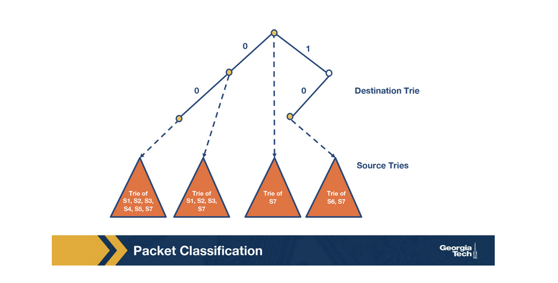

To** use this data structure**, we first match the destination IP address in a packet in the destination trie. Then we traverse the corresponding source trie to find the longest prefix match for the source IP. This is the basic idea of the **set-pruning tree**.

The problem with this extension of tries is that we have a memory-explosion problem because the source prefix can be present in multiple tries. See how S1,S2 and S3 are present on both of the left source tries in the image above.

**Reducing Memory using Backtracking**

**

**

The set pruning approach has high cost in memory to reduce time in the two-dimensional problem. **An opposite approach is to pay in time to reduce memory consumption.**

Let's look at the leftmost tree above. The prefix D = 00* has two rules associated with it, R4 and R5. The other rules, R1, R2, R3, R7 are copied into D's trie because their destination fields 0* and *, respectively, are a prefix of D.

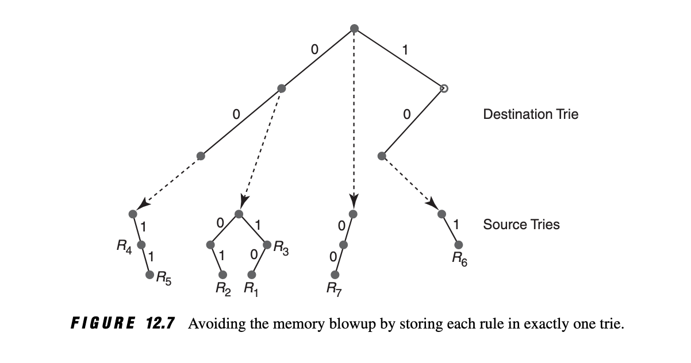

This copying can be avoided by having each destination prefix D point to a **source trie that stores the rules whose destination field is exactly D.** This means we need to modify the search strategy, instead of just searching the source trie for the best-matching destination prefix D, the **search algorithm must now search the source tries associated with all ancestors of D**.

Since each rule now is stored exactly once, the memory requirements are lower than the previous scheme. But** the lookup cost for backtracking is worse than for set-pruning tries**.

**Grid of Tries**

**

**

With the **Grid of Tries** approach, we can **reduce the time** in the **backtracking search** using **precomputation**. 

When there is a failure point in a source trie, we precompute a **switch pointe**r which take us to the next possible source trie than can contain a matching rule.

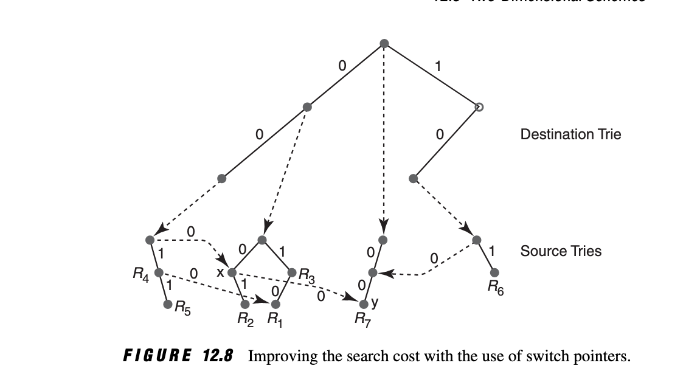

Let's look at an example. To do this we need to look at both Figures 12.7 and 12.8. **Let's match the packet with destination address 001 and source address 001.**

Using Backtracking

1. The search in the destination trie gives D = 00 as the best match. 
2. So the backtracking algorithm starts its search for the matching source prefix in the associated source trie, which contains rules R4 and R5
3. However, the search immediately fails, since the first bit of the source is 0. So the backtracking search backs up to the destination trie.

This backing up is a waste because we've already searched 0,0. The proper place to start searching again to is point x in Figure 12.8

The precomputed switch pointers allow us to take shortcuts. Using these pointers we do not do backtracking to find an ancestor node and then to traverse the source trie. We still proceed to match the source, and we keep track of our current best source match. But we are skipping source tries with source fields that are shorter than our current source match.

**Scheduling and Head of Line Blocking**

**

**

**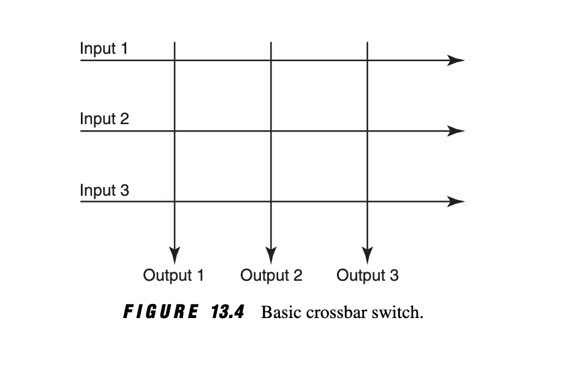

**

The simplest crossbar is an array of N input buses and N output buses.  Each crosspoint needs to be controlled (turned on or off), and we need to make sure that each input link is connected with at most one output link. Also, for better performance we want to **maximize the number of input/output link pairs that communicate **in parallel. 

A simple scheduling algorithm is the "**take the ticket" algorithm. **Each output line maintains a distributed queue for all input lines that want to send packets to it. When an input line wants to send a packet to a specific output line, it requests a ticket. The input line then waits for the ticket to be served by the output queue. Once it is, the input line connects to the output line, the crosspoint is turned on, and the input line sends the packet. 

See an example below for multiple input lines requesting a ticket from the same output line.

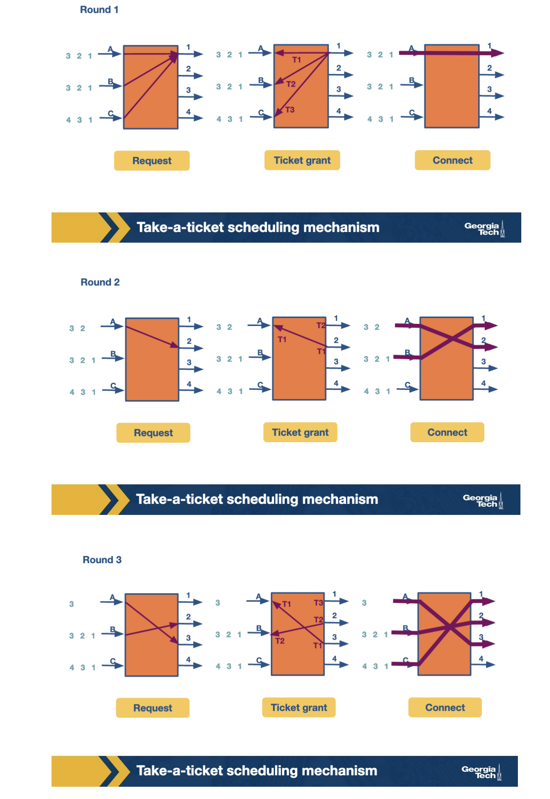

The following figure shows how the entire process progresses. For each output link we can see the time line as it connects with the input link. The empty spots mean no packets were sent at the corresponding time.

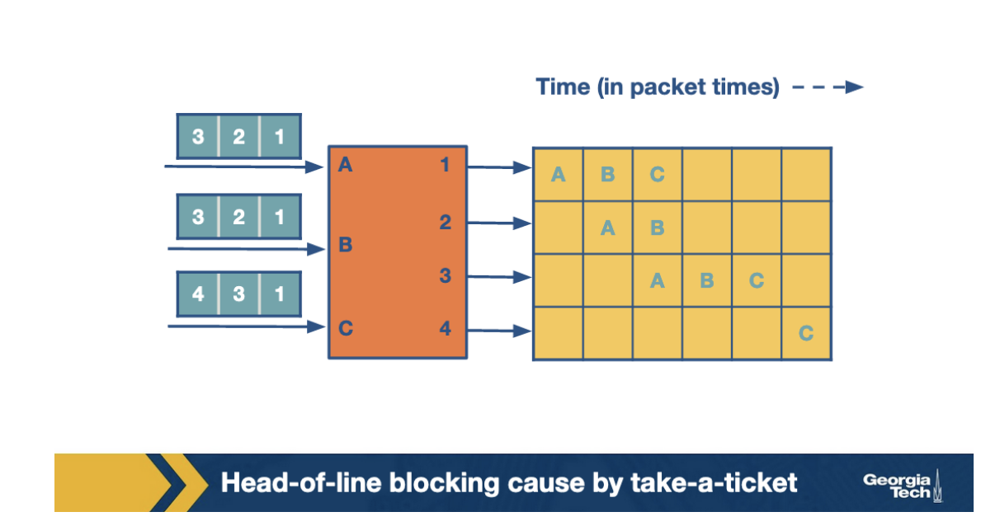

We can notice one big problem with this scheme. The **entire queue for B and C are waiting while A** is sending its packets at Time 0.  We refer to this problem as **head-of-line (HOL) blocking** because the entire queue is blocked by the progress of the head of the queue. 

**Avoiding Head of Line Blocking**

**

**

When HOL blocking was discovered, there was a slew of papers that proposed output queueing in place of input queueing to avoid HOL blocking. 

The idea is that it would be impossible for packet P destined for a busy output port to block another packet behind it. This is because packet P is sent off to queue at the output port, where it can **only block packets sent to the same port**.

The simplest way to do this would be to run the fabric N times faster than the input links (if we have N input links). Then even if all N inputs send to the same output in a given cell time, all N packets can be sent through the fabric to be queued at the output. This would require an N-fold speedup within the fabric, which is expensive and probably not feasible.

A practical implementation of this approach is the **Knockout scheme**. The basic idea of this scheme (please see p.313 of Network Algorithmics for more detail) is that instead of speeding up the fabric by N times, say we design the fabric links to run at K, where K is a reasonable estimate of the number of packets could all go to a single output queue. In the case where there is contention, a switching element called a **concentrator** is used to randomly pick a winner and loser packet for queueing.

Another scheme is called **parallel iterative matching **whereby queueing is still allowed for input lines, but in such a way that avoids HOL blocking. With this approach we **schedule both the head of the queue, but also more packets**, so that the queue makes progress in the case that the head is blocked.

We do this by breaking down the single input queue into multiple virtual input queues, with one queue for each output link.

In the accept phase, inputs that receive multiple grants randomly pick an output to send to. You can see this int he first round for Input A.

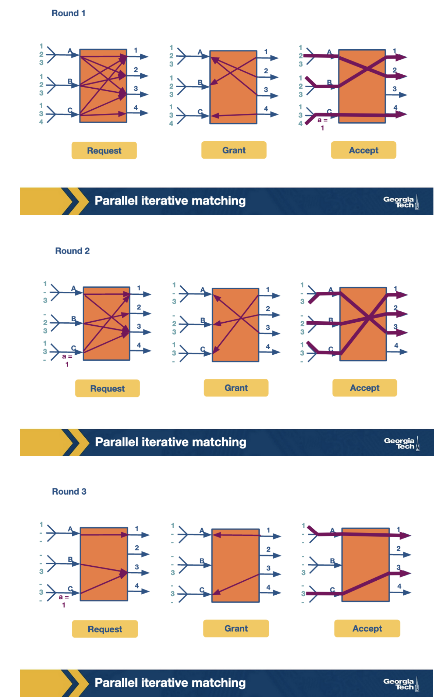

**Scheduling Introduction**

**

**

Busy routers rely on scheduling for the handling of routing updates, management queries and data packets. This is done in real-time, and due to increasing link speeds, these scheduling decisions need to be made in the minimum inter-packet times. 

The simplest method of router scheduling is **FIFO with tail drop**. In this method, packets enter a router on input links. They are then looked up using the address lookup component which gives the router an output link number. The switching system within the router than places the packet in the corresponding output port. This port is a FIFO queue, but if the buffer is full the incoming packets to the tail of the queue are dropped.

There are **other methods of packet scheduling** such as priority, round-robin, etc. These methods are **useful in providing quality of service guarantees** to a flow of packets on measures such as delay and bandwidth. 

**Deficit Round Robin**

**

**

We are now going to look at a **method to enforce bandwidth reservations** in schedulers.

We saw that FIFO queue with tail drop could result in important flows being dropped. To avoid this, and i**ntroduce fairness** in servicing different flows, we consider **round robin**. 

If we were to implement a naive round-robin, and alternate between packets from different flows, the difference in packet sizes could result in some flows getting serviced more frequently. To avoid this, researchers came up with bit-by-bit round robin. This provides provably fair bandwidth distribution and some remarkably tight delay bounds, unfortunately, it is hard to implement at gigabit speeds.

Another scheme is** packet-level fair queueing**. At any round the packet which has the lowest round number is chosen.

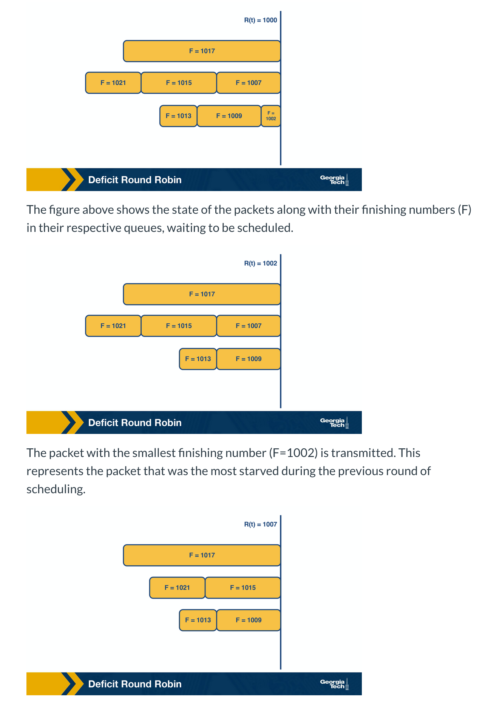

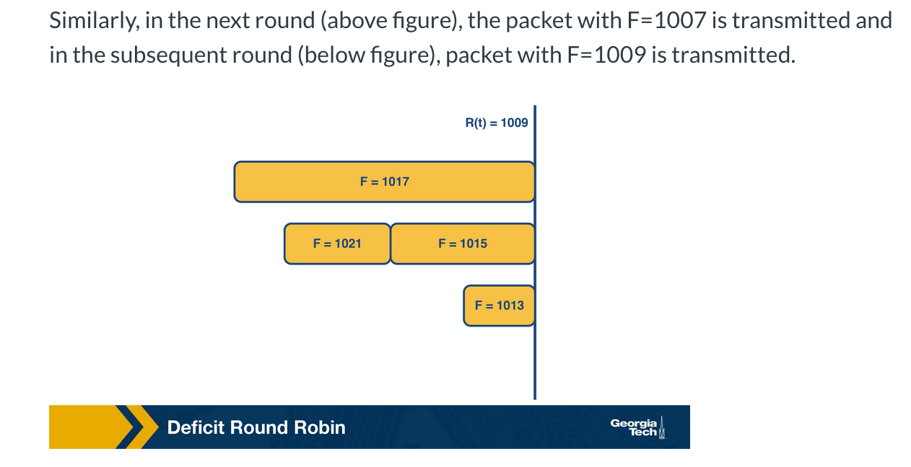

Although this method is fair, it also introduces new complexities. We need to **keep track of the finishing time at which the head packet of each queue will depart and choose the earliest one**. 

Although bit-by-bit Round Robin gave us bandwidth and delay guarantees, the time complexity was too high. We can use a simple constant-time round robin algorithm with a modification to ensure fairness: **Deficit Round Robin.**

**

**

For each flow, we assign a quantum size, Qi, and a deficit counter, Di. The quantum size determines the share of bandwidth allocated to the flow. For each turn of RR, the **algorithm will serve as many packets in the flow i with size less than Qi + Di**. If there are packets remaining in the queue, it will store the remaining bandwidth in Di for the next run. However, if all the packets are serviced, it will clear Di. 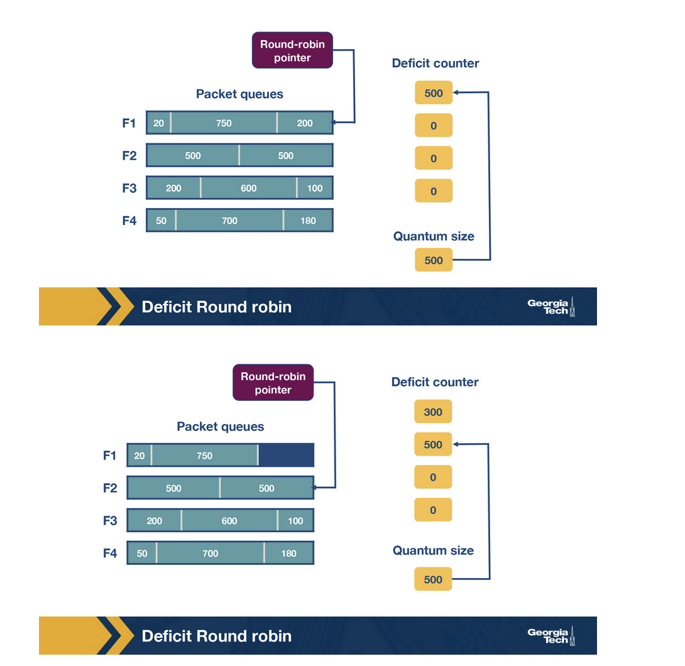

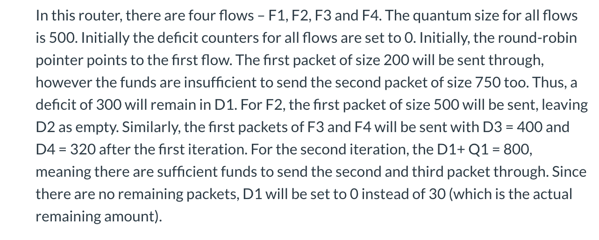

**Traffic Scheduling: Token Bucket**

**

**

There are scenarios where we want to **set bandwidth guarantees for flows in the same queue without separating them**. For example, we can have a scenario where we want to limit the specific type of traffic in the network to no more than X Mbps, without putting this traffic into a separate queue. 

We will start by describing the idea of token bucket shaping. This technique can limit the burstiness of a flow by:

* limiting the average rate
* limiting the maximum burst size

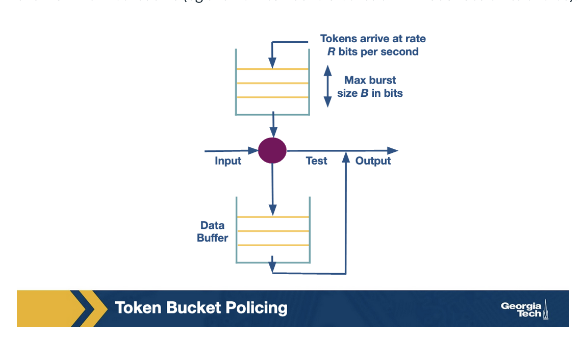

This technique assumes a bucket per flow, that fills with tokens with rate R per second, and it also can have up to B tokens at any given time.  If the bucket is full with B tokens, then additional tokens are dropped.

When a packet arrives, it can go through if there are enough tokens (equal to the size of packets in bits). If not, the packet needs to wait until enough tokens are in the bucket. **Given the max size of B, a burst is limited to B bits per second. **

**

**

In practice, this idea is implemented using a **counter** (can't go higher than max value B, and gets decremented when a bit arrives) and a **timer** (to increment the counter at a rate R). 

The problem with this technique is there is one queue per flow. To maintain a single queue, we use a modified version called token bucket policing. When a packet arrives we will need to have tokens at the bucket, if the bucket is empty the packet is dropped.

**Traffic Scheduling: Leaky Bucket**

**

**

Traffic policing and traffic shaping are **mechanisms to limit the output rate of a link**. The output rate is controlled by identifying traffic descriptor violations and then responding to them in two different ways. 

* **Policer**
* **Shaper**

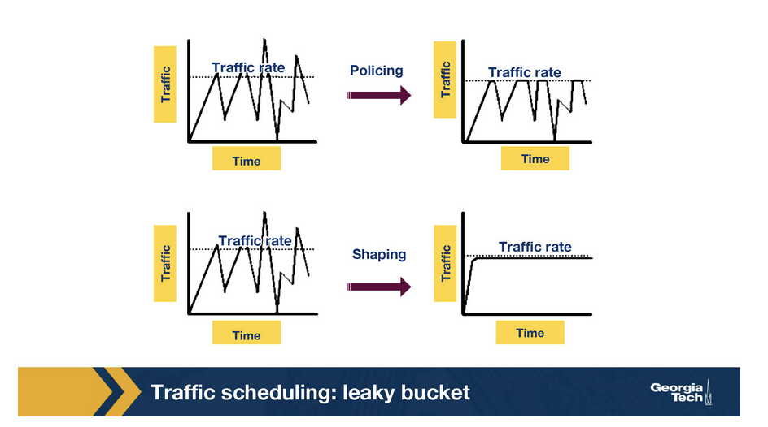

The **Leaky Bucket** is an algorithm which can be used in both traffic policing and traffic shaping. 

The Leaky Bucket algorithm is analogous to water flowing into a leaky bucket with the water leaking at a constant rate. The bucket, say with capacity b, represents a buffer that holds packets and the water corresponds to incoming packets. The leak rate, r, is the rate at which the packets are allowed to enter the network which is constant irrespective of the rate at which the packets arrive.

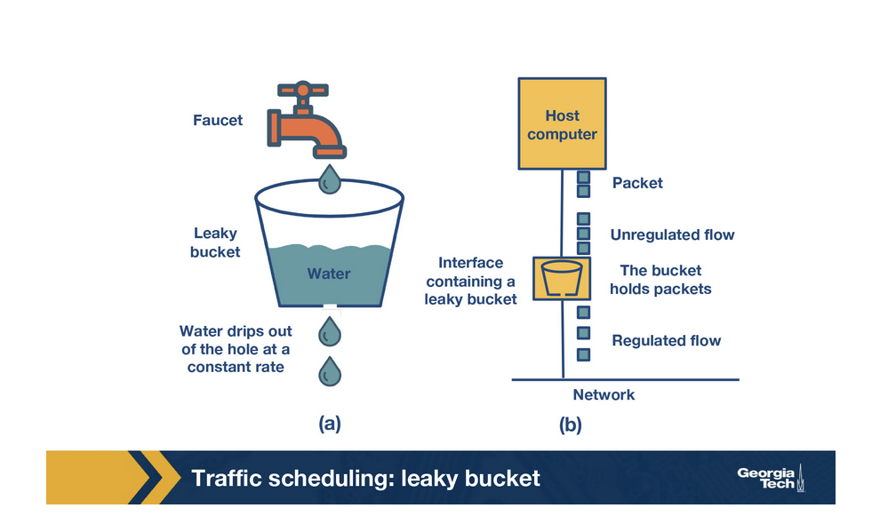

If an arriving packet does not cause an overflow when added to the bucket, it is said to be conforming. Otherwise, it is said to be non-conforming. Packets classified as conforming are added to the bucket, while non-conforming packets are discarded. 

Irrespective of the input rate of the packets, the output rate is constant which leads to uniform distribution of packets sent to the network.
