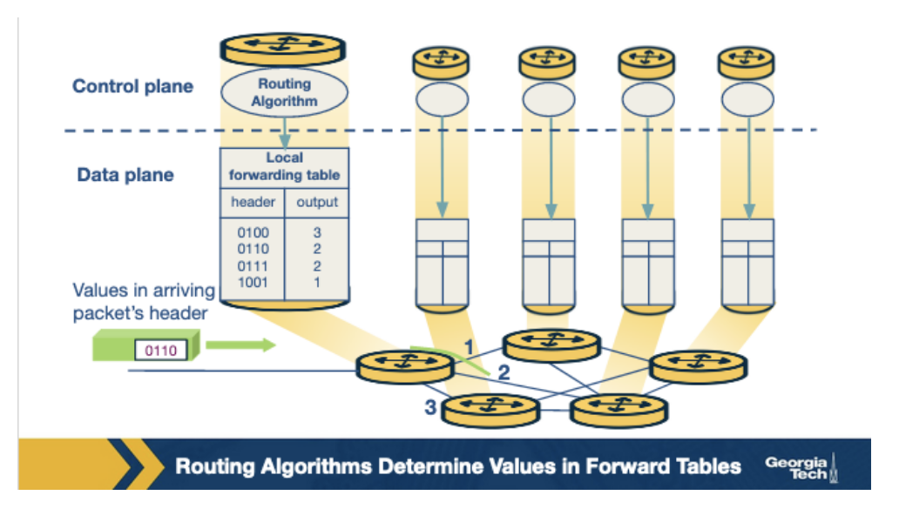
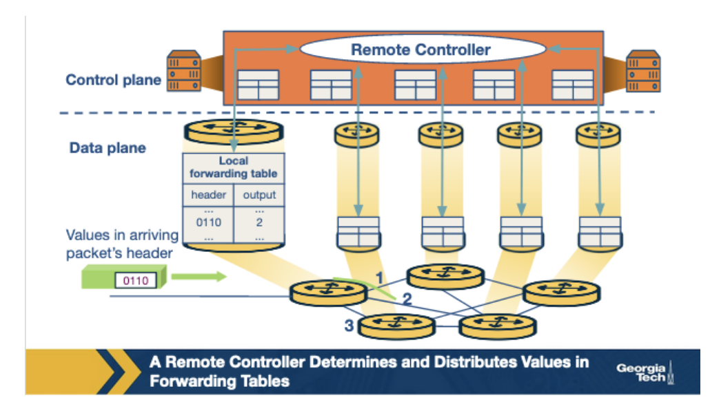
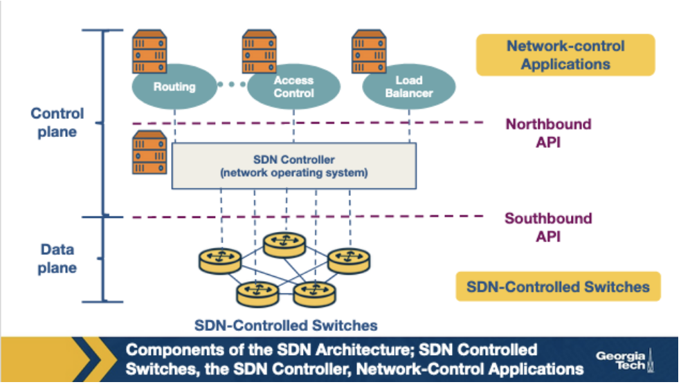
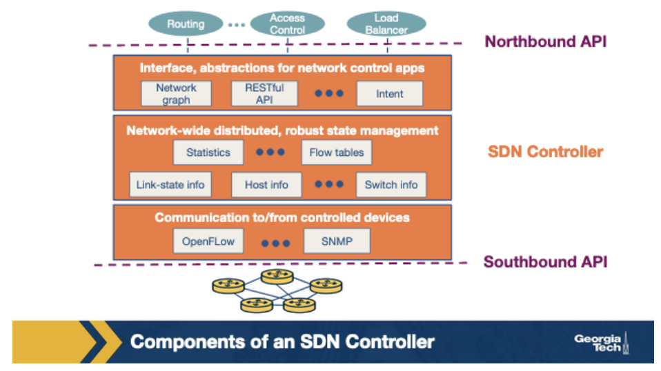

# Week 7 - Software Defined Networking (SDN)

The need to separate the control from the data plane, coupled with increasing challenges that networks have been facing gradually led to the development of SDN technology.

SDN arose as part of the process to **make computer networks more programmable**. Computer networks are complex and difficult to manage for two main reasons:

1. **Diversity of equipment on the network**
2. **Proprietary technologies for the equipment **

SDN offers new ways to redesign networks to make them more manageable. It employs a simple idea -** separation of tasks**, to divide the network into two planes - **control plane **(how to handle traffic)** and data plane **(forwards traffic according to decisions the control plane makes).

SDN **consolidates the control plane** so that a single software control program controls multiple data plane elements. It does this using a well-defined API, **OpenFlow**. 

**A Brief History of SDN**

The history of SDN can be divided into three phases:

1. **Active networks (1995-2002)**
    1. Research aimed at opening up network control. This movement envisioned a programming interface that would open up Data plane customization.

2. **Control and Data plane separation (2001-2007)**
    1. Steady increase in traffic volumes - and thus network reliability, predictability and performance become more important. Network operators were looking for better network-management functions such as control over paths to deliver traffic.

3. **OpenFlow API and network operating systems (2007-2010)**
    1. OpenFlow was born out of the interest in the idea of network experimentation at scale.  It built on existing hardware and enabled more functions than earlier route controllers.

**Why Separate the Data and Control Plane**

1. **Independent evolution and development**
    1. In traditional approaches, routers are responsible for both routing and forwarding functionalities. This meant that a change to either of the functions would require an upgrade of hardware. In this new approach, routers only focus on forwarding. Thus, innovation in this design can proceed independently of other routing considerations.  Similarly, improvement in routing algorithms can take place without affecting any existing routers.

2. **Control from high-level software**
    1. In SDN, we use software to compute the forwarding tables. Thus, we can easily use higher-order programs to control the routers behavior. The decoupling of functions make debugging and checking the behavior of the network easier.

**Control Plane and Data Plane Separation**

**Forwarding **is one of the most common, yet important functions of the network layer. When a router receives a packet at its input link, it must **determine which output link that packet should be sent through**. In addition to forwarding, a router can block a packet, or duplicate a packet to send it out on multiple links. Since forwarding is a local function for routers, it usually takes place in nanoseconds and is implemented in the hardware: that is, it is **a function of the data plane**.

**Routing** involves **determining the path from the sender to the receiver** across the network, Routers rely on routing algorithms for this purpose. It is an end-to-end process for networks. It usually takes place in seconds and is implemented in the software, it is **a function of the control plane**. 

In a traditional approach, the routing algorithms and the forwarding function are closely coupled. The router will run routing algorithms, and from there it can construct the forwarding table which consults it for the forwarding function.

In the SDN approach, there is a remote controller that computes and distributes the forwarding tables used by every router. This controller is physically separate from the router.

We have separation of functions, the routers are solely responsible for forwarding, and the remote controllers are solely responsible for computing and distributing forwarding tables. The controller is implemented in software and therefore we say the network is software defined.

**The SDN Architecture**

The main components of an SDN network are

1. **The SDN-controlled network elements **
2. **The SDN controller**
3. **The Network Control Applications**

**

**

**The four defining features in an SDN architecture are**

1. **Flow-based forwarding**
2. **Separation of data plane and the control plane**
3. **Network control functions**
4. **A programmable network**

**SDN Controller Architecture**

The **SDN controlle**r is part of the SDN control plane and it acts as an **interface between the network elements and the network-control applications**.

An SDN controller can be broadly split into three layers:

* **Communication Layer**
* **Network-wide state-management layer**
* **Interface to the network-control application layer**

**Communication layer** consists of a protocol through which the SDN controller and the network controlled elements can communicate. Using this protocol, the devices send locally observed events to the SDN controller **providing the controller with a current view of the network**. This is known as the **"southbound" interface**.

**Network-wide state-management layer **is the state maintained by the controller about the network. It includes any information about hosts, links, switches and other controlled elements in the network. It also includes copies of the flow tables of the switches.

The **interface to the network-control application layer** is known as the **"northbound" interface.** This interface allows the controller to interact with applications that can read/write network state and flow tables into the state management layer. The controller can also notify applications send by the SDN-controlled devices.

Many modern controllers such as OpenDayLight and ONOS are implemented using distributed controllers to provide highly scalable services.
