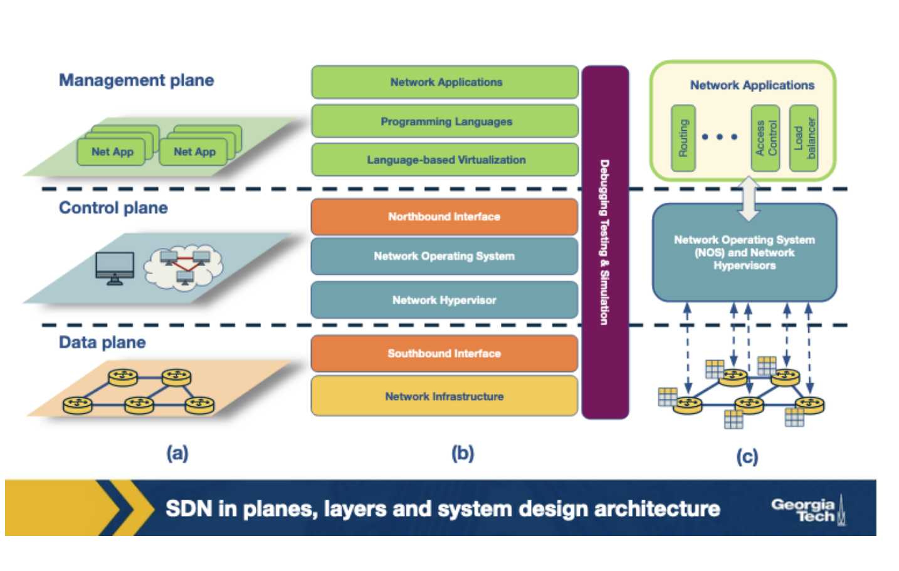

# Week 8 - Software Defined Networking - Part 2

**Revisiting the motivation for SDN**

**

**

As IP networks grew in adoption worldwide, there were a few challenges that grew more pronounced.

1. **Handling the ever growing complexity and dynamic nature of networks**
2. **Tightly coupled architecture**

**SDN** is an attempt to overcome limitations of the legacy IP networking paradigm. It starts by **separating out the control logic from the data plane**. With this separation, the network switches simply perform the task of forwarding, and the control logic is purely implemented in a logically centralized controller. Despite the centralized nature of control logic, in practice, production-level SDNs need a physically distributed control plane to achieve performance, reliability and scalability.

The separation of control and data plane is achieved by using a programming interface between the SDN controller and the switches. The SDN controller controls the data plane elements via the API. An example of such an API is OpenFlow. An OpenFlow switch can be instructed by the controller to behave like a firewall, switch, router, or even perform other roles like load balancing.

As opposed to traditional IP networks, SDN principles allow separation of concerns introduced between the definition of networking policies, their implementation in hardware, and the forwarding of traffic.

1. **Data Plane**
2. **Control Plane**
3. **Management Plane**

**SDN Advantages**

**

**

Conventional networks come with a tightly coupled data and control plane. As a result, to add a new networking feature, one usually had to introduce specialized equipment known as a **middlebox** through which concepts and featured could be introduced.

Since SDN decouples the control plane from physical networking devices, middlebox services can be viewed as SDN controller applications instead of physical devices. This approach has several advantages.

1. **Shared abstractions**
2. **Consistency of same network information -**
3. **Locality of functionality placement **

**The SDN Landscape**

**

**

Each layer performs its own functions through different technologies.

Let's take a look at each layer in this diagram starting from the bottom.

1. **Infrastructure - **
    1. [https://github.com/mininet/openflow-tutorial/wiki](https://github.com/mininet/openflow-tutorial/wiki)

2. **Southbound Interfaces - **
    1. [http://docs.openvswitch.org/en/latest/ref/ovsdb.7/](http://docs.openvswitch.org/en/latest/ref/ovsdb.7/)

3. **Network Virtualization - **
4. **Network Operating System - **
    1. [https://www.opendaylight.org/technical-community/getting-started-for-developers/tutorials](https://www.opendaylight.org/technical-community/getting-started-for-developers/tutorials)

5. **Northbound Interfaces - **
6. **Language-based Virtualization - **
7. **Network Programming Languages - **
    1. [http://frenetic-lang.org/pyretic/](http://frenetic-lang.org/pyretic/)

8. **Network Applications**

**SDN Infrastructure Layer**

**

**

The SDN infrastructure layer is composed of networking equipment performing simple forwarding tasks. These physical devices do not have embedded intelligence or control, as it is now delegated to a logically centralized control system.

These systems are built on top of open and standard interfaces that ensure configuration and communication compatibility and interoperability among different devices.

OpenFlow is currently the most widely accepted design of SDN data plane devices. It is based on a pipeline of flow tables where each entry of a flow table has three parts:

1. A matching rule
2. Actions to be executed on matching packets
3. Counters that keep statistics of matching packets

**SDN Southbound Interfaces**

**

**

The southbound interfaces are APIs that separate the data plane from the control plane.

Currently, OpenFlow is the most widely accepted southbound standard for SDNs. It provides specification to implement OpenFlow-enabled forwarding devices, and for the communication channel between data and control plane devices. There are three information sources provided by OpenFlow protocol:

1. Event-based messages that are sent by forwarding devices to the controller when there is a link or port change.
2. Flow statistics are generated by forwarding devices and collected by the controller.
3. Packet messages are sent by forwarding devices to controller when they do now know what to do with a new incoming flow.

It's important to note that there are a variety of other API proposols for this interface.

**SDN Controllers: Centralized vs Distributed**

**

**

A SDN controller is a critical element in the SDN architecture as it is the key supporting piece for control logic to** generate network configuration based on policies **defined by the network operator.

Core Controller Functions: **topology, statistics, notifications, device management, along with shortest path forwarding and security mechanism**s are essential network control functionalities.

Controllers can be **centralized or distributed.**

In a centralized controller, we typically see a single entity managing all forwarding devices in a network. This introduces a single point of failure and possible scaling issues.

Unlike single controller architectures, distributed network controllers can be scaled to meet the requirements of potentially any environment.  Distribution can occur in two ways: it can be a centralized cluster of nodes or physically distributed elements. Typically, a cloud provider that runs across multiple datacenters interconnected by a WAN may require a hybrid approach to distribution. Some properties of distributed controllers are weak consistency semantics and fault tolerance.

So **what does a controller look like?** Let's take a gander at ONOS (Open Networking Operating System), a distributed SDN control platform. Below is its high-level architecture.

There are several ONOS instances running in a cluster. The management and sharing of network state amongst these instances is achieved by maintaining a global network view. This view is built by using the network topology and state information that is discovered by each instance.

To make forwarding and policy decisions, the applications consume information from the view and then update these decisions back to the view.

Titan, a graph database, and a distributed key-value store, Cassandra are used to implement the view. The applications interact with the network view via the Blueprints graph API.

The distributed architecture of ONOS offers scale-out performance and fault tolerance. Each ONOS instance serves as the master OpenFlow controller for a group of switches. The propagation of state changes between a switch and the network view is handled solely by the master instance of that switch. The workload can be distributed by adding more instances to the ONOS cluster.

To achieve fault tolerance, ONOS redistributes the work of a failed instance to other remaining instances. Each switch in the network connects to multiple ONOS instances with only one instance acting as its master. Upon failure of an ONOS instance, an election is held on a consensus basis to choose a master for each of the switches that were controlled by the failed instance. Zookeeper is used to maintain the mastership between the switch and the controller.

**Programming the Data Plane**

**

**

**P4** is a language that was developed to allow programmability at the data plane. It allows network operators to configure switches. The popular vendor-agnostic OpenFlow interface, which enables the control plane to manage devices from different vendors, started with a simple rule table to match packets based on a dozen header fields. This specification has grown over the years to include multiple stages of the the rule tables with more header fields. This allows more control.

To manage the increasing number of header fields, a need arises for an extensible and flexible approach to parse packets and match header fields while also exposing an open interface to the controllers.

P4 is used to configure the switch programmatically and act as a general interface between the switches and the controller. Its aim is to allow the controller to define exactly how the switches operate. It's goals are:

1. Reconfigurability - parsing and processing packets should be modifiable.
2. Protocol Independence - To enable the switches to be independent of any particular protocol, the controller defines a packet parser and a set of tables mapping matches to their actions. The packet parser extracts the header fields.
3. Target independence - the packet processing programs should be programmed independently of the underlying target devices. These generalized programs written in P4 should be converted into target-dependent programs by a compiler which are then used to configure the switch.

**P4's Forwarding Module**

The switches using P4 use a programmable parser and a set of match/action tables to forward packets. The tables can be accessed in multiple stages in a series or parallel manner. This contrasts with OpenFlow, which supports only fixed parsers.

This allows the generalization of packet processing programs that are independent of the underlying devices. A compiler then maps these programs to different forwarding devices.

The two main operations of the P4 Forwarding model are:

1. Configure - used to program the parser. They specify the header fields to be processed in each match/action stage and also define the order of these stages.
2. Populate - The entries in the match/action tables specified during configuration may be altered using the populate operations. It allows addition and deletion of entries in the table.

Configuration determines the packet processing and the supported protocols in a switch, whereas population decides the policies to be applied to the packets.

**SDN Applications: An Overview**

**

**

1. **Traffic Engineering - **
2. **Mobility and Wireless - **
3. **Measurement and Monitoring - **
4. **Security and Dependability -**
5. **Data Center Networking - **

**SDN Application Example: A Software Defined IXP**

The routing of packets across the internet is currently handled through the popular** Border Gateway Protocol (BGP)**. However, BGP has limitations which makes internet routing unreliable and difficult to manage. The two main limitations are:

1. **Routing only on destination IP Prefix**
2. **Networks have little control over end-to-end paths**

**

**

Using SDN, researchers have proposed to address the above limitations with BGP. An IXP is a physical location that facilitates interconnection between networks so that they can exchange traffic and BGP routes. The SDN based architecture is called SDX.

SDX implements multiple applications including:

1. Application-specific peering - Custom peering rules can be installed for certain applications, such as high-bandwidth video applications like Netflix or Youtube.
2. Traffic Engineering - Controlling the inbound traffic based on source IP or port numbers by setting forwarding rules.
3. Traffic Load Balancing - The destination IP address can be rewritten based on any field in the packet header to balance the load.
4. Traffic Redirection through middleboxes - Targeted subsets of traffic can be redirected to middleboxes.

In a traditional IXP the participant ASes connect their BGP-speaking border router to a shared layer-two network and a BGP route server. The layer-2 network is used for forwarding packets (data plane) and the BGP route server is used for exchanging routing information ( control plane). 

In the SDX architecture, each AS has the illusion of its own virtual SDN switch that connects its border router to every other participant AS. For example, AS A has a virtual switch connecting to the virtual switches of ASes B and C. 

**SDN Application Example: Wide Area Traffic Delivery**

#### **1. Application specific peering **

ISPs prefer dedicated ASes to handle the high volume of traffic flowing from high bandwidth applications such as YouTube, Netflix. This can be achieved by identifying a particular application’s traffic using packet classifiers and directing the traffic in a different path. However this involves configuring additional and appropriate rules in the edge routers of the ISP. This overhead can be eliminated by configuring custom rules for flows matching a certain criteria at the SDX.

#### **2. Inbound traffic engineering **

An SDN enabled switch can be installed with forwarding rules based on the source IP address and source port of the packets, thereby enabling an AS to control how the traffic enters its network. This is in contrast with BGP which performs routing based solely on the destination address of a packet. Although there are workarounds such as using AS path prepending and selective advertisements to control the inbound traffic using BGP, they come with certain limitations. An AS’s local preference takes a higher priority for the outgoing traffic and the selective advertisements can lead to pollution of the global routing tables. 

#### **3. Wide-area server load balancing **

The existing approach of load balancing across multiple servers of a service involves a client’s local DNS server issuing a request to the service’s DNS server. As a response, the service DNS returns the IP address of a server such that it balances the load in its system. This involves DNS caching which can lead to slower responses in case of a failure. A more efficient approach to load balancing can be achieved with the help of SDX, as it supports modification of the packet headers. A single anycast IP can be assigned to a service, and the destination IP addresses of packets can be modified at the exchange point to the desired backend server based on the request load.

#### **4. Redirection through middle boxes**

SDX can be used to address the challenges in existing approaches to using middleboxes (firewalls, load balancers, etc). The placement of middleboxes are usually targeted at important junctions, such as the boundary of the enterprise networks with their upstream ISPs. To avoid the high expenses involved in placing middleboxes at every location in case of geographically large ISPs, the traffic is directed through a fixed set of middleboxes by the ISPs. This is done by manipulating routing protocols such as internal BGP to essentially hijack a subset of traffic and sending it to a middlebox. This approach could result in unnecessary additional traffic being redirected, and is also limited by the fixed set of middleboxes. To overcome these issues, an SDX can identify and redirect the desired traffic through a sequence of middleboxes.
