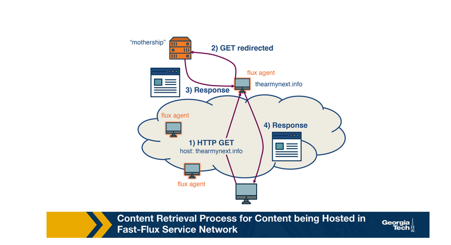
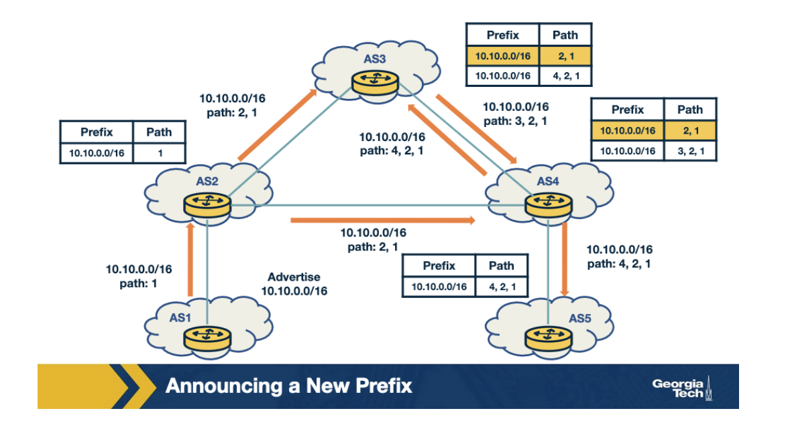
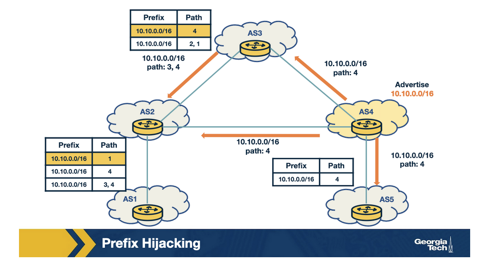
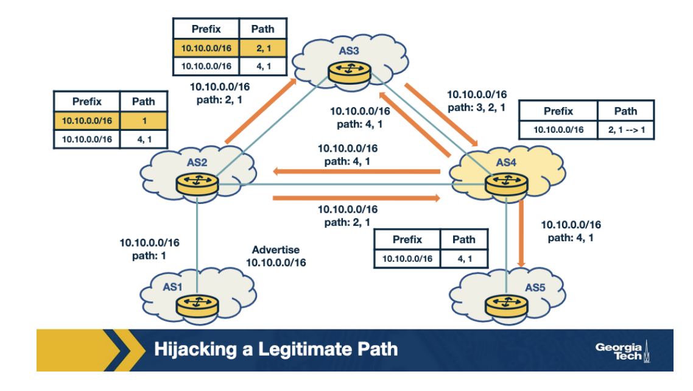
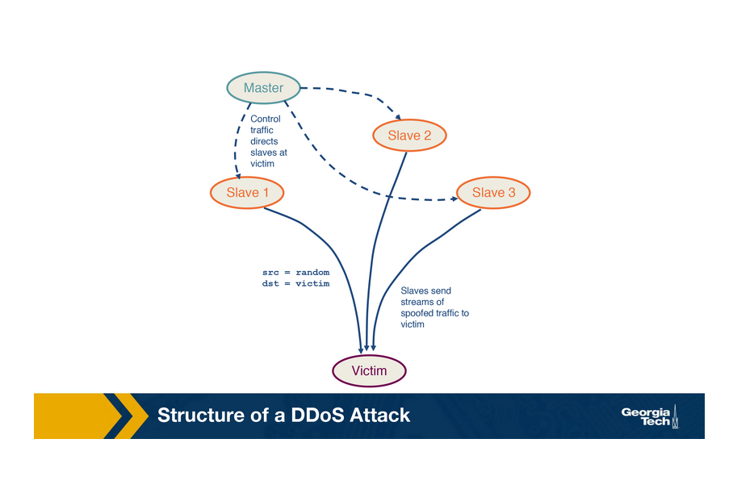
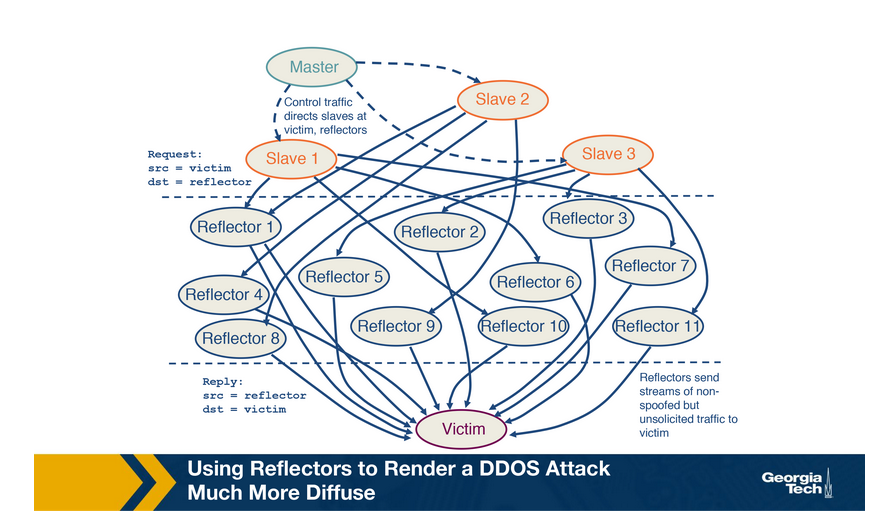
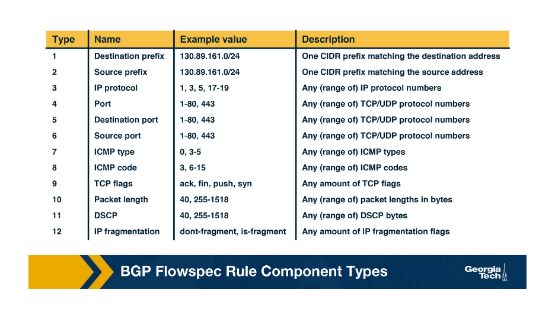
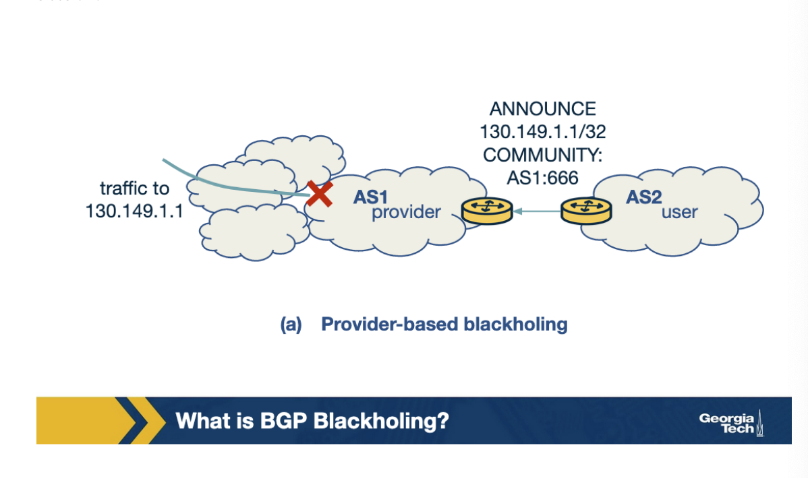
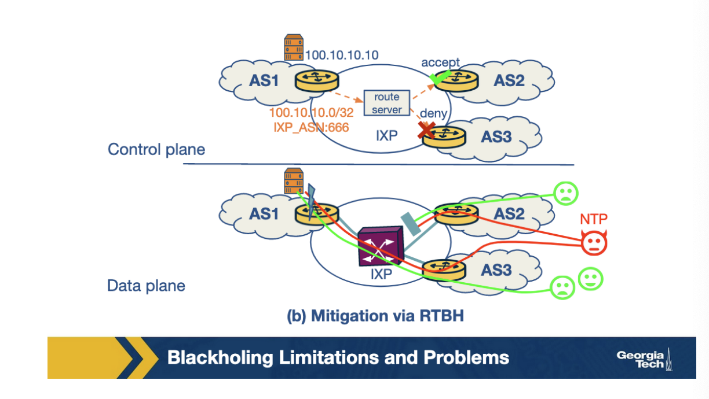

# Week 9 - Internet Security

When establishing communication there are four properties you should think about:

1. **Confidentiality**
2. **Integrity**
3. **Authentication**
4. **Availability**

**DNS Abuse**

Most DNS abuse has its roots in legitimate DNS-based techniques. Some of the techniques that we will cover will discuss how DNS is used to extend the uptime of domains that are used for malicious purposes.

**Round Robin DNS (RRDNS)**

This method is used by large websites to distribute the load of incoming requests to several servers at a single physical location. It responds to a DNS request with a list of DNS A records, which it then cycles through in a round robin manner. The DNS client can then choose a record using different strategies

**DNS-based content delivery**

Content Distribution Networks (CDNs) also use DNS-based techniques to distribute content, but they use more complex strategies. For example, CDNs also distribute DNS load to servers across the world.

When accessing the name of the service using DNS, the CDN computes the nearest edge server and returns its IP address to the DNS client. This results in the content being moved 'closer' to the DNS client which increases responsiveness and availability.

**Fast-Flux Service Networks**

The previous two strategies provide reliability, scalability, and resilience, which is great for larger websites. However, this also benefits spammers. How so? Using this technique, whereby a DNS request receives multiple A records, makes it harder to shut down online scams. 

**Fast-Flux Service Networks (FFDN)** is an extension of the ideas behind RRDNS and CDN. It is based on rapid change in DNS answers, with a TTL much lower than RR and CDNs. One key difference between FFDN and other methods is that after the TTL expires, it returns a different set of A records from a larger set of compromised machines. These compromised machines act as proxies between the incoming request and the control node/mothership, forming a resilient, one-hop overlay network.

**Finding Rogue Networks**

In this section, we will discuss a tool, FIRE, that monitors the internet for rogue networks (networks whose main purpose is malicious activity). 

**The key difference between rogue and legitimate networks is the longevity of malicious behavior**. Legitimate networks are usually able to remove the malicious content within a few days. Whereas rogue networks may let the content be up for weeks to more than a year.

A different approach to finding rogue networks is to monitor the control plane (routing behavior). This approach is based on the observation that malicious ASes have distinct interconnection patterns and overall different control plane behavior than most legitimate networks. For example, they are found to be changing upstream providers more aggressively than most legitimate networks, also they peer with shady networks, rather than connecting with legitimate networks.

**BGP Hijacking**

BGP hijacking is the illegitimate takeover of groups of IP addresses by corrupting Internet routing tables maintained by BGP.

1. **Classification of Affected Prefix**
    1. **Exact-prefix hijacking - **
    2. **Sub-prefix hijacking**
    3. **Squatting **

2. **Classification by AS-Path Announcement**
    1. **Type-0 hijacking**
    2. **Type-N hijacking**
    3. **Type-U hijacking**

3. **Classification by Data-Plane traffic manipulation**
    1. **Dropped**
    2. **Eavesdropped**
    3. **Impersonated**

What causes BGP hijacking attacks?

1. **Human error**
2. **Targeted attack**
3. **High impact attack**

**Example of BGP Hijacking**

**Benign Scenario: Announcing a new prefix**

1. AS1 announces a new prefix (10.10.0.0/16)
2. AS2, AS3, AS4 and AS5 receive an announcement and check to see whether the entry is present in the RIB. If it is new, they will add it announce it to other ASes.
3. As the announcements are made by AS2, AS3, and AS4, AS5 eventually receives a new prefix from A4(4,2,1).
4. If multiple routes exist for a prefix, then the best route is selected. This is shown in the figure as being the highlighted route.

**Attack Scenario: Hijacking a prefix**

In this scenario, the attacker uses AS4 to send false announcements and hijack the prefix 10.10.0.0/16 that belongs to AS1.

1. The attacker uses a router to announce the prefix 10.10.0.0/16 that belongs to AS1, with a new origin of AS4.
2. This new announcement causes a conflict of origin for the ASes that receive it.
3. As a result of the new announcement, AS2, AS3, and AS5 receive the false advertisement and they compare it with the previous entries in their RIB.
4. AS2 will not select the route as the best route as it is the same path length from AS1.
5. AS3 and AS5 will believe the new advertisement, and they will update their entries. Therefore AS5 and AS5 will send their traffic to AS4.

**Attack Scenario: Hijacking a path**

In this scenario, the attacker manipulates received updates before propagating them to neighbors. The key thing to note here is that the attacker does not need to announce a new prefix, but rather it can just manipulate an advertisement.

1. AS1 advertises the prefix 10.10.0.0/16
2. AS2 and AS3 receive and propagate legitimately the path for the prefix.
3. At AS4, the attacker compromises the update for the path by changing it to 4,1 and propagates it to the neighbors. Therefore it claims it has a direct link to AS1.
4. AS5 receives the false path, believes it and adopts it, but the rest of the ASes don't because they either have a shorter path already or an equally long path to AS1 for the same prefix.

**So how might you discover BGP Hijacking?**

The tool Artemis, keeps a record of all prefixes owned by the network and monitors BGP updates for any anomalies.

**How might you protect your system against BGP Hijacking?**

The Artemis system uses two automated techniques:

1. **Prefix deaggregation**
2. **Mitigation with Multiple Origin AS**
    1. The third party receives a notification and immediately announces from their locations the hijacked prefixes
    2. In this way, network traffic from across the world is attracted to the third party organization, which then scrubs it and tunnels to the legitimate AS.

**DDoS: Background and Spoofing**

In this topic, we will talk about another type of abuse: **Denial of Service Attacks (DDoS)**. We will also talk about how attackers amplify DDoS attacks by using a technique called spoofing.

A DDoS attack is an attempt to compromise a server or network resources with a flood of traffic. To achieve this, the attacker first compromises and deploys flooding servers.

Later, when initiating an attack, the attacker instructs these flooding servers to send a high volume of traffic to the victim. the result is that the victim host either becomes unreaachable or exhausts its bandwidth.

The configuration above amplifies the intensity of the attack and also makes it hard to protect against, because the attack traffic is sent with a spoofed source address.

IP Spoofing is the act of setting a false IP address in the source field of a packet with the purpose of impersonating a legitimate server. In DDoS attacks, this can happen in two forms. In the first form, the source IP address is spoofed, resulting in the response of the server sent to some other client instead of the attacker’s machine. This results in wastage of network resources and the client resources while also causing denial of service to legitimate users. 

In the second type of attack, the attacker sets the same IP address in both the source and destination IP fields. This results in the server sending the replies to itself, causing it to crash.

**DDoS Reflection and Amplification**

In a reflection attack, the attackers use a set of reflectors to initiate an attack on the victim. A reflector is any server that sends a response to a request. For example, any web server on a DNS server would return a SYN ACK in response to a SYN packet as part of a TCP handshake.

In a reflector attack, the leader server directs the followers to send spoofed requests to reflector servers. The followers set the IP address to the victim's IP address. Thus, the victim receives responses from a huge number of reflector servers. This is known as an amplification attack.

**Defenses against DDoS attacks**

1. **Traffic Scrubbing Services**
2. **ACL Filters**
3. **BGP Flowspec**

1. **BGP Blackholing**

BGP blackholing is implemented either with the help of an upstream provider or with the help of an IXP. With this technique, the victim AS uses BGP to communicate the attacked destination prefix to its upstream AS, which then drops the attack traffic towards this prefix. Then the provider (or the IXP) will advertise a more specific prefix and modifying the next-hop address that will divert the attack traffic to a null interface.

One of the major drawbacks of BGP blackholing is that the destination under attack becomes unreachable since all the traffic, including the legitimate traffic is dropped.

Another issue is that sometimes ASes will ignore blackhole requests, if an AS doesn't honor the announcement it will allow all traffic to continue to flow. 

