# The Processor

## Table of Contents

### Introduction

The performance of a computer is determined by three factors:
1. Instruction count
2. Clock cycle time
3. Clock Cycles per Instruction (CPI)

The compiler and Instruction Set Architecture (ISA) determine the instruction count required for a given program. The implementation of the processor determines both the clock cycle time and the number of clock cycles per instruction.

#### A Basic MIPS Implementation

We will be examining an implementation that includes a subset of the core MIPS instruction set:

* The memory-reference instructions `load word(lw)` and `store word (sw)`.
* The arihmetic-logical instructions `add`, `sub`, `AND`, `OR`, and `slt` (set on less than sets the destination register's content to the value 1 if the first source register's value is less than the second source register's value) 
* the instructions `branch equal (beq)` and `jump (j)`

This set illustrates the key principles used in creating a datapath and designing the control.

#### An Overview of the Implementation

For every instruction, the first two steps are identical:

1. Send the program counter (PC) to the memory that contains the code and fetch the instructions from memory.
2. Read one or two registers, using fields of the instruction to select the registers to read. For the load word instruction, we need to read only one register, but other instructions require reading two registers.

After these two steps, the actions required to complete the instruction depend on the instruction class. All instruction classes, except `jump`, use the Arithmetic Logic Unit (ALU) after reading the registers.
* The memory-reference instructions use the ALU for an address calculation
* The arithmetic-logical instructions for the operation execution
* The branches for comparison

After using the ALU, the actions required by the classes differ.
* The memory-reference instruction will need to access the memory either to read data for a `load` or write data for a `store`.
* The `arithmetic-logical` or `load` instruction must write the data from the ALU to memory back into a register
* The branch may need to change the next instruction address based on the comparison, otherwise the PC will be incremented by 4 to get the address of the next instruction

Let's take a high-level look at the MIPS implementation:

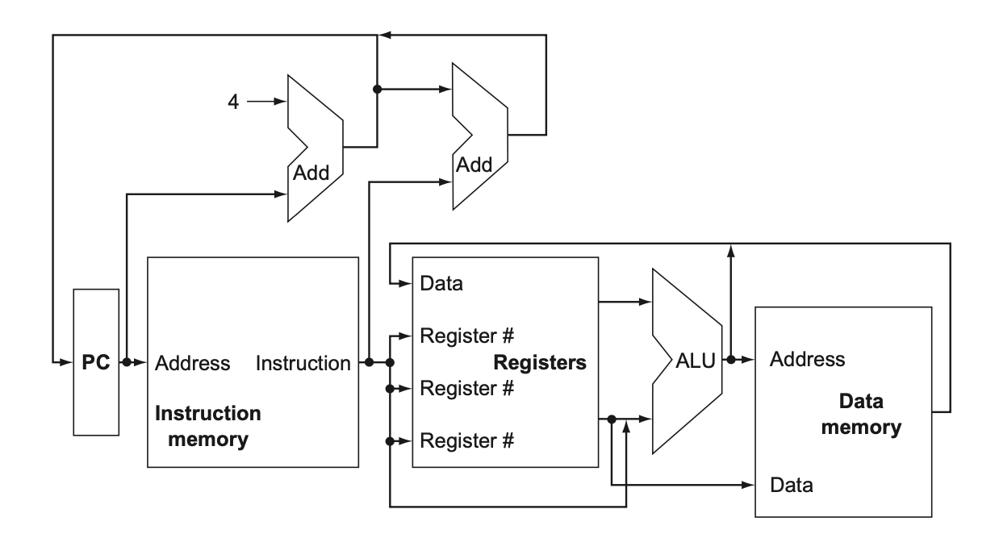

Although this figure shows most of the flow of data, it omits two aspects of the instruction execution:

1. In several places **the figure shows data going to a particular unit as coming from two different sources**. For example, the value written into the PC canc ome from one of two adders, the data written into the register file can come from either the ALU or data memory. **In practice, these data lines cannot be wired together**, we must add a logic element that chooses from among the sources and steers one to its destination. This selection is commonly **done with a device called a multiplexor**, which selects from several inputs based on a control line.
2. The second omission is that several of **the units must be controlled depending on the type of instruction**. For example the data memory must read on a `load` and `write` on a store.

Let's take a look at the data path with the three required multiplexors added, as well as the control lines for the major functional units:

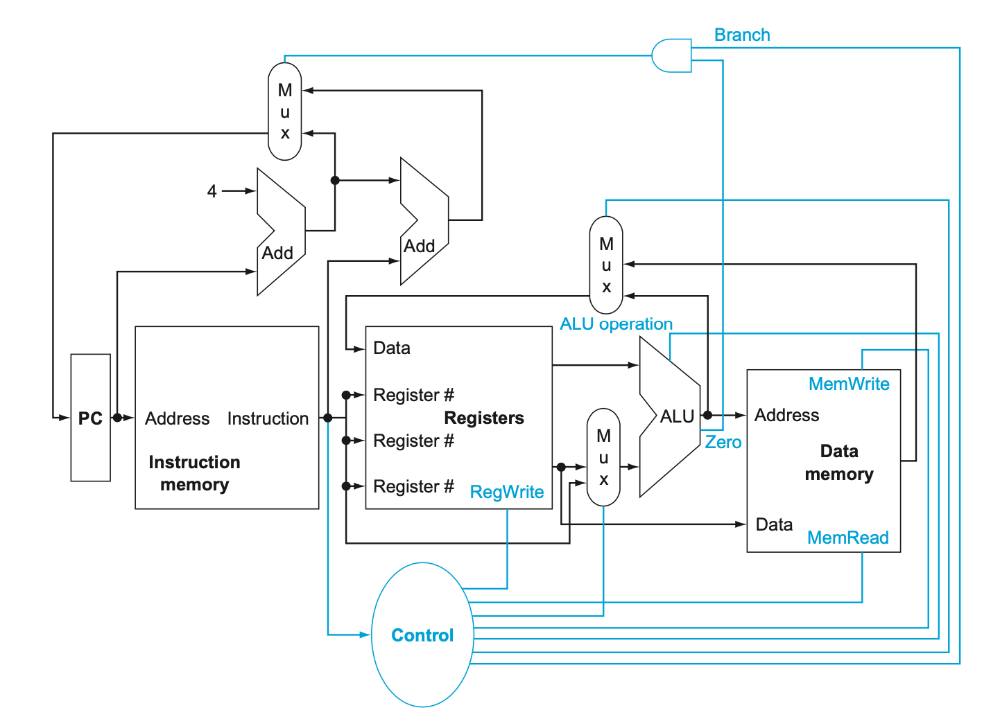

The top multiplexor controls what value replaces the PC(PC+4 or the branch destination address). This multiplexor is controlled by the gate that "ANDs` together the Zero output of the ALU and a control signal that indicates that the instruction is a branch.

The middle multiplexor, whose output returns the register file, is used to steer the output of the ALU (in the case of an arithmetic-logical instruction) or the output of the data memory (in the case of a `load`) for writing into the register file.

The bottommost multiplexor is used to determine whether the second ALU input is from the registers (for an arithmetic-logical instruction or branch) or from the offset field of the instruction (for a `load` or `store`). 

The other control lines determine the operation performed by the ALU, whether the data memory should read or write, and whether the registers should perform a write operation.

We will now explore using a single long clock cycle for every instruction. This means that every instruction will begin execution on one clock edge and complete execution on the next clock edge.

This approach is not practical, since the clock cycle must be severely stretched to accommodate the longest instruction. After designing the control for this simplistic example, we will look at pipelined implementation.

### Logic Design Conventions

To discuss the design of a computer, we  must decide how the hardware logic implementing the computer will operate and how the computer is clocked.

The datapath elements in the MIPS implementation consist of two different types of logic elements:
1. elements that **operate on data values**
2. elements that **contain state**

The elements that operate on data values are all **combinational**, which means that their outputs depend only on the current inputs. Given the same input, a combinational element will always produce the same output because it has no internal storage.

Other elements in the design are not combinational, but instead contain state. An element contains state if it has some internal storage. These are called **state** elements. In the figure above, the instruction and data memories are all examples of state elements.

State elements have at least two inputs and one output. The **required inputs** are the **data value to be written into the element** and **the clock**, which **determines when the data value is to be written**. The output from a state element provides the value that was written in an earlier clock cycle. A state element can be read at any time, it is not controlled by the clock input.

Logic components that contain state are called **sequential**, because their **outputs depend on both their inputs and the contents of the internal state**.

#### Clocking Methodology

A **clocking methodology** defines **when signals can be read and when they can be written**. It is important to specify the timing of reads and writes, because if a signal is written as the same time it is read, the value of the read could correspond to the old value, the newly written value, or some mix of the two! Clocking methodology **is designed to make hardware predictable**.

For simplicity, we will assume an **edge-triggered clocking methodology**. This means that **any values stored in a sequential logic element are updated only on a clock edge**, which is a **quick transition form low to high**, or vice-versa.

Because only state elements can store a data value, any collection of combinational logic must have its inputs come from a set of state elements and its output written into a set of state elements. The inputs are values that were written in a previous clock cycle, while the outputs are values that can be used in a following clock cycle.

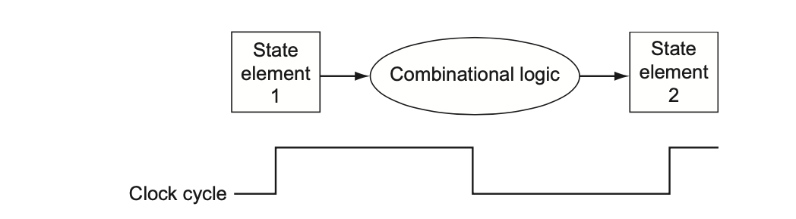

The figure above shows the two state elements surrounding a combinational logic block, which operates in a single clock cycle. All signals must propagate from state element 1, through the combinational logic, and to state element 2 in the time of one clock cycle.

For simplicity, a write control signal is not shown. A **control signal** is **used for multiplexor selection** or for **directing the operation of a functional unit**.  A control signal contrasts with a **data signal**, which **contains information that is operated on by a functional unit**.

In reality, both the clock signal and the write control signal are inputs, and the state element is only changed when the write control signal is asserted and the clock edge occurs. The word asserts is used to mean that the signal is logically high and deasserted to represent logically low.

An edge-triggered methodology allows us to read the contents of a register, send the value through some combinational logic, and write that register in the same clock cycle.

For the 32-bit MIPS architecture, nearly all of these state and logic elements **will have inputs and outputs that are 32 bits wide**, since that is the width of most of the data handled by the processor. The figures will indicate buses that are wider than 1 bit with thicker lines.

### Building a Datapath

Let's look at the datapath elements each instruction requires to execute each class of MIPS instructions.

#### Keeping track of a program

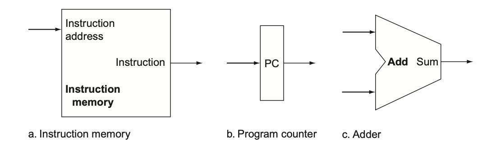

The first element we need is a **memory unit** to
1. store the instructions of a program
2. return instructions given an address

We will also need a **program counter** to:
1. a register that holds the address of the current instruction

Lastly we need an **adder** to
1. increment the PC to the address of the next instruction.

This adder, which is combinational, can be build from an ALU by wiring the control lines so that the control always specifies an add operation.

To execute any instruction, we must start by fetching the instruction from memory. To prepare for executing the next instruction, we must also increment the program counter so that it points to the next instruction (4 bytes later). Let's look at a figure that shows how to combine the three elements above to form a datapath that does just that.

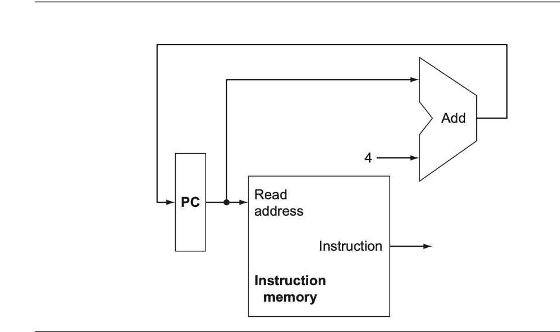

#### Arithmetic-logical Instructions

Now, let's consider the R-format instructions. They all read two registers, perform an ALU operation ont he contents of the registers, and write the result to a register. We call these instructions R-type or arithmetic-logical instructions because they perform arithmetic or logical operations.

This instruction class includes `add`, `sub`, `AND`, `OR`, and `slt. The use of an R-type instruction is as follows:

```
add $t1, $t2, $t3
```

This instruction does the following, it reads $t2 and $t3, adds them together and writes to $t1.

The processor has 32 general-purpose registers, and they are stored in a structure called the **register file**. A register file is a **collection of registers in which any register can be read or written by specifying the number of the register** in the file.

The **R-format instructions** have **three register operands**, so we will need to **read two data words from the register file** and **write one data word into the register file** for each instruction. 

For each **data word to be read** from the registers, we need an input to the register file that specifies the register number to be read and an output from the register file that will carry the value that has been read from the registers. 

**To write a data word,** we will need two inputs, one to specify the register number to be written and one to supply the data to be written to the register.

The register file always outputs the contents of whatever register numbers are on the Read register input, **writes** however **are controlled by the write control signal**, which must be asserted for a write to occr at the clock edge. Thus we need a total of four inputs (three for register numbers and one for data) and two outputs (both for data). The register number inputs are 5 bits wide to specify on eof the 32 registers, whereas the data input and two data output buses are 32 bits wide.

All writes are edge-triggered (part of the [clocking methodology](#clocking-methodology), so that all write inputs must be valid at the clock edge. Because of our design, we can read and write the same register within a clock cycle.

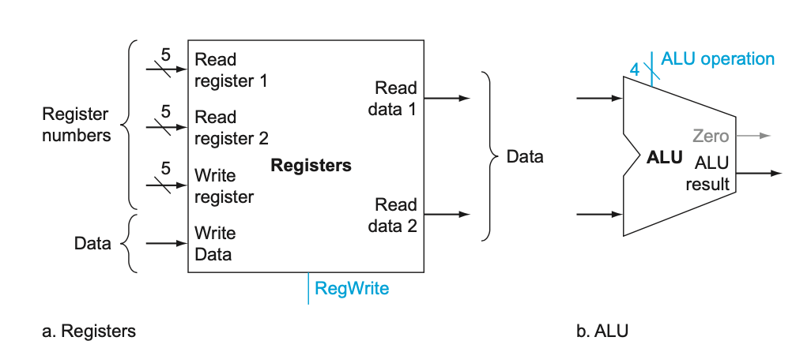

We also need an ALU which takes two 32-bit inputs and produces a 32-bit result, as well as a 1-bit signal if the result is 0. There is also a 4-bit control signal which we will review shortly.

#### Load and Store

The `load` and `store` MIPS instructions have the form:

```assembly
lw $t1, offset_value($t2)
sw $t1, offset_value($t2)
```
The instructions compute a memory address by adding the base register ($t2) to the 16-bit signed offset field contained in the instruction. If the instruction is a `store`, the value to be stored must also be read from the register file where it resides in $t1. If the instruction is a `load`, the value read from memory must be written into the register file in the specified register ($t1). Thus we will need both the register file and the ALU from above.

We will also need a unit to **sign-extend** (to increase the size of a data item by replicating the high-order sign bit of the original data item in the high order bits of the larger, destination data item) the 16-bit offset field in the instruction to a 32-bit signed value, and a **data memory** unit to read from or write to. The data memory must be written on the `store` instruction It must have read and write control signals, an address input, and an input for the data to be written into memory.

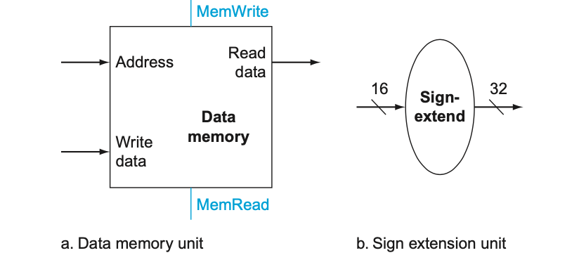

The `beq` instruction has three operands, two registers that are compared for equality, and a 16-bit offset used to compute the **branch target address** ( the address which becomes the new program counter if the branch is taken) relative to the branch instruction address.

```assembly
beq $t1, $t2, offset
```

To implement this instruction we must compute the branch target address by adding the sign-extended offset field of the instruction to the PC. There are two details in the definition of branch instructions that we must pay attention to:

1. The ISA specifies that the base for the branch address calculation is the address of the instruction following the branch. Since we compute the PC+4 in the instruction fetch datapath, it is easy to use this value for the base for computing the branch target address.

2. The architecture also states that the offset field is shifted left 2 bits so that it is a word offset, this shift increases the effective range of the offset field by a factor of 4. 

To deal with the latter complication, we will need to shift the offset field by 2. This is accomplished by the shift left 2 operator with adds 00 to the low-order end of the sign-extended offset field. Since we know the offset was sign-extended from 16 bits, the shift will throw away only the *sign bits*.

As well as computing the branch target address, we must also determine whether the next instruction is the instruction that follows sequentially or the instruction at the branch target address.

Thus the **branch datapath** must do two operations: **compute the branch target address** and **compare the register contents**. Let's show the structure of the datapath segment that handles branches:

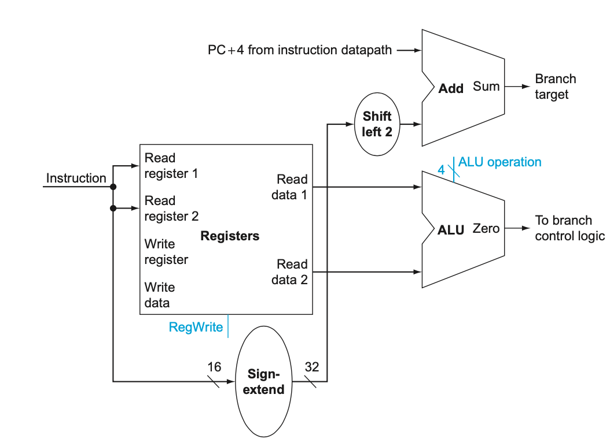

To **perform the compare**, we use the register file to supply two register operands, in addition, the comparison is done using an ALU. Since the ALU provides an output signal that indicates whether the result was 0, we can **send two register operands to the ALU with the control set to do a subtract**. If the **Zero signal** out of the ALU is asserted, we know that the two values are equal.

The `jump` instruction operates by replacing the lower 28 bits of the PC with lower 26 bits of the instruction shifted left by two bits.

#### Creating a Single Datapath

Now that we have examined datapath components, let's try to combine them into a single datapath and add the control to complete the implementation.

The **simplest datapath with attempt to execute all instructions in one clock cycle**. This means no datapath resource can be used more than once per instruction, so any element needed more than once must be duplicated.

To share a datapath between two different instruction classes, we may need to allow multiple connections to the input of an element, using a multiplexor and control signal to select among the multiple inputs.

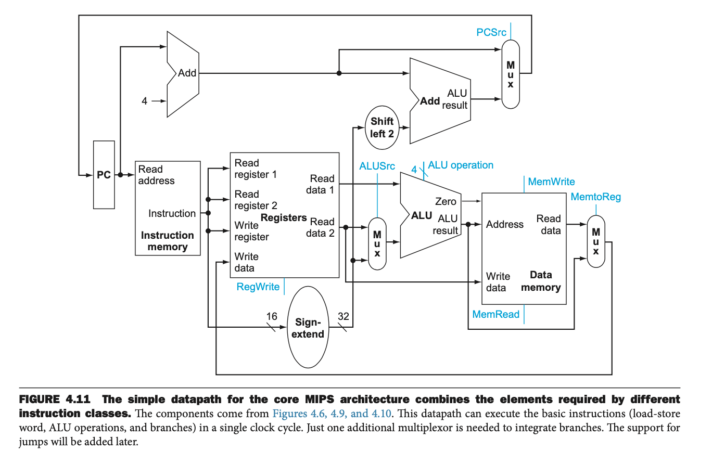

### A Simple Implementation Scheme

In this section we look at what might be thought of as the simplest possible implementation of the MIPS subset. We build this implementation using the datapath above and adding a **control function**.

#### The ALU Control

The MIPS ALU in this book defines the 6 following combinations of four input controls:
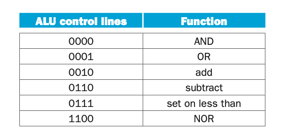

Depending on the instruction class, the ALU will need to perform one of these first five functions (NOR is not needed for this section). 
1. For `load` word and `store` word instructions, we use the ALU to compute the memory address by addition. 
2. For the R-type instructions, the ALU needs to perform one of the five actions (`AND`, `OR`, `sub`, `add`, or `stl`) depending on the value of the 6-bit function field in the low-order bits of the instruction.

We can generate the 4-bit ALU control input using a small control unit that has as inputs the function field of the instruction and a **two-bit control field**, which we call **ALUOp**. ALUOp indicates whether the operation to be performed should be:

1. add (00) for `load`s and `store`s
2. subtract (01) for `beq`, or 
3. determined by the operation encoded in the function field (10).

The output of the ALU control unit is a 4-bit signal that directly controls the ALU by generating one of the 4 bit combinations shown above. Later in this chapter, we will see how the ALUOp bits are generated from the main control unit.

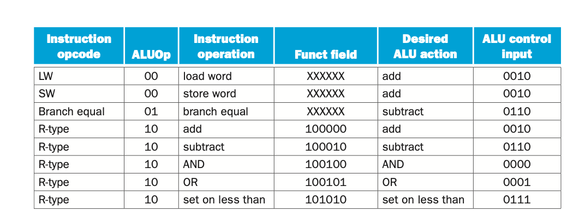


This style of using multiple levels of decoding, the main control unit generates the ALUOp bots, which then are used as input to the ALU control that generates the actual signals to control the ALU - is a common implementation technique. **Using multiple levels of control can reduce the size of the main control unit as well as potentially speed up the control unit**.

Because only a small number of the 64 possible values of the function field are of interest and the function field is only used when the ALUOp bits equal 10, we can use a small piece of logic that recognizes the subset of possible values and causes the correct setting of the ALU control bits.

As a step in designing this logic, it is useful to create a truth table for the interesting combinations of the function field and the ALUOp bits: 

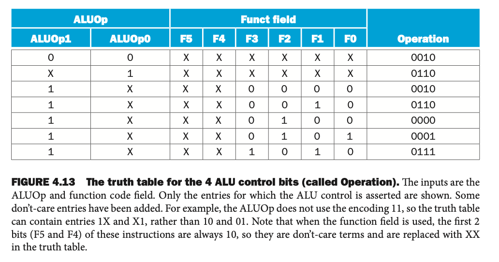


This truth table show how the 4-bit ALU control is set depending on these two input fields. Since the full truth table is very large (256 entries) and we don't care about the value of the ALU control for many of these input combinations, only the truth table entries for which the ALU control must have a specific value are shown.

Because in many instances we do not care about the value of some of the inputs, and because we wish to keep the tables compact, **don't-care terms** are also included. A don't care term (represented by X) indicates that the output does not depend on the value of the input corresponding to the column denoted by the X. For example, when the ALUOp bits are 00, we always set the ALU control to 0010, independent of the function code. 

Once the truth table has been constructed, it can be turned into gates.

#### Designing the Main Control Unit

Now that we have described how to design an ALU that uses the function code and a 2-bit signal as its control inputs, we can return to looking at the rest of the control.