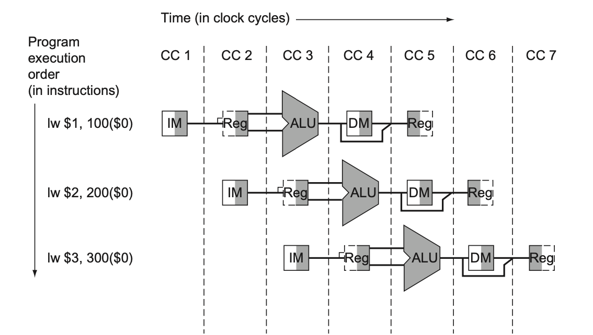

# The Processor

## Table of Contents

### Introduction

The performance of a computer is determined by three factors:
1. Instruction count
2. Clock cycle time
3. Clock Cycles per Instruction (CPI)

The compiler and Instruction Set Architecture (ISA) determine the instruction count required for a given program. The implementation of the processor determines both the clock cycle time and the number of clock cycles per instruction.

#### A Basic MIPS Implementation

We will be examining an implementation that includes a subset of the core MIPS instruction set:

* The memory-reference instructions `load word(lw)` and `store word (sw)`.
* The arihmetic-logical instructions `add`, `sub`, `AND`, `OR`, and `slt` (set on less than sets the destination register's content to the value 1 if the first source register's value is less than the second source register's value) 
* the instructions `branch equal (beq)` and `jump (j)`

This set illustrates the key principles used in creating a datapath and designing the control.

#### An Overview of the Implementation

For every instruction, the first two steps are identical:

1. Send the program counter (PC) to the memory that contains the code and fetch the instructions from memory.
2. Read one or two registers, using fields of the instruction to select the registers to read. For the load word instruction, we need to read only one register, but other instructions require reading two registers.

After these two steps, the actions required to complete the instruction depend on the instruction class. All instruction classes, except `jump`, use the Arithmetic Logic Unit (ALU) after reading the registers.
* The memory-reference instructions use the ALU for an address calculation
* The arithmetic-logical instructions for the operation execution
* The branches for comparison

After using the ALU, the actions required by the classes differ.
* The memory-reference instruction will need to access the memory either to read data for a `load` or write data for a `store`.
* The `arithmetic-logical` or `load` instruction must write the data from the ALU to memory back into a register
* The branch may need to change the next instruction address based on the comparison, otherwise the PC will be incremented by 4 to get the address of the next instruction

Let's take a high-level look at the MIPS implementation:


Although this figure shows most of the flow of data, it omits two aspects of the instruction execution:

1. In several places **the figure shows data going to a particular unit as coming from two different sources**. For example, the value written into the PC canc ome from one of two adders, the data written into the register file can come from either the ALU or data memory. **In practice, these data lines cannot be wired together**, we must add a logic element that chooses from among the sources and steers one to its destination. This selection is commonly **done with a device called a multiplexor**, which selects from several inputs based on a control line.
2. The second omission is that several of **the units must be controlled depending on the type of instruction**. For example the data memory must read on a `load` and `write` on a store.

Let's take a look at the data path with the three required multiplexors added, as well as the control lines for the major functional units:


The top multiplexor controls what value replaces the PC(PC+4 or the branch destination address). This multiplexor is controlled by the gate that "ANDs` together the Zero output of the ALU and a control signal that indicates that the instruction is a branch.

The middle multiplexor, whose output returns the register file, is used to steer the output of the ALU (in the case of an arithmetic-logical instruction) or the output of the data memory (in the case of a `load`) for writing into the register file.

The bottommost multiplexor is used to determine whether the second ALU input is from the registers (for an arithmetic-logical instruction or branch) or from the offset field of the instruction (for a `load` or `store`). 

The other control lines determine the operation performed by the ALU, whether the data memory should read or write, and whether the registers should perform a write operation.

We will now explore using a single long clock cycle for every instruction. This means that every instruction will begin execution on one clock edge and complete execution on the next clock edge.

This approach is not practical, since the clock cycle must be severely stretched to accommodate the longest instruction. After designing the control for this simplistic example, we will look at pipelined implementation.

### Logic Design Conventions

To discuss the design of a computer, we  must decide how the hardware logic implementing the computer will operate and how the computer is clocked.

The datapath elements in the MIPS implementation consist of two different types of logic elements:
1. elements that **operate on data values**
2. elements that **contain state**

The elements that operate on data values are all **combinational**, which means that their outputs depend only on the current inputs. Given the same input, a combinational element will always produce the same output because it has no internal storage.

Other elements in the design are not combinational, but instead contain state. An element contains state if it has some internal storage. These are called **state** elements. In the figure above, the instruction and data memories are all examples of state elements.

State elements have at least two inputs and one output. The **required inputs** are the **data value to be written into the element** and **the clock**, which **determines when the data value is to be written**. The output from a state element provides the value that was written in an earlier clock cycle. A state element can be read at any time, it is not controlled by the clock input.

Logic components that contain state are called **sequential**, because their **outputs depend on both their inputs and the contents of the internal state**.

#### Clocking Methodology

A **clocking methodology** defines **when signals can be read and when they can be written**. It is important to specify the timing of reads and writes, because if a signal is written as the same time it is read, the value of the read could correspond to the old value, the newly written value, or some mix of the two! Clocking methodology **is designed to make hardware predictable**.

For simplicity, we will assume an **edge-triggered clocking methodology**. This means that **any values stored in a sequential logic element are updated only on a clock edge**, which is a **quick transition form low to high**, or vice-versa.

Because only state elements can store a data value, any collection of combinational logic must have its inputs come from a set of state elements and its output written into a set of state elements. The inputs are values that were written in a previous clock cycle, while the outputs are values that can be used in a following clock cycle.


The figure above shows the two state elements surrounding a combinational logic block, which operates in a single clock cycle. All signals must propagate from state element 1, through the combinational logic, and to state element 2 in the time of one clock cycle.

For simplicity, a write control signal is not shown. A **control signal** is **used for multiplexor selection** or for **directing the operation of a functional unit**.  A control signal contrasts with a **data signal**, which **contains information that is operated on by a functional unit**.

In reality, both the clock signal and the write control signal are inputs, and the state element is only changed when the write control signal is asserted and the clock edge occurs. The word asserts is used to mean that the signal is logically high and deasserted to represent logically low.

An edge-triggered methodology allows us to read the contents of a register, send the value through some combinational logic, and write that register in the same clock cycle.

For the 32-bit MIPS architecture, nearly all of these state and logic elements **will have inputs and outputs that are 32 bits wide**, since that is the width of most of the data handled by the processor. The figures will indicate buses that are wider than 1 bit with thicker lines.

### Building a Datapath

Let's look at the datapath elements each instruction requires to execute each class of MIPS instructions.

#### Keeping track of a program


The first element we need is a **memory unit** to
1. store the instructions of a program
2. return instructions given an address

We will also need a **program counter** to:
1. a register that holds the address of the current instruction

Lastly we need an **adder** to
1. increment the PC to the address of the next instruction.

This adder, which is combinational, can be build from an ALU by wiring the control lines so that the control always specifies an add operation.

To execute any instruction, we must start by fetching the instruction from memory. To prepare for executing the next instruction, we must also increment the program counter so that it points to the next instruction (4 bytes later). Let's look at a figure that shows how to combine the three elements above to form a datapath that does just that.


#### Arithmetic-logical Instructions

Now, let's consider the R-format instructions. They all read two registers, perform an ALU operation ont he contents of the registers, and write the result to a register. We call these instructions R-type or arithmetic-logical instructions because they perform arithmetic or logical operations.

This instruction class includes `add`, `sub`, `AND`, `OR`, and `slt. The use of an R-type instruction is as follows:

```
add $t1, $t2, $t3
```

This instruction does the following, it reads $t2 and $t3, adds them together and writes to $t1.

The processor has 32 general-purpose registers, and they are stored in a structure called the **register file**. A register file is a **collection of registers in which any register can be read or written by specifying the number of the register** in the file.

The **R-format instructions** have **three register operands**, so we will need to **read two data words from the register file** and **write one data word into the register file** for each instruction. 

For each **data word to be read** from the registers, we need an input to the register file that specifies the register number to be read and an output from the register file that will carry the value that has been read from the registers. 

**To write a data word,** we will need two inputs, one to specify the register number to be written and one to supply the data to be written to the register.

The register file always outputs the contents of whatever register numbers are on the Read register input, **writes** however **are controlled by the write control signal**, which must be asserted for a write to occr at the clock edge. Thus we need a total of four inputs (three for register numbers and one for data) and two outputs (both for data). The register number inputs are 5 bits wide to specify on eof the 32 registers, whereas the data input and two data output buses are 32 bits wide.

All writes are edge-triggered (part of the [clocking methodology](#clocking-methodology), so that all write inputs must be valid at the clock edge. Because of our design, we can read and write the same register within a clock cycle.


We also need an ALU which takes two 32-bit inputs and produces a 32-bit result, as well as a 1-bit signal if the result is 0. There is also a 4-bit control signal which we will review shortly.

#### Load and Store

The `load` and `store` MIPS instructions have the form:

```assembly
lw $t1, offset_value($t2)
sw $t1, offset_value($t2)
```
The instructions compute a memory address by adding the base register ($t2) to the 16-bit signed offset field contained in the instruction. If the instruction is a `store`, the value to be stored must also be read from the register file where it resides in $t1. If the instruction is a `load`, the value read from memory must be written into the register file in the specified register ($t1). Thus we will need both the register file and the ALU from above.

We will also need a unit to **sign-extend** (to increase the size of a data item by replicating the high-order sign bit of the original data item in the high order bits of the larger, destination data item) the 16-bit offset field in the instruction to a 32-bit signed value, and a **data memory** unit to read from or write to. The data memory must be written on the `store` instruction It must have read and write control signals, an address input, and an input for the data to be written into memory.


The `beq` instruction has three operands, two registers that are compared for equality, and a 16-bit offset used to compute the **branch target address** ( the address which becomes the new program counter if the branch is taken) relative to the branch instruction address.

```assembly
beq $t1, $t2, offset
```

To implement this instruction we must compute the branch target address by adding the sign-extended offset field of the instruction to the PC. There are two details in the definition of branch instructions that we must pay attention to:

1. The ISA specifies that the base for the branch address calculation is the address of the instruction following the branch. Since we compute the PC+4 in the instruction fetch datapath, it is easy to use this value for the base for computing the branch target address.

2. The architecture also states that the offset field is shifted left 2 bits so that it is a word offset, this shift increases the effective range of the offset field by a factor of 4. 

To deal with the latter complication, we will need to shift the offset field by 2. This is accomplished by the shift left 2 operator with adds 00 to the low-order end of the sign-extended offset field. Since we know the offset was sign-extended from 16 bits, the shift will throw away only the *sign bits*.

As well as computing the branch target address, we must also determine whether the next instruction is the instruction that follows sequentially or the instruction at the branch target address.

Thus the **branch datapath** must do two operations: **compute the branch target address** and **compare the register contents**. Let's show the structure of the datapath segment that handles branches:


To **perform the compare**, we use the register file to supply two register operands, in addition, the comparison is done using an ALU. Since the ALU provides an output signal that indicates whether the result was 0, we can **send two register operands to the ALU with the control set to do a subtract**. If the **Zero signal** out of the ALU is asserted, we know that the two values are equal.

The `jump` instruction operates by replacing the lower 28 bits of the PC with lower 26 bits of the instruction shifted left by two bits.

#### Creating a Single Datapath

Now that we have examined datapath components, let's try to combine them into a single datapath and add the control to complete the implementation.

The **simplest datapath with attempt to execute all instructions in one clock cycle**. This means no datapath resource can be used more than once per instruction, so any element needed more than once must be duplicated.

To share a datapath between two different instruction classes, we may need to allow multiple connections to the input of an element, using a multiplexor and control signal to select among the multiple inputs.


### A Simple Implementation Scheme

In this section we look at what might be thought of as the simplest possible implementation of the MIPS subset. We build this implementation using the datapath above and adding a **control function**.

#### The ALU Control

The MIPS ALU in this book defines the 6 following combinations of four input controls:


Depending on the instruction class, the ALU will need to perform one of these first five functions (NOR is not needed for this section). 
1. For `load` word and `store` word instructions, we use the ALU to compute the memory address by addition. 
2. For the R-type instructions, the ALU needs to perform one of the five actions (`AND`, `OR`, `sub`, `add`, or `stl`) depending on the value of the 6-bit function field in the low-order bits of the instruction.

We can generate the 4-bit ALU control input using a small control unit that has as inputs the function field of the instruction and a **two-bit control field**, which we call **ALUOp**. ALUOp indicates whether the operation to be performed should be:

1. add (00) for `load`s and `store`s
2. subtract (01) for `beq`, or 
3. determined by the operation encoded in the function field (10).

The output of the ALU control unit is a 4-bit signal that directly controls the ALU by generating one of the 4 bit combinations shown above. Later in this chapter, we will see how the ALUOp bits are generated from the main control unit.


This style of using multiple levels of decoding, the main control unit generates the ALUOp bots, which then are used as input to the ALU control that generates the actual signals to control the ALU - is a common implementation technique. **Using multiple levels of control can reduce the size of the main control unit as well as potentially speed up the control unit**.

Because only a small number of the 64 possible values of the function field are of interest and the function field is only used when the ALUOp bits equal 10, we can use a small piece of logic that recognizes the subset of possible values and causes the correct setting of the ALU control bits.

As a step in designing this logic, it is useful to create a truth table for the interesting combinations of the function field and the ALUOp bits: 


This truth table show how the 4-bit ALU control is set depending on these two input fields. Since the full truth table is very large (256 entries) and we don't care about the value of the ALU control for many of these input combinations, only the truth table entries for which the ALU control must have a specific value are shown.

Because in many instances we do not care about the value of some of the inputs, and because we wish to keep the tables compact, **don't-care terms** are also included. A don't care term (represented by X) indicates that the output does not depend on the value of the input corresponding to the column denoted by the X. For example, when the ALUOp bits are 00, we always set the ALU control to 0010, independent of the function code. 

Once the truth table has been constructed, it can be turned into gates.

#### Designing the Main Control Unit

Now that we have described how to design an ALU that uses the function code and a 2-bit signal as its control inputs, we can return to looking at the rest of the control.

To begin, let's identify the fields of an instruction and the control lines that are needed for the datapath we constructed:


1. The op field (specifies what kind of instruction it is) is always contained in bits 31:26
2. The two registers to be read are always specified by the rs and rt fields, at positions 25:21 and 20:16. This is true for R-type instructions, branch equal and `store`.
3. The base register for `load` and `store` instructions is always in bit positions 25:21
4. The 16-bit offset for `beq`, `load` and `store` is always in position 15:0
5. The destination register is in one of two places
    1. For `load` it is in bit positions 20:16
    2. For R-type instructions it is in 15:11
    This means we need a multiplexor to select which field of the instruction is used to indicate the register number to be written

Using this information we can add the instruction labels and extra multiplexor (for the write register number input of the register file) to the simple datapath.


The figure shows seven single-bit control lines plus the 2-bit ALUOp control signal. Let's look at the definitions of the other control signals.


The **control unit can set all but one of the control signals based solely on the opcode field of the instruction**. 

The PCSrc control line is the exception. That control line should be asserted if the instruction is branch on equal and the Zero output of the ALU is asserted. To generate the PCSrc signal we will need to AND together a signal from the control unit, which we will call Branch, with the Zero signal of the ALU.

These nine control signals (seven from the figure, and two for the ALUOp) can now be set on the basis of six input signals to the control unit, which are the opcode bits 31:26.


Because the setting of the control lines depends only the opcode, we define whether each control signal should be 0, 1 or don't care (X) for each of the opcode values in the following table:


#### Operation of the Datapath

Let's look at the flow of three different instruction classes through the datapath. We will specifically look at the asserted control signals and the active datapath elements. A multiplexor whose control is 0 has a definite action, even if its control line is not highlighted.

First let's look at the operation of the datapath for an R-type instruction: `add $t1, $t2, $t3`. 

Although everything occurs in one clock cycle, we can think of four steps to execute the instruction:
1. The instruction is fetched and the PC is incremented.
2. Two registers, $t2 and $t3 are read from the register file, also the main control unit computes the setting of the control lines.
3. The ALU operates on the data read from the register file, using the function code (bits 5:0) to generate the ALU function.
4. The result from the ALU is written into the register file using bits 15:11 of the instruction to select the destination register ($t1)


Similarly, we can illustrate the execution of a `load` word such as `lw $t1, offset($t2)`. We can think of a load instruction as operating in five steps:

1. An instruction is fetched from the instruction memory, and the PC is incremented.
2. A register ($t2) value is read from the register file.
3. The ALU computes the sum of the value read from the register file and the sign-extended, lower 16-bits of the instruction (offset).
4. The sum from the ALU is used as the address for the data memory
5. The data from the memory unit is written into the register file, the register destination is given by bits 20:16 of the instruction ($t1).


Finally, we can show the operation of the branch-on-equal instruction, such as `beq $t1, $t2, offset` in the same fashion. It operates much like an R-format instruction, but the ALu output is used to determine whether the PC is written with PC+4 or the branch target address. The steps of execution are:

1. An instruction is fetched from the instruction memory and the PC is implemented.
2. Two registers, $t1 and $t2 are read from the register file.
3. The ALU performs a subtract on the data values read from the register file. The value of the PC+4 is added to the sign-extended, lower 16 bits of the instruction (offset) shifted left by two: the result is the branch target address.
4. The Zero result from the ALU is used to decide which adder result to store into the PC.


#### Finalizing Control

The control function can be defined precisely using the table we introduced earlier.


The outputs are the control lines, and the input is the 6-bit opcode field. Thus we can create a truth table for each of the outputs based on the binary encoding of the opcodes.

Another table shows the logic in the control unit as one large truth table that combines the outputs and uses opcode bits as inputs. It completely specifies the control function.


#### Why a Single-Cycle Implementation is not used today

Although this design will work, it would not be used in modern designs because **it is inefficient**. The clock cycle must be the same length for every instruction in this design. This also means that the longest possible path in the processor determines the clock cycle. 

The penalty for using a single-cycle sign with a fixed clock cycle is significant, but might be considered acceptable for this small instruction set. Early computers did use this implementation technique. However, if we tried to implement the floating-point unit or an instruction set with more complex instructions, this design wouldn't work well at all.

### An Overview of Pipelining

**Pipelining** is an implementation technique in which **multiple instructions are overlapped in execution**. It is used nearly universally today.

Anyone who has done a lot of laundry has intuitively used pipelining. The non-pipelined approach to laundry would be the following three steps:

1. Place one load of dirty clothes into the washer.
2. When the washer is finished, place the load in the dryer.
3. When the dryer is finished, fold the laundry.
4. When the folding is finished, put the clothes away.

When this is done, start on the next load.

Obviously, this is inefficient, the pipelined approach is that when the washer is finished with the first load and placed in the dryer, you load the washer with the second dirty load. When the first load is dry, you place it on the table to fold, move the wet load to the dryer, and put the next dirty load into the washer.


All the steps (called stages in pipelining) are operating concurrently. As long as we have separate resources for each stage, we can pipeline tasks.

Pipelining does not decrease the time to complete one load of laundry, but when we have many loads of laundry to do, the improvement in throughput decreases the total time to complete the work. If all the stages take about the same amount of time and there is enough work to do, then the speed-up due to pipelining is equal to the number of stages in the pipeline. Therefore pipelined laundry is potentially four times faster than non-pipelined laundry.

This same principle applies to processors where we pipeline instruction execution. MIPS instructions classically take five steps:
1. Fetch the instructions from memory.
2. Read registers while decoding the instruction. The regular format of MIPS instructions allows readings and decoding to occur simultaneously.
3. Execute the operation or calculate an address.
4. Access an operand in data memory.
5. Write the result into a register.

The pipeline we explore has five stages.

To make this discussion concrete, let's create a pipeline. In this example, and in the rest of the chapter, we limit our attention to eight instructions: `load` word (lw), `store` word (sw), `add`, `sub`, `and`, `or`, `slt`, and `beq`.

Compare the average time between instructions of a single-cycle implementation in which all instruction take on clock cycle, to a pipelined implementation. The operation times for the major functional units in this example are:
1. 200ps for memory access
2. 200ps for ALU operation
3. 100ps for register read and write

Let's use these values to break down the instructions.


All the pipeline stages take a single clock cycle, so the clock cycle must be long enough to accommodate the slowest operation.


Just as the single cycle design must take the worst-case clock cycle of 800 ps, even though some instructions can be 500 ps, the pipelined execution must have the worst-case clock cycle of 200ps even though some stages take only 100ps. Pipelining still offers a fourfold improvement.

We can turn this pipelining speed up into a formula. If the stages are perfectly balanced, then the time between instructions on the pipelined processor is equal to:


Under ideal conditions and with a large number of instructions, the speed-up from pipelining is approximately equal to the number of pipe stages. This formula suggests that a five-stage pipeline should offer nearly a five-fold improvement over the 800ps non-pipelined time, or 160ps clock cycle. The example shows, however, that **the stages may be imperfectly balanced**. Moreover, pipelining involves some overhead, thus the time per instruction will exceed the minimum possible, the speed-up will be less than the number of pipeline stages.

Pipelining **improves performance by increasing instruction throughput**, as opposed to decreasing the execution time of an individual instruction.

#### Designing Instruction Sets for Pipelining

The MIPS instruction set was designed for pipelined execution. What does this mean? 

Well, first, **all MIPS instructions are the same length**. This restriction makes it much **easier to fetch** instructions in the first pipeline stage **and to decode** them in the second stage. In the x86 instruction set where instructions vary from 1 to 15 bytes, pipelining is considerably more challenging.

Second, MIPS has only a **few instruction formats**, with the source register fields being located in the same place in each instruction. This symmetry means that the second stage can begin reading the register file at the same time that the hardware is determining what type of instruction was fetched. If MIPS instruction formats were not symmetric, we would need to split stage 2, resulting in six pipeline stages.

Third, memory operands only appear in `load`s or `store`s in MIPS. This restriction means we can use the execute stage to calculate the memory address and then access memory in the following stage.

Fourth, operands must be aligned in memory, hence we need not worry about a single data transfer instruction requiring two data memory accesses. The requested data can be transferred between processor and memory in a single pipeline stage.

#### Pipeline Hazards - Structural Hazard

There are situations in pipelining where **the next instruction cannot execute in the following clock cycle**. These events are called **hazards**.

The first hazard is called a **structural hazard**. It means that the **hardware cannot support the combination of instructions that we want to execute in the same clock cycle**. Following up on our laundry metaphor, a structural hazard would be if for some reason we couldn't put away the folded clothes, this would cause clothes coming out of the dryer to back up, etc.

As we said earlier, the MIPS instruction set was designed to be pipelined, making it fairy easy for designers to avoid structural hazards.

#### Pipeline Hazards - Data Hazard

The second hazard is called a **data hazard**. It occurs when the **pipeline must be stalled because one step must wait for another to complete**. Suppose you found a sock at the folding station for which no match existed. One possible strategy is to run to your room and search for the match. While you are searching the pipeline slows down because stages can't be swapped.

In a computer pipeline, **data hazards arise from the dependence of one instruction on an earlier one** that is still in the pipeline (a relationship that does not really exist when doing laundry).

Let's look at an example: Suppose we have an `add` instruction followed immediately by a `sub` instruction that uses the sum.

```
add $s0, $t0, $t1
sub $t2, $s0, $t3
```

Without intervention, a data hazard could severely stall the pipeline. **The add instruction doesn't write its result until the fifth stage**, meaning that we would have to waste three clock cycles in the pipeline.

Although we could rely on compilers to remove all such hazards, the results would not be satisfactory. The **primary solution** is based on the observation that **we don't need to wait for the instruction to complete before trying to resolve the data hazard**. For the code sequence above, as soon as the ALU creates the sum for the add, we can supply it as an input to the subtract. Adding extra hardware to retrieve the missing item early from the internal resources is called **forwarding** or **bypassing**.


This graphic shows the how we forward the value in $s0 after the execution stage of the add instruction as input to the execution stage of the sub instruction.

Forwarding works well and we will cover it in more detail later, but it cannot prevent all pipeline stalls. For example, suppose the first instruction was a `load` instead of an `add`.

If this was the case, the desired data would be available only after the fourth stage of the first instruction in the dependence, which is too late for the input stage of the third stage of `sub`. Hence, even with forwarding we would have to stall one stage for a **load-use data hazard**. A load-use data hazard is a specific form of data hazard in which the data being loaded by a `load` instruction has not yet become available when it is needed by another instruction. 


This figure shows an important pipeline concept, officially called a **pipeline stall**, but also given the nickname **bubble**. We will discuss how to handle hard cases like this either using hardware detection and stalls or software that reorders code to try and avoid these load-use pipeline stalls.

#### Pipeline Hazards - Control Hazard

The third type of hazard is called a **control hazard**, which arises from the **need to make a decision based on the results of one instruction while others are executing**.

Control hazards happen when there are **branch instructions**. Notice that **we must begin fetching the instruction following the branch on the very next clock cycle**. Nevertheless, **the pipeline cannot possibly know what the next instruction should be** since it only received the branch instruction in memory! 

One possible solution is to stall immediately after we fetch a branch, waiting until the pipeline determines the outcome of the branch and knows what instruction address to fetch from. Let's assume that we put in enough extra hardware so that we can test registers, calculate the branch address, and update the PC during the second stage of the pipeline. Even with extra hardware, the pipeline involving conditional branches would look like the following:


If we cannot resolve the branch in the second stage, as is often the case for longer pipelines, then we'd see an even larger slowdown if we stall on branches. **The cost of this option is too high** for most computers to use and motives a second solution.

The second solution is to **predict**. Try to guess the next pipeline instruction, if you are right, then the pipeline continues to flow, if not you will need to flush the pipeline and load the correct instructions.

One simple heuristic to use is to predict the branches will always be untaken. When you're right the pipeline proceeds at full speed. Only when branches are taken does the pipeline stall.


A more sophisticated version of **branch prediction** (a method of resolving a branch hazard) would have some branches predicted as taken and some as untaken. In the case of programming, at the bottom of loops are branches that jump back to the top of the loop. Since they are likely to be taken and they branch backward, we could always predict taken for branches that jump back to an earlier address.

Such rigid approaches rely on stereotypical behavior and don't account for the individuality of a specific branch instruction. Dynamic hardware predictors, in contrast, make their guesses depending on the behavior of each branch and may changes predictions for a branch over the life of a program.

One popular approach to dynamic prediction of branches is **keeping a history for each branch as taken or untaken**, and then using the recent past behavior to predict the future. We will see in future sections thate the amount of history that can be used is extensive and branch predictors can operate with more than 90% accuracy. 

When the guess is wrong, the pipeline control must ensure that the instructions following the wrongly guessed branch have no effect and must restart the pipeline from the proper branch address.

As in the case of all other solutions to control hazards, longer pipelines exacerbate the problem, in this case by raising the cost of misprediction.

One last approach to control hazards is **delayed decision making** or **delayed branch**. In this solution the delayed branch always executes the next sequential instruction, with the branch taking place after that one instruction delay. MIPS software will place an instruction immediately after the delayed branch instruction that is not affected by the branch, and a taken branch changes the address of the instruction that follows this safe instruction. 

#### Pipeline Overview Summary

Pipelining is a technique that exploits parallelism among the instructions in a sequential instruction stream. It has substantial advantage that unlike programing a multiprocessor, it is invisible to the programmer.

In the next few sections, we cover the concept of pipelining using the MIPS instruction set from the single-cycle implementation. We then look at the problems that pipelining introduces and the performance attainable under typical situations.

Outside the memory system, **the effective operation of the pipeline is usually the most important factor in determining the CPI of the processor** and hence its **performance**. Understanding the performance of a modern multiple-issue pipelined processor is complex and requires more than understanding the issues that arise in a simple pipelined processor. Nonetheless, structural, data and control hazards remain important in both types of pipelines.

For modern pipelines, **structural hazards usually resolve around the floating-point unit**, which may not be fully pipelined, while **control hazards are usually more of a problem in integer programs**, which tend to have higher branch frequencies as well as less predictable branches. Data hazards can be performance bottlenecks in both integer and floating-point programs. Often it is easier to deal with data hazards in floating-point programs because the lower branch frequency and more regular memory access patterns allow the compiler to try to schedule instructions to avoid hazards.

In summary, **pipelining increases the number of simultaneously executing instructions and the rate at which instructions are started and completed**. Pipelining **does not reduce the time it takes to complete an individual instruction**, also called **latency**.

### Pipelined Datapath and Control


The figure above shows the single-cycle datapath with the pipeline stages identified. The division of an instruction into five stages means a five-stage pipeline, which in turn means **up to five instructions will be in execution during a single clock cycle**.

Thus, we must separate the datapath into five pieces, with each piece named corresponding to a stage of instruction execution:

1. IF: Instruction fetch
2. ID: Instruction decode and register file read
3. EX: Execution or address calculation
4. MEM: Data memory access
5. WB: Write Back

In the figure, these five components correspond roughly to the way the datapath is drawn, instructions and data move generally from left to right. There are two exceptions:

* the write-back stage, which places the result back into the register file in the middle of the datapath. This can lead to data hazards.
* the selection of the next value of the PC, choosing between the incremented PC and the branch address from the MEM stage. This can lead to control hazards.

Data flowing from right to left does not affect the current instruction, these reverse data movements influence only later instructions in the pipeline.

One way to visualize pipelined instruction is to pretend that each instruction has its own datapath, and then to place these datapaths on a timeline to show their relationship.



The figure above seems to suggest that three instructions need three datapaths, instead we add registers to hold data so that portions of a single datapath can be shared during instruction execution.

For example, the figure above shows the instruction memory  is used during only one of the five stages of an instruction, allowing it to be shared by following instructions during the other four stages. To retain the value of an individual instruction for its other four stages, the value read from instruction memory must be saved in a register. Similar arguments apply to every pipeline stage, so we must place registers wherever there are dividing lines between stages.

The figure above stylizes the registers into two logical parts: registers read during register fetch and registers written during write back.

The following figure shows the pipelined datapath with the pipeline registers highlighted.


All instructions advance during each clock cycle from one pipeline register to the next. The registers are named for the two stages separated by that register.

Notice that there is no pipeline register at the end of the write back stage. All instructions must update some state int he processor, the register file, memory, or the PC, so a separate pipeline register is redundant to the state that must be updated.

Every instruction updates the PC, whether by incrementing it or setting it to a branch destination address. The PC can be thought of as a pipeline register: one that feeds the IF stage of the pipeline. However, the PC is part of the visible architectural stage; its contents must be saved when an exception occurs, while the contents of pipeline registers can be discarded.

We will now look at **what happens in a datapath as a load instruction goes through the five stages of pipelined execution**. We will highlight the right half of registers/memory when they are being read and the left half when they are being written. The five stages for the `lw` instruction are as following:

1. **Instruction fetch**: The instruction is being read from meory using the address in teh PC and then being placed in the IF/ID pipeline register. The PC address is incremented by 4 and then written back into the PC to be ready for the next clock cycle. This incremented address is also saved in the IF/ID pipeline register in case it is needed later for an instruction, such as `beq`. 


2. **Instruction decode and register file read**: The instruction portion of the IF/ID pipeline register supplies the 16-bit immediate field, which is sign-extended to 32 bits, and the register numbers to read the two registers. All three values are stored in the ID/EX pipeline register, along with the incremented PC address.


3. **Execute or address calculation**: The load instruction reads the contents of register 1 and the sign-extended immediate from the ID/EX pipeline register and adds them using the ALU. That sum is placed in the EX/MEM pipeline register.


4. **Memory Access**: The load instruction reads the data memory using the address from the EX/MEM pipeline register and loads the data into the Mem/WB pipeline register.


5. **Write-back**: The load instruction reads the data from the MEM/WB pipeline register and writes it into the register file in the middle of the figure.

