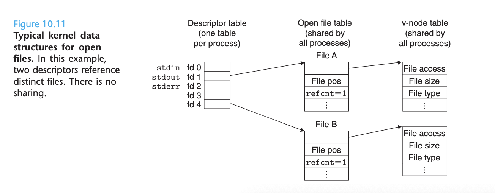

# Ch 10 System-Level I/O

**TLDR**

**

**

Just read below, this chapter is short

**

**

**Introduction**

**

**

**Input/Output (I/O)** is the** process of copying data between main memory and external devices**. An input operation copies data from an I/O device to main memory, and an output operation copies data from memory to a device. 

**Unix I/O**

**

**

A unix file is a sequence of m bytes:BB00,B,B11,...,B,...,Bkk,...,B,...,Bmm−−11..

**All I/O devices**, such as networks, disks and terminals **are modeled as files**, and **all input and output is performed by reading and writing the appropriate files**. This simple interface is known as Unix I/O, and it enables all input and output to be performed in a uniform and consistent way.**All I/O devices**, such as networks, disks and terminals **are modeled as files**, and **all input and output is performed by reading and writing the appropriate files**. This simple interface is known as Unix I/O, and it enables all input and output to be performed in a uniform and consistent way.

1. **Opening a file** - an application announces its intention to access an I/O device by asking the kernel to open the corresponding file. The kernel returns a small nonnegative integer, called a **descriptor**, that identified the file in all subsequent operations on the file. The kernel keeps track of all information about the open file. The application only keeps track of the descriptor.**Opening a file** - an application announces its intention to access an I/O device by asking the kernel to open the corresponding file. The kernel returns a small nonnegative integer, called a **descriptor**, that identified the file in all subsequent operations on the file. The kernel keeps track of all information about the open file. The application only keeps track of the descriptor.
2. **Changing the file position** - the kernel maintains a file position k, initially at 0, for each open file. the file position is a byte offset from the beginning of a file. An application can set the current file position k explicitly by performing a seek operation.
3. **Reading and writing files** - A read operation copies n > 9 bytes from a file to memory, starting at the current file position k, and then incrementing k by n.  Given a file with a size of m bytes,  performing a read operation when k >= m triggers a condition known ad end-of-file EOF, which can be detected by the application.
4. **Closing files** - when an application has finished accessing a file it informs the kernel by asking it to close the file. The kernel responds by freeing the data structures it created when the file was opened and restoring the descriptor to the pool of available descriptors. When a process terminates for any reason, the kernel closes all open files and frees their memory resources.

**Each process** created by a Unix shell begins life with **three open files**:

1. 
2. **Standard Output** (descriptor 1)
3. **Standard Error **(descriptor 2)

**Sharing Files**

**

**

The kernel represents open files using three related data structures:

1. **Descriptor Table**
2. **File Table**
3. **V-node table**



This first figure (10.11) shows an example where descriptors 1 and 4 reference two different files through distinct open file table entries. This is a typical situation where files are not shared, and where each descriptor corresponds to a distinct file.


The second figure (10.12) demonstrates how multiple descriptors can also reference the same file through different file table entries. This might happen, for example, if you were to call the open function twice with the same filename. The key idea here is that each descriptor has its own distinct file position, so different reads on different descriptors can fetch data from different locations in the file.


The last image shows how parent and child processes share files. The child gets its own duplicate copy of the parent's descriptor table. Parent and child share the same set of open file tables, and thus share the same file position. An important consequence is that the parent and child must both close their descriptors before the kernel will delete the corresponding file table entry.

**I/O Redirection**

**

**

Unix shells provide I/O redirection operators that allow users to associate standard input and output with disk files.

```
ls > foo.txt
```

will cause the shell to load and execute the ls program, with standard output redirected to the disk file foo.txt. How does I/O redirection work. Well, it could use the dup2 function which copies an old descriptor table entry to a new descriptor table entry.

Once this happens, any data written from standard output (fd1) is redirected to file B (fd4)


**Standard I/O**

**

**

The Standard I/O library** models an open file** as a **stream**. To a programmer, a stream is a pointer to a structure of type FILE. 

A stream of type FILE is an abstraction for a file descriptor and a stream buffer. The purpose of the stream buffer is to minimize the number of expensive Unix I/O system calls. 
