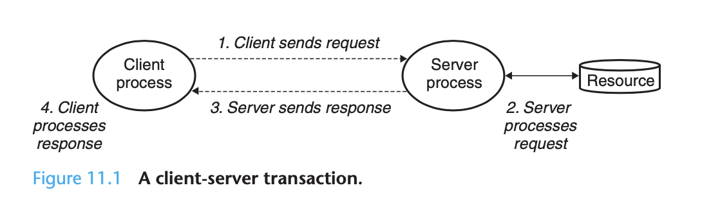
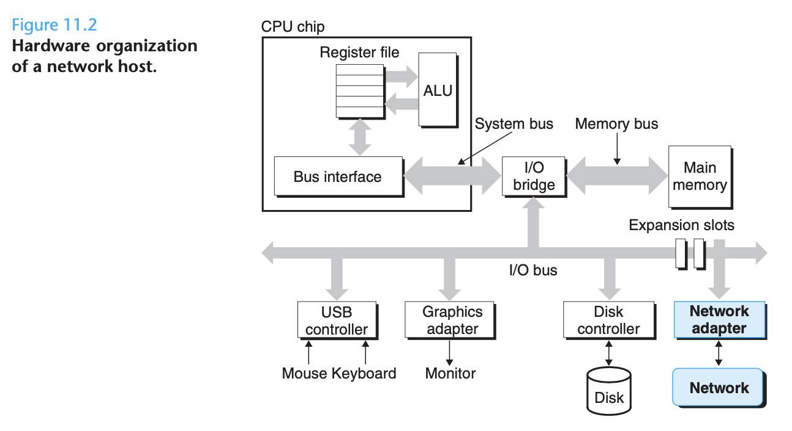
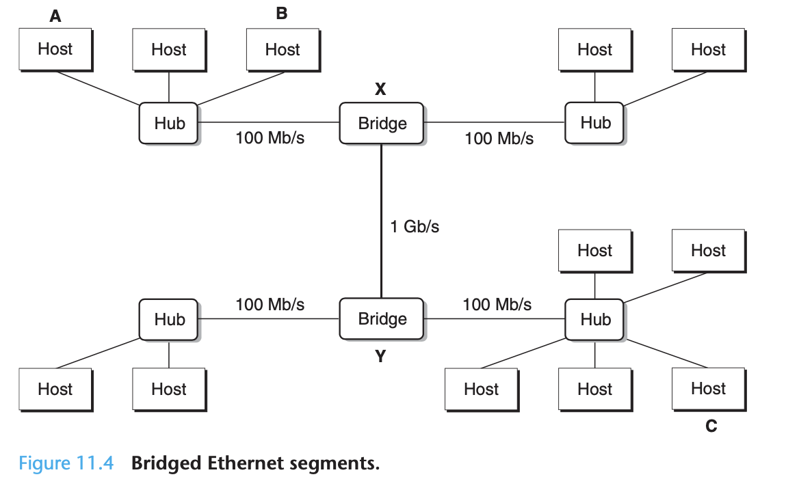
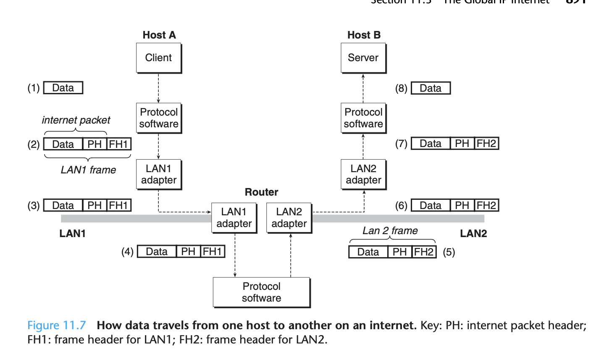
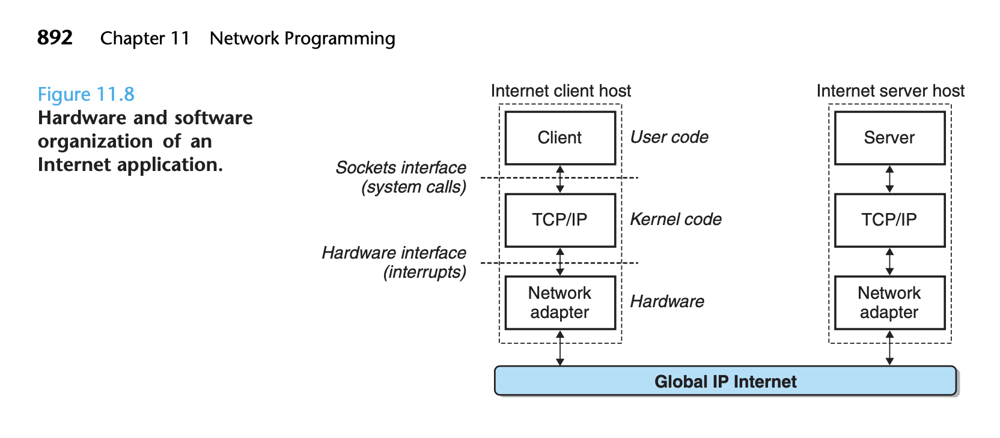
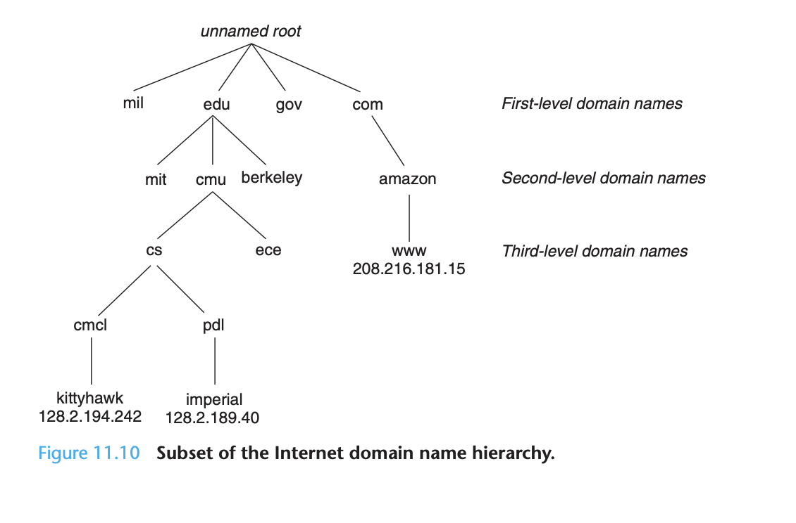
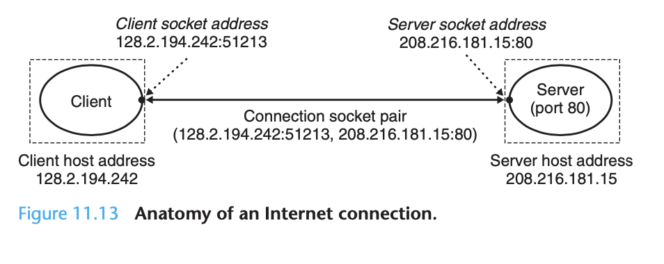
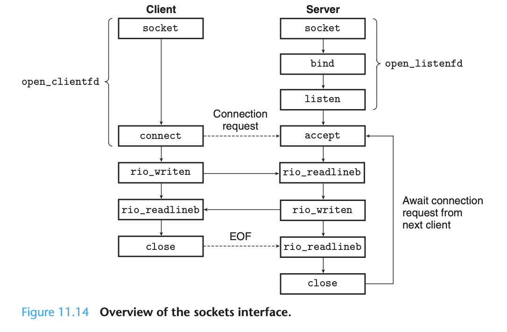

# Ch 11 Network Programming

All network applications are based on the same basic programming model, have similar overall logical structures, and rely on the same programming interface.

Network applications rely on many of the concepts we are already studied: processes, signals, byte ordering, memory mapping, and dynamic storage allocation. 

**The Client-Server Programming Model**

Every network application is based on the **client-server model**. With this model, an application consists of a server process and one or more client processes. A server manages a resource, and it provides some service for its clients by manipulating that resource. 

The fundamental operation of the client-server model is the **transaction**.



It is important to realize that clients and servers are processes and not machines or hosts. A single host can run many different clients and servers concurrently, and a client and server transaction can be on the same or different hosts. 

**Networks**

Clients and servers often run on separate hosts and communicate using the hardware and software resources of a **computer network**. 

To a host, a network is just another I/O device that serves a source and sink for data. An adapter plugged into an expansion slot on the I/O bus provides the physical interface to the network. Data received from the network is copied from the adapter across the I/O and memory buses into memory, typically by a DMA transfer.



Physically, a network is a hierarchical system that is organized by geographical proximity. At the lowest level is a LAN (local area network) that spans a building or campus. The most popular LAN technology is Ethernet.

An Ethernet segment consists of some wires and a small box called a hub. Each wire has the same maximum bit bandwidth. One end is attached to an adapter on a host, and the other end is attached to a port on the hub. **A hub copies every bit that it receives on each port to every other port**. Thus every host sees every bit.

Each Ethernet adapter has a globally unique 48-bit address that is stored in non-volatile memory on the adapter. A host can send a chunk of bits called a frame to any other host on the segment. Each frame includes some fixed number of header bits that identify the source and destination fo the frame and the frame length, followed by a payload of data bits. Every host sees the frame, but only the destination host reads it.



Multiple Ethernet segments can be connected into larger LANs called bridged Ethernets, using a set of wires and small boxes called **bridges**. Bridged Ethernets can span entire buildings or campuses. In a bridged Ethernet, some wires connect bridges to bridges, others connect bridges to hubs. The bandwidths of the wires can be different, bridge to bridge wires probably need more.

**Bridges make better us of the available wire bandwidth** than hubs. Using a clever distributed algorithm, they automatically learn over time which hosts are reachable from which ports, and they **selectively copy frames from one port to another only when necessary**.

Multiple incompatible LANs can be connected by specialized computers called **routers** to form an **internet**. Each router has an adapter (port) for each network that it is connected to. Routers can also connect high-speed point-to-point phone connections, which are examples of networks known as WANs (Wide Area Networks) so called because they span larger geographical areas.

**Hosts can send data across incompatible networks by using layered protocol software** that smoothes out the differences between the networks. A protocol provides two basic capabilities:

1. A Naming Scheme - Creates a uniform format for host addresses
2. Delivery Mechanism - Defines a uniform way to bundle up data bits into discrete chunks called packets.



**The Global IP Internet**

The global IP Internet is the most famous and successful implementation of an internet. It has existed in one form or another since 1969. 



Each Internet host runs software that implements the TCP/IP protocol, which is supported by almost every modern computer system. **Internet clients and servers communicate using a mix of sockets interface functions and Unix I/O functions**. The** sockets functions** are typically** implemented as system calls** that trap into the kernel and various kernel-mode functions in TCP/IP.

TCP/IP is actually a family of protocols, each of which contributes different capabilities. For example, the IP protocol provides the basic naming scheme and delivery mechanism that can send packets from one Internet host to another. The IP mechanism is unreliable, it does not make any effort to recover packets if they are lost. 

UDP extends IP slightly so that packets can be transferred from process to process, rather than host to host. TCP is much more complex, and it provides reliable full duplex connections between processes.

From a programmer's perspective, we can think of the Internet as a worldwide collection of hosts with the following properties:

1. The set of hosts is mapped to a a set of 32-bit IP addresses (IPv4)
2. The set of IP addresses is mapped to a set of identifiers known as Internet domain names
3. A process on one Internet host can communicate with a process on any other Internet host over a connection.

**IP Addresses**

An IP address is an unsigned 32-bit integer. Network programs store IP addresses in the IP address structure, it would make more sense to use a scalar type but this is an unfortunate artifact of early implementations of the sockets interface.

Because Internet hosts can have different host byte orders, **TCP/IP defines a uniform network byte order (big endian)** for any data that is carried across the network.

**Internet Domain Names**

**

**

Internet clients and servers use IP addresses when they communicate with each other. However large integers are difficult for people to remember, so **the Internet also defines a separate set of more human-friendly domain names**. 



A domain is a sequence of words separated by periods. The set of domain names forms a hierarchy, and each domain name encodes its position in the hierarchy which can be represented as a tree. The subtrees are referred to as subdomains. 

Until 1988, the mapping between domain names and IP addresses was maintained manually in a single text file called HOSTS.txt. Since then, the mapping has been maintained in a **distributed world-wide database known as DNS (Domain Name System)**. 

**Internet Connections**

**

**

Internet clients and servers **communicate by sending and receiving streams of bytes** over **connections**. A connection connects a pair of processes on remote computers.

A **socket** is an **end point of a connection**. Each socket has a corresponding **socket address** that consists of an Internet address and a 16-bit integer port, and is denoted by **address:port**.  The port in a client's socket address is assigned automatically by the kernel when the client makes a connection request, and is known as an ephemeral port.

However, the port in the server's socket address is typically a well-known port that is associated with a service. Web servers typically use port 80. On Unix machines, the file **/etc/services** contains a comprehensive list of services provided by the machine. 

A connection is uniquely identified by the socket addresses of its two endpoints. This pair of socket addresses is known as a socket pair and is denoted by the tuple:

```
(cliaddr:cliport, servaddr:servport)
```



**Sockets Interface**

**

**

The sockets interface is a set of functions that are used in conjunction with the Unix I/O functions to build network applications. 



From the perspective of the Unix kernel, a socket is an end point for communication. From the perspective of a Unix program, a socket is an open file with a corresponding descriptor. 
