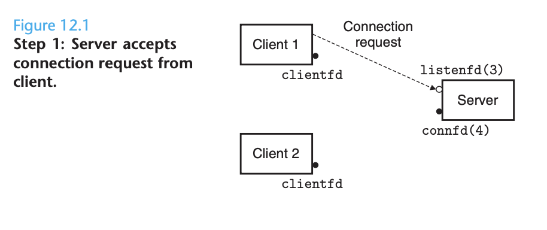
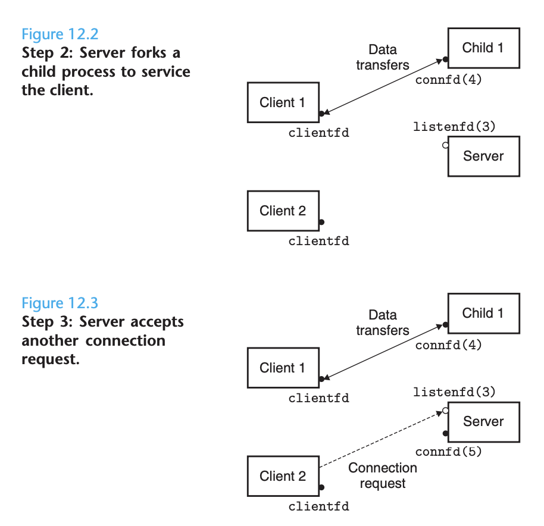
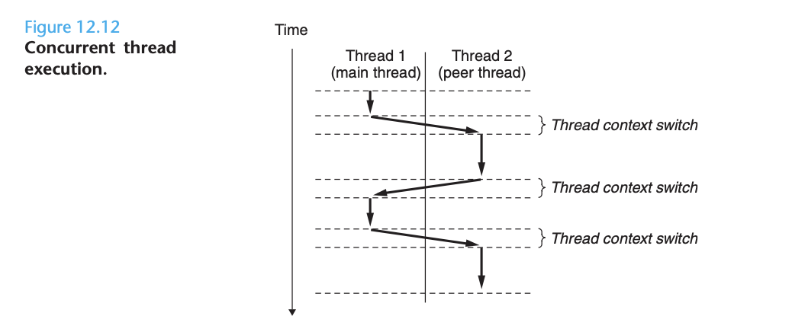

# Ch 12 Concurrent Programming

Logical control flows are **concurrent** if they **overlap in time**. This general phenomenon shows up at many different levels of a computer system. Hardware exception handlers, processes, and Unix signal handlers are all familiar examples. 

So far, we have treated concurrency mainly as a mechanism that the operating system kernel uses to run multiple application programs. But concurrency is not just limited to the kernel! It can play an important role in application programs as well. 

Application-level concurrency is useful for:

1. **Accessing slow I/O devices **
2. **Interacting with humans**
3. **Reducing latency by deferring work**
4. **Servicing multiple network clients**
5. **Computing in parallel on multi-core machines**

Modern operating systems provide three basic approaches to building concurrent programs:

1. **Processes**
2. **I/O multiplexing**
3. **Threads**

**Concurrent Programming with Processes**

The simplest way to build a concurrent program is with processes. For example, a natural approach for building a concurrent server is to accept client connection requests in the parent, and then create a new child process to service each new client. 

Since the connected descriptors in the parent and child each point to the same file table entry, it is crucial for the parent to close its copy of the connected descriptor. Otherwise, the file table entry for connected descriptor 4 will never be released and the resulting memory leak will eventually consume the available memory and crash the system. 

**Pros and Cons of Concurrent programming with processes**

**

**

Processes have a clean model for sharing state information between parents and children: file tables are shred, and user address spaces are not. Having separate address spaces is both an advantage and disadvantage. It is impossible for one process to accidentally overwrite the virtual memory of another process. On the other hand, separate address spaces make it more difficult for processes to share state information.

**Concurrent Programing with I/O Multiplexing**

Let's use a thought experiment to illustrate I/O multiplexing. Suppose you need a server that can respond to interactive commands, as well as network requests. Which event do you wait for first?

The basic idea of I/O multiplexing is to **use the select function to ask the kernel** to **suspend the process**, returning control to the application only after one or more I/O events have occurred. 

The select function is complicated, but we can use it to wait for a set of descriptors to be ready for reading.

The select function manipulates descriptor sets, which we  can think of as a bit vector where each bit corresponds to a descriptor. You are only allowed to do a couple of things things with descriptor sets, allocate them, and modify and inspect them.

The server loop will inspect this set and respond to changes in it.

I/O multiplexing can be used as a **basis for concurrent event-driven programs**, where flows make progress as a result of certain events. The general idea is to model logical flows as state machines.

**Pros and Cons of Concurrent programming with I/O multiplexing**

**

**

One advantage of event-driven programming is that they give programmers more control over the behavior of their programs than process-based designs. 

Another advantage is that an event-driven server runs in the context of a single process, and thus every logical flow has access to the entire address space of the process. This makes it easy to share data between flows.

Finally, event-driven designs are often significantly more efficient than process-based designs because they do not require a process to context switch to schedule a new flow.

A significant disadvantage of event-driven designs is coding complexity.  They are cannot fully utilize multi-core processors.

**Concurrent Programming with threads**

**

**

A **thread** is a** logical flow that runs in the context of a process.** Thus far in this book, our program shave consisted of a single thread per process. The threads are scheduled automatically by the kernel. Each thread has its own thread context, including a unique integer thread id (TID), stack, stack pointer, program counter, general-purpose registers, and condition codes. All **threads running in a process share the entire virtual address space of the process**.

Logical flows based on threads combine qualities of flows based on processes and I/O multiplexing. Like processes, threads are scheduled automatically by the kernel and are known by an integer ID. Like flows based on I/O multiplexing, multiple threads run in the context of a single process and thus share the entire contents of the process virtual address space.

