# Ch 1 A Tour Of Computer Systems

**TLDR**

A **computer system **consists of hardware and systems software that work together to run application programs. Information inside the computer is represented as groups of bits that are interpreted in different ways, depending on the context. 

Programs are translated by other programs into different forms, beginning with ASCII text and then translated by compilers and linkers into binary executable files.

Processors read and interpret binary instructions that are stored in main memory. Since computers spend most of their time copying data between memory, I/O devices, and CPU registers, the storage devices are organized into a hierarchy.

The operating system kernel serves as an intermediary between the application and the hardware. It provides three fundamental abstractions:

1. Files - abstractions for I/O devices
2. Virtual Memory - abstraction for main memory and disks
3. Processes - abstractions for the processor, main memory and I/O devices

Networks provide ways for computer systems to communicate with one another.

**Introduction**

A **computer system **consists of hardware and systems software that work together to run application programs.

Most modern systems use the ASCII standard to represent text characters with a unique byte-sized integer value.

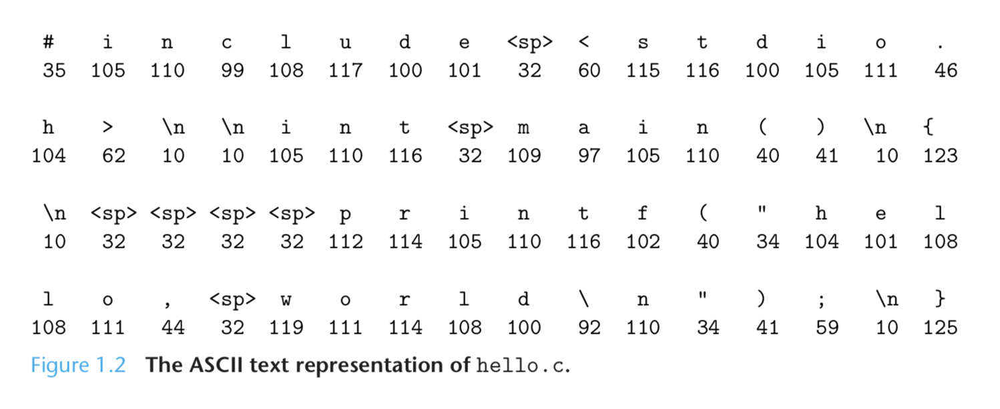

Each text line is terminated by the invisible newline character \n. 

The example above demonstrates a** fundamental idea** - _all information in a computer system is represented as a bunch of bits._ The only thing that distinguishes different data objects is the **context** in which we view them. 

In order to run a c program, the individual c statements need to be **translated** into a sequence of low-level **machine-language instructions. **These instructions are then packaged into an executable and stored as a binary disk file. 

On a Unix system, the translation is performed by a **compiler**.

```
$ gcc -o hello hello.c
```

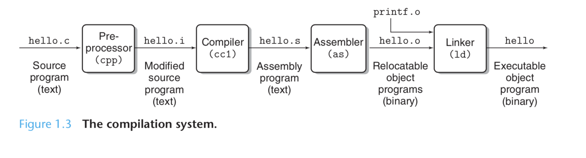

1. **Preprocessing phase**
2. **Compilation phase**
3. **Assembly phase **
4. **Linking phase **

**Hardware Organization**

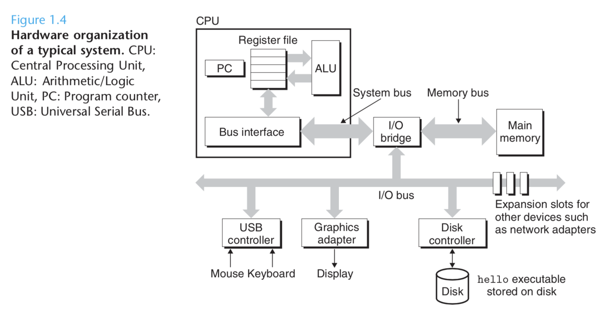

**Buses **are electrical conduits that carry bytes of information between components. They are designed to transfer fixed-size chunks of bytes known as **words**. Word size is a fundamental system parameter. Most machines have word sizes of 4 bytes (32 bits) or 8 bytes (64 bits).

**I/O devices **are the system's connection to the external world. Some examples are keyboards, mouses, and a disk for long term storage.  Each device is connected to the I/O bus by a **controller** or an **adapter**. The distinction between the two is that a controller is built into the motherboard, while an adapter plugs into a slot on the motherboard. The purpose of both is to **transfer information between the I/O bus and the I/O device**.

**Main memory **is a temporary storage device that holds programs and data while the processor is executing the program. It consists of a collection of** Dynamic Random Access Memory** chips. Memory is organized as a linear array of bytes, each with its own unique address.

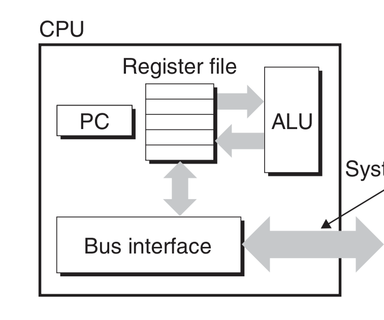

**Central Processing Unit **is the engine that executes instructions stored in main memory.

* **Program Counter**
* **Register File **
* **ALU**

So what steps actually take place when the hello program is run?

1. The shell program sends the characters that we are typing to main memory.
2. When we hit the enter key. The shell loads the executable file by executing a sequence of instructions that copies the code and data in the hello object file from disk to main memory.
3. Once the code is loaded into memory, the processor begins executing the machine-language instructions. They copy the bytes in hello world from memory to the register file and from there to the screen.

**The system spends a lot of time moving information from one place to another!**

**Caches **are fast storage devices that serve as temporary staging areas for information that the processor is likely to need in the near future. Caches can be accessed nearly as fast as the register file. Typically processors have L1 (smaller) and L2 caches that are implemented with hardware technology known as **static random access memory.**

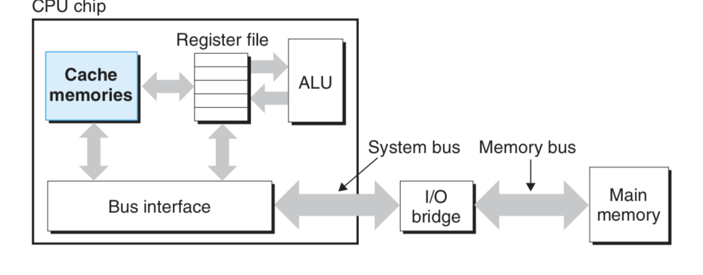

The idea behind caching is that a system can get the effect of both a very large memory and a very fast one by exploiting **locality**, the tendency for programs to access data and code in localized regions. Application programmers who are aware of cache memories can exploit them to improve the performance of their programs by an order of magnitude.

The **memory heirarchy **describes the layers of storage devices between the processor and larger slower devices.

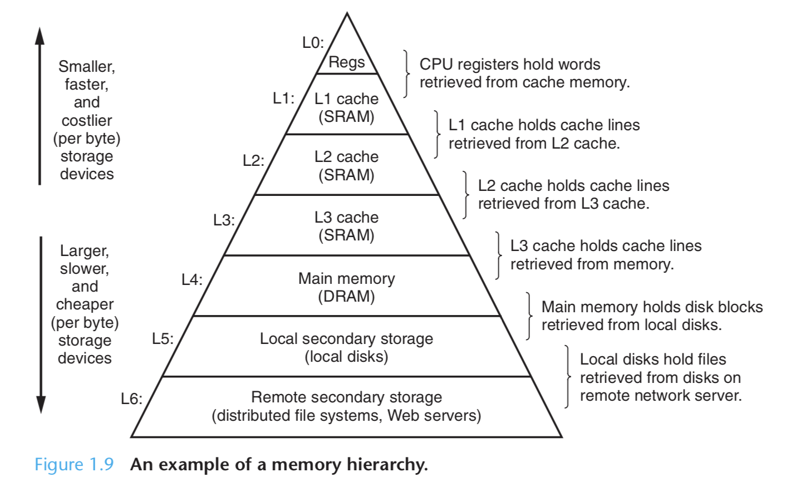

**The Operating System**

When the shell loaded and ran the hello program and when the hello program printed its message, neither program accessed the keyboard, display, disk or main memory directly. They relied on an arbiter, the **operating system** to do so. The operating system is a layer of software interposed between the application program and the hardware. 

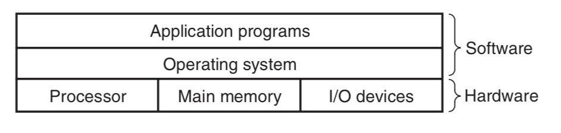

The operating system has two primary purposes:

1. To protect the hardware from misuse by runaway applications
2. To provide applciations with simple and uniform mechanisms for manipulating complicated low-level hardware.

The operating system achieves these goals by providing fundamental abstractions: **processes**, **virtual memory** and **files**. 

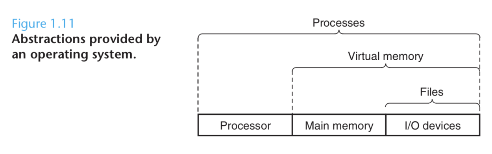

As the figure above suggests, **files** are abstractions of I/O devices, **virtual memory** is an abstraction for both the main memory and disk I/O devices and **processes** are abstractions for the processor, main memory and I/O devices!

A **process** is the operating system's abstraction for a running program.

Multiple processes can run **concurrently** -- instructions of one process are interleaved with instructions of another -- on the same system. Switching between process execution is known as **context switching**.

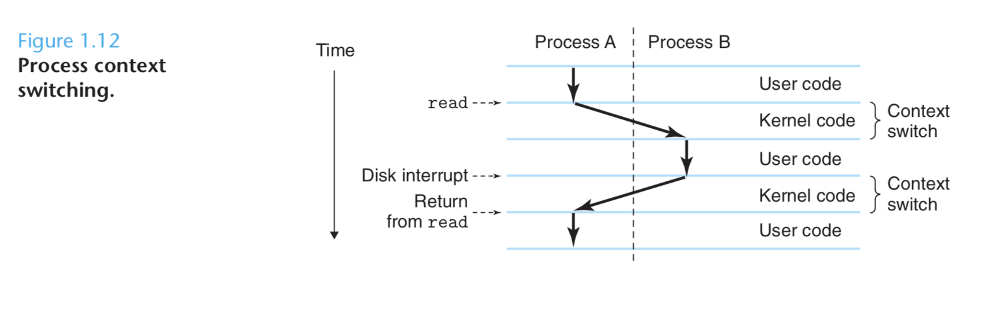

The operating system keeps track of all the state information that the process needs in order to run.  This state is known as the **context**. When the operating system decides to transfer control from the current process to some new process, it performs a **context switch** by saving the content of the current process, restoring the context of the new process, and then passing control to the new process.

In modern systems, a process can actually consist of multiple execution units, called **threads**, each running in the same context of the process and sharing the same code and global data. Threads are becoming increasingly important because sharing data between multiple threads is easier than between multiple processes.

**Virtual memory** is an abstraction that provides each process with the illusion that it has exclusive use of the main memory. Each process has the same uniform view of memory, which is known as the **virtual address space**. 

Some things to note here are that the **topmost region** of the virtual address space is reserved for code and data in the operating system. The lower region is for the code and data defined by the user's process. Addresses increase from bottom to top. 

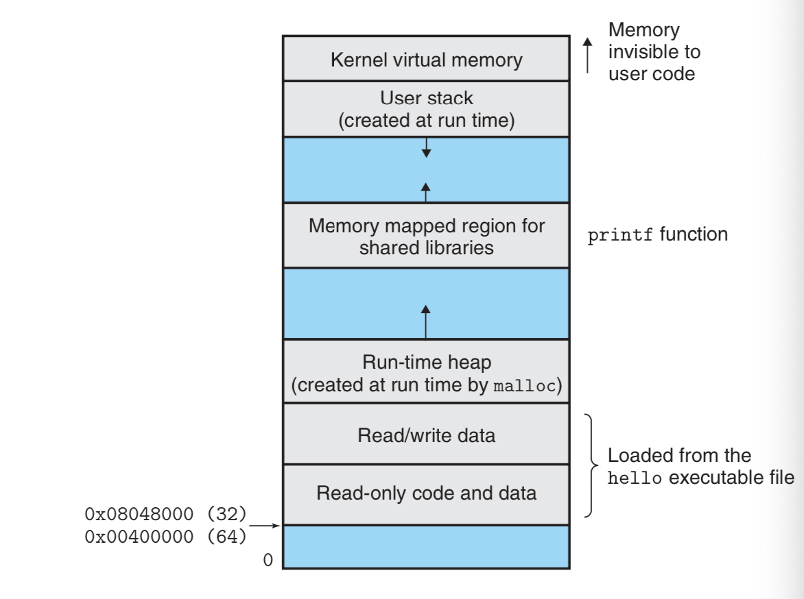

**Virtual Memory Organization**

* **Program Code and Data**
* **Heap**
* **Shared libraries**
* **Stack**
* **Kernel virtual memory**

**Files**

A **file** is a sequence of bytes. **Every I/O device, including disks, keyboards, displays and even networks is modeled as a file. **All input and output in the system is performed by reading and writing files.

The beauty of the file as an abstraction is that it provides applications with a uniform view of all the varied I/O devices that might be contained in the system. 

**Networks**

From the point of view of an individual system, the network can be viewed as just another I/O device. When the system, copies a sequence of bytes from main memory to the network adapter. The data flows across the network to another machine, instead of to a local disk drive. 

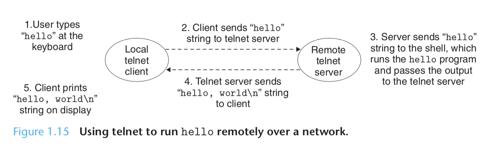

**Summary**

A computer system is more than just hardware. It is a collection of intertwined hardware and systems software that must cooperate in order to achieve the ultimate goal of running application programs. 

**Concurrency vs Parallelism**

* **Concurrency**
* **Parallelism **

Traditionally, **concurrent execution** was only **simulated** by having a single computer rapidly switch among its executing processes, like a juggler keeping multiple balls in the air. This configuration is known as a **uniprocessor system**.

* This system allows a single user to engage in multiple tasks concurrently, like having a web browser open, a word processor in another
* It also allows a web server to serve multiple people at the same time.

A system of multiple processors all under the control of a single operating system kernel is a **multiprocessor system.** One model for these systems is a single integrated circuit chip with multiple CPUs. Each CPU has its own L1 and L2 caches but they share the higher levels of cache.

**Three types of Parallelism**

* **Thread-Level Concurrency**
* **Instruction-Level Parallelism **
* **Single-instruction, Multiple-Data Parallelism**
