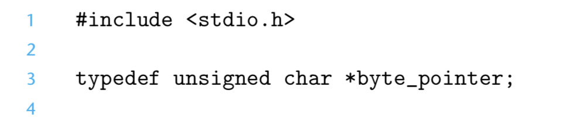
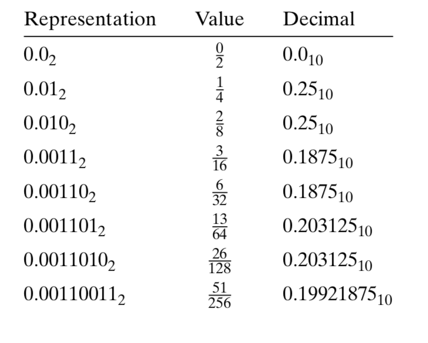

# Ch 2 Representing and Manipulating Information

**TLDR**

**

**

Computers encode information as bits, generally organized as sequences of bytes. Different encodings are used for representing integers, real numbers, and character strings. 

Due to finite lengths of encodings, computer arithmetic has properties quite different from conventional integer and real arithmetic. One of the most common issues seen from this difference is overflow, where they exceed the range of the representation.

**

**

**Introduction**

Grouping bits together and applying **interpretation** to that grouping is what created the digital revolution.

The three most important representations of numbers in a computer are:

* **Unsigned**
* **Signed**
* **Floating-point**

Computers use a limited number of bits to encode a number, hence some operations can **overflow** when the results are too large to be represented.

Integer and Floating-point arithmetic have different mathematical properties.

In most computers, the smallest addressable unit of memory is eight bits, or a **byte**.  A program views memory as a very large array of bytes known as **virtual memory**. Each byte of memory is identified by a **unique address**. The set of all possible addresses is known as the **virtual address space**. The virtual address space is just a conceptual image presented to the program. The actual implementation of memory uses. RAM, disk storage, special hardware and the OS.

A **pointer** provides a mechanism for referencing elements of data. It has a value and a type. The value indicates where in memory an object is (the location), and the type indicates what kind of object is at the location of the pointer.

Binary notation is too verbose, and decimal notation is tedious to convert to and from bit patterns. Instead we bit patterns as base-16/**hexadecimal** numbers. Written in hexadecimal, a single byte can range from 00 to FF.

**Shortcut! Converting powers of two to Hex**

When a value x is a power of two, it is 1 followed by a number of zeros. The hexadecimal digit 0 represents 4 binary zeros. So for n written in the form 

```
i + 4j
```

where 0 <= i <= 3, we can write x with a leading hex digit of 1, 2, 4, or 8 followed by j hexadecimal 0s

```
x = 2048 = 2 ^ 11
```

```
n = 11 = 3 + 4 * 2 = Ox800
```

Practice

* n = 9
    * 2 ^ 9 = 512
    * n = 1 + (4 * 2) = 0x200

* n = 19
    * 2 ^ 19 = 524288
    * n = 3 + (4 * 4) = 0x80000

* n = 14
    * 2 ^ 14 = 16834
    * n = 2 + (4 * 3) = 0x4000

* n = 16
    * 2 ^ 16 = 65536
    * n = 0 + (4 * 4) = 0x10000

* n  = 17
    * 2 ^ 17 = 131072
    * n = 1 + (4 * 4) = 0x20000

* n = 5
    * 2 ^ 5 = 32
    * n = 1 + (4 * 1) = 0x20

* n = 7
    * 2 ^ 7 = 128
    * n = 3 + (4 * 1) = 0x80

**Converting Decimal to Hexadecimal**

To convert a decimal number x to hexadecimal, we can repeatedly divide x by 16, giving quotient q and remainder r, such that:

```
x = q * 16 + r
```

We can then use the hexadecimal representing r as the least significant digit and generate the remaining digits by repeating the process on q


Practice

* 167 | 1010 0111 | 0xA7
* 62   | 0011 1110 | 0x3E
* 188 | 1011 1100 | 0xBC
* 55   | 0011 0111 | 0x37
* 144 | 1001 0000 | 0x90
* 243 | 1111 0011 | 0xF3
* 82   | 0101 0010 | 0x52
* 172 | 1010 1100 | 0xAC
* 231 | 1110 0111 | 0xE7

**Word Size **the nominal size of integer and pointer data. Since a virtual address is encoded by a word, the most important system parameter is determined by the word size is** the maximum size of the virtual address space**.

Computers and compilers support multiple data formats using different ways to encode data. 


For program objects that **span multiple bytes**, we must establish two conventions:

* what the address of the object will be
* how we will order the bytes in memory

In virtually all machines, a multi-byte object is stored as a** contiguous sequence** of bytes, with the address of the object given by the **smallest address of the bytes used**.

As for ordering the bytes - 

* **Little Endian **
* **Big Endian**


Most of the time you don't need to worry about the byte-ordering of your code. Sometimes however, it is important. 

1. When binary data is communicated over a network between different machines. To avoid such problems, code written for networking applications must follow established conventions for byte ordering to make sure the sending machine converts its internal representation to the network standard, while the receiving machine converts the network standard to its internal representation. 
2. When looking at byte sequences representing integer data, this often happens when inspecting machine-level programs with a 
3. Byte ordering also becomes visible when a program is written that circumvents the normal type system. In C this can be done with a

**typedef declarations** in C provide a way of giving a name to a data type. The syntax is that of declaring a variable, except that it uses a type name rather than a variable name. 



**Pointer Creation and Dereferencing**

* "&" - 
* "&x" creates a pointer to the location holding the object indicated by the variable, the type of the pointer depends on the type of x


**Representing Strings**

A **string in C** is** encoded by an array** of characters terminated by the null character "\0". Each character is represented by some standard encoding. The **ASCII** character set is suitable for encoding english-language documents, but it does not support much in the way of special characters. **Unicode** was devised to be a comprehensive standard for encoding text.

The base encoding of Unicode uses a 32-bit representation of characters. **UTF-8** is an alternative scheme that gives standard ASCII characters the same single-byte encodings.

A fundamental concept of computer systems is that **a program**, from the perspective of the machine,** is simply a sequence of bytes**.

**Boolean Symbols in C**

* **~**
* **& **
* **|**
* **^ **

Boolean operators can also operate on **bit vectors**, strings of zeros and ones of some fixed length.


When we consider operations on bit vectors, we get a mathematical form known as a** Boolean ring**. A Boolean ring has many properties in common with integer arithmetic. One example is the property of an additive inverse, whereby x + -x = 0.

In the Boolean ring, with XOR, each element is its own additive inverse.

* a ^ a = 0
* 0 ^ 0 = 1
* 1 ^ 1 = 0

One useful application of bit-level operations is to implement **masking operations**, where a mask is a bit pattern that indicates a selected set of bits within a word.

Example: Masking with 0xFF, will yield the low-order byte of a word. 

```
x & FF = 0x000000EF
```

Practice Problem, write C expressions, in terms of variable x for the following rules

* The least significant byte of x, with all other bits set to 0
* All but the least significant byte of x complemented, with the least significant byte unchanged.
* The least significant byte to set all 1s and the other bytes left unchanged

```
int main() {

int x = 0x87654321;

printf("least significant byte of x: 0x%x\n", x & 0xFF);

printf("all but least significant byte of x complemented, with least significant byte unchanged: 0x%x\n", (~x) ^ 0xFF);

printf("least significant byte set to all 1s: 0x%x,\n ", x | 0xFF);

}
```

The most common computer representation of signed numbers is known as **two's complement** form. In this representation the most significant bit of the word has negative weight.


There is an asymmetry in two's complement expressive range. This is because 0 is a non-negative number and thus two's complement can represent one less positive number than negative.

C allows casting between different numeric data types. As a general rule, the bit patterns do not change, but the numeric values do.

In C, most numbers are signed by default. However, when an operation is performed where one operand is signed the other is unsigned, C implicitly casts the signed argument to unsigned and performs the operations assuming the numbers are nonnegative.

One common operation is to convert between integers having different word sizes while retaining the same numeric value.

* To convert an unsigned number to a larger data type, we can simply add leading zeros to the representation. This is known as 
* To convert a two's complement number, the rule is to perform a

**Integer Arithmetic**

When a full integer cannot fit within the word size limits of the data type the number experiences **overflow**. C programs do not signal this as an error.

**Two's complement numbers** can have** positive overflow** or **negative overflow**. 

```
int uadd_ok(unsigned x, unsigned y) {

unsigned sum = x+y;

// if it overflows the sum will be greater than x
    return sum >= x;

}

int tadd_ok(int x, int y) {

//overflow can happen in two directions with twos complement
int sum = x + y;

if (x > 0 && y > 0 && sum < 0) {

    return false;

} else if (x < 0 && y < 0 && sum >= 0)

{
    return false;

}
    return true;

}

```

To get the bit level-representation of a negated number, take it's complement and add 1.

If you need to **multiply or divide by a power of 2**, you can use the shift operator.

**Floating Point**

Floating point representation encodes rational numbers of the form V = x + 2^y. It is useful for performing computations of large or very small numbers.


There is a limit as to what can be represented by fractional binary numbers, take this example of the simple fraction 1/5.



The positional notation above would be a little impractical for representing large numbers.


The bit representation of a floating-pointer number is divided into three fields to encode these values.

* the single sign bit 
* the k-bit exponent field exp encodes the exponent 
* the n-bit fraction field encodes the significand


The bit representations for different categories of floating point values follow separate rules:

* **Normalized Values**
* **Denormalized Values -**
* **Special Values - **


One useful exercise for understanding floating point numbers is to convert sample integer values into floating point form. Let's do so with the number **12,345**.

1. First we find the binary representation.
    1. 11000000111001

2. Then we create the normalized representation by shifting thirteen positions to the right.
    1. 12345 = 1.1000000111001 x 2 ^ 13

3. To encode this we construct the fraction field by dropping the leading 1 and adding ten zeros to the end, giving binary representation.
    1. 10000001110010000000000

4. To construct the exponent field, we add bias 127 to 13, giving 140, which has a binary representation
    1. 10001100

5. We combine this with a sign bit of 0 to get the floating-point representation in binary
    1. 01000110010000001110010000000000

Floating-point arithmetic can only approximate real arithmetic since their is a limited range and precision. Thus, **rounding** is needed to find the closest approximate value.

The IEEE floating point standard specifies a simple rule for determining the result of an arithmetic operation such as addition or multiplication. Viewing floating point values x and y as real numbers, and any operation, the computation should yield


Floating-point addition is** not associative. **This has important implications for scientific programmers and compiler writers. 

**Summary**

Computers encode information as bits, generally organized as sequences of bytes. Different encodings are used for representing integers, real numbers and character strings. Different models of computers use different conventions for encoding numbers and for ordering the bytes within multi-byte data.
