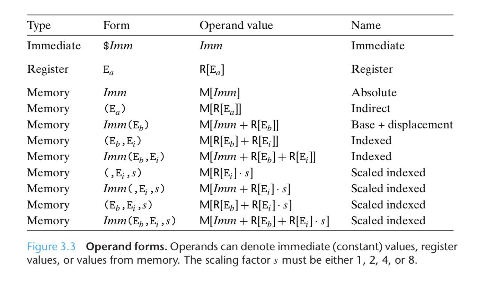
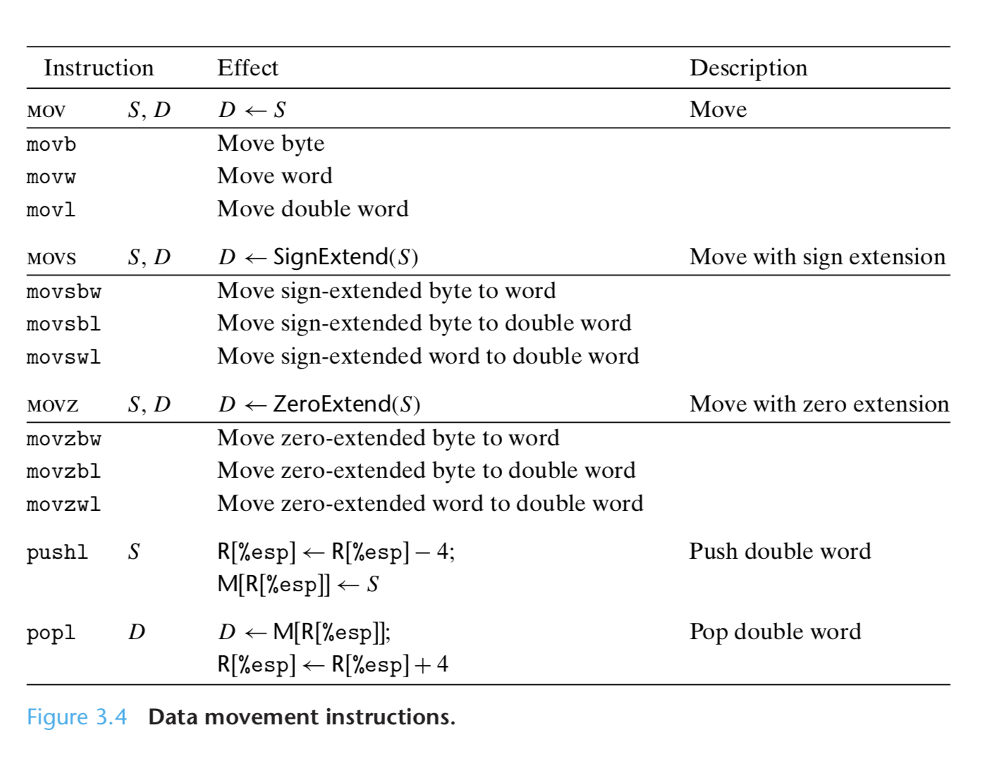
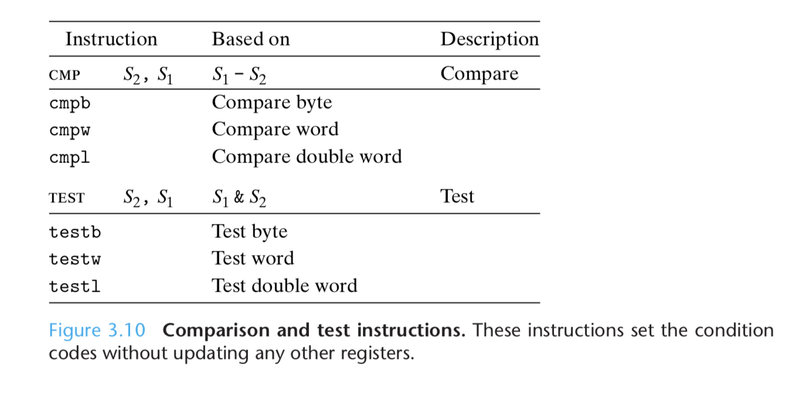

# Ch 3 Machine-Level Representation of Programs

**TLDR**

**

**

Machine-level programs, and their representation by assembly code, differ in many ways from C programs. There is minimal distinction between different data types. The program is expressed as a sequence of instructions, each of which performs a single operateion.

**

**

**Introduction**

Computers execute **machine code**, sequences of bytes encoding the low-level operations that manipulate data, manage memory, read and write data on storage devices, and communicate over networks

A **compiler **generates machine code through a series of stages, based on:

* the rules of the programming language
* the instruction set of the target machine
* the conventions followed by the operating system.

**Assembly code** is a textual representation of the machine code. Using a high-level language allows us to be shielded form the detailed, machine-level implementation of our program. Best of all, a program, written in a high-level language can be compiled and executed on a number of different machines whereas assembly code is highly machine specific.

**Assembly code is not easy to read**. Relative to the expressive nature of C code. Which is typically fairly clear. The compiler can generate assembly code that is cryptic,  often rearranging execution order, eliminating unneeded computations, replacing slow operations with faster ones and even changing recursive computations into iterative ones.

**Some Trivia**

```
gcc -Og -S some_program.c
```

-**Og** flag makes your code optimized but generally readable. It avoids the hard to understand substitutions that might be made during optimizations

**-S **will just output the assembly code

```
objdump -d some_program
```

**objdump** is a disassembler program.

**How a compiler works**


1. **Preprocessing phase**
2. **Compilation phase**
3. **Assembly phase **
4. **Linking phase **

**Two abstractions** are especially** important for machine-level programming**.

* **Instruction Set Architecture**
* **Virtual Addresses **

Machine code looks very different from C code, parts of the processor state that are normally hidden are visible.

* **Program Counter**
* **Register File**
* **Condition Code Registers**
* **Floating Point Registers **

Aggregate data types in C such as arrays and structs are represented in machine code** as contiguous collections of bytes**. Even for scalar data types, machine code makes no distinctions between signed or unsigned integers, between different types of pointers, or even between pointers and integers. 

Program memory contains

1. Executable machine code for the program.
2. Some information required by the OS.
3. The run-time stack for managing procedure calls and returns.
4. Blocks of memory allocated by the user.

**Example disassembly**

```
int main() {
    return sum(1, 3);
}
```

```
gcc -O1 -o prog sum.c
```

```
objdump -d prog
```

**Assembly code** can be represented in different formats, for most of this book we will be using the ATT format, but there is also an Intel format. They differ in how they express assembly actions. 


Due to its origins as a 16-bit architecture, Intel uses the term **word** to refer to a **16-bit datatype**.** 32-bit quantities** are referred to as** double words**, and **64-bit quantities** as "**quad words**".

In assembly you will see the **suffix q** (**quad**) at the end of instructions to refer to quad words. Double words use the **suffix l (long)**. The **suffix b** is used to represent a byte, and the **suffix w** (**word**) is used to represent 2 bytes (16-bits see above).


An IA32 CPU contains a set of of 8 registers storing 32-bit values. In an **x86-64 machine**, the number of **registers is 16 and they store 64-bit values**. Most of the rest of the book will refer to the IA32 machine, the two work basically the same. 


In** IA32 machines**, the **registers are prefixed with %e**, in **x86-64** they are **prefixed with %r**.

There are only a few registers you need to know, the rest are general purpose registers. The ones you need to know are **%ebp/%rbp** and **%esp/%rsp **which contain pointers to important places in the program stack.

Most assembly instructions have one or more **operands:**

1. **source value**
2. **destination location**

The different possibilities can be classified into three types:

1. **Immediate**
2. **Register**
3. **Memory**




1. 0x100 -> Register
2. 0xAB -> Memory Address
3. 0x108 -> Immediate (constant)
4. 0xFF -> Indirect Address
5. 0xAB -> Indirect Address + 4
6. 0x11 -> Indirect Address (0x100 + 0x3 + 9 = 0x10C)
7. 0x13  -> Indirect Address (0x104 + 0x1 + 0x3)
8. 0xFF  -> Scaled Index Address (0x1 * 4 + 0xFC) -> address 0x100
9. 0x11 -> Scaled Index Address (0x100 + 0x3 * 4)

**The most heavily used instructions are those that copy data from one location to another. **The source operand designates a value that is immediate, stored in a register, or stored in memory. The destination operator designates a location that is either a register or a memory address. IA32 imposes the restriction that a move instruction cannot have both operands refer to memory locations, this means that **copying a value from one memory location to another takes two instructions**.




The push and pop data movement operations are used to push data onto and pop data from the **program stack**. The stack is a data structure that operates according to **LIFO rules, last in, first out**. The program stack **grows downward**. The **stack pointer (%esp/%rsp)** holds the** address of the top stack element** (bottom-most element).


Let's talk briefly about **c pointers**. 

A **pointer** value indicates where in memory an object is. It is simply an address.

```
int x = *xp;
```

Indicates that we should **read the value stored in the location designated by xp** and store it as a local variable named x. This **read operation is known as dereferencing. The * operator performs pointer dereferencing.**

```
*xp = y;
```

**writes the value of parameter y at the location designated by xp.**

```
int a = 4;
int b = exchange(&a, 3);
printf("a = %d, b = %d\n", a, b);
// a = 3, b = 4
```

The C operator **& (called "address of") creates a pointer**. In this case to the location holding local variable a. Function exchange then overwrote the value store in a with 3, but returned 4 as the function value.

**Arithmetic and Logical Operations****


**

The** load effective address (leal)** is a variant of a mov instruction. It copies the effective address to the destination. This instruction can be used to generate pointers for later memory reference. It can be used to compactly describe common arithmetic operations. if register %edx contains the value x.

```
leal 7(%edx, %edx, 4) %eax
// %eax = 5x + 7
```

Compilers often find clever uses of leal that have nothing to do with effective address computations.


1. %edx = 6 + x
2. %edx = x + y
3. %edx = x + 4y
4. %edx = 9x + 7
5. %edx = 4y + 10
6. %edx = 2y + x + 9

**Often assembly code instructions occur in a different order than in the C source code**. 


**Multiplication and Division**


The most important thing to note here is the storage of the product. The two registers are correct for a** little-endian machine **(LSB first), The higher order bits in register %edx are stored at an offset to the lower-order bits, with the stack growing toward lower addresses, the **lower order bits are at the top of the stack**. 

**Control**

Machine code provides **two basic low-level mechanisms for implementing conditional behavior,** it tests data values:

1. And then either alters the control flow
2. Or the data flow

Execution order of a set of machine-code instructions can be altered with a **jump instruction**.

In addition to the integer registers, the CPU maintains a set of **single-bit condition code registers** to describe the most recent arithmetic or logical operations. These registers can be tested to perform conditional branches. 

The most useful condition codes are

1. **Carry Flag (CF)**
2. **Zero Flag (ZF)**
3. **Sign Flag (SF)**
4. **Overflow Flag (OF)**



The above instructions set the condition codes without altering any other registers.

The condition codes are not read directly, there are three common ways of using them.

1. **Set a single byte**
2. **Conditionally jump**
3. **Conditionally transfer data**


A **SET instruction** only sets a single byte. To generate a 32-bit result, we need to clear the high-order 24-bits


A **JUMP instruction** can cause the execution to switch to a completely new position in the program. These instructions are usually indicated in assembly language by a label. 


In the above example, the jump instruction will cause the program to skip over the mov1 instruction. When generating the object-code file, the assembler determines the addresses of all labeled instructions and encode sth ejump targets as part of the jump instructions.

Jump instructions can be **direct**, where the target is encoded as part of the instruction, or **indirect** where the jump target is read from a register in memory. Indirect jumps are written using (*) followed by an operand.

```
jmp *%eax
jmp *(%eax)
```

In the first example, the value in register %eax is used as the jump target. In the second example, the assembler uses the value in %eax as the read address.

Some jump instructions are **conditional, **meaning they either jump or continue executing at the next instruction int he code sequence depending on condition codes.

**Conditional Statements**

**


**

**Looping**

C provides serveral looping constructs -- do-while, while and for. **Most compilers generate loop code based on the do-while form of a loop** even though this form is relatively uncommon in actual programs.


Above are some examples of how the do-while loop is represented in assembly code. A while loop is similar except it uses a test before the loop.


A for-loop can be similarly transformed.

The **conventional way to implement conditional operations** is through a** conditional transfer of control**, where the program follows one execution path when a condition holds and another when it does not. This mechanism is **simple and general, but it can be very inefficient**.

An** alternative strategy** is through a **conditional transfer of data**. This approach **computes both outcomes **of a conditional operation and then selects one based on whether or not the condition holds.

**Conditional transfer of data can be more efficient than conditional control transfers because** of how modern processors operate. Processors use a technique called **pipelining** whereby an instruction is processed via a sequence of steps that overlap each other. When a machine encounters a conditional jump, it often cannot determine which branch will be followed. 

Processors use sophisticated **branch prediction logic**, to try to guess whether or not each jump instruction will be followed. Processors do this remarkably well, with success rates of up to 90%. Mispredicting a jump on the other hand requires the processor to discard much of the work it has already done on future instructions.

Compilers must take into account the relative performance of wasted computation versus the potential for performance penalty due to branch misprediction.

**Switch statements**

Switch statements use a data structure called a **jump table**. A jump table is an array where entry i is the address of a code segment implementing the action the program should take when the switch index equals i. The advantage of a jump table is that the time taken to perform the switch is independent of the number of switch cases.

**Procedures**

A procedure call involves

1. **passing data**
2. **passing control**
3. **allocating space**

The program stack is used to support procedure calls. The portion of the stack allocated for a single procedure call is called a **stack frame**.


The stack grows toward lower addresses and the stack pointer %esp points to the top element on the stack. Data can be stored on and retrieved from the stack using the push1 and pop1 instructions. 

The **instructions supporting procedure calls and returns (transfer of control)** are


The above table shows a direct and an indirect **call**. These instructions take a target indicating the address of the instruction where the procedure starts. The **effect of call is to push a return address on the stack and jump to the start of the called procedure. **The return address is the address of the instruction immediately following the call in the program, so that the execution will resume at this location when the procedure returns.


The **return instruction****pops an address off the stack and jumps to this location**. The proper use of this instruction is to have prepared the stack so that the stack pointer points to a place where the preceding call instruction stored its return address.

The set of program registers act as a single resource shared by all of the procedures. For this reason, most APIs for assembly adopt **a set of conventions for register usage**.

* **Caller-save registers**
* **Callee-save registers**

**Array Allocation and Access**

The declaration of an array has two effects

* It allocates a contiguous region of L * N bytes where L is the size in bytes of the data type
* It introduces an identifier A that can be used as a pointer to the beginning of the array

The array elements can be accessed using an integer index ranging between 0 and N-1.

Memory reference instructions were designed to simplify array access. The scale factor allows memory addresses to be easily computed. 


1. 2 bytes, 14 bytes, Xs + 2i
2. 4 bytes (or 8 bytes in x86-64), 12 bytes, Xt+ 4i
3. 2 bytes, 12 bytes, Xu + 2i

C allows **arithmetic on pointers**, where the computed value is scaled according to the size of the data type referenced by the pointer.


The general principle of array allocation and referencing holds when we create arrays of arrays.

To access elements of multidimensional arrays, the compiler generates code to compute the offset of the desired element and then uses on of the **mov** instructions with the start of the array as the base address and the offset as the index.

**Structs and Unions**

C provides two mechanisms for creating data types by combining objects of different types.

1. **Structs**
2. **Unions**

The** implementation of structures** is similar to that of arrays in that all the components of a structure are **stored in a contiguous region of memory**. The compiler maintains information about each structure type indicating the byte offset of each field. 


**Unions** provide a way to **circumvent the type system** of C, allowing a single object to be referenced according to multiple types.

The syntax of unions is identical to that for structures, but its semantics are very different. Rather than have the different fields reference different blocks of memory, they are the same block.

```
struct S3 {
    char c;
    int i[2];
    double v;
}

union U3 {
    char c;
    int i[2];
    double v;
}
```


The overall size of the union is the the maximum size of any of its fields.

Unions can lead to nasty bugs because they bypass the C type system, however they can be useful. One application is when we know in advance that the use of two different fields in a data structure will be mutually exclusive. Then, declaring these two fields as part of a union rather than a structure will reduce the total space allocated.

**Data alignment: **many computer systems place restrictions on the allowable addresses of primitive data types, requiring that the address for some types of objects be a multiple of some value K (typically 2, 4, or 8). These alignment restrictions simplify the design of the hardware forming the interface between the processor and the memory system.

Library routines that allocate memory such as malloc must be designed so that they return a pointer that satisfies the worst-case alignment restrictions for the machine it is running on, typically 4 or 8. For code involving structures, this means the compiler may need to insert gaps in the field allocation to ensure that each structure element satisfies its alignment requirements.


**Understanding Pointers**

Pointers are a central feature of C. **They serve as a uniform way to generate references to elements within different data structures**.

1. Every pointer 
2. Every pointer 
3. Pointers are
4. Pointers are 
5. **Arrays and pointers are closely related**
6. Casting from one type of pointer to another changes its type but not its value.
7. Pointers can also point to functions

**Buffer Overflow**

**C does not perform any bounds checking for array references** and **local variables are stored on the stack** along with state information such as saved register values and **return addresses**. **This combination** can lead to serious errors where the state of the stack gets corrupted by a write to an out-of-bounds array element. This can be used to get a program to perform a function that it would otherwise be unwilling to do. Typically, an attacker will feed an array some exploit code that is subsequently called.

Strategies to combat buffer overflow attacks are

1. **Stack randomization**
2. **Stack corruption detection**
3. **Limiting executable code regions**

In order to insert exploit code into a system, an attacker needs to inject both the code as well as the pointer to this code as part of the attack string. Generating this pointer r**equires knowing beforehand the stack address where the string will be located**. Historically, this has been highly predictable. For all systems running the same combination of program and OS version, **the stack locations are fairly stable**. This is known as the **security monoculture**.

**Stack randomization **is the idea of making the position of the stack vary from one run of a program to another. Thus, even if machines are running identical code, they would all be using different stack addresses. Stack randomization has become standard practice in Linux systems. However a persistent attacker can overcome randomization by brute force.

A common trick is to include a long sequence of **nop **(no operation) instructions before the actual exploit code. Executing the instruction has no effect other than incrementing the program counter to the next instruction. As long as the attacker can guess an address somewhere within the sequence, the program will run through it until it hits the exploit code. This is known as a **nop sled**.

A second line of defense is to **determine when the stack has been corrupted**. We do this by trying to detect when a write has occurred out of bounds. This scan be done with a **stack protector/stack canary**. The idea is to store a special canary value into the stack frame between any local buffer and the rest of the stack state. This canary value is generated randomly each time the program is run, and before restoring the register state and returning from a function, the program checks if the canary value has been altered by some operation of this function. If so the program aborts with an error. 


A final step in eliminating buffer overflow attacks is to** limit which memory regions hold executable code**. In typical programs, only the portion of memory holding the code generated by the compiler needs to be executable. The other portions can be restricted to only allow reading and writing. Thus the stack can be marked as being readable and writeable, but not executable.

One big difference between 32-bit and 64-bit machines is that it **changed from being heavily reliant on the stack to hold program state in the expanded register set**.


