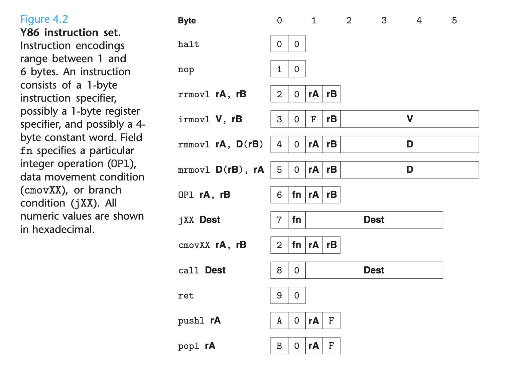

# Ch 4 Processor Architecture

**TLDR**

**

**

**Instruction set architecture** provides a layer of abstraction between the behavior of a processor and how the processor is implemented (API for processor).

**Pipeling **improves the throughput performance of a system by letting different stages operate concurrently.

**Processor Architecture**

A processor must execute a sequence of instructions, where each instruction performs some primitive operation. The instructions supported by a particular processor and their byte-level encodings are known as the **instruction-set architecture (ISA)**.

The ISA provides a conceptual layer of abstraction between compiler writers, who need only to know what instructions are permitted and how they are encoded, and processor designers who must build machines that execute the instructions.

In this chapter we are going to work with a somewhat simplified ISA made up by the instructors called Y86.

Every instruction has an initial byte identifying the instruction type. This byte is split into two 4-bit parts:

1. The high-order or 
2. The low-order or

Each of the eight program registers has an associated register identifier. The program registers are stored within the CPU in a **register file**, a small random-access memory where the register IDs serve as addresses.

One important property of any instruction set is that the **byte encodings must have a unique interpretation**. An arbitrary sequence of bytes either encodes a unique instruction sequence or is not a legal byte sequence.

**Complex Instruction Set Computer** (**CISC**) is a more complicated instruction set than a **Reduced Instruction Set Computer (RISC)**.

CISCs

* Have a large number of instructions
* Have some instructions with long execution times
* Have variable length encodings
* Have multiple formats for specifying operands
* Have stack-intensive procedure linkage

RISCs

* Have many fewer instructions, typically less than 100
* Have no instructions with long execution time
* Have fixed-length encodings
* Have simple addressing formats
* Have register-intensive procedure linkage

In Y86, the status code describes the overall state of an executing program. For Y86, the processor stops executing instructions when it encounters an exception. In a more complete design the processor would typically invoke an exception handler, a procedure designated to handle the specific type of exception encountered.

**Logic Design and HCL**

Most contemporary circuit technology represents different bit values as high or low voltage on signal wires.

Three major components are required to implement a digital system

1. **Combinational logic**
2. **Memory elements**
3. **Clock signals**

**Logic gates** are the basic computing elements for digital circuits. By assembling a number of logic gates into a network, we can construct computational blocks known as **combinational circuits**.

A **multiplexor** is a combinational gate that selects a value from among a set of different data signals, depending on the value of a control input signal. 

By assembling large networks of logic gates, we can construct combinational circuits that compute much more complex functions. Circuits are typically designed to operate on **data words**, groups of bit-level signals that represent an integer or some control pattern.

Combinational circuits to perform word-level computations are constructed using logic gates to compute the individual bits of the output word, based on the individual bits of the input word.

The word-level multiplexor above consists of 32 identical subcircuits, each having a structure similar to the one bit multiplexor from earlier. Multiplexors are often used in processor designs because they allow us to select a word from a number of sources depending on some control condition.

**Memory and Clocking**

Combinational circuits, by their very nature do not store any information. Instead they react to signals at their inputs, generating an output. 

To create **sequential circuits**, systems that have state and perform computations on that state, we must introduce devices to store information.

The storage devices are all controlled by a single **clock**, a periodic signal that **determines when new values are to be loaded into the devices**.

We will talk about two memory devices

1. **Clocked registers**
2. **Random-access memories **

The word **register** means two slightly different things when speaking about hardware versus machine-level programming. In hardware, a register is directly connected to the rest of the circuit by its input and output wires. In machine-level programming, the registers represent a small collection of addressable words in the CPU.

**Sequential Processing**

**Processing an instruction involves a number of steps**

* **Fetch**
* **Decode **
* **Execute**
* **Memory**
* **Write back**
* **PC update**

The processor loops indefinitely, performing these stages.

**Pipelining**

In a pipelined system, the task to be performed is **divided into a series of discrete stages**. A key feature of pipelining is that it **increases the throughput** of the system, but it also may slightly i**ncrease the latency** of the system, the time required to service an individual customer.

The transfer of the instructions between pipeline stages is controlled by a clock signal. There are some factors that arise to diminish the effectiveness of pipelining

The rate at which we can operate the clock is limited by the delay of the slowest stage, thus **nonuniform stages can slow down pipelines**.

Devising a system into a series of stages having uniform delays can be a major challenge for hardware designers.

Another limitation is dividing stages into sequences of shorter and shorter stages, known as **deep pipelining**. In these situations, we can improve the throughput, but we are limited by register updating.

Modern processors employ very deep pipelines, up to 15 or more stages in an attempt to maximize the processor clock rate.
