# Ch 5 Optimizing Program Performance

**TLDR**

Compilers can generate efficient code, but much can be done by an application programmer to assist the compiler. No compiler can replace an inefficient algorithm with a good one. 

Understanding how the microarchitecture of a processor works can lead to tuning performances beyond the basic levels.

**Performance Realities**

The primary objective of writing a program is to make it work **under all possible conditions**.

Writing an efficient program requires several types of activities.

1. Selecting 
2. Writing source 
3. A third technique for dealing with demanding computations is to divide a task into portions that can be 
4.

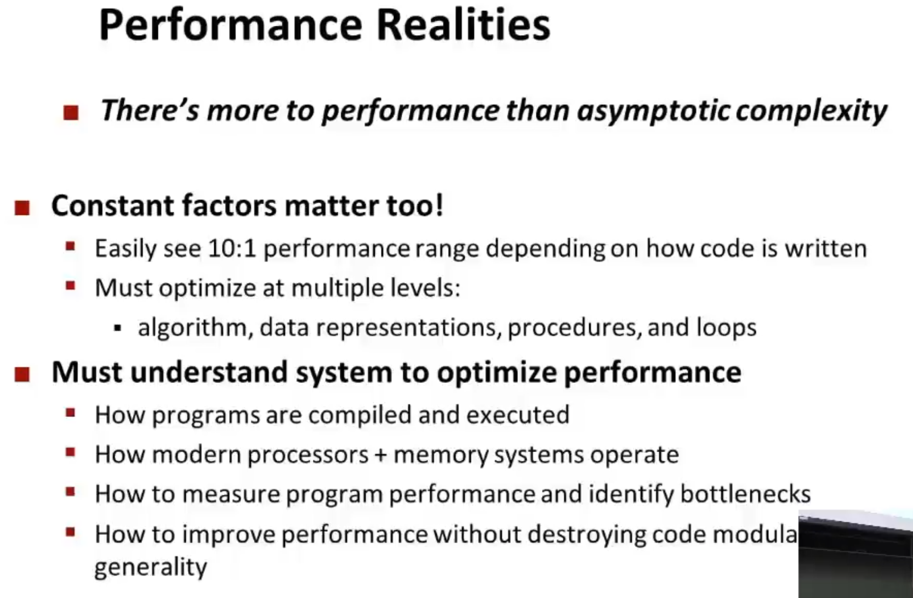

Modern compilers employ sophisticated forms of analysis and optimization, but even the best compilers can be thwarted by aspects of the program's behavior that depend strongly on the programs execution environment.

The first step in optimizing a program is **eliminating unnecessary work.** This often includes eliminating unnecessary functional calls, condition tests and memory references.

**Code profilers** are tools that measure the performance of different parts of a program that can highlight inefficiencies.

A good starting strategy for creating efficient code is to study the assembly code representation of the program and look at the inner loops, identifying performance reducing attributes such as excessive memory references and poor use of registers.

Compilers must be careful to apply only **safe optimizations** to a program, meaning the resulting program will have the exact same behavior as would an unoptimized version for all possible cases the program may encounter.

The case where two pointers may designate the same memory location is known as **memory aliasing** and in performing only safe optimizations, a compiler must assume that different pointers may be aliased. This can limit compiler optimization.

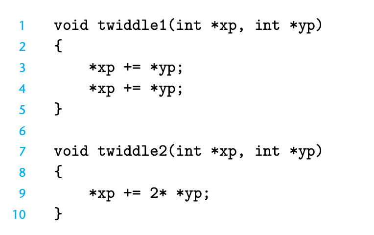

If the pointers are referencing the same location in memory, the value will be quadrupled in the first function and tripled in the second. 

A second optimization blocker is due to function calls. 

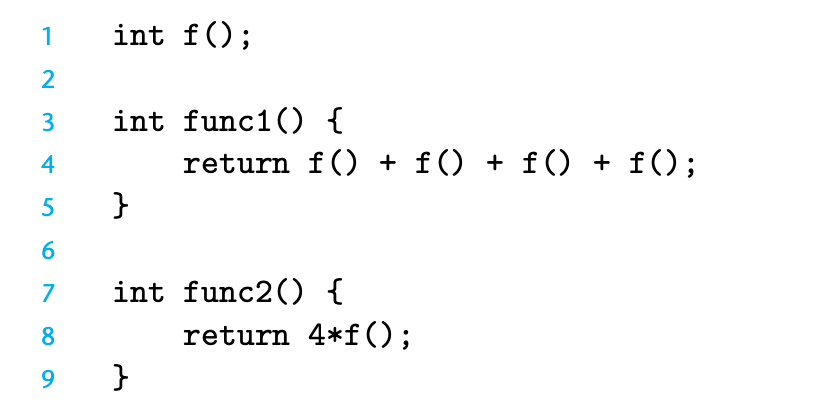

It's tempting to generate code in the style of func2, when given func1 as the source. 

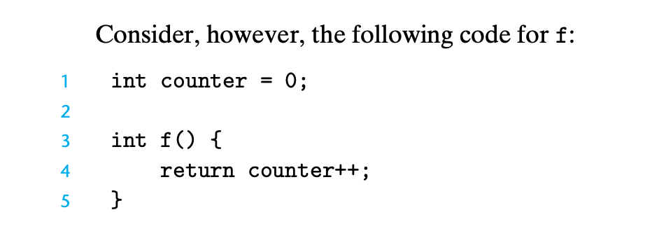

This function has a** side effect**, it modifies some part of the global program state. A call to func1 would result in 6, but a call to func2 would result in 0. **Most compilers do not try to determine whether a function is free of side effects**.

Code involving function calls can be optimized by a process known as **inline substitution**, where the function call is replaced by the code for the body of the function.

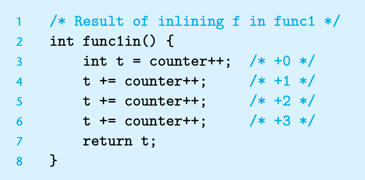

**Expressing Program Performance**

**Cycles per element (CPE) ** is a way to express program performance in a way that can guide us in improving code. Measurements of CPE help to understand **loop performance of an iterative program**. It is appropriate for programs that perform repetitive computation.

The sequencing of activities by a processor is controlled by a clock providing a regular signal of some frequency. This frequency is usually expressed in Gigahertz, billions of cycles per second. From a programmer's perspective it is instructive to express measurements in clock cycles, that way the measurements express how many instructions are being executed rather than how fast the clock runs.

So how does CPE work, let's do an example. We are going to compute the prefix-sum.

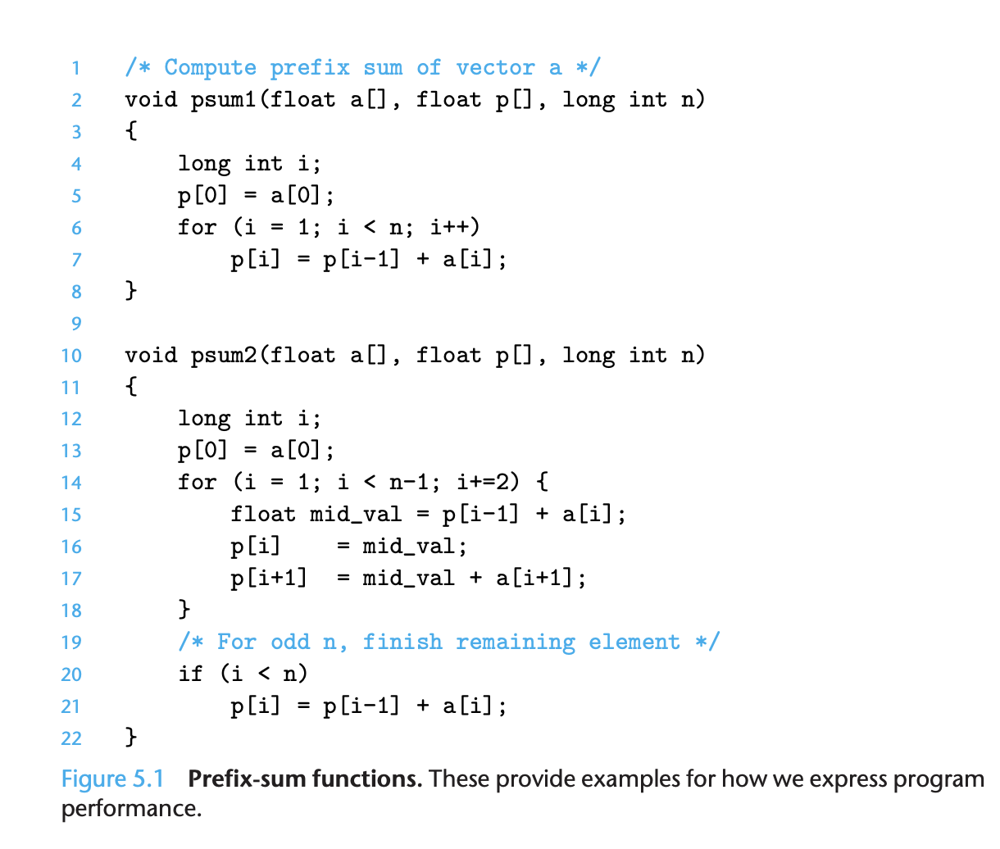

As you can see, all this function does is iterate through an array and add the previous running sum to the current element. The second version of the program uses a technique called **loop unrolling**, which computes two elements per iteration.

Loop unrolling improves performance by reducing the number of operations that do not contribute directly to the program result, such as loop indexing and conditional branching.

The time required by such a procedure can be characterized as a constant plus a factor proportional to the number of elements processed.

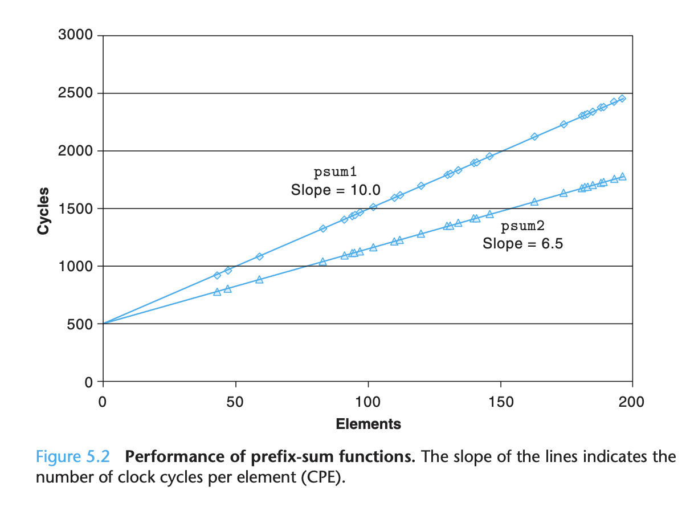

These two equations indicate an overhead of ~500 instruction cycles to initiate the procedure plus a linear factor of 6.5 or 10.0 cycles per element. We **refer to this coefficient as the effective number of CPE**.

Only one type of processor should be used for performance measuring, which kind doesn't matter (although preferably it is the one the code will be running on), as long as it is consistent. This machine is referred to as the **reference machine**.

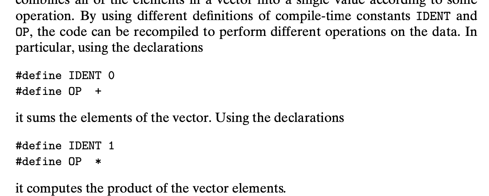

**Eliminating loop inefficiencies**

**

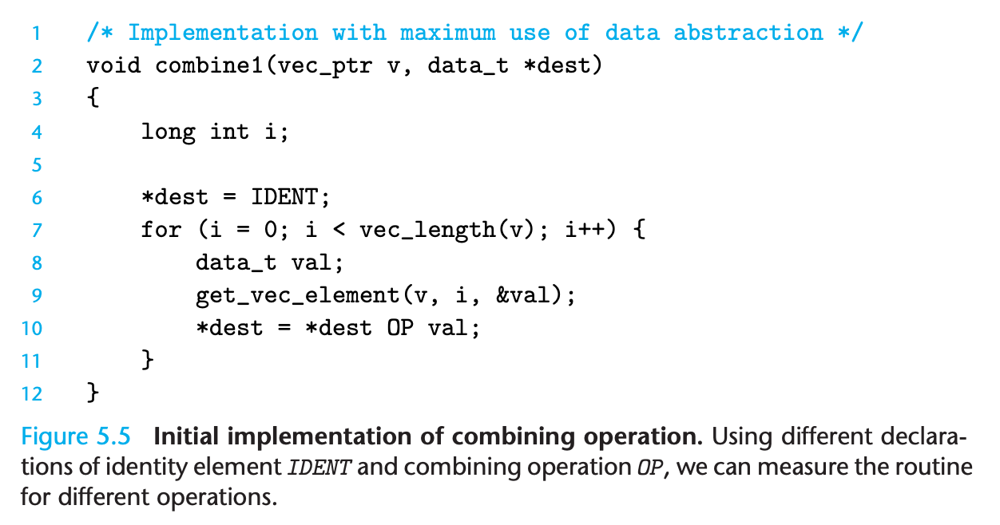

**

Recall how loops are turned into machine code, the **test condition must be evaluated on every iteration of the loop**. In the example above, the length of the vector does not change as the loop proceeds. We can therefore eliminate a O(n) cost to our algorithm. 

**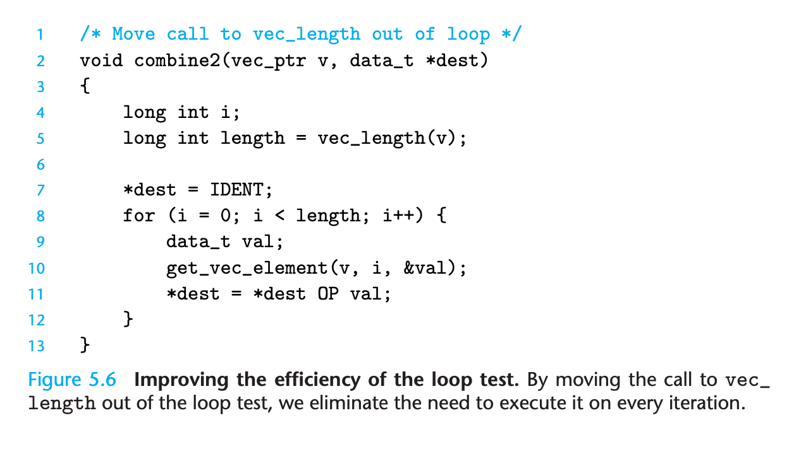

****

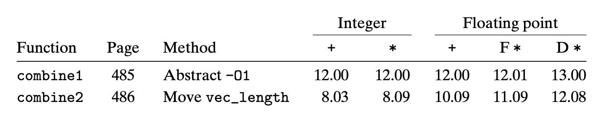

**

This optimization is an instance of a general class of optimizations known as **code motion**. They involve **identifying a computation that is performed multiple times, but such that the result of the computation will not change**. Optimizing compilers try to perform code motion, but are often conservative because they can't predict side-effects.

This example illustrates a common problem in writing programs, in which a seemingly trivial piece of code has a hidden asymptotic inefficiency.

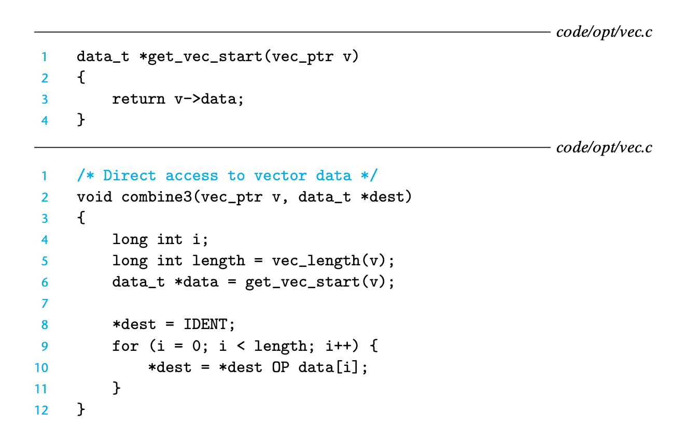

**Procedure calls can incur overhead and also block most forms of program optimization**. IN the improvement above, we replaced a call to get_vec_element with a direct access of the array. The code is less clean, but it is certainly faster. When optimizing code sometimes you have to compromise readability.

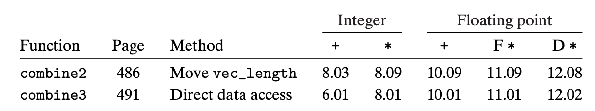

One of the trickier optimizations is **eliminating unneeded memory references**. Let's look at the assembly code generated for the loop on lines 9-11 for combine3. This code accumulates the value being computed by the combining operation at the location designated by the pointer dest. 

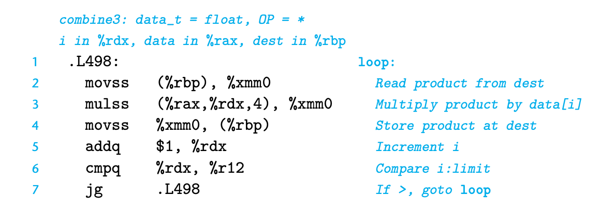

Notice that on each iteration, the program reads the value at %rbp, multiples it by data[i] and stores it back into %rbp. This reading and writing is wasteful since the value read from dest at the beginning of each iteration should simply be the value written at the end of the previous iteration. Let's **introduce a temporary variable** to eliminate this reading and writing.

Here's our optimized code.

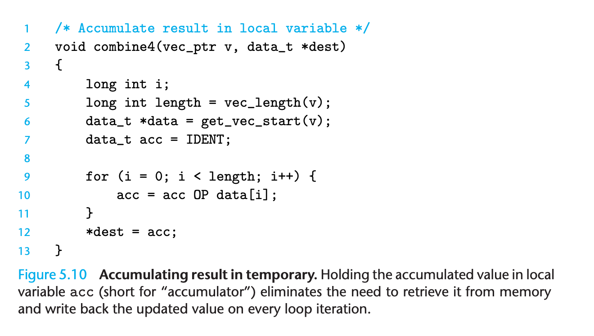

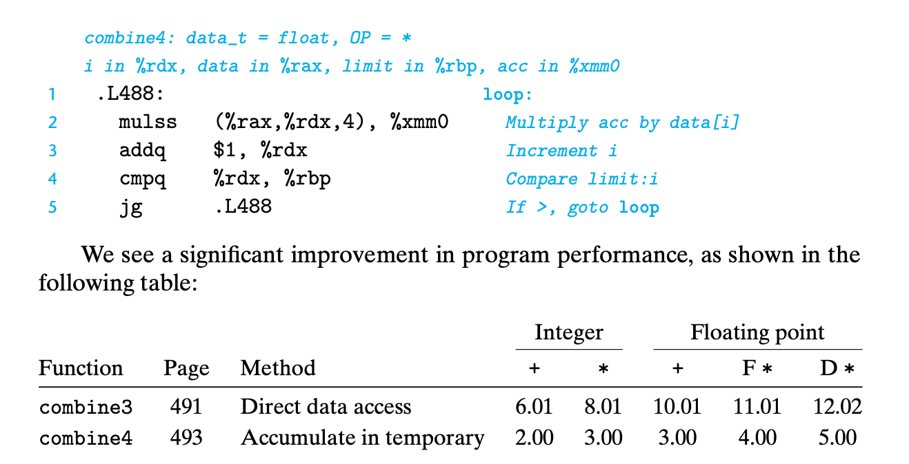

**Using Understanding of Processors**

Some performance measures come from optimizations that exploit the **microarchitecture of the processor**, the underlying system design by which a processor executes instructions.

Be aware the the detailed performance results that you get through these optimizations might not hold for other machines.

Actual operation of computers looks far different than one would assume looking at machine-code. For instance, at code level, it appears as if instructions are executed one-at-a-time. In reality, a number of instructions are evaluated simultaneously, this is called **instruction-level parallelism**. 

Elaborate mechanisms are employed to make sure the behavior of this parallel execution exactly captures the sequential semantic model required by the machine-level program.

Two guidelines for thinking about performance in the microarchitecture level are

1. **The latency bound**
2. **The throughput bound**

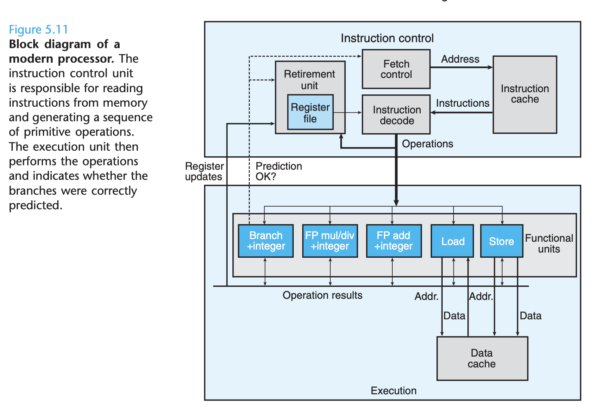

Above is a simplified view of a modern microprocessor. It is of the Nehalem design, and it is described as being

* **superscalar**
* **out-of-order**

The overall design has two main parts

1. **Instruction Control Unit (ICU)**
2. **Execution Unit (EU) - **

The ICU reads instructions from an **instruction cache, **a special high-speed memory containing the most recently accessed instructions. In general, the ICU **fetches well ahead of the currently executing instructions** so it has time to decode them.

The processor runs into trouble when it hits a branch (a conditional jump instruction). Modern processors use **branch prediction** to guess whether or not a branch will be taken and also to predict the target address for the branch. 

Using a technique known as **speculative execution**, the processor begins fetching and decoding instructions at where it predicts the branch will go, and even begins executing these operations before it has determined whether or no the branch prediction was correct. If it later determines that the branch was predicted incorrectly, it resets the state to that at the branch point and begins fetching and executing instructions in the other direction. In the figure above, it is the block labeled "Fetch Control" which incorporates branch control.

**Instruction decoding logic** takes the actual program instructions and converts them into a set of primitive operations which perform some simple computational task like adding two number, reading data from memory, or writing data to memory. The details of how instructions are decoded into sequences of more primitive operations varies between machines and this information is considered highly proprietary.

The EU can typically receive a number of instructions each clock cycle. These instructions are dispatched to a set of **functional units** that perform the actual operations.

The **load and store units** implement reading and writing memory. They access memory via a data cache, a high-speed memory containing the most recently accessed data values.

**With speculative execution**, the operations are evaluated, but the final results are not stored in the program registers or data memory until the processor can be certain that these instructions should actually have been executed. **Branch operations are sent to the EU, not to determine where the branch should go, but rather to determine whether or not they were predicted correctly** (the work was done beforehand). If the prediction was incorrect, the EU will discard the results and begin fetching the correct instructions.

Within the ICU, the **retirement unit** keeps t**rack of the ongoing processing** and makes sure that it obeys the sequential semantics of the machine-level program. The register file is inside the retirement unit, and it controls updating the file. 

Functional units can be classified by their throughput. A fully pipelined functional unit can do one operation per clock cycle, units that cannot do one operation per clock cycle, will have a lower throughput.

Often times, program optimization at the architecture level comes from** figuring out ways to break sequential dependency of instructions**. This typically occurs through finding operations that are commutative and associative and improving the performance by splitting the set of combining operations into two or more parts, ie **parallelism**. 

Compare these two optimized functions, one which just exploits loop unrolling, and the other that uses parallelism.

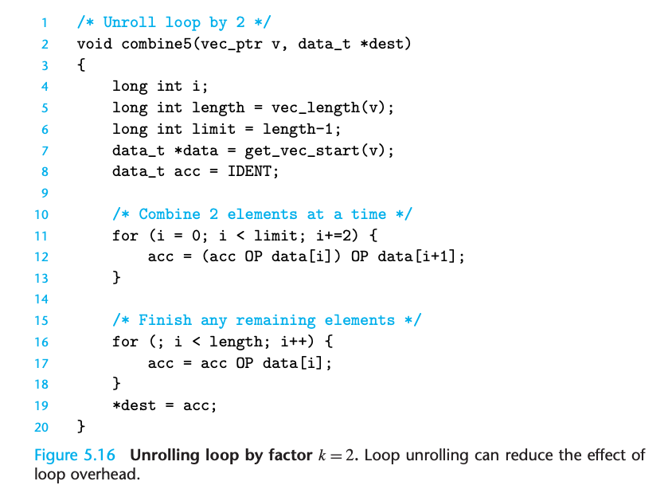

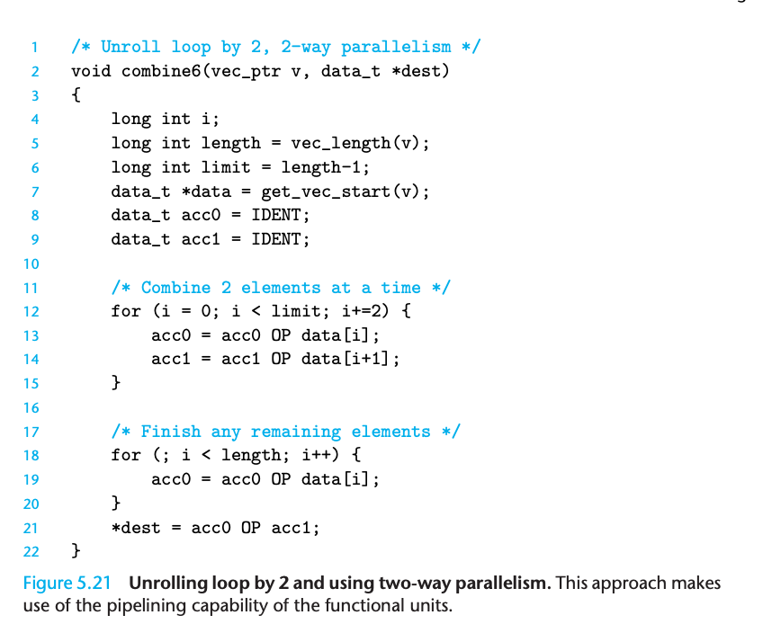

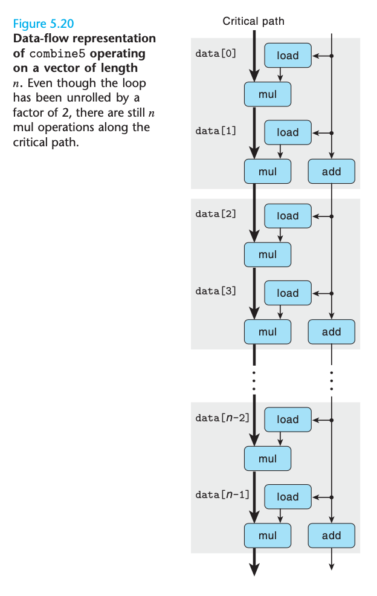

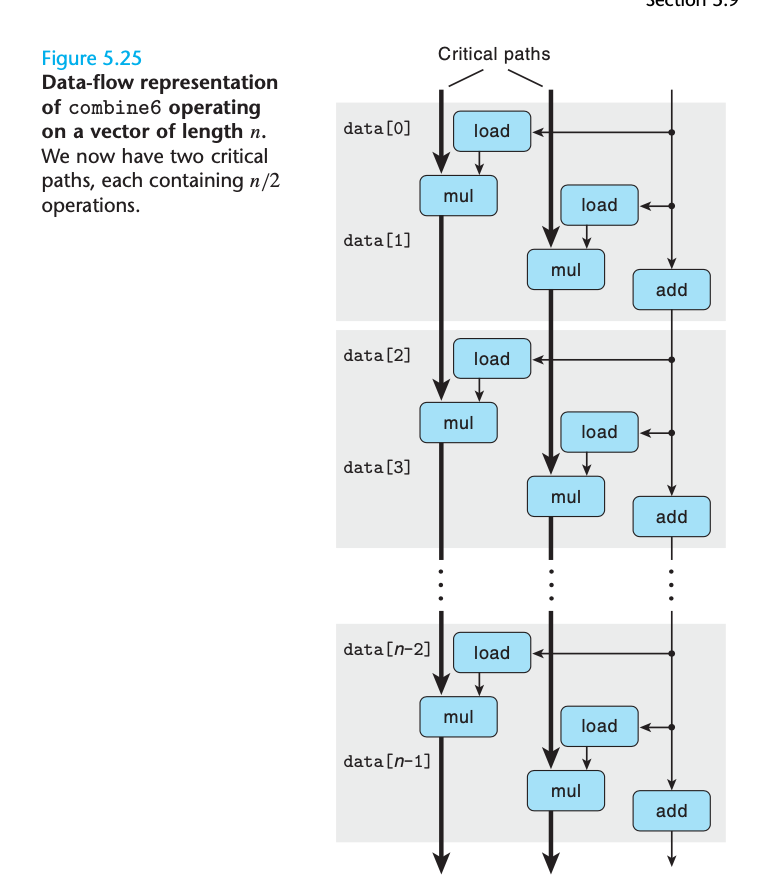

The idea behind **SIMD, Single-Instruction, Multiple-Data **is that some registers, notably XMM registers can hold multiple values. If we include multiple values in these registers we can compute **multiple vector operations on this register in parallel**.

**Speculative Execution and Conditional Move Instructions**

Modern processors work well ahead of the currently executing instructions, reading new instructions from memory and decoding them to determine what operations to perform on what operands. In a processor that employs speculative execution, the processor begins executing the instructions at the predicted target branch target. It does this in a way that avoids modifying any actual register or memory locations until the actual outcome has been determined. The basic idea of using conditional moves is to compute the values along both branches so that you don't get a branch prediction penalty.

For inherently unpredictable branch cases, program performance can be greatly enhanced if the compiler is able to generate code using conditional data transfers rather than conditional control transfers.

We didn't talk much about memory efficiency but the following is important to remember.

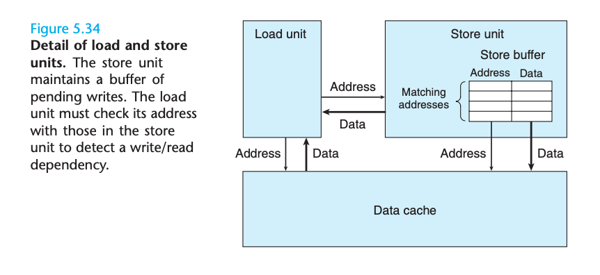

Up to this point we have only considered optimizing small programs, where there is some clear place int he program that limits its performance. When working with large programs, even knowing where to focus optimization efforts can be difficult. **Code profilers** are analysis tools that collect performance data about a program as it executes. Profilers work by **running a version of a program in which instrumentation code has been incorporated to determine how much time the different parts of the program require**.

**Profiling requires that the program is compiled and linked for profiling**. With GCC, this involves simply including the run-time flag -pg. 
