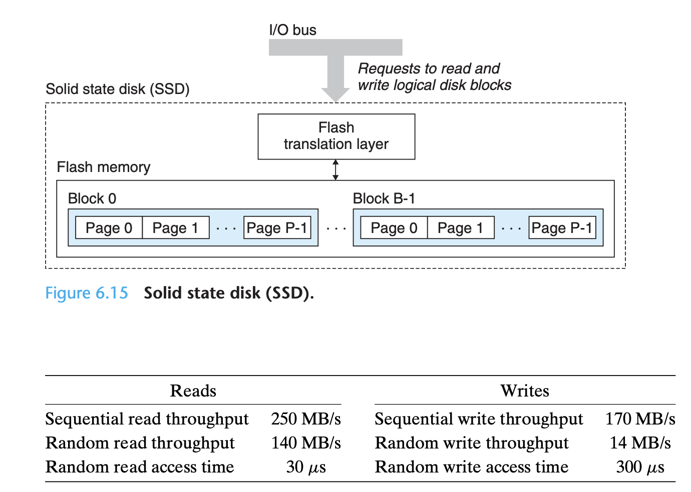
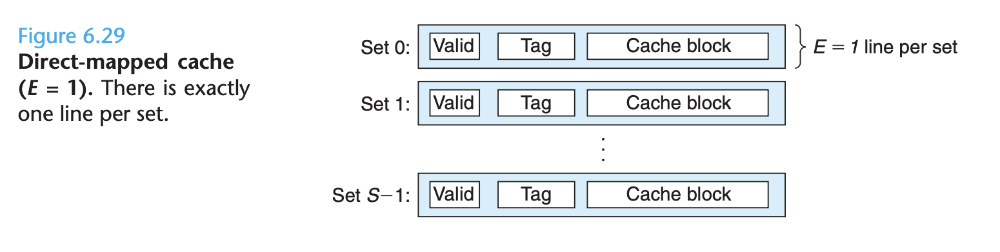

# Ch 6 The Memory Heirarchy

**TLDR**

**

**

The basic storage technologies are

1. **Random-access memories**
    1. **Static RAM (SRAM)**
    2. **Dynamic RAM (DRAM)**

2. **Nonvolatile memories (ROMs)**
3. **Disks**

Systems bridge the difference in speed between storage devices by organizing memory as a hierarchy of storage devices, with smaller, faster devices closer to the CPU, and slower devices farther away.

**

**

**Memory Hierarchy**

Up to this point, we've talked about memory as a linear array of bytes and acted like the CPU can access each memory location in a constant amount of time. While this is an effective model for learning, it does not reflect reality


A memory system is a hierarchy of storage devices with different capacities, costs and access times.

1. **CPU registers**
2. **Cache memories**
3. **Main memory**
4. **Disks**

Memory hierarchies work because well-written programs tend to access the storage at any particular level more frequently than they access the storage the lower level.

If you understand how the system moves data up and down the memory hierarchy, then you can write your application programs so that their data items are stored higher in the hierarchy, where the CPU can access them more quickly. This idea centers around a fundamental property of computer programs known as **locality**.

Programs with good locality tend to access more data items from upper levels of the memory hierarchy and thus run faster.

**Storage Technologies**

**Random-access memory (RAM) 🐏  **comes in two varieties:

1. **Static RAM (SRAM)**
2. **Dynamic RAM  (DRAM)**


SRAM stores each bit in a bistable memory cell, which is composed of a six-transistor circuit. DRAM stores each bit as a charge on a capacitor. SRAM is persistent as long as power is applied. Unlike DRAM, no refresh is necessary and it is not sensitive to disturbances such as light and electrical noise. The trade off is the it uses more transistors and thus have lower density, is more expensive and consumes more power.


The cells in a DRAM chip are partitioned into supercells, each consisting a number of DRAM cells. Information flow sin and out of the chip via external connectors called pins.

DRAM chips are packaged in **memory modules** that plug into expansion slots on the main system board. Common packages include the 168 pin dual inline memory module, which transfers data to and from the memory controller in 64-bit chunks. 

The basic idea of a memory module is of parallel use of DRAM chips. To retrieve a 64-bit doubleword at memory address A, the memory controller converts A to a supercell address (i,j) and sends it to the memory module which then **broadcasts** i and j to each DRAM. In response, each DRAM outputs the 8-bit (or however large the cell is) contents of its i,j supercell. It then returns these combined bits to the memory controller.


DRAMS and SRAMS are **volatile** in the sense that **they lose information if the supply voltage is turned off.**

There are a variety of nonvolatile memories, for historical reasons, they are referred to collectively as **read-only memories**, even though some types of **ROMS** can be written as well as read. ROMS are distinguished by the number of times they can be reprogrammed and by the mechanism for reprogramming them.

**Programmable ROM** - can only be programmed exactly once. 

**Erasable Programmable ROM** - allows writes, electrically erasable proms (EEPROM) are popular, Flash memory is based on EEPROMS.

Programs stored in ROM devices are often referred to as **firmware**. 

**Accessing Main Memory**

Data flows back and forth between the processor and the DRAM main memory over shared electrical conduits called **buses**. 

1. Read transaction - transfers data from the main memory to the CPU
2. Write transaction - transfers data from the CPU to main memory.

A bus is a collection of parallel wires that carry address, data, and control signals. Depending on the bus design, data and address signals can share the same set of wires.


The** I/O bridge is a chipset** (includes the memory controller) that exists outside of the CPU that translates the electrical signals of the system bus into the electrical signals of the memory bus. We will see later, it also connects the system bus to the I/O bus.

Consider what happens when the CPU performs a load operation where the contents of address A are loaded into register %eax.

```
mov1 A, %eax
```

Circuity on the CPU chip called the bus interface initiates a read transaction which consists of three steps.


The store operation is much the same but in reverse.

**Disks**

Disks are workhorse storage devices that **hold enormous amounts of data**. However, it **takes on the order of milliseconds to read information from a disk**, a hundred thousand times longer than from DRAM and a million times longer than SRAM.

Disks are constructed from platters, where each platter consists of two sides that are coated in a magnetic recording material. A rotating spindle in the center of the platter spins the platter at a fixed rotational rate of between 5400 to 15000 rotations per minute.


Each surface consists of a collection of concentric rings called **tracks**. Each track is partitioned into a collection of **sectors**. Each sector contains an equal number of data bits, typically 512 bytes. Sectors are **separated by gaps** where no data bits are stored. Gaps** store formatting bits that identify sectors**.

The maximum number of bits that can be recorded by a disk is known as its **capacity**.

Disk capacity is determined by the following technology factors

1. **Recording density**
2. **Track density**

Disk manufacturers work tirelessly to increase the **areal density**, the product of the recording density and the track density.


Disks read and write bits store don the magnetic surface using a** read/write head** connected to the end of an actuator arm.

By moving the arm back and forth along its radial axis, the drive can position the head over any track on the surface. This motion is known as a **seek**.

The read/write heads of multiple platter discs are lined up vertically and move in unison. At any point in time, all the heads are positioned on the same cylinder.

Disks **read and write in sector-sized blocks**. The access time for a sector has three main components:

1. **Seek time**
2. **Rotational latenc**
3. **Transfer tim**

The** time to access **the 512 bytes in a disk sector is **dominated by the seek time and the rotational latency**. Since the seek time and rotational latency are roughly the same, twice the seek time is a simple rule for estimating disk access time.

To** hide the complexity from the operating system**, modern disks present a simpler view of their geometry. They present a sequence of B sector-sized **logical blocks**. A small piece of hardware/firmware device in the disk package, called **the disk controller**, which maintains the mapping between the logical block numbers and actual disk sectors.

When the operating system wants to perform an I/O operation such as reading a disk sector into main memory, it sends a command to the disk controller asking it to read a particular logical block number. Firmware on the controller performs a fast table lookup that **translates the logical block number into a (surface, track, sector) triple that uniquely identifies** the corresponding physical sector.

**Input/output devices are connected** to the CPU and main memory using an I/O bus such as Intel's PCI bus. It is **slower** than the system and memory buses, it can accommodate a wide variety of third-party I/O devices.


A **Universal Serial Bus 🚌  (USB)** controller is a conduit for devices attached to a USB bus, which is a widely popular standard for connecting peripheral I/O devices.

A **graphics card **contains hardware and software logic that is responsible for painting the pixels on the display monitor on behalf of the CPU.


The graphics above demonstrate how disks are accessed.

1. First the CPU issues a command to I/O devices using a technique called 
2. Once the disk controller receives the read command from the CPU, it translates the logical block number to a sector address, reads the contents of the sector, and transfers the contents directly to main memory, without any intervention from the CPU. This process, whereby 
3. After the DMA transfer is complete and the contents of the disk sector are safely stored in main memory, the disk controller notifies the CPU by sending an interrupt signal to the CPU. This causes the CPU to stop what it is currently working on and jump to an OS system routine.

Most disks have **spare sectors** that form a pool of spare cylinders. If the recording material on a sector goes bad, the disk controller will **automatically remap the logical blocks on that cylinder to an available spare**. Thus, logical blocks not only provide a simple interface to the OS, but provide a level of **indirection** that allows the disk to be **more robust**.

**Solid State Disks (SSD)** is a storage technology, based on flash memory.



The flash memory chips replace the mechanical drive in a conventional rotating disk, and a flash translation layer is the firmware the plays the role as a disk controller, translating requests for logical blocks into accesses of the underlying memory.

SSDs have a number of advantages over rotating disks. 

1. They are built of semiconductor memory, with no moving parts, and thus have much faster random access times than rotating disks, 
2. use less power
3. are more rugged.

The disadvantages are that

1.  SSDs have the potential to wear out, although clever use of the flash translation layer attempts to maximize the lifetime of each block. 
2. They are about 100 times more expensive per byte than rotating disks.

**Locality**

Well-written computer programs tend to exhibit good **locality.** That is they tend to reference data items that are near other recently referenced data items.

Locality is typically described as having two distinct forms:

1. **Temporal Locality**
2. **Spatial Locality**

**Programs with good locality run faster than programs with poor locality.**

All levels of modern computer systems, from the hardware, to the operating system, to application programs, are designed to exploit locality.

A **cache** is a small, fast storage device that acts as a** staging area** for the data objects stored in a larger, slower device.

The central idea of the memory hierarchy is that for each level, the faster and smaller storage device at the upper level is a cache for the larger and slower storage device below it.

At any point in time, the cache contains copies of a subset of blocks, contiguous chunks of data objects, from the lower level.


When a program needs a particular data object, it first looks in the cache. If the object is there, it reads the data object directly from the cache, this is known as a **cache hit**.

If the data object is not found, then we have what is called a **cache miss**, where the cache fetches the block from the next lower level of memory hierarchy. Once it is found, it is usually saved back in the cache. The process of overwriting an existing block is known as evicting the block. The decision of which block to replace is known as the **cache's replacement policy**.

At each level, some form of logic must manage the cache. This means partitioning the cache storage into blocks, transferring blocks between different levels, and deciding when there are hits and misses and dealing with them. The logic that manages the cache  can be hardware, software or a combination fo the two.

Examples:

1. The compiler manages the register file, the highest level of the cache hierarchy.
2. The caches at levels L1, L2, and L3 are managed entirely by hardware logic built into the caches.
3. With virtual memory, the DRAM main memory serves as a cache for data blocks stored on disk and is managed by a combination of the operating system and address translation hardware on the CPU.

In summary, memory hierarchies based on caching work because slower storage is cheaper than faster storage and because programs tend to exhibit locality.

* Savvy cache replacement logic ensures temporal locality. Subsequent hits will be much faster than the original miss
* Blocks usually contain multiple data objects. We can expect that the copying of a block after a miss will be amortized by subsequent references to other objects within that block.

**Cache Memories**

Because of the increasing gap between CPU and main memory, system designers were compelled to insert a small SRAM cache memory between the CPU register file and main memory.


The registers can be accessed in 1 clock cycle, while the L1 cache can be accessed in 2 to 4 clock cycles. More layers were added, including an L2 and an L3 cache.

A cache is composed of sets, which are further organized into lines, which are further broken down into blocks. 

Each data block has a **valid bit** that indicates whether or not the line contains meaningful information, and **tag bits**, which are used to uniquely identify the block stored in the cache line.


How does the cache know whether it contains a copy of the word at address A. The cache is organized so that it can find the requested word by simply inspecting the bits of the address, **similar to a hash table**.

The address into a cache memory is broken up into the three fields shown above.

1. The 
2. The
3. The

Caches are grouped into different classes based on the number of cache lines per set. A cache with exactly one line per set is known as a **direct-mapped cache**. Conflict misses are common in direct map caches, causing perplexing performance issues when there is good locality in programs.



A **set-associative cache** holds more than one cache line per set. Line matching is more involved in set-associative caches because it must check the tags of multiple lines in order to determine if the requested word is set.


In a direct-mapped cache memory, it is an array of values that take an address as input and returns the value stored at that address. An **associative memory**, on the other hand is an array of key, value pairs that take as input a key, and return the key, value pairs that match the input key. A set-associative cache, is a small associative memory where **the keys are the concatenation of the tag and valid bits, and the values are the contents of the block**.


A **fully-associative cache** consists of a single set that contains all of the cache lines.


Line matching and word selection in a fully-associative cache works the same as with a set-associative cache, but the difference in mainly in question of scale. Because the cache circuitry must search all the lines,** A fully associative cache must be small**. One appropriate use case if for **translation lookaside buffers** (TLBs)

Let's talk about **writes**. Suppose we write a word that is already cached, a **write hit**. After the cache updates its copy of the word, what does it do about updating the copy of the word in the next lower level of the hierarchy?

The simplest approach is known as a **write-through**, which immediately writes the word block to the next lower level. While simple to understand, this strategy has the disadvantage of causing bus traffic with every write.

Another approach, **write-back**, defers the update as long as possible by writing the updated block to the next lower level only when it is evicted from the cache.

What about **write misses**?

**Write-allocate** loads the corresponding block from the next-lower level into the cache and then updates the cache block. This exploits spatial locality, but has the disadvantage that every miss results in a block transfer.

**No-write-allocate** bypasses the cache and writes the word directly to the next lower-level.

Write-through caches tend to be no-write-allocate, write-back caches tend to be write-allocate.

**When writing code, assume that your caches are write-back and write-allocate.**

So far, we've assumed that caches only hold program data, but in fact caches can hold instructions as well as data. A cache that holds instructions only is called an **i-cache**, while one that holds only program data is called a **d-cache**. A cache that holds both instructions and data is known as a **unified cache**.


