# Chapter 7 Linking

**TLDR**

**

**

**Linking** is the process of** collecting and combining **various pieces of code and data **into a single file** that can be l**oaded (copied) into memory and executed.**

**

**

Linking can be performed at

1. **compile time **
2. **load time**
3. **run time**

**

**

Linkers manipulate binary files called object files which come in three different forms:

1. **relocatable -**
2. **executable - **
3. **shared - **

The two main tasks of linkers are:

1. **Symbol resolution - **
2. **Relocation - **

**

**

**What is linking?**

**

**

**Linking** is the process of** collecting and combining **various pieces of code and data **into a single file** that can be l**oaded (copied) into memory and executed,**

Linking can be performed at

1. **compile time **
2. **load time**
3. **run time**

Linkers enable **separate compilation**, which allows developer to organize large projects into small modules that can be compiled separately instead of as part of one monolithic source file.

A **compiler driver** invokes the language preprocessor, compiler, assembler and linker for the user. We can invoke the gcc driver by typing the following command:

```
gcc -02 -g -o p main.c swap.c
```

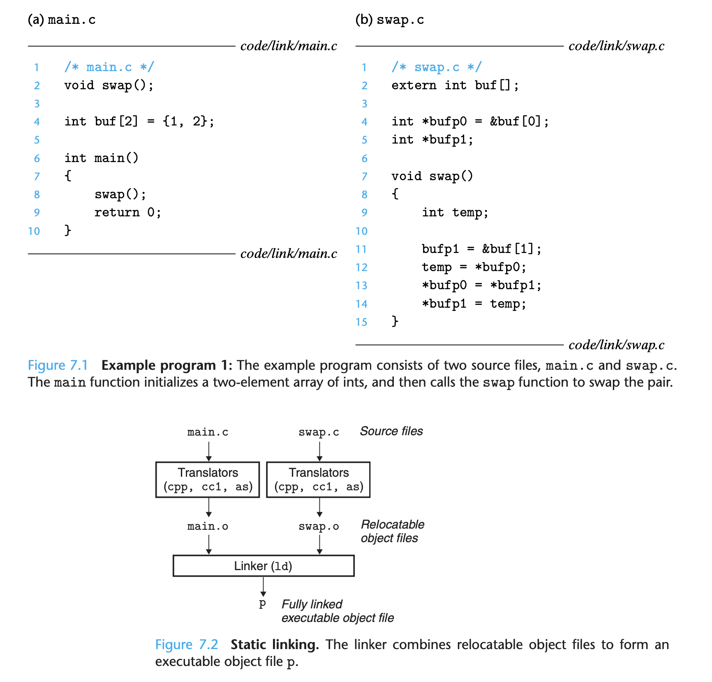

1. The driver first runs the
2. Next, the driver runs the 
3. Then the driver runs the 
4. Repeat the above steps for swap.c
5. Finally it runs the

If you run the executable ./p, the shell invokes a function in the operating system called the **loader**, which **copies the code and data in the executable file p into memory, and then transfers control** to the beginning of the program.

**Static Linking**

**Static linkers** take as input a collection of** relocatable object files** and command-line arguments and generate as output **a fully linked executable object file** that can be loaded and run.

To build the executable, the linker must do two tasks

1. **Symbol Resolution**
2. **Relocation**

Fundamentally linkers concatenate blocks together, decide on run-time locations for the concatenated blocks, and modify various locations within the code and data blocks. Linkers have minimal understanding of the target machine. Compilers and assemblers have done most of the hard work!

**Object Files**

Object files are merely collections of blocks of bytes.

1. **Relocatable Object Fil**
2. **Executable Object File**
3. **Shared Object File**

Compilers and assemblers generate relocatable object files, linkers generate executable object files.

Object file formats vary from system to system, we will discuss the **Unix Executable and Linkable Format (ELF)**

**

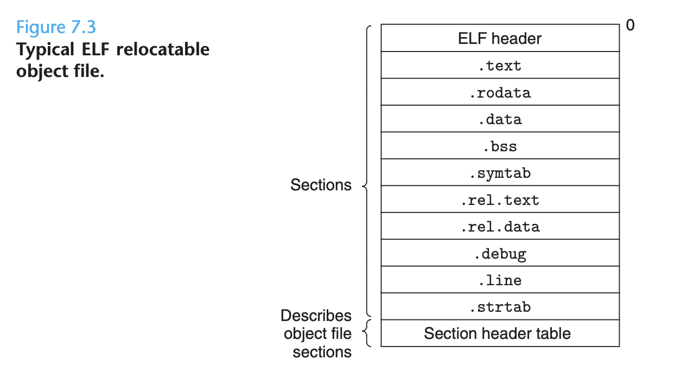

**

* **ELF header**
* **Section header table**

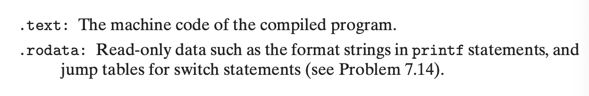

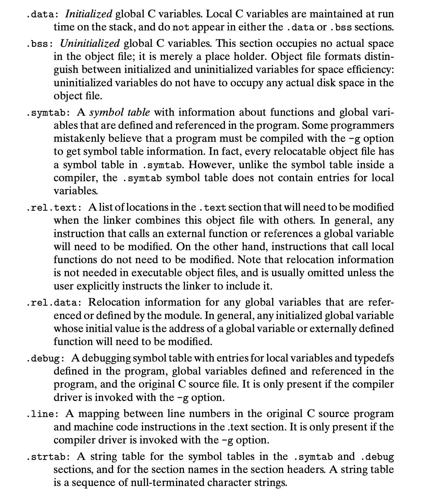

**Symbols and Symbol Tables**

Each relocatable object module has a symbol table that contains information about the symbols that are defined and referenced by the module. There are three kinds.

1. Global Symbols that are defined by the module and can be referenced by other modules. This means non-static C functions and global variables that are defined without the C static attribute.
2. Global symbols that are referenced by the module but defined by some other module. External variables or functions.
3. Local Symbols that are defined and used exclusively by the module. This would mean any variables or functions defined with the static attribute.

It's important to note that the** local linker symbols are not the same as local program variables**! These variables are managed at run time on the stack. Only if you give a local program variable the static attribute will it be managed by the linker.

C programmers use the static attribute to hide variable and function declarations inside modules, much as you would use public and private declarations within Java or C++. **It is good programming practice to protect your variables and functions with the static attribute whenever possible.**

**Symbol tables** are built by assemblers, using symbols exported by the compiler into the assembly language .s file. The following image shows the format of an entry in a symbol table. An ELF symbol table contains an array of these entries.

**

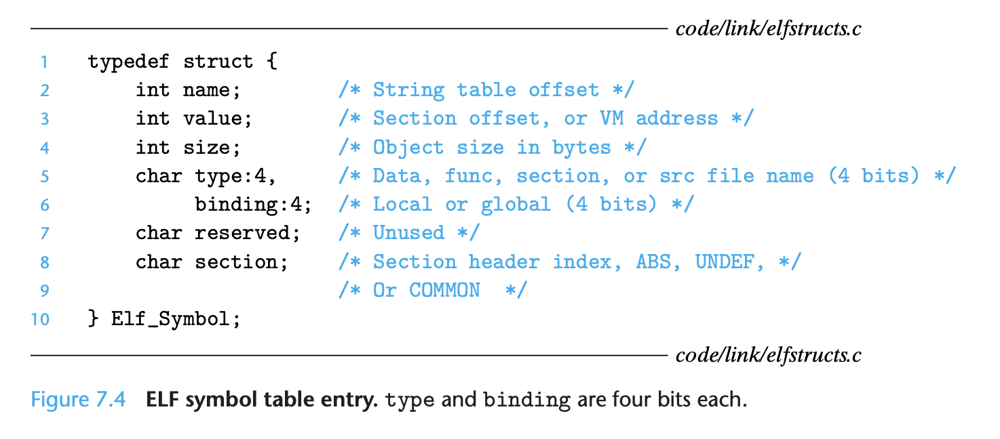

**

The **linker resolves symbol references** by associating each reference with exactly one symbol definition from the symbol tables of its input relocatable object files. This is relatively straightforward for references to local symbols, but tricky for global symbols, because the symbol might not be defined, or because it might be defined by multiple object files. Many nasty bugs can be introduced into code because of the latter issue. To read about how symbol resolution conflicts get resolved, check out p. 662

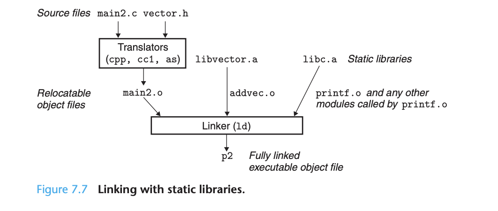

A **static library** is a mechanism for packaging related object modules into a single file, when the linker builds the output executable, it copies only the object modules in the library that are referenced by the application program. This is usually more commonly known as a standard library.

On Unix systems, static libraries are stored on disk in a particular file format known as an **archive**. An archive is a collection of concatenated relocatable object files, with a header that describes the size and location of each member object file.

While static libraries are useful, they are also the source of confusion to programmers because of the way the Unix linkers use them to resolve external references. The algorithm can result in some baffling link-time errors because **the ordering of libraries and object files on the command line is significant**. The general rule for libraries is to place them at the end of the command line.

**Relocation**

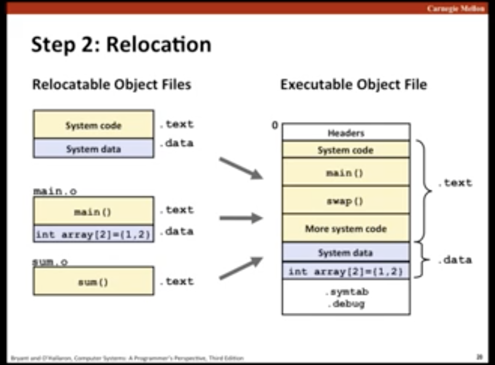

During relocation, the linker merges the input modules and assigns run-time addresses to each symbol. This consists of two steps:

1. **Relocating sections and symbol definitions**
2. **Relocating symbol references within sections**

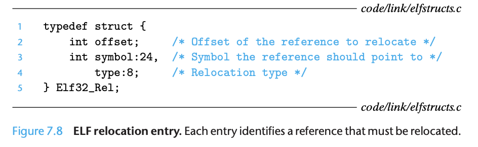

When an **assembler** generates an object module, it **does not know where the code and data will ultimately be stored in memory**. So whenever the assembler encounters a reference to an object whose ultimate location is unknown, it generates a **relocation entry** that **tells the linker how to modify the reference **when it merges the object file into an executable.

Relocation entries are placed in .rel.text, or .rel.data, depending on what kind of data they are.

**Executable Object Files**

The format of an executable object file is similar to that of a relocatable object file. The .text, .rodata, and .data sections are similar except that these sections have been relocated to their eventual run-time memory addresses. The .init function defines a small function that will be called by the program's initialization code. Since the executable is fully linked, it needs no .rel sections.

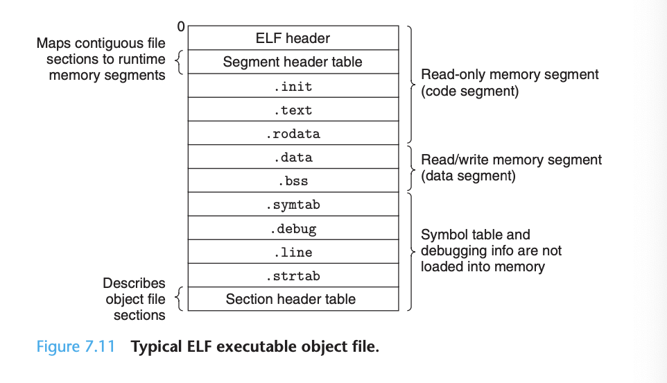

ELF executables are designed to be easy to load into memory, with contiguous chunks of the executable file mapped to contiguous memory segments. This mapping is described by the segment header table.

Any Unix program can invoke the loader by calling the **execve function**. The loader copies the code and data in the executable object file from disk into memory, and then runs the program by jumping to its first instruction (entry point). The process of **copying the program into memory and then running it** is known as **loading**.

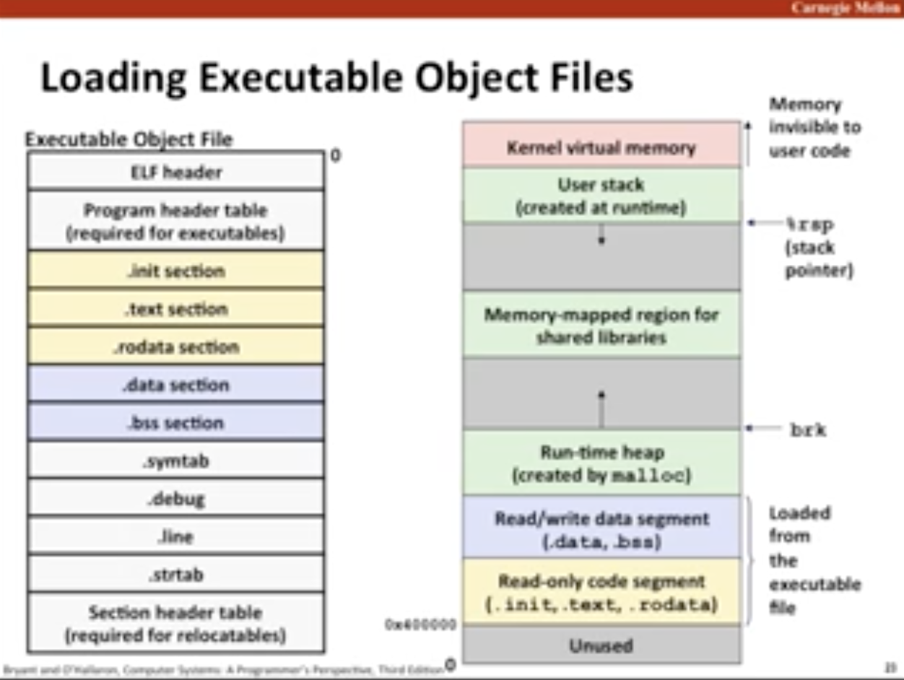

Every Unix program has a** run-time memory image** similar to the one below. 

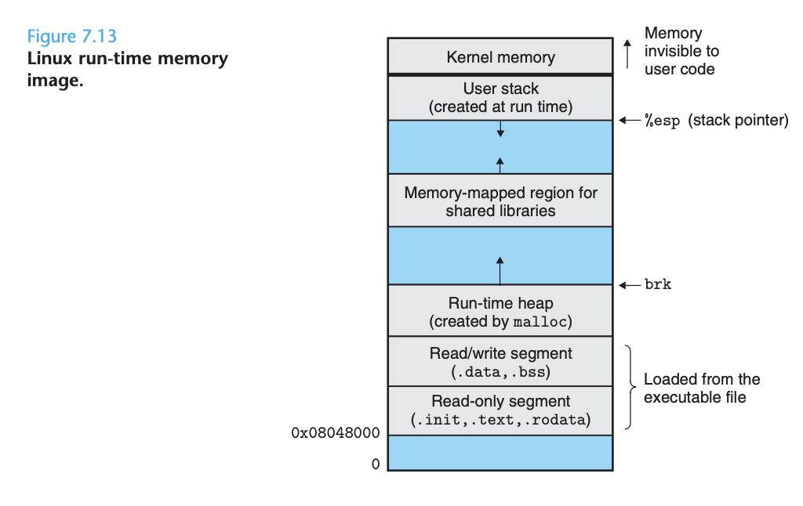

The **program code segmen**t starts at 0x08048000 on 32-bit linux systems, the **data segment** follows at the next 4KB aligned address. 

Next comes the **heap** which **grows up via calls to the malloc library**. The** user stack** always** starts at the largest legal user address** and grows down. Lastly, the segment above the stack is reserved for the code and data in the **memory-resident part of the OS** known as the **kernel**. 

When the loader runs, it creates the memory image above. Guided by the segment header table in the executable, it copies chunks of the executable into the code and data segments. Then it jumps to the program's entry point, which is always the address of the _start symbol. The startup code at the _start address is the same for all C programs.

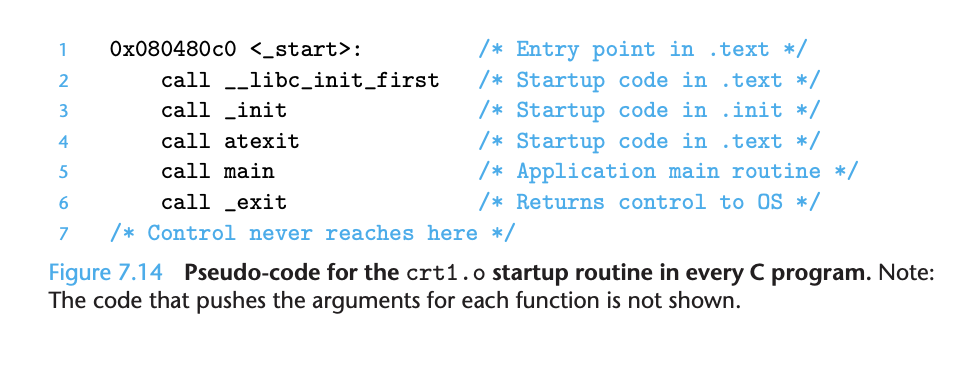

**Dynamic Linking with Shared Libraries**

**Static libraries still have some significant disadvantages** although they address many issues associated with making large collections of related functions available to programs.

The first is that they can significantly waste scarce memory resources because almost every C program uses standard I/O functions such as printf. At run time, **the code for these functions is duplicated in the text segment of every running process**.

A **shared library (shared object)** is an object module that, at run time, can be loaded at an arbitrary memory address and linked with a program in memory. This process is known as **dynamic linking**, and is performed by a program called a **dynamic linker**.

This typically happens by allowing a single copy of the .text section of the shared library in memory to be shared by different running processes.

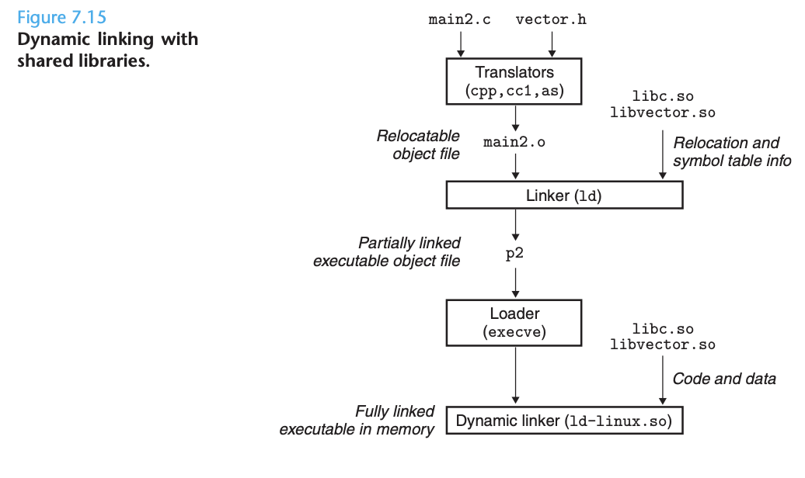

There are a number of tools available on Unix systems to help you understand and manipulate object files.

* **ar**
* **strings**
* **strip**
* **nm**
* **size**
* **readelf**
* **objdump**
