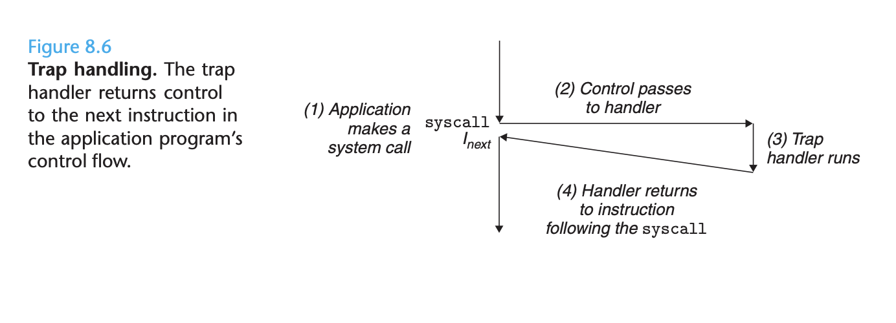
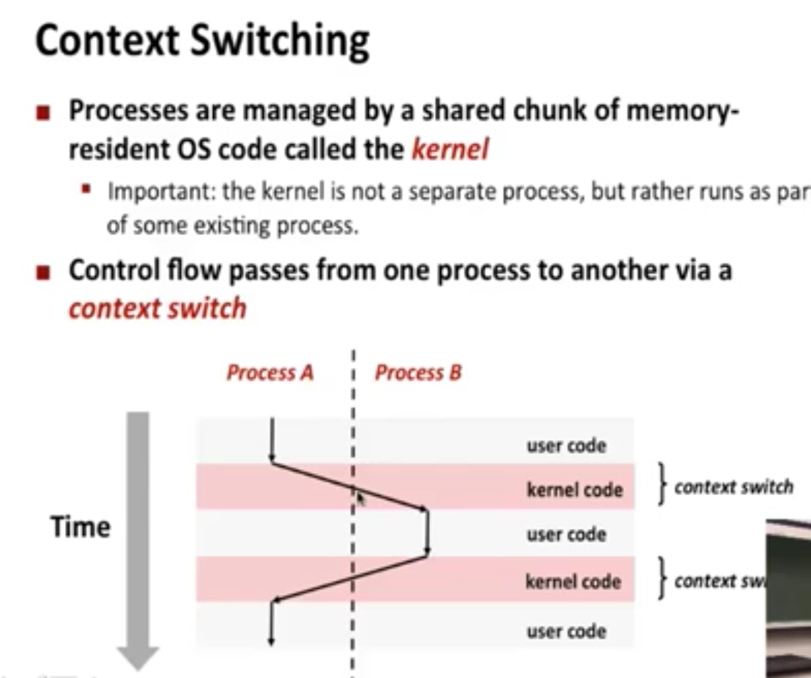
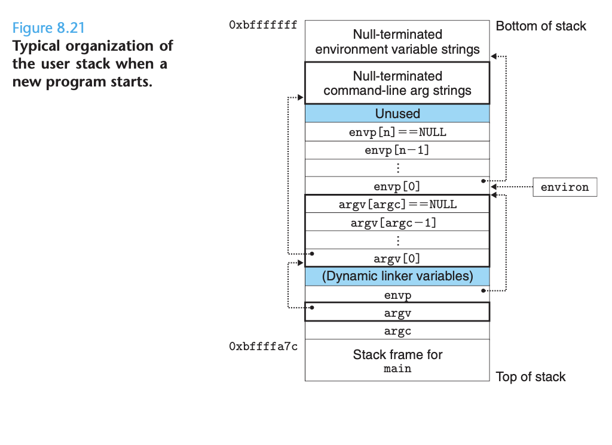

# Ch 8 Exceptional Control Flow

**TLDR**

**

**

**Exceptional control flow (ECF)** occurs at all levels of a computer system and is a basic mechanism for providing concurrency in a computer system.

At the hardware level, exceptions are abrupt changes in the control flow that are triggered by events in the processor. The control flow passes to a software handler which does some processing and then returns control to the interrupted control flow.

Exceptions are divided into **four classes**.

* **Interrupts**
* **Traps**
* **Faults**

At the operating system level, the kernel uses ECF to provide the fundamental notion of the **process**. A process provides applications with two important abstractions.

1. logical control flows that give each program the illusion that it has exclusive use of the processor
2. private address spaces that provide the illusion that each program has exclusive use of main memory.

**

**

**Control Flow**

From the time you first apply power to a processor until the time you shut it off, the program counter assumes a sequence of values. Each transition from one instruction to the next is known as **control transfer**. A sequence of such control transfers is called the **control flow**.


The simplest kind of control flow is smooth and linear, where each instruction is adjacent in memory. Abrupt changes are caused by jumps, calls and returns, which allow programs to respond to internal program logic. But **systems must also be able to react to changes in system state** not captured by internal program variables, and not necessarily related to the execution of the program. 

For example, packets arrive at the network adapter and must be stored in memory, or programs request data from a disk and then sleep until they are notified


Modern systems react to these situations by making abrupt changes in the control flow, we call these abrupt changes **exceptional control flow (ECF)**. 

ECF is important

1. ECF is the basic mechanism behind I/O, processes and virtual memory.
2. Applications request services from the operating system by using a form of ECF known as a 
3. ECF is a basic mechanism for implementing concurrency in computer systems.
4. Programming languages provide software exception mechanisms via try, catch and throw statements. These allow the programs to make


**Exceptions** are a form of ECF that are implemented partly by the hardware and partly by the operating system. An exception is an **abrupt change in the control flow in response to some change in the processor's state**. The state is encoded in various bits and signals inside the processor. The change of state is known as an **event**. An event can be related to the execution of the current instruction, or not!


When the processor detects that the event has occurred, it makes an indirect procedure call (the exception), through a jump table called an **exception table **to an operating system subroutine (the exception handler) that is specifically designed to process this particular kind of event.


**Each type of possible exception in a system is assigned** a unique nonnegative integer **exception number**. Some of these numbers are assigned by the designers of the processor. Other numbers are assigned by the designers of the operating system **kernel** (the memory resident part of the operating system).

* Processor Exceptions: divide by zero, page faults, memory access violations, breakpoints, and arithmetic overflows
* Operating System Exceptions: System calls and signals from external I/O devices.

The exception table is allocated by the OS at system boot time. The exception number executed by the processor is an index into the exception table, whose starting address is contained in a special CPU register called the exception table base register.


An exception is akin to a procedure call but with some differences

* As with a procedure call, the processor pushes a return address onto the stack before branching to the handler. However, depending on the exception, the address is either the current instruction or the next instruction.
* The processor also pushes some processor state onto the stack that will be necessary to restart the interrupted program when the handler returns.

Once hardware triggers the exception, the rest of the work is done in software by the exception handler.

Exceptions are divided into **four classes**.

* Interrupts
* Traps
* Faults
* Aborts


**Interrupts** occur as a **result of signals from I/O devices **that are external to the processor. Exception handlers for hardware interrupts are called **interrupt handlers**.


**How does Interrupt handling work?** After the current instruction finishes executing, the processor notices that the interrupt pin has been flipped, it reads the exception number from the system bus, and then calls the appropriate handler. When the handler returns, it returns control to the next instruction.

**Traps** are intentional exceptions that occur as a result of executing an instruction. They are used to provide a procedure-like** interface** (**System Cal**l) **between user programs the kernel**. User programs often need to request services from the kernel such as reading a file (read), creating a new process (fork), loading a new program (execve), or terminating the current process (exit). 

From a programmer's perspective, a system call is identical to a regular function call. However, their implementations are quite different. Regular functions run in **user mode**, which restricts the types of instructions they can execute, and they access the same stack as the calling function. A system call runs in **kernel mode**, which allows it to execute instructions and accesses a stack defined in the kernel. 



Like an interrupt handler, trap handlers return control to the next instruction.


**Faults **result from** error conditions** that a handler might be able to correct. The fault handler **tries to correct the error condition**, if it succeeds, it r**eturns control to the faulting instruction**, thereby reexecuting it. Otherwise, the handler returns an abort routine in the kernel that terminates the application program that caused the fault.


**Aborts **are the final type of exception, they result from unrecoverable fatal errors, typically hardware errors. Abort handlers never return control to the application program. 


**Processes**

Exceptions are the basic building blocks that allow the operating system to provide the notion of a **process**, one of the most profound and successful ideas in computer science.

A process is **an instance of a program in execution**. Every program in the system runs in the context of some process, which consists of the state that the program needs to run correctly:

1. program's code
2. data stored in memory
3. it's stack
4. contents of the general-purpose registers
5. program counter
6. environment variables
7. set of open file descriptors

Each time a user runs a program by typing the name of an executable object file to the shell, the shell creates a new process and runs the executable object file in the context of this new process.


The **key abstractions that a process provides** to an application are:

1. An independent logical control flow that provides
2. A private address space that provides

Let's look closer at these abstractions...

A process provides each program with the illusion that it has exclusive use of the processor, even though many other programs are typically running concurrently on the system. If we were to use a debugger to inspect the series of program counter values that occurs during execution of a program, we would observe that they would correspond only to instructions that relate to our program, despite the fact that many other programs are running.


The key point is that processes take turns using the processor. Each processor executes a portion of its flow and then is temporarily suspended while others take its turn.

The sequence of PC values that correspond to the instructions of a program is known as a logical flow. A logical flow whose execution overlaps in time with another flow is called a **concurrent flow**, and the two flows are said to run **concurrently**.  In the figure above, A and B run concurrently, as do A and C, but B and C do not run concurrently. 

The general phenomenon of multiple flows executing concurrently is known as **concurrency**. The notion of a process taking turns with other processes is also known as **multitasking**.

If two flows are running concurrently on different process cores or computers, then we say they are parallel flows, and have **parallel execution**. Parallel execution is a subset of concurrent execution.

Another abstraction that processes provide is that each program has **exclusive use of the system's address space**. A process provides each program with its own private address space, meaning that anything written to this space cannot be read or written by any other process.


In order for the operating system kernel to provide an airtight process abstraction, **the processor must provide a mechanism that restricts the instructions that an application can execute, as well as the portions of the address space that it can access**.

Processors typically **provide this capability** with a **mode bit** in a control register that **characterizes the privileges** that the process currently enjoys.  When the **mode bit is set**, the process is running in **kernel mode**. A process in kernel mode can **execute any instruction in the instruction set and access any memory location in the system**. 

When the **mode bit is not set**, the process is running in **user mode**. A process in user mode is **not allowed to execute privileged instructions that do such things as halt the processor, change the mode bit, or initiate an I/O operation**. Nor is it allowed to directly reference code in the kernel area of the address space. User programs must instead access kernel code and data indirectly via the system call interface.



The operating system kernel **implements multitasking** using a **higher-level form of exceptional control flow** known as a **context switch**. Context switching is built on top of exception handling.

Let's put it all together. The kernel maintains a context for each process. The context is the state that the kernel needs to restart a stopped process. 

At certain points during the execution of a process, the kernel can **decide to preempt (stop) the current process and restart a previously stopped process**. This decision is known as **scheduling**, and is handled by code in the kernel known as the **scheduler**.

After the kernel has scheduled a new process to run, it preempts the current process and transfers control to the new process using a mechanism called the **context switch** that: 

1. saves the context of the current process
2. restores the saved context of a previously preempted process
3.  and passes control to the newly restored process.

Context switches can occur while the kernel is executing a system call on behalf of the user. If the system call blocks, it can use a context switch to do some other work. A context switch can also occur as a result of an interrupt. All systems have some mechanism for generating periodic timer interrupts, typically every 1 ms or 10 ms. 

In general, **hardware cache memories do not interact well with exceptional control flows such as interrupts and context switches**. This is because the new process is going to bring entirely new data into the caches.

**Process Control**

**

**

Unix provides a number of system calls for manipulating processes from C programs.

Each process has a** unique positive process ID(PID)**.

* _getpid_
* _getppid_

**A process can be in one of three states**:

1. **Running -**
2. **Stopped -**
3. **Terminated - **
    1. it received a signal whose default action is to terminate the process
    2. returned from the main routine
    3. called the

A parent process **creates a new running child process** by calling the _fork_ function.

The newly created child process is almost, but not quite identical to the parent. It gets an identical (but separate) copy of the parent's user-level virtual address space. The child also gets identical copies of any of the parent's open file descriptors. The most significant difference is they have different PIDs.

The fork function is peculiar in that it is called once, but it returns twice: once in the calling process, and once in the newly created child process. In the parent, _fork_ returns the PID of the child. In the child, _fork_ returns 0. This is an unambiguous way to tell whether the program is executing the parent or the child.


There is only one way to create a process on a linux system, and that is with the fork call. In fact, all running processes form a hierarchy, eventually spawning from the init process. All other processes are descendants of that process. The** init process** spawns daemons for long-running services. A shell takes your input and spawns a child process to compute your command (ex: ls, cd, pwd).

When a **process terminates**, the kernel **does not remove it from the system immediately**. Instead, the process is kept around in a terminated state until it is **reaped** by its parent. When the parent reaps the terminated child, the kernel passes the child's exit status to the parent, and then discards the terminated process.

A terminated process that has not yet been reaped is called a **zombie**.

If the parent process terminates without reaping its zombie children, the kernel arranges for the init process to reap them. 

A process waits for its children to terminate or stop by calling the **waitpid** function or the **wait** function (wait is simpler).

**Loading and Running Programs**

The _**execve**_ function loads and runs a new program in the context of the current program. Execve only returns to the calling program if there is an error, otherwise it never returns. 




**Signals**

**

**

Signals are a higher-level software form of exceptional control flow. They **allow processes and the kernel to interrupt other processes**.


A signal is a small message that notifies a process that an event of some type has occurred in the system. Each signal type corresponds to some kind of system event. **Low-level hardware exceptions are processed by the kernel's exception handlers and would not normally be visible to user processes**. Signals are the mechanism for exposing the occurrence of such exceptions to user processes.

The transfer of a signal to a destination process occurs in two distinct steps:

1. **Sending a signal**
2. **Receiving a signal**


One gotcha about signals is that at any point in time, there can be at most one pending signal of a particular type. If a process has a pending signal of type k, then **any subsequent signals of type k sent to that process are not queued**, they are simply discarded.

A pending signal is received at most once. For each process, the kernel maintains the set of pending signals in the pending bit vector, and the set of blocked signals int he blocked bit vector.

**Sending Signals**

Unix systems provide a number of mechanisms for sending signals to processes. All of these mechanisms rely on the notion of a **process group**.

Every process belongs to one process group, which is identified by a positive integer, the process group ID. By default, a child process belongs to the same process group as its parent.

* **getpgrp**

* **setpgid**

The terribly named **kill** program sends an arbitrary signal to another process. It is terribly named because it can send any signal to another process, not just a terminate signal.

```
kill -9 15213
```

will send signal 8 (SIGKILL) to process 15213

A negative PID causes the signal to be sent to every process in process group PID

```
kill -9 -15213
```

**What about CTRL-C?**

Let's talk about the **Unix shell**, it uses the **abstraction of a job** to represent the processes that are created as a result of evaluating a single command line. At any point in time, there is at most one foreground job and zero or more background jobs.

```
ls | sort
```

Creates a foreground job consisting of two processes connected by a Unix pipe. The shell creates a separate process group for each job. Typing ctrl-c at the keyboard causes a SIGINT signal to be sent to the shell. The shell catches the signal and then sends a SIGINT to every process in the foreground process group.

**Receiving Signals**

**

**

When the kernel is returning from an exception handler and is ready to pass control to a process, it checks the set of unblocked pending signals for process p. If this set is empty, then the kernel passes control to the next instruction in the logical control flow of the process.


However, if the set is nonempty, then the kernel chooses some signal in the set and forces p to receive the signal. The receipt of the signal triggers some **action** by the process. There is **a default action associated with each type of signal**. For example, the default action of SIGKILL is to terminate the receiving process.

A process can **modify the default action** associated with a signal by using the **signal function**. 

**Tools for manipulating processes**

**

**

* **strace -**
* **ps - **
* **top -**
* **pmap -**
* **/proc**
    * cat /proc/loadavg
