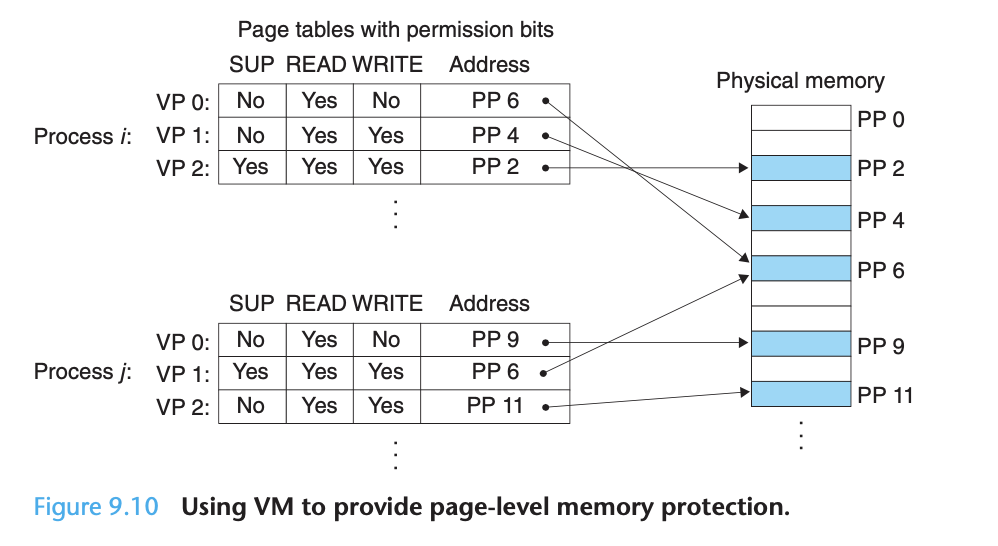
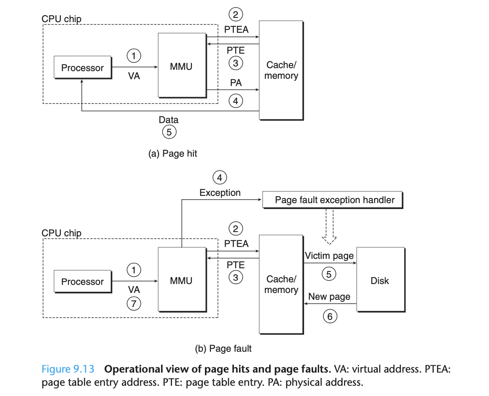
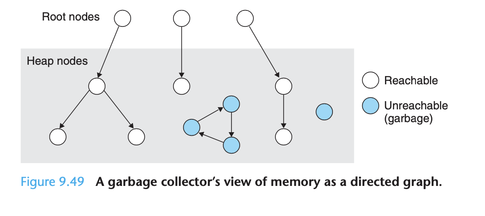

# Ch 9 Virtual Memory

**TLDR**

Virtual memory is an abstraction of main memory. Processors that support virtual memory reference main memory using a form of indirection known as virtual addressing. The translation of addresses from a virtual address space to a physical address space requires close cooperation between hardware and software. Dedicated hardware translates virtual addresses using page tables.

Virtual memory provides three important capabilities:

1. It automatically caches recently used contents of the virtual address space stored on disk in main memory. The block in virtual memory cache is known as a page. 
2. It simplifies memory management, which in turn simplifies linking, sharing data between processes, and the allocation fo memory for processes.
3. It simplifies memory protection by incorporating protection bits into every page table entry.

Modern systems initialize chunks of virtual memory by associating them with chunks of files on a disk, a process known as memory mapping. It pr

**Introduction**

Processes in a system share the CPU and main memory with other processes. This can come with some challenges. For example, if too many processes need too much memory, then some of them will simply not be able to run! When a program is out of space, it is out of luck. Memory is also vulnerable to corruption. If some process inadvertently writes to the memory used by another process, that process might fail in some bewildering fashion!

In order to manage memory more efficiently and with fewer errors, modern systems provide an abstraction of main memory known as **virtual memory (VM)**.

**Virtual memory** is an elegant **interaction of hardware exceptions, hardware address translation, main memory, disk files, and kernel software** that provides each process with a large, uniform, and private address space. It provides three important capabilities:

1. It 
2. It 
3. It

Virtual memory is truly one of the great ideas in computer systems. A major reason it is so successful is that it works silently and automatically, without any intervention.

**Physical and Virtual Addressing**

The **main memory** of a computer system is organized as **an array of contiguous byte-sized cells**. Each byte has a unique **physical address (PA)**. The first byte has an address of 0, and the next byte an address of 1, and so on.

Given this simple organization, the most natural way for a CPU to access memory would be to use physical addresses. This approach is called physical addressing. When the CPU executes the load instruction, it generates an effective physical address and passes it to main memory over the bus. The main memory fetches the 4-byte word starting at physical address 4 and returns it to the CPU which stores it in a register.

Early PCs **used physical addressing,** and **systems such as digital signal processors, embedded microcontrollers and Cray supercomputers continue to do so**!

Modern processors now use a form of addressing known as **virtual addressing**. With virtual addressing, the CPU accesses main memory by generating a** virtual address (VA)**, which is converted to the appropriate physical address before being sent to the memory. The task of converting a virtual address to a physical address is known as **address translation**.

Address translation requires close cooperation between the CPU hardware and the operating system. Dedicated hardware on the CPU chip called the **memory management unit (MMU) translates virtual addresses** on the fly, using a look-up table stored in main memory whose contents are managed by the operating system.

**Address Spaces**

An **address space** is an ordered set of nonnegative integer addresses ( 0,1,2,...). If the integers in the address space are consecutive, then we say that it is a linear address space.

In a system with virtual memory, the CPU generates virtual addresses from an address space of N = 2^n addresses ({{00,,11,,22,...,N ,...,N −−11})}) called the **virtual address space**.

The size of an address space is characterized by the number of bits that are needed to represent the largest address. Modern systems typically support either 32-bit or 64-bit virtual address spaces.

A system also has a **physical address space **that corresponds to the M bytes of physical memory in the system ({{00,,11,,22,...,M ,...,M −−11}}).

The concept of an address space is important because it makes a clean distinction between data objects (bytes) and their attributes (addresses). Once we recognize this distinction, then we can generalize and allow each data object to have multiple independent addresses, each chosen from a different address space.

This is the basic idea of virtual memory. **Each byte of main memory has a virtual address chosen from the virtual address space, and a physical address chosen fro the physical address space.**

**Virtual Memory as a tool for caching**

A virtual memory is organized as an **array of N contiguous byte-sized cells stored on disk**. Each byte has a **unique virtual address** that serves as an index into the array. The contents of the array on disk are cached in main memory. As with any other cache in the memory hierarchy, the data on disk (the lower level) is **partitioned into blocks** that serve as the transfer units between the disk and the main memory (the upper level). 

VM systems handle this by partitioning the virtual memory into fixed-sized bocks called **virtual pages (VPs)**. Similarly, physical memory is partitioned into **physical pages (PPs)**. At any point in time, the set of virtual pages is partitioned into three disjoint subsets:

1. Unallocated - Pages that have not yet been allocated or created by the VM system. 
2. Cached - Allocated pages that are currently cached in physical memory.
3. Uncached - Allocated pages that are not cached in physical memory.

When talking about caches, we have to keep them straight. We will use SRM cache to refer to the L1, L2, and L3 cache memories between the CPU and main memory, and we will use the term **DRAM cache** to denote the **VM system's cache that caches virtual pages in main memory**.

DRAM is at least ten times slower than an SRAM and disk is about 100,000 times slower than DRAM. Thus, misses in DRAM caches are very expensive compared to misses in SRAM caches because DRAM caches are served from disk, while SRAM cache misses are served from DRAM.

Because of the large miss penalty and the expense of accessing the first byte,** virtual pages tend to be large**. 

**Page Tables**

As with any cache, the VM system must have some way to **determine if a virtual page is cached somewhere** in DRAM. If so, the system must determine which physical page it is cached in. If there is a miss, the system must determine where the virtual page is stored on disk, select a victim page in physical memory, and copy the virtual page from disk to DRAM, replacing the victim page. 

These capabilities are provided by a combination of operating system software, address translation hardware in the MMU, and a data structure store in physical memory known as a **page table**, that **maps virtual pages to physical pages**. 

A **page table** is **an array of page table entries **(PTEs). Each page in the virtual address space has a PTE at a fixed offset in the page table.  Each PTE consists of a valid bit and an n-bit address field. The valid bit indicates whether the virtual page is currently cached in DRAM. If the valid bit is set, the **address field indicates the start of the corresponding physical page in DRAM where the virtual page is cached**.

The example in Figure 9.4 shows a page table for a system with eight virtual pages and four physical pages. Four virtual pages (VP 1, VP 2, VP 4, and VP 7) are currently cached in DRAM. Two pages (VP 0 and VP 5) have not yet been allocated, and the rest (VP 3 and VP 6) have been allocated, but are not currently cached. An important point to notice about Figure 9.4 is that because the DRAM cache is fully associative, any physical page can contain any virtual page.The example in Figure 9.4 shows a page table for a system with eight virtual pages and four physical pages. Four virtual pages (VP 1, VP 2, VP 4, and VP 7) are currently cached in DRAM. Two pages (VP 0 and VP 5) have not yet been allocated, and the rest (VP 3 and VP 6) have been allocated, but are not currently cached. An important point to notice about Figure 9.4 is that because the DRAM cache is fully associative, any physical page can contain any virtual page.

**Page Hits****Page Hits**

When the CPU reads a word of virtual memory (VP2)When the CPU reads a word of virtual memory (VP2) which is cached in DRAM. Since the valid bit is set, the address translation hardware knows that VP 2 is cached in memory. SO it uses the physical memory address in the PTE to construct the physical address of the word. 

**

**

**Page Faults**

In virtual memory parlance, **a DRAM cache miss** is known as a **page fault**. In the example below, the CPU has referenced a word in VP 3, which is not cached in DRAM. The address translation hardware reads PTE3 from memory, infers from the valid bit that VP3 i snot cached and triggers a page fault exception.

The page fault exception invokes a page fault exception handler in the kernel, which selects a victim page, in this case VP4 stored in PP3. If VP4 has been modified, then the kernel will copy it back to disk. In either case, the kernel modifies the page table entry for VP4 to reflect the fact that VP4 is no longer cached in main memory.

Next, the kernel copies VP3 from disk to PP3 in memory, updates PTE3, and then returns. When the handler returns, it restarts the faulting instruction, which resends the faulting virtual address to the address translation hardware. Now VP3 is cached in main memory and the page hit is handled normally.

The strategy of waiting until the last moment to swap in a page, when a miss occurs, is known as **demand paging**. 

**Performance**

As long as our programs have good temporal locality, virtual memory systems work quite well. The **working set** is a term used to describe the number of active pages in a specific program. After an initial overhead where the working set is paged into memory, subsequent references are really fast and no additional disk traffic is needed. When a programs working set exceeds the size of physical memory, then the program undergoes **thrashing**, where pages are swapped in and out continuously.

**VM as a tool for memory management**

We just saw how virtual memory provides a mechanism for using the DRAM to cache pages from a typically larger virtual address space.  Thus far, we have assumed a single page table that maps a single virtual address space to the physical address space. In reality, **the operation system provides a separate page table, and thus a separate virtual address space for each process.**

**

**

Virtual memory **simplifies linking because every process can use the same basic format** for its memory image, regardless of where the code and data actually reside in physical memory. 

Virtual memory **simplifies sharing** by providing a consistent mechanism to share memory between user processes and the operating system itself.

**VM as a tool for memory protection**

A user process should not be allowed to modify its read-only text section. Nor should it be allowed to read or modify any of the code and data structures in the kernel. It should not be allowed to read or write the private memory of other processes, and it should not be allowed to modify any virtual pages that are shared with other processes.

The address translation mechanism can be extended in a natural way to provide finer access control. Since the address translation hardware reads a PTE each time the CPU generates an address, it is straightforward to control access to the contents of a virtual page by adding some permission bits to the PTE. 

In this example there are three permission bits to each PTE. SUP which indicates whether processes must be running in kernel mode (supervisor), READ and WRITE are pretty self-explanatory.

**Address Translation**

Address translation is mapping between the elements of a virtual address space to a physical address space. 

So, how does it work? A control register in the CPU, the page table base register (PTBR) points to the current page table. The n-bit virtual address has two components: a p-bit virtual page offset (VPO) and an (n-p)-bit virtual page  number (VPN). 

The MMU uses the VPN to select the appropriate PTE. The corresponding physical address is the concatenation of the physical page number (PPN) from the page table entry and the VPO from the virtual address. 

A page hit is thus handled entirely by hardware. Handling a page fault requires cooperation between hardware and the OS kernel.

**Memory Mapping**

**

**

Linux (along with other forms of Unix) **initializes the contents of a virtual memory****area** by **associating it with an object on disk**, a process known as **memory mapping**. Areas can be mapped to one of two types of objects:

1. 
2. **Anonymous file** - an area can be mapped to an anonymous file, created by the kernel, that contains all binary zeros.

In either case, once a virtual page is initialized, it is swapped back and forth between a special swap file maintained by the kernel. The swap file is also known as the swap space or the swap area. The swap space bounds the total amount of virtual pages that cont be allocated by the currently running process.

The idea behind memory mapping is that if the virtual memory system could be integrated into the conventional file system, then it could provide a simple and efficient way to load programs and data into memory.

The process abstraction promises to provide each process with its own private virtual address space that is protected from errant writes or reads by other processes. However, many processes have identical read-only text areas! And almost every C program requires functions from the standard C library. **It would be extremely wasteful for each process to keep duplicate copies of these commonly used codes in physical memory. **Fortunately, memory mapping provides us with a clean mechanism for controlling how objects are shared by multiple processes.

**An object can be mapped into an area of virtual memory** as either **a shared object or a private object**. If a process maps a shared object into an area of its virtual address space, then any writes that the process makes to that area are visible to any other processes that have also mapped the shared object into their virtual memory. Changes made to a private object are not visible.

Private objects are mapped into virtual memory using a clever technique called copy-on-write. A private object begins life in exactly the same way as a shared object, with only one copy of the private object stored in physical memory. For each process that maps the private object, the page table entries for the corresponding private area are flagged as read-only, and the area struct is flagged as private copy-on-write. So long as neither process attempts to write to its respective private area, they continue to share a single copy of the object in physical memory. However, as soon as a process attempts to write to some page in the private area, the write triggers a protection fault.

When the fault handler notices that the protection exception was caused by the process trying to write to a page in a private copy-on-write area, it creates a new copy of the page in physical memory, updates the page table entry to point to the new copy of the page, and then restores the write permissions to the page as shown in (9.30b). When the fault handler returns, the CPU reexecutes the write, which now proceeds normally. 

By deferring the copying of pages in private objects until the last possible moment, copy-on-write makes the most efficient use of scarce physical memory. 

**Dynamic Memory Allocation**

**

**

**

**

**

**

When C programmers need to require more memory at runtime they use **dynamic memory allocation**. A dynamic memory allocater maintains an area of process's virtual memory known as the **heap**.  Details vary from system to system, but we will assume that the heap is an area of demand-zero memory (all zeros) that begins immediately after the the uninitialized bss area and grows upward. For each process, the kernel maintains a variable brk (break) that points to the top of the heap.

An allocator maintains the heap as a collection of various-sized blocks. Each block is a contiguous chunk of virtual memory that is either allocated or free. Allocators come into two basic styles, they differ about which entity is responsible for freeing allocated blocks:

1. **Explicit allocators**
2. **Implicit allocators**

**Garbage Collectors**

**

**

**

**

A garbage collector views memory as a directed reachability graph. The nodes of the graph are partitioned into a set of root notes and a set of heap nodes. Each heap node corresponds to an allocated block in the heap. A directed edge p->q means that some location in block p points to some location in block q. Root nodes correspond to locations not in the heap that contain pointers into the heap.  These locations can be registers, variables on the stack or global variables int eh read-write data area of virtual memory.

We say that a node is reachable if there exists a directed path from any root node to p. At any point in time, the unreachable nodes correspond to garbage that can never be used again by an application. The role fo the garbage collector is to maintain some representation of the reachability graph and periodically reclaim the unreachable nodes.
