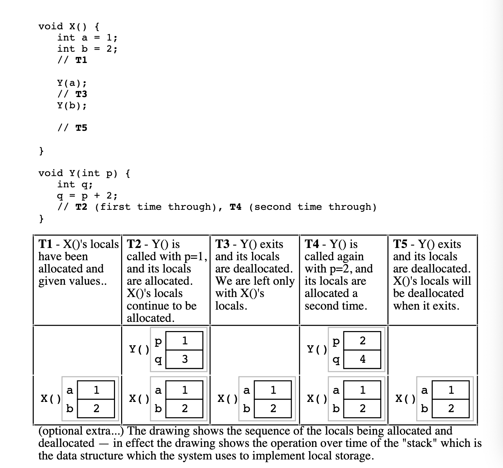

# Essential C

**Basic Types and Operators**

C provides a standard, minimal set of basic data types. Sometimes these are called "primitive" types. 

**Integer Types **

1. **char**
2. **int**
3. **long**

The integer types can be preceded by the qualifier unsigned which disallows representing negative numbers, but doubles the largest positive number representable.

You can think of pointers as being a form of unsigned long on a machine with 4 byte pointers. **It's best to avoid using unsigned unless you really need to.**

Instead of defining the exact size of integer types, C defines lower bounds. This makes it easier to implement C compilers on a wide range of hardware. Unfortunately it can lead to crazy bugs. **If you are designing a function that will be implemented on several different machines, it is a good idea to use typedefs to set up types** that specify the size of input. 

**char Constants**

A char constant is written with single quotes. The char constant 'A' is really just a synonym for the ordinary integer value 65. 


**int Constants**

Numbers in the source code such as 234 default to type int. They may be followed by an 'L' (upper or lower case) to designate that the constant should be a long. 

**Type Combinations and Promotion**

The integral types must be mixed together in arithmetic expressions since they are all basically just integers with variations in their width. To do this, the compiler "promotes" the smaller type to be the same size as the larger type. Promotions are determined at compile time.

**Floating point Types**

1. **float -**
2. **double - **

**Most C programmers use double for their computations**. The main reason to use float is to save memory if many numbers need to be stored. 

The **main thing to remember about floating point numbers **is that they are **inexact**. For this reason you should never compare floating point numbers for equality, you should use inequality comparisons instead.

**Variables**

As in most languages, a variable declaration reserves and names an area in memory at run time to hold a value of particular type. 

**Whenever you are stuck make a drawing. **

Variables do not have their memory cleared or set in any way when they are allocated at run time. Variables start with random values, and it is up to the program to set them to something sensible before depending on their values. 

**Truncation**

The opposite of promotion is truncation. **Truncation moves a value from a type to a smaller type**. In that case, the compiler just drops the extra bits.** The compiler might not generate a compile time warning for the loss of information!**

Assigning from a floating point type to an integer drops the fractional part of the number.

**Bools**

**There are no distinct boolean types in C, int is used instead. The language treats the integer 0 as false.**

**Control Statements**

**Switch Statement**

Once execution has jumped to a particular case, the program will keep running through all the cases from the point down. This is called "fall through" and causes bugs in code. You must use an explicit 'break' statement to exit the switch statement.

**Break Statement**

The break statement can be used to move control outside a loop or a switch statement. It's preferable not to use a break in a loop because you have a condition, but if you have to, you have to. 

**Complex Data Types**

C uses **structs** and **arrays** to group things together. The == operator does not work on structs. 

The simplest type of array in C is the one which is declared and used in one place. 

Lets imagine we declare an array as follows:

```
int scores[100];

scores[0] = 13;
scores[99] = 42;
```

Below is a graphical representation of what the array looks like. 


**C does not do any run time or compile time bounds checking in arrays.** At run time the code will just access and mangle whatever memory it happens to hit and crash or misbehave in some unpredictable way. This is what makes C not memory safe. 

I'm going to give some background on pointers from [http://cslibrary.stanford.edu/102/PointersAndMemory.pdf](http://cslibrary.stanford.edu/102/PointersAndMemory.pdf)

Pointers and Memory

A **pointer** is a value which represents a reference to another value. 

Why have pointers?

1. Pointers allow different sections of code to 
2. Pointers enable complex linked data structures like linked-lists and trees.

**A pointer does not store a value directly.** Instead a pointer **stores a reference (memory address) to another value**.


The **"dereference" operation** follows a pointer's reference to **get the value of its pointee**. The value of the dereference operation on numPtr above is 42. 

Almost all bugs in pointer code involve trying to dereference a pointer that doesn't have a pointee. 

The** constant NULL** is **a special pointer value** which encodes the idea of **"points to nothing"**. It is a runtime error to dereference a NULL pointer.


The assignment operation (=) between two pointers make them point to the same pointee. After assignment the equality test (==) comparing the two pointers will return true. 

**Drawings are the key to thinking about pointer code.**

Two pointers which both refer to a single pointee are said to be sharing. T**hat two or more entities can cooperatively share a single memory structure is a key advantage of pointers in all computer languages.** Pointer manipulation is a technique, often sharing is the real goal.

In particular, sharing can enable communication between two functions. If one function passes a pointer to the value of interest to another function, the functions can access the value of interest but the value of interest is itself not copied.  This communication is called **"shallow"** because the **value of interest is not copied**. The alternative is a **"deep" copy** where the **complete copy is sent to the function**. If two functions are sharing a shallow copy, they need to be written to understand that they should not change or delete the value since it is shared. 


**When a pointer is first allocated, it does not have a pointee.** The pointer is "uninitialized" and** a dereference operation will crash**, halt immediately, or just do crazy stuff that will mess things up.  Bad pointers are VERY COMMON. Every pointer starts out with a bad value. 

**Pointer Syntax**

A pointer type is just the pointee type followed by an asterisk(*)


**Pointer variables are declared like any other variable. The declaration gives the type and name of the new variable and reserves memory to hold its value.** The declaration does not assign a pointee for the pointer. 

There are several ways to **compute a reference to a pointee**. The simplest way is the** & operator**. It can to the left of any variable and it computes the reference to that variable. 


The **star operator (*) dereferences a pointe**r. The * is a unary operator which goes to the left of the pointer it dereferences. The pointer must have a pointee. 


The most common sort of pointer bug will look like the code above except that the pointers will not be assigned pointees. The bad code will compile, but at run-time each dereference with a bad pointer will corrupt memory in some way. 

**Pointer Rules Summary**

1. A pointer stores a reference to its pointee. The pointee stores something useful.
2. The dereference operation on a pointer accesses its pointee. A pointer may only be dereference after it has been assigned to refer to a pointee.
3. Allocating a pointer does not automatically assign it to refer to a pointee.
4. Assignment between two pointers makes them refer to the same pointee which introduces sharing.

**How is a pointer implemented?**

The short explanation is that every area of memory in the machine has a numeric address like 1000 or 20452. **A pointer to an area of memory is really just an integer which is storing the address of that area of memory.** The **dereference operation looks at the address** and goes to that area of memory to **retrieve the pointee** stored there. 

Local Memory

Variables represent storage space in the computer's memory. Each variable represents a convenient name like sum in the source code. Behind the scenes at runtime, each variable uses an area of the computer's memory to store the value. Modern programming languages give memory only when necessary. The period of time from its **allocation** to **deallocation** is called its **lifetime**.  

The most common memory-related error is using a deallocated variable. For local variables, modern languages protect against this error. With pointers, this is not the case and deallocation must be handled correctly.



local variables are tightly associated with their function. They are used their and nowhere else. In the example above, only the X code can refer to a and b. Only the Y code can refer to p and q. 

Local variables are great for 90% of a program's memory needs. 

* Convenient - they exist only for the duration of a function's computation.
* Efficient - Allocating and deallocating is time efficient and they are space efficient in the way they use memory.
* Local Copies - local parameters are basically local copies of the information of the caller. This is known as "

Some disadvantages of Locals are

* Short Lifetime - their allocation and deallocation schedule are very strict. Sometimes a program needs memory which continues to be allocated even after the function which originally allocated it has exited. This problem will be solved with 'heap' memory.
* Restricted Communication - Since local variables are copies of the caller parameters, they not not provide a means of communication from the callee back to the caller.

Local variables are sometimes known as stack variables because at a low level, languages almost always implement them using a stack structure in memory. 

Want to see a tricky bug?!


**What is wrong with this code?**

The problem happens to its caller after TAB exits. TAB returns a pointer to an int, but where is that int allocated? The problem is that the local int temp is allocated only while TAB is running. When TAB exits, all of its locals are deallocated. So the caller is left with a pointer to a deallocated variable.  Yeesh.

**How does the function call stack work?**

1. The function evaluates the parameter expressions in the caller's context.
2. Allocate memory for the functions locals by pushing a block of memory onto a runtime "call stack". For parameters, but not local variables, store the values from step 1 into the appropriate slot in the block.
3. Store the caller's current address of execution(the return address) and switch execution to the function.
4. The function executes with its local block conveniently available at the end of the call stack.
5. When the function finishes, it exits by popping its locals off the stack and returns tot he caller using the previously stored address.

Reference Parameters

A** reference parameter passes a pointer** to the value of interest instead of a copy of the value of interest. This technique uses the sharing property of pointers so that the caller and callee can share the value of interest. 


**Syntax**

1. The function takes as its parameter a pointer to the value of interest
2. At the time of the call, the caller computes a pointer to the value of interest and passes that pointer. The type of the pointer will agree with the type of the pointer declared in the function. This typically uses the & operator.
3. When the callee is running, if it wishes to access the value of interest, it must dereference the pointer.

**Reference parameters **enable communication between callee and caller. Another reason to use reference parameters is to avoid making copies. For efficiency, making copies may be undesirable if the value of interest is large. Making the copy requires extra space.


Heap Memory

AKA dynamic memory, is an alternative to local stack memory. **Local memory is automatic**, it is allocated on function call and it is deallocated automatically when a function exits.

**Heap memory** is different. The **programmer explicitly requests the allocation of a memory "block"** of a particular size, and the block **continues to be allocated until the programmer explicitly requests that it be deallocated**. 

The advantages of heap memory are:

1. Lifetime - Because the programmer now controls exactly when memory is allocated and deallocated, it is possible to build a data structure in memory, and return that data structure to the caller. 
2. Size - The size of allocated memory can be controlled with detail.

The disadvantages of heap memory are:

1. More work - Heap allocation needs to be arranged explicitly.
2. More bugs - Because it is now done explicitly, there are more chances for programmers to make a bug. Local memory is constrained, but it is never wrong.

In **languages with garbage collectors (not C)**, the above disadvantages are mostly eliminated. The **garbage collector takes over most of the responsibility for heap management** at the cost of a little extra time taken at run-time. 

**What does the heap look like?**

The heap is a large area of memory available for use by the program. The program can request areas, or blocks of memory for use within the heap. 


In order to allocate a block of some size, the program makes an explicit request by calling the **heap allocation function**. This function reserves a block and returns a pointer to it.

Each allocation request reserves a contiguous area of the requested size in the heap and returns a pointer to that new block. The program always manipulates its heap blocks through pointers.

In reality, the heap manager can allocate blocks wherever it wants int he heap as long as the blocks do not overlap. It has its own private data structures to records what areas of the heap are committed to what purpose at any moment. 


**When the program is finished using a block **of memory, it makes an **explicit****deallocation****request** to indicate to the heap manager that the program is now finished with that block. The heap manager updates its private data structures to show that the block is free again.

**Programming The Heap**

In C, heap is managed by the ANSI library functions malloc, free and realloc. 

The **malloc function** takes an unsigned integer which is the requested size of the block measured in bytes. It returns a pointer to a new heap block if the allocation is successful and NULL if the request cannot be satisfied. The C operator sizeof() is a convenient way to compute the size in bytes of a type.

The** free function** takes a pointer to a heap block and returns it to the free pool for later reuse. The pointer to free must be exactly the pointer returned earlier by malloc, not just a pointer to somewhere in the block. 

Calling free with the wrong sort of pointer is famous for causing ugly crashes.

A simple example


In the C language, it is convenient to allocate an array in the heap, since C can treat any pointer as an array. The size of the array memory block is the size of each element multiplied by the number of elements.


Let's look at a heap string. A string is just an array of chars under the hood. In the example below, the StringCopy function takes a C string, makes a copy of that string in the heap and returns a pointer to the new string. The caller takes over ownership of the new string and is responsible for freeing it. 


**Memory leaks**

If **memory is allocated on the heap and never deallocated**. The program which forgets to deallocate a block is said to have a memory leak. The result will be that the heap gradually fills up. For a program that runs and exits, memory leaks are not a concern. **Memory leaks are a problem in long-running programs.**

**C Strings**

C has minimal support of character strings. For the most part strings operate as ordinary arrays of characters. Their maintenance is up  to the programmer using the standard facilities available for arrays and pointers.

A **C string is just an array of char **with one additional convention that **a "null" character ('\0') is stored after the last real character** in the array. 


The x's in the above image represent characters which have not been set to any particular value.

The convention with C strings is that the **owner of the string is responsible for allocating array space which is "large enough" to store whatever the string will need to store**. 

You can write over the allocated length, and this is a common source of bugs, and security problems ("buffer overflow").  

To avoid buffer overflow attacks, production code should check the size of dat first to make sure it fits in the destination string.

Because of the way C handles the types of arrays, the type of the variable in local string above is char*. C programs often manipulate strings using char* which points to an array of characters.

**TypeDef**

A typedef statement introduces a shorthand name for a type. 


**Functions**

**

**

****The **keyword static** defines that a function will** only be available to callers in the file where it is declared**. If a function **needs to be called from another file**, the file cannot be static and **will require a prototype**.

Parameters are passed "by value", which means that there is a single copying assignment for each actual parameter. The actual parameter is evaluated by the caller's context, and then the value is copied into the function's formal parameter just before the function begins executing.

**void** is a type formalized in ANSI C which means "nothing". **To indicate that a function does not return anything, use void as the return type**. Also, by convention, a pointer which does not point to any particular type is declared as void*. 

**Call by value vs Call by reference**

**

**

C passes parameters "by value" which means that the actual parameter values are copied into local storage. The caller and callee functions do not share any memory -- they each have their own copy. This scheme has two disadvantages:

1. Because the callee has its own copy, modifications to that memory are not communicated back to the caller. Therefore, value parameters do not allow the callee to communicate back to the caller. 
2. Sometimes it is undesirable to copy the value from the caller to the callee because the value is large and so copying it is expensive.

The alternative is to pass the arguments "by reference". Instead of passing a copy of a value from the caller to the callee, pass a pointer to the value. In this way there is only one copy of the value at any time. 


The caller uses the & operator to computer pointers to its local memory.

**Odds and Ends**

**

**

****The execution of a C program begins with a function named **main**. All of the files and libraries for the C program are compiled to build a single program file. That file must contain exactly one main function which the OS uses as the starting point for the program.

A **prototype** for a function gives its name and arguments but not the body. In order for a caller, in any file, to use a function, the caller must have seen the prototype for that function.

The** preprocessing step** happens to the C source **before it is fed to the compiler**. The two most common preprocessor directives are **#define and #include**. 

1. **#define **
2. **#include**


**h files vs c files**

**

**

The universally followed convention for C is that for a file named "foo.c"

* a separate file name "foo.h" will contain the prototypes for the functions in foo.c which clients may want to call. 
* Near the top of foo.c will be the following line which ensures that the function definitions in foo.c see the prototypes in foo.h 
    * #include "foo.h"

* Any xxx.c file which wishes to call a function defined in foo.c must include
    * #include "foo.h"

Sometimes there's a problem where a .h file is #included into a file more than one time resulting in compile errors. This can be a serious problem. Because of this, you want to avoid #including .h files in other .h files. If you are lucky, your compiler will support the **#pragma once** feature which **automatically prevents a single file from being included more than once**.

**Assert**

**

**

Array out of bounds references are an extremely common form of C run-time error. You can **use the assert() function to sprinkle your code with your own bound checks**. 

**Arrays**

**

**

The **+ syntax** between a pointer and an integer can compute the offset computation for an array. The only difference is that it gives a pointer to that element, not a reference. 


* intArray[3] = *(intArray + 3)
