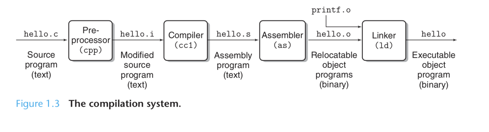

# From Source to Binary

## Table of Contents

## Introduction

In programming, everything starts with source code. Source code typically consists of a number of text files. The CPU cannot execute textual instructions, these files need to be translated by a compiler to machine-level instructions.

In this chapter we will discuss:
1. The C compilation pipeline
2. Preprocessor
3. Compiler
4. Assemblers
5. Linkers

For more discussion about these systems, please check out my [Computer Systems](https://github.com/lkrych/encylopedia_lelandica/tree/main/notes/computer_systems) notes. 

## Compilation Pipeline



The C compilation pipeline has four distinct components with each of them doing a different task.

1. Preprocessor
2. Compiler
3. Assembler
4. Linker

Each component in this pipeline accepts a certain input from the previous component and produces a certain output for the next component of the pipeline.

A **platform** is a **combination of an operating system running on specific hardware**. The most important part of the platform is its **CPU instruction set**. 

Cross-platform software can run on different platforms. However there is a distinction between cross-platform and portable software. **Cross-platform software has different binaries and installers** for each platform, **portable software uses the same produced binaries and installers** on all platforms.

### Header files

Header files typically have a `.h` extension, they usually contain **enumerations, macros, and typedefs**, as well as the **declarations of functions, global variables, and structures**. In C, declarations can be separated from definitions for some objects.

As a rule of thumb, **the declarations are stored in header files** and the corresponding **definitions go to source files**.

Let's look at an example of a header file with a function declaration, and a source file with its definition.

*average.h*
```c
double average(int*, int)
```
*average.c*
```c
double average(int* array, int length) {
    if (length <= 0) {
        return 0;
    }
    double sum = 0.0;
    for (int i = 0; i < length; i++) {
        sum += array[i];
    }
    return sum/length;
}
```

To further cement these concepts we are going to walk through the compilation pipeline with a specific example.

### Compiling an Example

In this example we will have three files, one header file and two source files. The purpose of this code is to calculate the average of an array.

The header file is used as a bridge between two separate source files and makes it possible to write our code in two separate files but build them together. The header file will contain the function declaration of `avg`, one of the source files will contain the definition of `avg`, and the other will be invoking the function.

- /2_example
    - average.h
    - average.c
    - main.c

*average.h*
```c
#ifndef EXAMPLE_AVERAGE
#define EXAMPLE_AVERAGE 
typedef enum{
    NONE,
    NORMAL,
    SQUARED
} average_type_t;

double average(int*, int, average_type_t);
#endif
```
*average.c*
```c
#include "average.h"

double average(int* array, int length, average_type_t type) {
    if (length <= 0 || type == NONE) {
        return 0;
    }
    double sum = 0.0;
    for (int i = 0; i < length; i++) {
        if (type == NORMAL) {
            sum += array[i];
        } else if (type == SQUARED) {
            sum += array[i] * array[i];
        }
    }
    return sum/length;
}
```
*main.c*
```c
#include <stdio.h>

#include "average.h"

int main(int argc, char** argv) {
    int array[5];

    array[0] = 10;
    array[1] = 3;
    array[2] = 5;
    array[3] = -8;
    array[4] = 9;

    double avg = average(array, 5, NORMAL);
    printf("The average: %f\n", average);

    avg = average(array, 5, SQUARED);
    printf("The squared average: %f\n", average);
    return 0;
}
```
Building a C project means that we will compile all the source files within the code base and **first produce some relocatable object files**. Finally, we will c**ombine these relocatable object files** and produce a final product such as a **static library or executable binaries**.

There are two important rules that you should know about using the C pipeline:
1. **We only compile source files** - header files do not contain any actual C code other than declarations, thus we only compile `.c` files.
2. **We compile each source file separately** - A project made up of 100 source files need to compile every source file separately, that means the compiler will be run 100 times.

#### Preprocessing

The first step in the C compilation pipeline is **preprocessing**. A source file has a number of header files included. Before the compilation begins, the **contents of these files are gathered by the preprocessor as a single body of C code**. This is created by copying content of the header files into the source file content.

Also, other preprocessor directive must be resolved in this step. This preprocessed code is called a **translation unit**. 

It is possible to ask compilers to dump the translation unit without compiling it further.

```bash
~/encylopedia_lelandica(main) » gcc -E 2_example/average.c          
# 1 "notes/extreme_c/examples/2_example/average.c"
# 1 "<built-in>" 1
# 1 "<built-in>" 3
# 366 "<built-in>" 3
# 1 "<command line>" 1
# 1 "<built-in>" 2
# 1 "notes/extreme_c/examples/2_example/average.c" 2
# 1 "notes/extreme_c/examples/2_example/average.h" 1


typedef enum{
    NONE,
    NORMAL,
    SQUARED
} average_type_t;

double average(int*, int, average_type_t);
# 2 "notes/extreme_c/examples/2_example/average.c" 2

double average(int* array, int length, average_type_t type) {
    if (length <= 0 || type == NONE) {
        return 0;
    }
    double sum = 0.0;
    for (int i = 0; i < length; i++) {
        if (type == NORMAL) {
            sum += array[i];
        } else if (type == SQUARED) {
            sum += array[i] * array[i];
        }
    }
    return sum/length;
}
```

As you can see the declarations are copied from the header file into the translation unit. The translation unit for `main.c` is really large because it contains the `stdio.h` header file.

#### Compilation


Once you have a translation unit, you can pass it as the input to the **compiler which will output** the corresponding **assembly code**. Assembly code is still human-readable, but it is machine-dependent and close to the hardware. It still needs further processing in order to become machine-level instructions.

Let's take a look:

```bash
~/encylopedia_lelandica(main*) » gcc -S 2_example/average.c         
----------------------------------------------------------------------------
~/encylopedia_lelandica(main*) » cat average.s                                               

        .build_version macos, 11, 0     sdk_version 11, 1
        .globl  _average                ## -- Begin function average
        .p2align        4, 0x90
_average:                               ## @average
        .cfi_startproc
## %bb.0:
        pushq   %rbp
        .cfi_def_cfa_offset 16
        .cfi_offset %rbp, -16
        movq    %rsp, %rbp
        .cfi_def_cfa_register %rbp
        movq    %rdi, -16(%rbp)
        movl    %esi, -20(%rbp)
        movl    %edx, -24(%rbp)
        cmpl    $0, -20(%rbp)
        jle     LBB0_2
## %bb.1:
        cmpl    $0, -24(%rbp)
        jne     LBB0_3
LBB0_2:
        xorps   %xmm0, %xmm0
        movsd   %xmm0, -8(%rbp)
        jmp     LBB0_13
LBB0_3:
        xorps   %xmm0, %xmm0
        movsd   %xmm0, -32(%rbp)
        movl    $0, -36(%rbp)
LBB0_4:                                 ## =>This Inner Loop Header: Depth=1
        movl    -36(%rbp), %eax
        cmpl    -20(%rbp), %eax
        jge     LBB0_12

...etc
```
As part of the compilation step, the **compiler parses the translation unit and turns it into assembly code that is specific to the target architecture**. The assembly code above is built on a Intel 64-bit machine.

**Producing assembly code from C code is the most important step in the compilation pipeline.**

#### Assembling


The next step after compilation is **assembly**. The objective here is to **generate the actual machine-level instructions (machine code)** based on the assembly code generate by the compiler. Each architecture has its own assembler.

Assembly produces a **relocatable object file** by processing the assembly code produced by the compiler. In most Unix-like systems, the assembler tool is `as`.

The object files produced by the assembler are **not executable**. They only contain the machine-level instructions generated for a translation unit. There are a few more things that need to be put in place before a binary is executable.

```bash
~/encylopedia_lelandica(main*) » gcc -c 2_example/main.c         
------------------------------------------------------------------
~/encylopedia_lelandica(main*) »  ls                             
2_example         main.o
```

Assembly is the **last step in compiling a single source file**. In other word, when we have corresponding relocatable object files for a source file, we are done with its compilation. At this stage we can continue compiling other source files.

#### Linking


The next step in our example is **combining our relocatable object files** in order **to create another object file that is executable**. Luckily, that is exactly what linking does.

In Unix-like systems, `ld` is the default linker.

```bash
~/encylopedia_lelandica(main*) » gcc -c average.c -o impl.o                                 
~/encylopedia_lelandica(main*) » gcc -c main.c -o main.o                                    
~/encylopedia_lelandica(main*) » gcc impl.o main.o                                          
~/encylopedia_lelandica(main*) » ./a.out   
The average: 3.800000
The squared average: 55.800000
```

## Preprocessor

Preprocessing is an essential feature of the C language. It allows you to:

1. modify your source code before sending it for compilation. 
2. divide your declarations into header files so that you can include functions into multiple source files.

It's important to remember that the preprocessor only does simple tasks, such as copying contents from a file or expanding macros by text substitution. It knows nothing about C syntax, it uses a grammar that is almost independent of C grammar.

In most Unix-like operating systems, there is a tool called `cpp` which stands for `C Pre-Processor` that is part of the C development bundle. It is used in the background by a C compiler to do the preprocessing steps.

## Compiler

Compilers accept the translation unit prepared by the preprocessor and **generate corresponding assembly instructions**. When multiple C sources are compiled into their equivalent assembly code, the existing tools in the platform, such as the assembler and the linker, manage the rest by making relocatable object files out of the assembly.

The assembler and the linker, `as` and `ld` respectively, exist outside of `gcc` and any compiler more generally. They standalone and are available on any platform even without having `gcc` installed.

This is because the platform is the most knowledgeable entity about the instruction set accepted by its processor. The **compiler is not usually aware of these constraints** unless it wants to do some optimizations.

One of the challenges of C compilation is to **generate the correct assembly instructions for the target architecture**. It is possible to use `gcc` for architectures such as ARM, Intel x86, AMD and many more.

The way that `gcc` overcomes this difficulty is to **split this task into two steps**
1. parsing the translation unit into a relocatable and **C-independent data structure** called an **Abstract Syntax Tree (AST)**. This step is architecture-independent and is performed by the **compiler frontend**.
2. using the AST to generate the equivalent assembly instructions for the target architecture. This step is architecture-dependent and is performed by the **compiler backend**.

### Abstract Syntax Tree

ASTs can be generated for any programming language, not only C. Once the AST is produced, the compiler backend can start to optimize the AST and generate assembly code based on the optimized AST.

## Assembler

A platform has to have an assembler in order to produce object files that contain correct machine-level instructions. Object files can have different formats in various operating systems. **Each OS defines its own specific binary format** when it comes to storing machine level instructions. This means that you can have two different OS's on the same machine and the object files of assembled code will not be the same despite containing the same machine-level instructions.

For Linux the platform-specific object files are known as **Executable and Linking Format (ELF)**.

## Linker

Before we talk about linking, let's talk about all the possible products in a C project:
1. **executable files** - have a `.out` extension in most Unix-like OSes.
2. **static libraries** - have the `.a` extension in most Unix-like OSes.
3. **dynamic libraries** (shared object files) - have the `.so` extension in most Unix-like OSes.

**Relocatable object files** are not considered as a product because they **are temporary**. They are the input to the linking step and they are used to produce the preceding products. The **linker** has the **sole responsibility of producing the preceding products from the given relocatable object files**.

An **executable file can be run as a process**. It **must have an entry point** where the machine-level instructions are executed. While the `main` function is the entry point of a C program, the **entry point of an executable object file** is platform-dependent, and it **is not the `main` function**. The `main` function will eventually be called after some preparations made by a group of platform-specific instructions which have been added by the linker.

A **static library is an archive file that contains several relocatable object files**. It is not produced by the linker directly, instead it is produced by the default archive program of the system, which in Unix-like systems is `ar`. **Static libraries are usually linked to other executable files**, and then they become part of those executable files.

**Shared object files are created directly by the linker**. Before they are used they need to be **loaded into a running process at run time**. This is in opposition to static libraries that are **used at link time**. A single shared object file can be loaded and **used by many different processes at the same time**.

### How does the linker work?