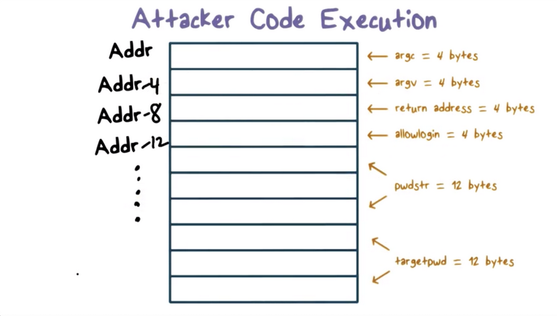

# Week 1 - Security Mindset and Software Security

Add important dates to google calendar

Lesson 1 - Security Mindset and Software Security

* Video Lectures
* Quiz 1
* Read OMSCS Notes
* Papers
    * Design Principles of Secure Systems
    * Computer Security in the Real World
    * Protection of Information in Computer Science

**Security Mindset Lectures**

The most common security requirements for sensitive information are 

* **confidentiality**
* **integrity **
* **availability**

So, what big picture principles can we follow to address cyber security?

1. **Economy of mechanism**
2. **Fail-safe default**
3. **Complete mediation**
4. **Open design**
5. **Least Privilege**
6. **Psychological acceptability**

**Software Security Lectures**

One of the most common vulnerabilities in software is the **buffer overflow**.

A buffer overflow occurs when the amount of memory allocated for expected data is insufficient (too small) to hold the actual received data. The received data "runs over" into adjacent memory, often corrupting the values present.

Malicious actors use buffer overflows in the call stack to execute evil code.

Let's take a look at a malicious program.

```
#include <stdio.h>
#include <strings.h>

int main(int argc, char *argv[]) {
      int allow_login = 0;
      char pwdstr[12];
      char targetpwd[12] = 'MyPwd123";

        gets(pwdstr);
        if(strncmp(pwdstr, targtpwd, 12) == 0)
                allow_login = 1;

        if(allow_login == 0)
                printf("Login request rejected");
        else
                printf("Login request allowed");
}
```

The main issue here is that "gets" is not a safe function call. When a string that is longer than 12 bytes is passed to pwdstr, the remaining bytes will overflow into the memory allocated to allow login, effectively overwriting its values.



The reason pwdstr overflows into allowLogin and not targetPwd is because occupation of memory occurs sequentially, from lower memory addresses to higher memory addresses. Note that this is the opposite of the way the stack grows.

A buffer overflow in the situation above will lead to an attacker logging in as whatever user they want. That's bad. Another bad thing they can do is plant code at a known address and then overwrite the return address of the current stack frame. 

When the function finishes executing it will return to the malicious code and start executing it. 

Code that the attacker wants to craft is code that is going to launch a command shell, this type of code is called **shellcode**. Here is some C code that launches a shell.

```
int main (int argc, char *argv[]) {
    char *sh;  
    char *args[2];
    
    sh = "/bin/sh";
    args[0] = sh;
    args[1] = NULL;

    execve(sh, args, NULL);
}
```

The trick is **execve**, which replaces the currently running program with the invoked program, in this case the shell.

When control is transferred, the shellcode will have the same privileges as the host program.

**Return to libc**

There are a couple of variations of buffer overflows, the first we will talk about is **return-to-libc**.

In the shellcode example above, the goal was to overflow the return address to the point to the location of our shellcode, but we don't need to return to code that we have explicitly written. 

In return-to-libc, the return address will be modified to point to a standard library function. If you return to the right kind of library function and you are able set up the arguments for it on the stack, then you can **execute any library function**. The main idea with this form of exploitation is exploit with instructions already present on the system.

**Heap Overflows**

One crucial difference between the heap and the stack is that the heap does not have a return address, so the traditional stack overflow/ return-to-libc mechanism won't work.

What we have in the heap are function pointers, which can be overwritten to point to functions that we want to execute. Heap overflows require more sophistication.

**OpenSSL Heartbleed**

So far, we have talked about how buffer overflows exploit overwriting some parts of memory and how it enables arbitrary code execution. Well, overflows don't just have to be associated with writing data. 

For example, if a variables has 12 bytes, but we ask to read 100 bytes, the read will continue past the original 12 bytes and return data in subsequent memory locations. 

The OpenSSL Heartbleed vulnerability did just this. It read past an assumed boundary and was exploited to steal some important information.

**What are defenses against Buffer Overflows?**

Some languages perform bounds checking explicitly, these languages are known as "safe" languages. One drawback of these languages is that they have performance degradation because the extra runtime checks slow down the execution of the code.

When using unsafe languages, the programmer takes on the responsibility of preventing buffer overflow scenarios. 

One way to do this is by checking all input. Assume all input is evil. Another strategy to reduce the possibility is to use safer functions that perform bounds checking!

A third strategy is to use automated tools that analyze a program and flag code that looks vulnerable

**Stack Canaries**

During the execution of a function, there is no reason the return address should be modified. As a result, if we can detect that the return address has been modified, we can show that a buffer overflow is being exploited and terminate the process.

We can detect if the return address has been modified using a stack canary, a value that we write to an address just before the return address on the stack frame. If an overflow is exploited, the canary value will be overwritten as well.

All the runtime has to do is check if the canary value has changed when a function completes execution.

One nice feature of this approach is that the programmer doesn't have to do anything.

**ASLR**

One technique many operating systems use is **address space layout randomization (ASLR)**. 

Remember that an attacker needs to know how memory is laid out within the stack or within a processes address space to direct execution.

ASLR randomizes how memory is laid out within a process to make it difficult for an attacker to predict, even roughly, where certain key data structures or libraries reside.

**Non-executable stack**

Lastly, there is no legitimate reason for programs to execute instructions that are stored on the stack. One way to block executing shellcode off the stack is to make the stack non-executable.
