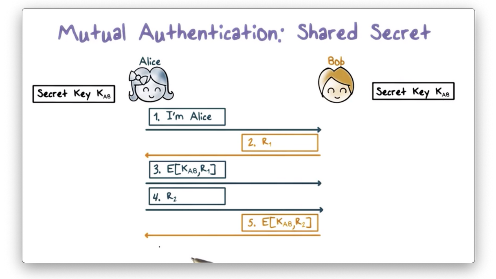
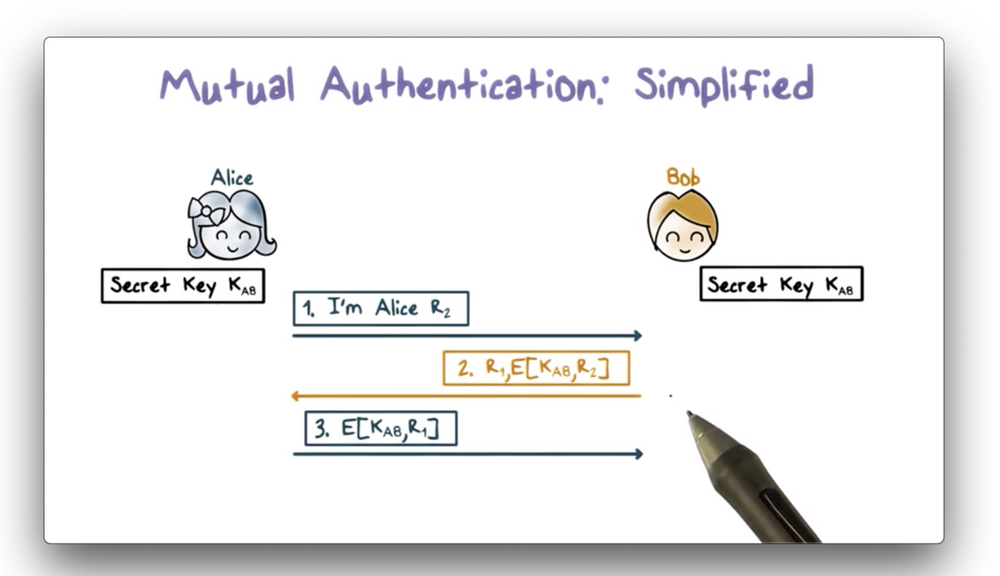
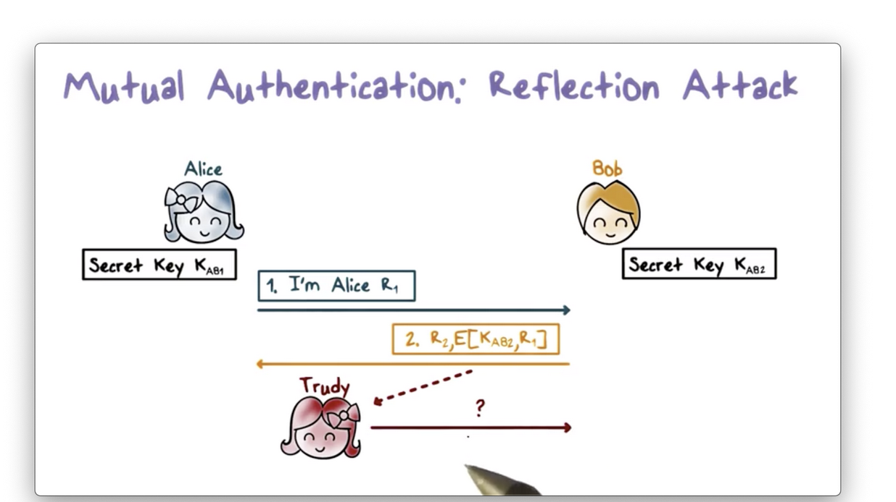
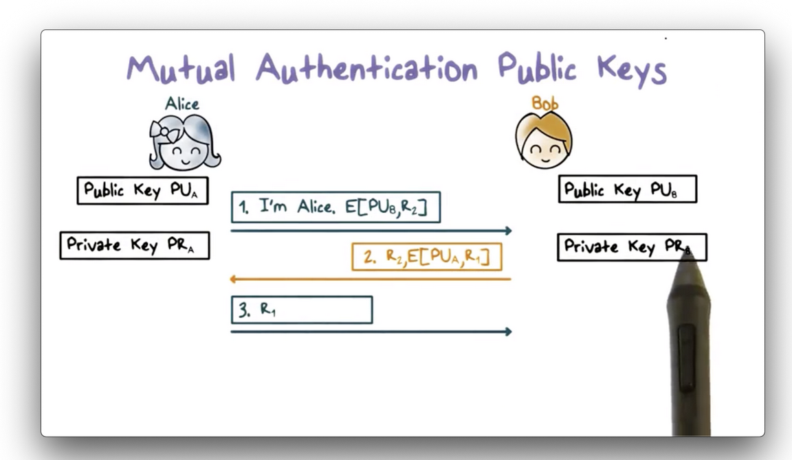
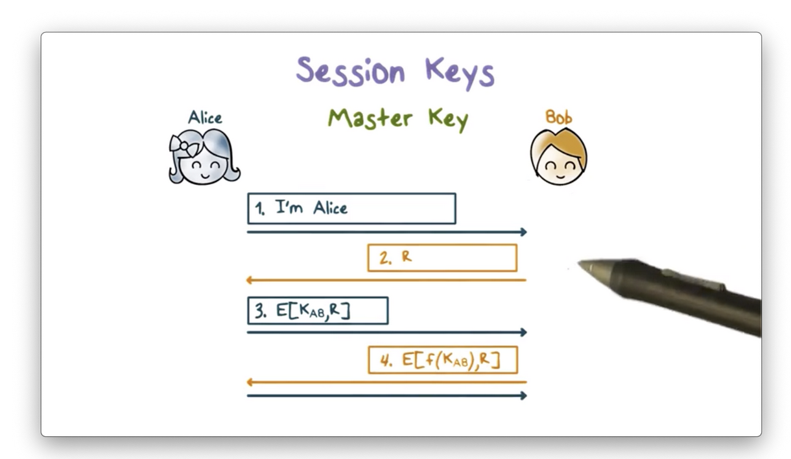
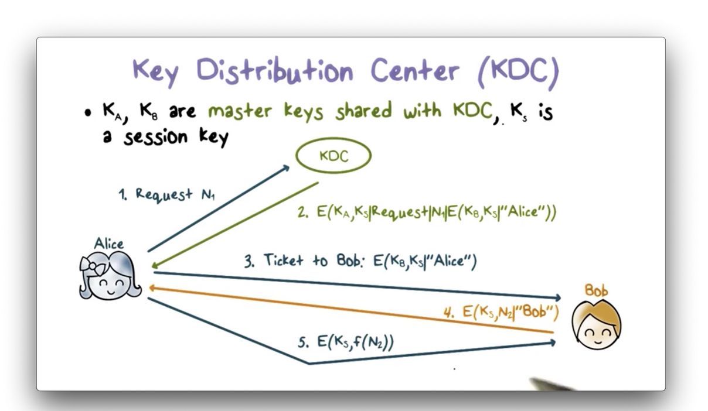
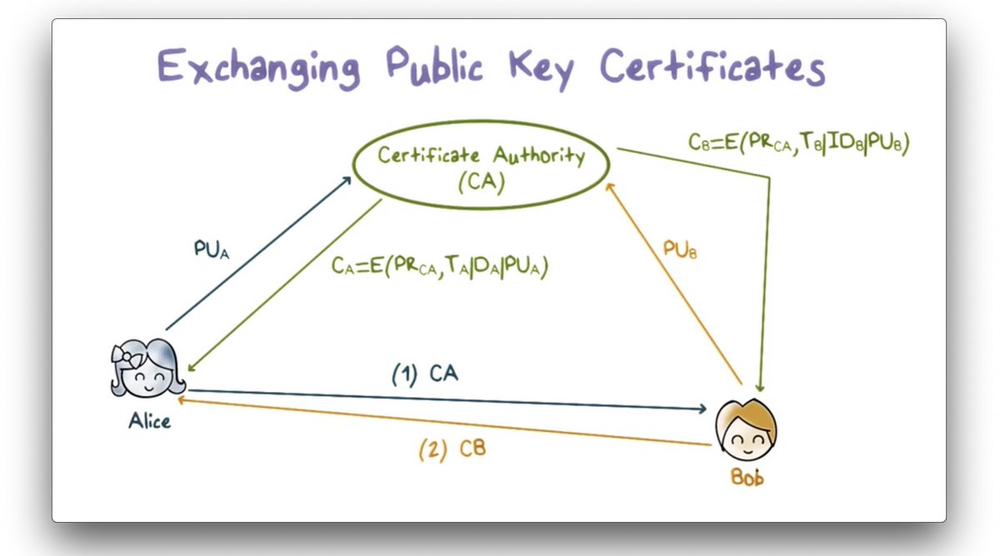
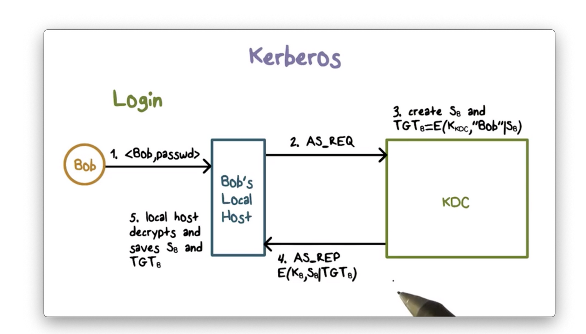
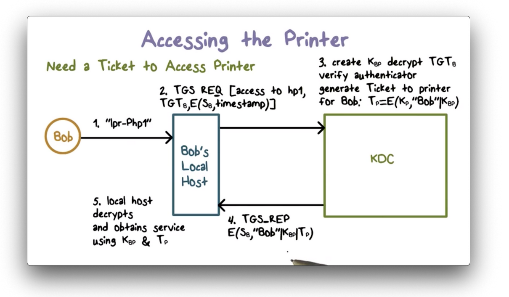
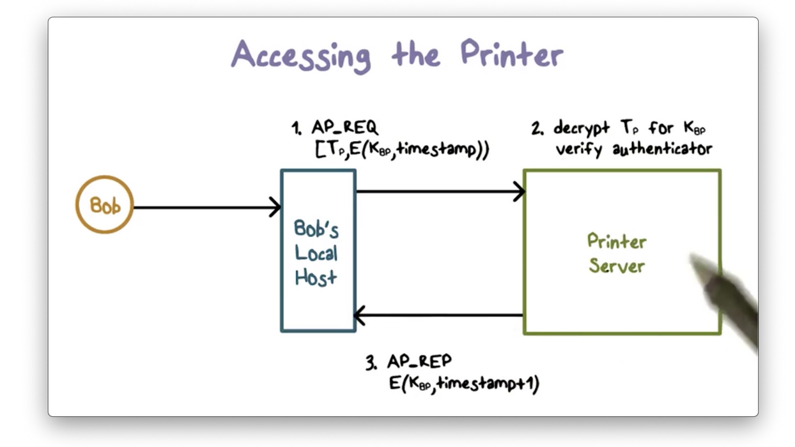

# Week 10 - Security Protocols

A **network protocol **defines the rules and conventions for communications between two parties. A **security protocol **defines the rules and conventions for secure communications between two parties.

Suppose Alice and Bob want to communicate securely over the Internet. **They first need to authenticate each other**, so that Alice knows she is communicating with Bob and Bob knows that he is communicating with Alice.

Further,** if they want to communicate securely, they likely want to encrypt their messages**. Therefore, they need to establish and exchange keys and agree on what cryptographic operations and algorithms to use.

The** building blocks of these security protocols are the public-key and secret-key algorithms, as well as hash functions.**

**Mutual Authentication: Shared Secret**

In mutual authentication, Alice needs to prove to Bob that she is Alice, and Bob needs to prove to Alice that he is Bob.

Suppose that Alice and Bob share a secret key, K_AB, which only they know. Using this secret key, we can envision the following authentication protocol.

1. First, Alice sends a message to Bob, claiming that she is Alice.
2. Bob responds with a random value r1, referred to as the 
3. Alice encrypts r1 with K_AB and sends the ciphertext back to Bob as a 
4. When Bob receives the response, he decrypts it with K_AB and sees if it matches r1.

If there is a match, Bob knows that he must be communicating with Alice, since she is the only other person with knowledge of K_AB. Without K_AB, r1 cannot be encrypted in such a way that Bob can recover it with decryption using K_AB.

Note that there are several cases where only one-way authentication is required.

Also note that eavesdroppers can impersonate either party if they can intercept challenges and responses. To create secure protocols, we want to avoid any kind of replay attacks. We can achieve this by avoiding repeatable or predictable values for the challenge. Typically, we use large random values.

**Mutual Authentication: Simplified**

The mutual authentication protocol described above takes five steps. Can we shorten it to require only the following three steps?

1. First, Alice presents her identity to Bob and sends a challenge r2.
2. Bob responds with both the ciphertext r2 generated from K_AB, as well as his challenge, r1.
3. Upon receiving the response, Alice decrypts the ciphertext and validates the plaintext matches r2.
4. Then she sends Bob the ciphertext of r1, which Bob decrypts and compares with the plaintext to authenticate Alice.

**Unfortunately, this protocol is susceptible to a reflection attack.**

**

**

First, Trudy impersonates Alice and sends challenge r2 to Bob. According to the protocol, Trudy will be stuck at the final step of the exchange because she cannot encrypt the challenge r1 sent from Bob without K_AB.

Next, Trudy opens another connection to Bob, again impersonating Alice. Trudy sends Bob the challenge r1 that he just sent her in the first connection. Bob responds with the ciphertext for r1 and a new challenge r3.

Remember, Trudy needed the ciphertext for r1 to complete the authentication exchange in the first connection. She tricked Bob into responding to his own challenge in the second connection. Thus, Trudy can take the ciphertext from the second connection and send it back to Bob in the first connection.

This type of attack is** referred to as a reflection attack because Trudy reflects Bob’s challenge from the first connection back to him in the second connection.**

**Preventing Reflection Attacks**

**

**

One strategy to **defend against reflection attacks is to use two different shared keys**: one for the initiator of the connection and one for the responder.

Another way to prevent reflection attacks is **to use different challenges for the initiator and responder**. Odd-number vs even-numbered challenges

**Mutual Authentication:  Public Keys**

If Bob and Alice have each other's public key, they can use public-key cryptography for mutual authentication.

1. First, Alice sends Bob a challenge r2 encrypted with Bob's public key.
2. Upon receiving the challenge, Bob decrypts the ciphertext using his private key, and sends back the plaintext challenge, r2 along with his own challenge r1.
3. When Alice receives the response from Bob, the plaintext r2 lets Alice know that she is communicating with Bob because only he has the private key that pairs with the public key that encrypted r2.
4. Alice also decrypts the ciphertext for r1 using her private key and sends the plaintext response r1 to Bob.

This protocol can be modified to use signing with private keys instead of encrypting with public keys.

**Session Keys**

After authentication, Alice and Bob need to establish a shared secret key for their communication session so they can securely send messages to one another.

Typically, Alice and Bob share a long term secret key - called a master key - often derived from a password. Alice can use this **master key to encrypt a new key, K_S, which she and Bob can use for message encryption during their current communication session**.

Alice and Bob should establish a new shared key for each session, even though they both share a master key. If the session key is leaked or broken, the impact is limited to the current session.

After authentication, Bob and Alice compute the same session key based on both K_AB and something about the current session. Incorporating information about the current session into the generation of the session key helps to ensure the key is unique to the session.

Bob then encrypts the challenge r using this new session key and sends it to Alice. If she can decrypt r using the version of K_S that she generated, then she knows that she and Bob have generated the same session key, and communication can proceed.

Alice and Bob can also use public-key cryptography to exchange a shared session key. As a third alternative, Alice and Bob can use Diffie-Hellman key exchange protocol to generate and exchange the session key.

**Key Distribution Center**

**

**

A **major shortcoming** of using pairwise key exchange based on a shared secret** is that it doesn't scale well**.

A** key distribution center** (KDC), solves this scalability problem. In this setup, each party holds only one master key, which they share with the KDC, and the KDC holds master keys for each enrolled party. 

If Alice and Bob want to have a secure session, they must first establish a session key.

1. First, Alice sends a message to the KDC containing both a request for a shared session key between her and Bob as well as a random nonce value n1.
2. The KDC sends a response encrypted using the master key it shares with Alice. This response contains the session key, K_S that the KDC just created for Alice and Bob to share. The response also contains the original request that Alice sent along with the nonce n1. Finally, the response contains a 
3. When Alice receives this response, she can decrypt it because she holds K_A. She can verify the message is not a replay by comparing the received request/nonce combination she generated.
4. Alice then sends the ticket to Bob, which he can decrypt because he holds K_B. Bob can tell that the KDC generated the ticket because only the KDC can encrypt Alice's ID using K_B since it is the only other party in possession of that key.
5. Next, Bob creates a message containing a nonce, n2 and his ID, encrypts it using K_S, and sends it to Alice. 
6. When Alice receives this message and decrypts is successfully, she knows she is communicating with Bob because only he can decrypt the ticket and retrieve K_S.
7. Finally, Alice performs an agreed upon transformation of n2, encrypts the results using K_S and sends it back to Bob.

**Exchanging Public Key Certificates**

**

**

A **certificate authority (CA)** often manages the secure distribution of public keys.

1. First, Alice sends her public key to the CA, which verifies her identification and then sends her a certificate of her public key. The certificate is signed with the CA's privatekey and  contains the certificate creation time and period of validity, as well as Alice's ID and public key.
2. Alice can then send this certificate to a user, such as Bob, or she can publish it so that any user can retrieve it. We assume that all users have the CA's public key, and therefore that Bob can use this public key to verify the certificate and obtain Alice's public key.

**Kerberos**

**

**

Kerberos is a standard protocol used to provide authentication and access control in a networked environment.

Each entity in the network - every user and network resource - has a master key that is shares with the **Kerberos servers**, which **perform both authentication and key distribution**. That is, a Kerberos server functions as a KDC.

For human users, the master key is derived from his or her password, while for network devices, the key must be configured.

1. When Bob logs in, his workstation first contacts the KDC with an authentication service request. 
2. The KDC generates a per-day session key, S_B, and a so-called 
3. The KDC then sends this response back to Bob. Only Bob's local workstation can decrypt this response. He stores the S_B and the TGT.
4. Bob's local workstation uses S_B for subsequent messages with the KDC and includes the TGT to convince the KDC to use S_B.

There are several benefits to this setup. First Bob's localhost does not need to store his password or password_hash once Bob has logged in and obtained S_B from the KDC.

Second, the master key, K_B that Bob shares with the KDC is only used once every day.

So how does this work in practice? Let's suppose Bob wants to access a remote networked device like the printer. 

1. His localhost sends a ticket-granting service request to the KDC. The request contains the TGT and an authenticator: the current timestamp encrypted using Bob's per-day session key S_B.
2. When the KDC receives the request, it decrypts the TGT using its private key, K_KDC. The correct decryption of Bob's ID in the TGT verifies the validity of the TGT since only K_KDC could have encrypted it in the first place.
3. The KDC then uses S_B contained in the TGT to verify the authenticator by decrypting it and checking that the timestamp is current. This verifies that Bob is the sender.
4. The KDC then generates a ticket for Bob to communicate with the printer. This ticket contains a session key K_BP, and Bob's ID, and is encrypted using the printer's master key.
5. The KDC sends a ticket-granting service response to Bob's localhost, which contains the session key K_BP. Bob's ID and the ticket to the printer. The entire response is encrypted using S_B, therefore only Bob's local workstation can decrypt it. 
6. Finally, Bob can now authenticate itself to to the printer.

First, it sends an authentication request to the printer containing the ticket and a new authenticator encrypted with K_BP.

The printer decrypts the received ticket using the master key K_P it shares with the KDC because the KDC encrypted the ticket with that key.

Since the printer can verify that the KDC created the ticket - only the KDC and the printer share K_P - the printer can verify that the KDC created the shared key K_BP contained in the ticket.

The print server uses K_BP to verify the authenticator by decrypting the ciphertext and verifying that the result matches the current timestamp.

The printer then sends a response to authenticate itself to Bob by, say, adding 1 to the current timestamp, and encrypting it with the shared key K_BP.

After these authentication steps, Bob’s localhost can send the print job to the printer.
