# Week 11 - IPSec and TLS

**Goals of IPSec**

Unfortunately, if Alice receives a packet with Bob's source IP address, she cannot e sure that the packet is really from Bob. **The IP protocol does not enforce source IP address authentication**. This fact is commonly exploited by cyber attacks.

One example of this would be using source IP spoofing to mount a DNS DDoS attack. An attacker uses a botnet to query many different DNS servers requesting the full TXT record of a domain from a spoofed IP address that points to a victim website. These DNS requests are then resolved and flood the victim website.

**IPSec** provides **security services at the IP layer**, including:

1. **authentication of source IP addresses**
2. **confidentiality and integrity protection of packet data**
3. **authenticity of packet data, including preventing replay.**

It ensures secure networking for the many applications above it that run on the IP layer.

**IPSec Modes**

IPSec supports two operational modes: transport mode and tunnel mode.

1. **Transport Mode **
2. **Tunnel Mode**

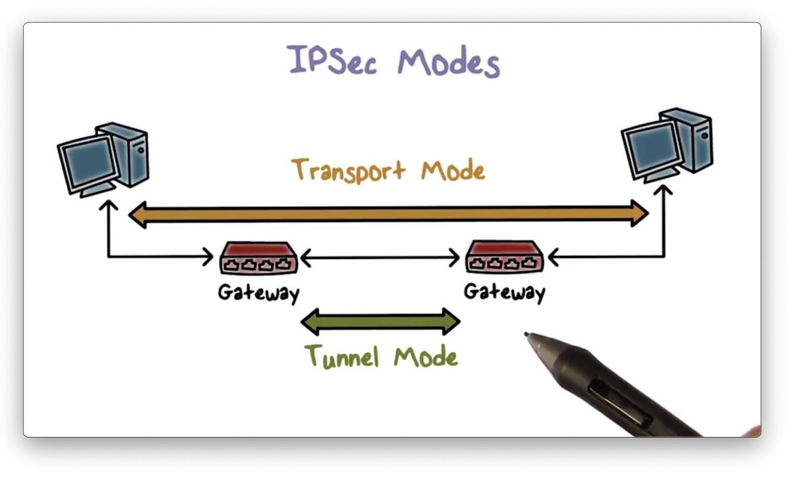

**Tunnel Mode**

Tunnel mode is the more commonly used operation mode. Suppose we have two end hosts A and B belonging to the same company, but in two different local area networks (LANs) separated by the Internet. If there is an IPSec tunnel between the gateways of the two LANs, then traffic from A to B is automatically protected.

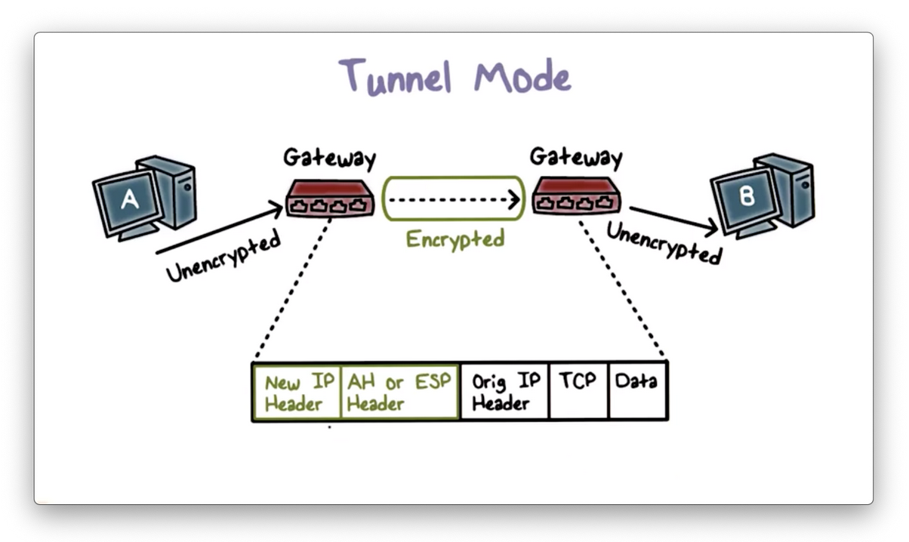

Gateway A emits unencrypted packets, and the **gateway encrypts** them before they leave the LAN. On the receiving side, the gateway to B's LAN decrypts the packets and forwards them to B. 

The gateway of A's network encapsulates traffic from A to B by **adding a new IP header that specifies its IP as the source IP and the IP of B's gateway as the destination IP **to make sure the protected packet is delivered to B's gateway first.

The gateway also includes an IPSec header, which contains the information about the protection mechanism used.

**IPSec Architecture**

**

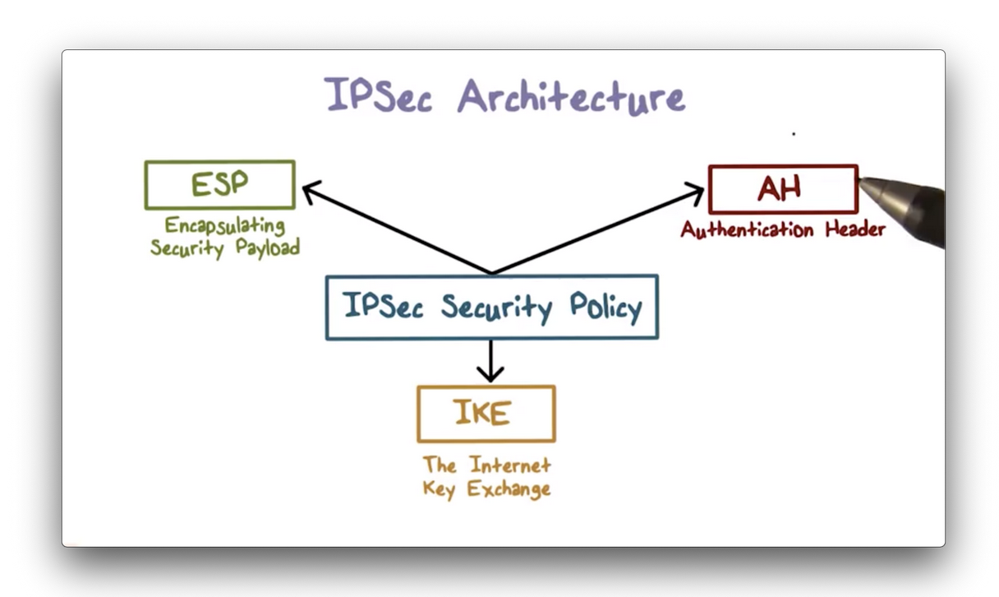

**

IPSec offers several protocols to perform various functions. These include:

1. **Internet Key Exchange (IKE)**
2. **Encapsulated Security Payload (ESP)**
3. **Authentication Header (AH) **

**ESP in Transport Mode**

An **ESP header** is inserted after the original IP header and includes the **security parameter index** and **sequence number**. The ESP header also includes the i**nitialization vector (IV)** used for encryption.

The **ESP trailer** contains padding information and a next header field, which contains information about the type of data contained in the payload, such as TCP or UDP data.

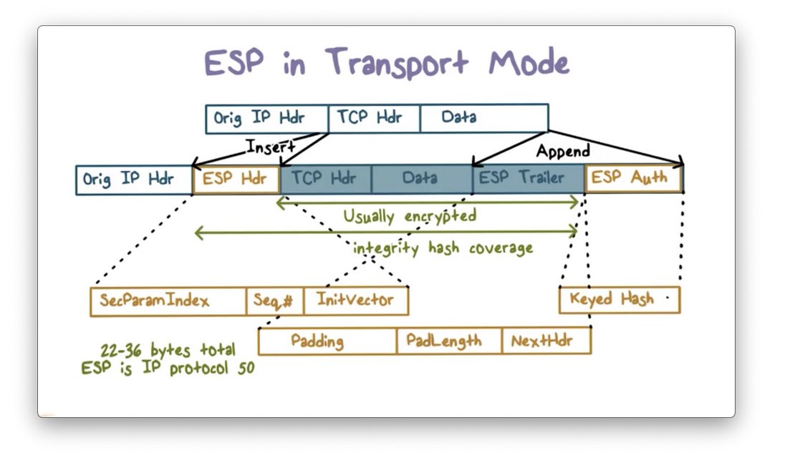

The packet payload and the ESP trailer are both encrypted, but the ESP header is not because it provides information about how to decrypt the payload, specifically in the security index header.

The ESP header and encrypted payload are hashed together with a secret key, and the hash value is appended to the packet. This hash value serves as a message authentication code (MAC) that the receiver can use to verify the authenticity and integrity of the message.

**ESP in Tunnel Mode**

In Tunnel Mode, an ESP header is added after the new IP header, and the packet payload, which contains the entire original packet plus the ESP trailer is encrypted. The MAC is computed over the entire original packet, plus the ESP header and trailer. Therefore, even the original IP header fields, including the original source and destination IP address are encrypted and authenticated. 

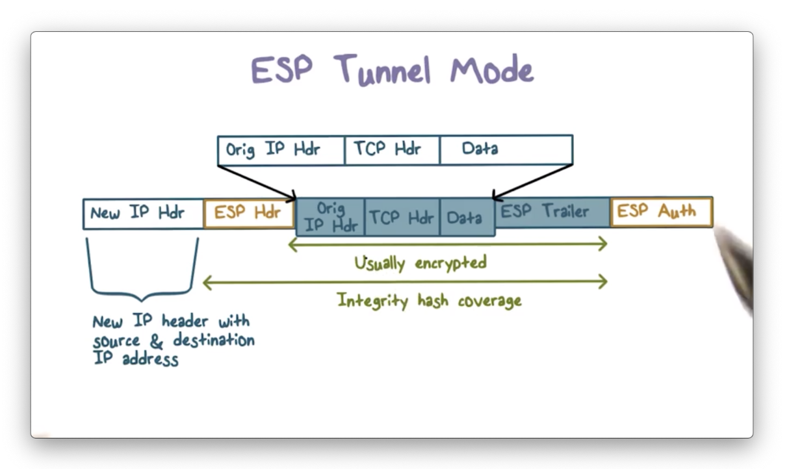

**Authentication Header**

ESP does not authenticate the headers of the transmitted IP packet. If we want to authenticate the entire packet, we can use an authentication header (AH), which contains a MAC for the complete packet.

There are several fields in the IP header that might change in transmission (like TTL). The values of these fields cannot be authenticated, and are often zeroed out when computing the MAC.

While AH does not provide encryption, we can use ESP first to encrypt the payload and then apply AH to authenticate the entire packet.

If AH is used in Transport Mode, the AH header is inserted after the original IP header.

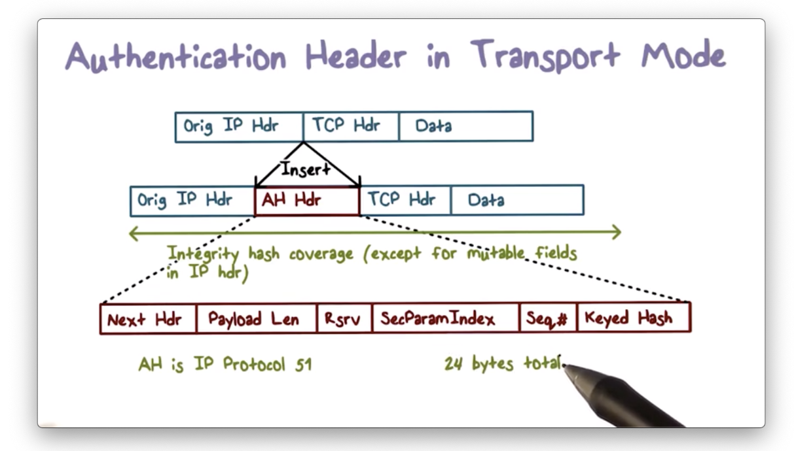

If AH is used in tunnel mode, the AH header is inserted after the new IP header.

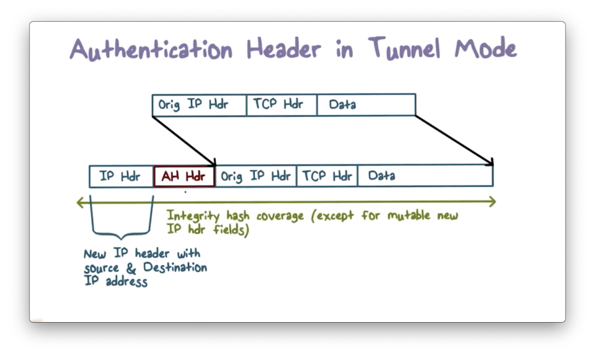

**Internet Key Exchange (IKE)**

If two parties wish to communicate securely, they typically need to use a security protocol that performs mutual authentication and key exchange.

For two end hosts or gateways to use IPSec for secure communications over the internet, that protocol is the Internet Key Exchange Protocol (IKE).

IKE allows the two parties to decide the security policies for the traffic between them. Additionally, it allows the parties to agree on a set of security parameters, such as which cryptographic algorithms to use for encryption and hashing. Finally, it allows two parties to establish a shared key for confidential communication.

**Security Association**

The security parameters for a particular type of traffic - for example, all TCP connections from host A to host B - are described in a **security association (SA)**. 

Security associations are asymmetric. For the TCP example above, we need one SA to describe traffic flow from A to B, and another to describe traffic flow from B to A. 

An end host may need many SAs and uses an **SA database (SADB)** to store them. **Each SA has a unique index in the SADB known as the security parameter index (SPI).**

When A and B agree on the security parameters for their communications, each side creates an identical SA entry in their local SADB. Then B, communicates the SPI for its copy to A, which saves it as the SPI for its copy.

Whenever A and B communicate, they include the SPI on any outgoing packet so the receiver can find the corresponding SA and process it according to the agreed-upon security parameters

**SPD and SADB **

**An SPD entry describes a security policy** that decides the security parameters, which are stored in an SA in the SADB. The unique index for the SA of the receiver is the SPI. The SPI is included in the IPSec packet header.

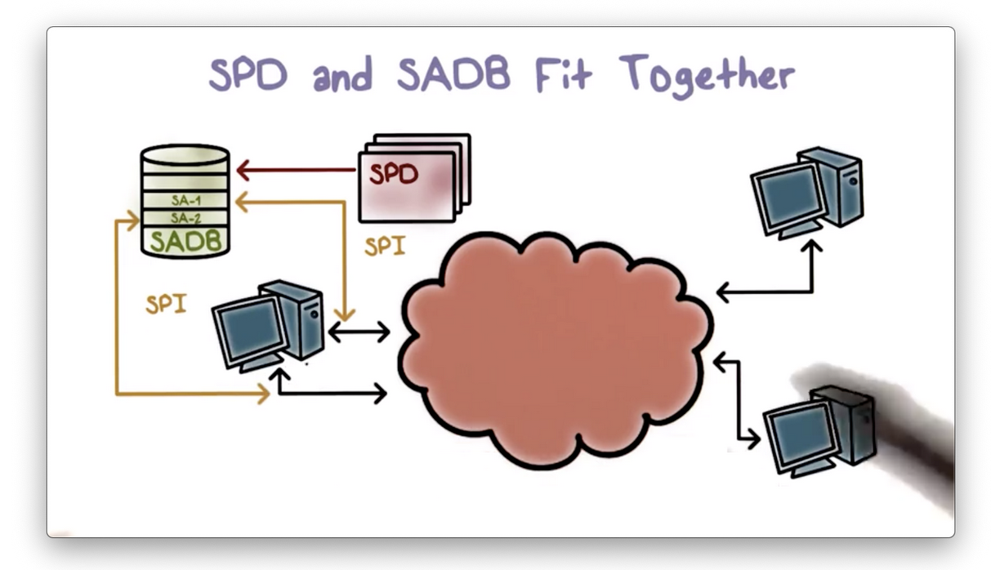

**SPD and SADB example in IPSec Transport Mode**

Suppose a policy dictates that all traffic from A to B must be authenticated using HMAC with MD5 as the embedded hash function.

A's SPD stores this policy, and both A and B store an SA in their respective SADB's containing the negotiated parameters for the policy. For example, A's SA stores the secret key for HMAC and the SPI to index the SA in B's SADB.

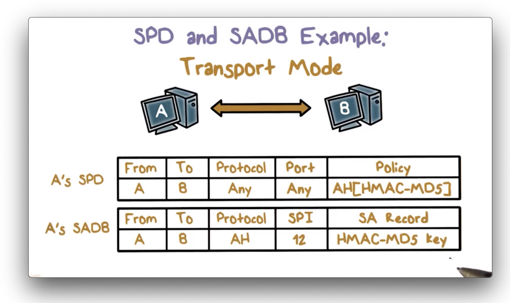

When A sends traffic to B, it includes the SPI in the IPSec header so that B can use it to look up its SA and then process the traffic appropriately.

**SPD and SADB example in IPSec Tunnel Mode**

Suppose a policy states that any traffic from A's subnet to B's subnet must be sent to B's gateway D, and then must be processed using ESP with 3DES.

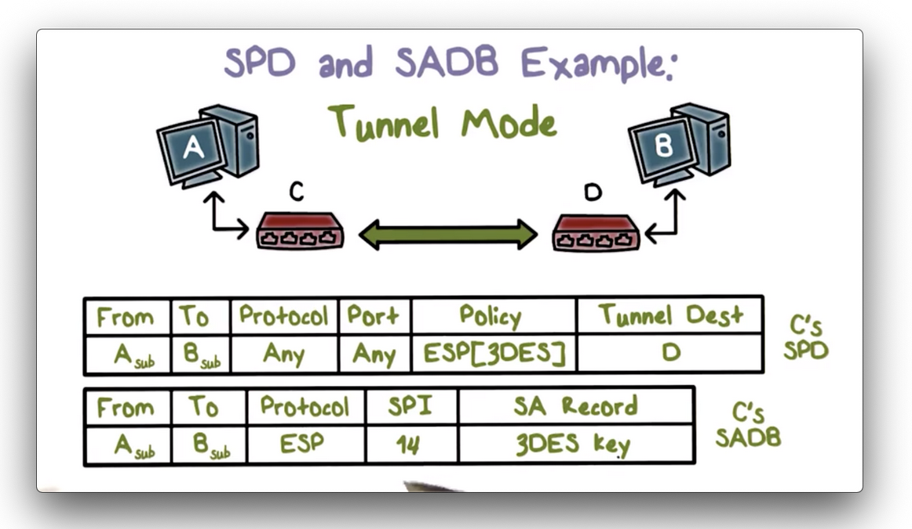

Since C is the gateway of the A's subnet, C's SPD stores this policy, and its SADB stores the SA that has the 3DES key and the SPI for looking up the SA in D's SADB.

**Inbound and Outbound processing**

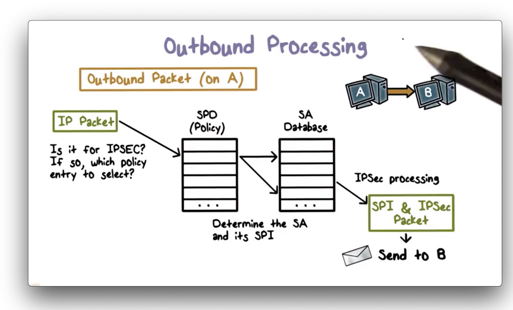

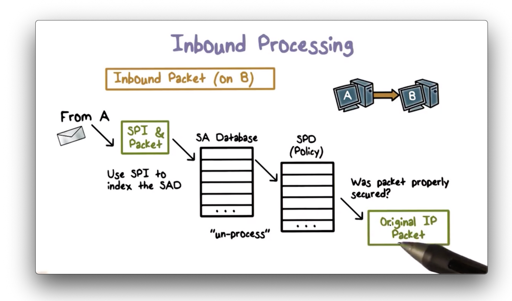

**Antireplay**

**

**

The** IPSec header contains a sequence number field**, which is designed to prevent replay attacks. This field is only used if AH is requested, or if authentication option in ESP is selected.

To utilize sequence numbers, a host H must maintain a sliding window of size n. Although packets may arrive out of order, their sequence numbers should be within the window size.

Any packets received outside of the window size are rejected.

**Internet Key Exchange**

**

**

Before A and B can communicate securely, they must agree upon the security parameters for their communication, such as encryption and authentication algorithms and keys that they plan to use. In other words, they need to establish an SA.

**The Internet Key Exchange (IKE)** protocol **facilitates the establishment of one or more IPSec SAs between hosts**. This protocol works in two phases.

1. The hosts establish an IKE SA to protect SA negotiation itself. This SA is bidirectional.
2. The hosts use this SA to protect negotiations of multiple IPSec SAs.

**IKE Phase I**

The first phase of the IKE protocol serves to establish a general security association that can be used to establish multiple IPSec security associations in the second phase.

First, both sides negotiate the protection mechanism to use - AH or ESP -  and also agree upon which cryptographic algorithms to use, such as AES, or HMAC with SHA1.

Then, they establish a shared secret key using a protocol such as Diffie-Hellman. Both sides can use either a pre-shared key, digital signatures, or public-key encryption to authenticate the key exchange.

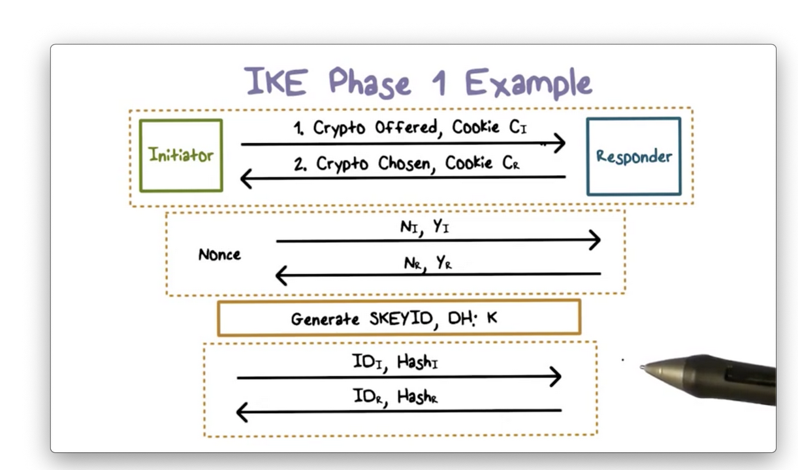

Let's walk through the example above.

1. The initiator sends the cryptographic algorithm it proposes, along with a cookie, to the responder. The cookie is a value that the initiator can easily compute, and the responder can easily verify, such as a hash over the initiator's IP address and the current timestamp. (we assume both sides have a pre-shared secret key).
2. The cookie proves that the initiator has done some computation and is serious about following through with the protocol. This first action can mitigate denial of service attacks where initiators can send many requests to responders at little to no cost.
3. The two parties exchange Yi, and Yr, the public components of the Diffie-Hellman key exchange, combined with the nonce values to prevent replay attacks.
4. Both the initiator and responder compute the same shared key according to the DH key exchange.
5. Finally, they exchange hash values to authenticate the newly established key using their pre-shared secret key.

**Diffie-Hellman and Pre-shared secret**

**

**

In our example, the initiator and the responder have a pre-shared secret key, and  using this key as well as the information exchanged between them, they can compute shared keys using a pseudorandom function.

Each party can build a pseudorandom function using HMAC and SHA-1 to generate a pseudorandom bitstream. SHA-1 has a property whereby the change in a single bit of input produces a new hash value with no apparent connection to the preceding hash value. This property forms the basis of pseudorandom number generation.

The pseudorandom function PRF receives two pieces of data as input, a key and a data block, both of which are passed down to HMAC.

1. The initiator and responder compute a root shared secret, SKEYID. Each party computes this value by invoking PRF, using the pre-shared key as the key and the previously exchanged nonce values Ni and Nr as the data block.
2. They compute a shared key to use for IPSec SA, SKEYID_d, Each party computes this value by invoking PRF, using SKEYID as the key, and the following four values as the data block:
    1. K, the shared secret key computed using Diffie-Hellman
    2. Ci and Cr, the cookies previously exchanged 
    3. The number 0

Both parties compute the keys for IKE message authentication and encryption.

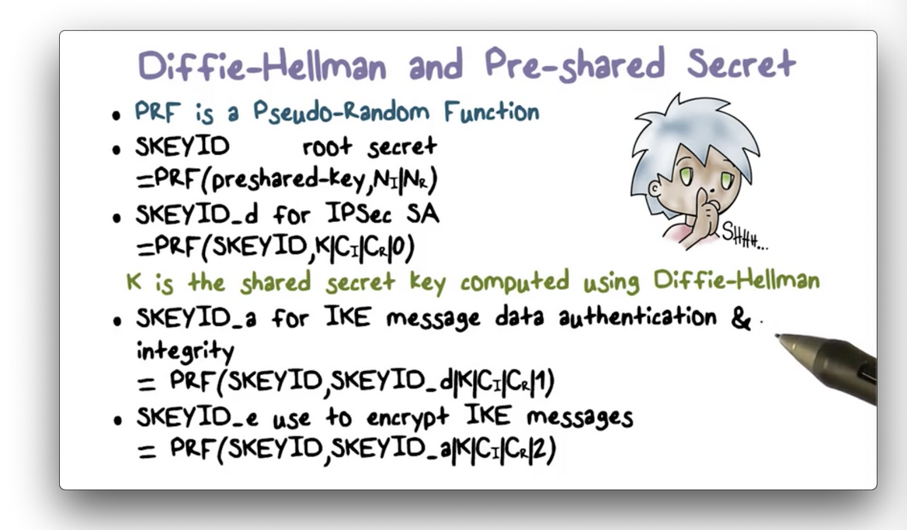

**Authentication of the Key Exchange**

**

**

Now let's take a look at how the initiator and responder authenticate the key exchange. Both parties hash the information they have exchanged, using PRF with SKEYID as the key.

The input data block passed to PRF contains the public components of the DH exchange, the cookies, the offered cryptographic algorithms and the identities of the initiator and the responder.

Each party can verify the hash value computed by the other because these values are based on information shared by both parties.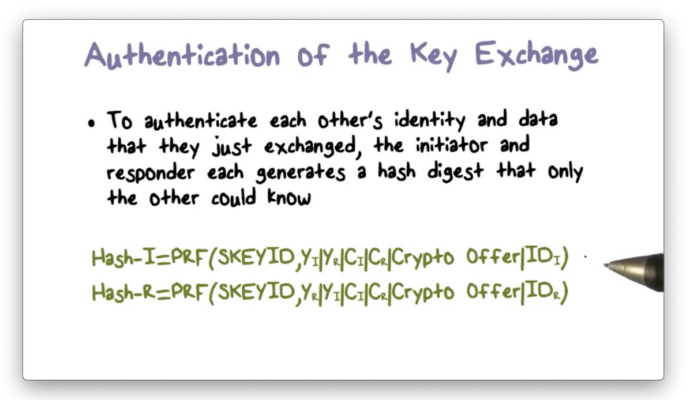

**IKE Phase II Keys**

**

**

The second phase of IKE deals with establishing IPSec SAs. Multiple SAs can be negotiated using the protection of the same IKE SA established in the first phase of IKE. The two phases work similarly, differing primarily in how the IPSec keys are derived.

If the hosts do not require [perfect forward secrecy](https://en.wikipedia.org/wiki/Forward_secrecy) (PFS), then they can derive all SA keys using one of the shared keys, SKEYID_d, computed in IKE phase one. The weakness of this approach is that if SKEYID_d is somehow leaked, then all of the IPSec SA keys are compromised.

Stronger security requires PFS. With PFS, both sides exchange new nonce values and perform new key exchanges before each IPSec SA negotiation. Therefore, unless the pre-shared master secret key is compromised, the keys for the current IPSec SA are secure, even if other keys previously computed have been compromised.

**IPSec Summary**

**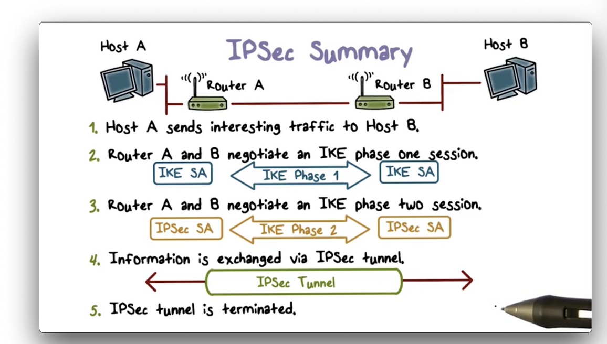

**

**

**

**SSL and TLS**

One of the most widely used security services is **Secure Sockets Layer (SSL)** and the follow-on standard, **Transport Layer Security (TLS)**. TLS is designed to make use of TCP to provide a reliable end-to-end secure service.

TLS can be provided as part of the underlying transport protocol suite, which allows all applications above the transport layer to benefit from the provided security services.

Alternatively, TLS can be embedded in specific application packages. For example, most web browsers come equipped with SSL, and most web servers have implemented the protocol.

TLS is not a single protocol, but rather two layers of protocols.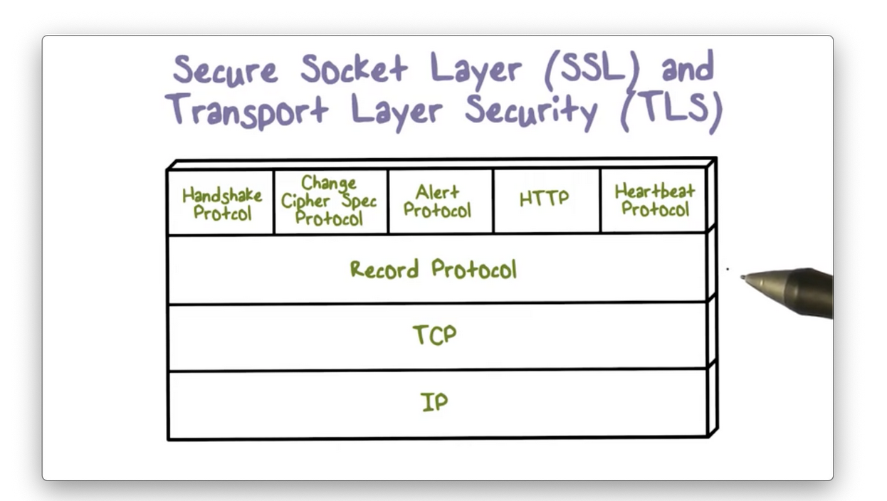

The **record protocol** provides basic security services to various higher-layer protocols, such as HTTP or SMTP. 

Additionally, TLS defines three application-level protocols which are used in the management of TLS exchanges:

1. The 
2. The 
3. The

**TLS Concepts**

**

**

**A TLS Session** is an association between a client and a server created by the handshake protocol. A session defines the set of cryptographic parameters to be used by each connection within the session. By defining the parameters at the session level, we avoid having to perform the expensive security negotiation process for each new connection.

**A TLS Connection** is a transport layer relationship between a client and server. Whereas a TLS session defines a long-term relationship, a TLS connection is transient.

**SSL Record Protocol**

**

**

The SSL record protocol **provides two services for SSL connections - confidentiality and message integrity** - both of which are made possible by the handshake protocol. That is, the handshake protocol establishes secret keys for use in encryption and message authentication code (MAC) generation, and the record protocol uses these keys to provide these services.

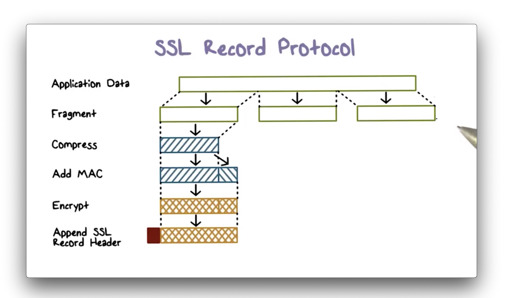

To transform application data using the SSL record protocol:

1. First, the host H fragments the application data that can fit in a TCP segment.
2. Next, H compresses each block and computes a MAC over the compressed data.
3. Third, H encrypts the compressed message and MAC using symmetric encryption.
4. Finally, H prepends a header to the encrypted, authenticated message that includes fields specifying message length and protocol version.

H transmits the data in a TCP segment. The receiving end applies the transformation steps in reverse - decryption, verification, decompression and reassembly - before delivering the data to the application.

**The Handshake Protocol**

**

**

The handshake protocol allows a client and server to negotiate security parameters, ultimately resulting int he creation of a TLS session between them.

**Phase One**

**

**

In phase one, the client and server share their respective security capabilities. The client initiates this phase by sending a client_hello message to the server, which contains several parameters: TLS version number, session ID, crypto suite, compression method, and initial random numbers.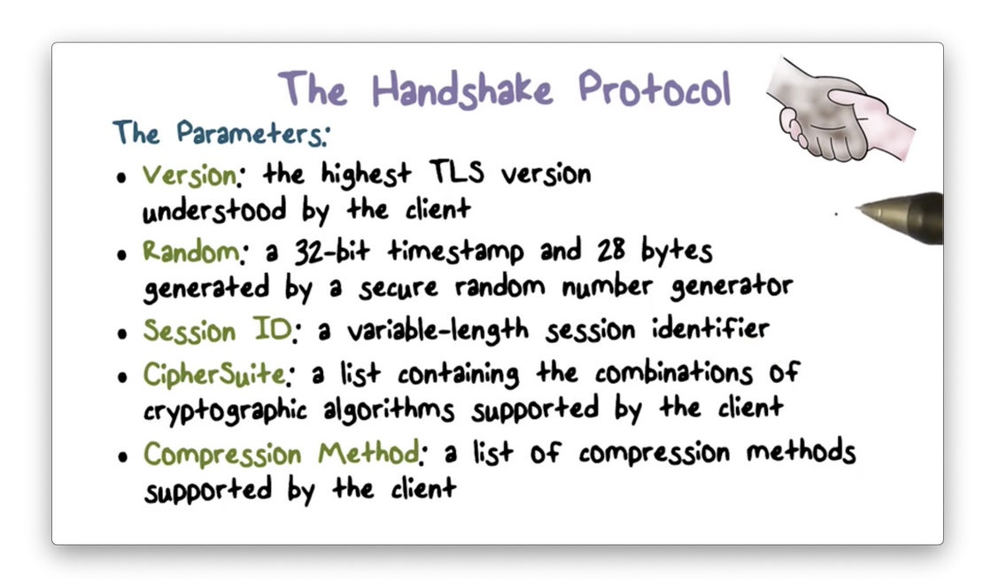

After sending the client_hello message, the client waits for the server_hello message, which contains the same parameters. Therefore at the end of phase one, both client and server know each other's security capabilities.

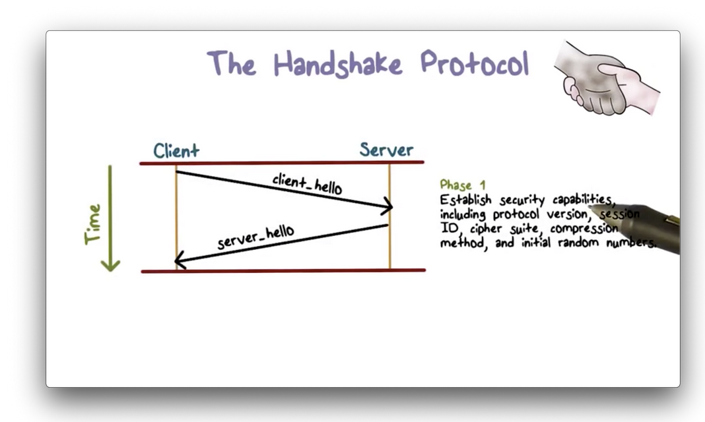

**Phase Two**

**

**

The details of phase two depend on the underlying public-key encryption scheme in use. In some cases, the server passes a certificate to the client possibly with some additional key information, and may request a certificate from the client. Regardless, the final message must be server_hello_done, which indicates the end of the phase.

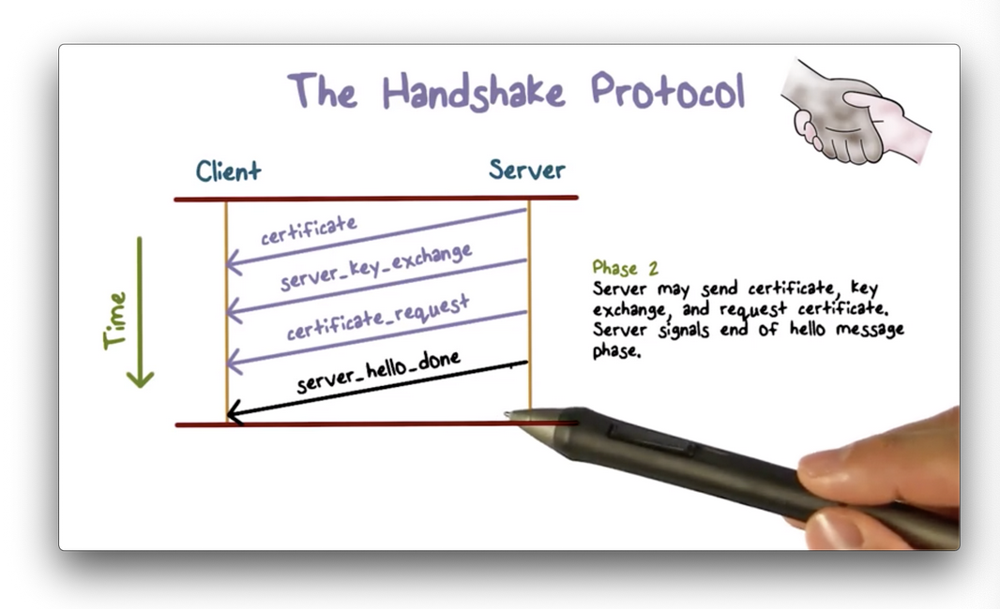

**Phase Three**

**

**

In phase three, the client should first verify the server's certificate. For example, the client should be able to validate that a reputable certificate authority signed the certificate.

After verification, the client can send key exchange information to the server. For example, the client can generate a secret key, encrypt it using the server's public key, and send it to the server.

Depending on the application requirements, the client may send a certificate to the server to authenticate itself. If a website is public-facing, then the authentication is typically one-way, that is the client needs to authenticate the server, but the server does not need to authenticate the client. On the other hand, internal or private web servers may require mutual authentication.

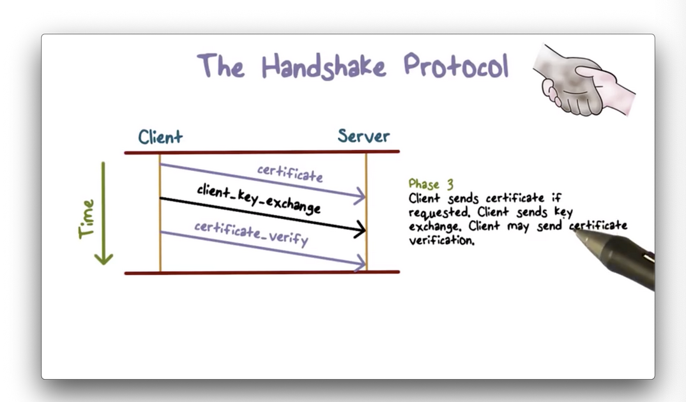

**Phase Four**

**

**

In phase four, the client sends a change_cipher_spec message to the server and copies the pending security parameters to the current cipher spec. It then signals the completion of the handshake protocol.

In response, the servers sends its own change_cipher_spec back to the client to signal that it also agrees on the exchanged security parameters. Then the server sends its own message to signal the end of the handshake.

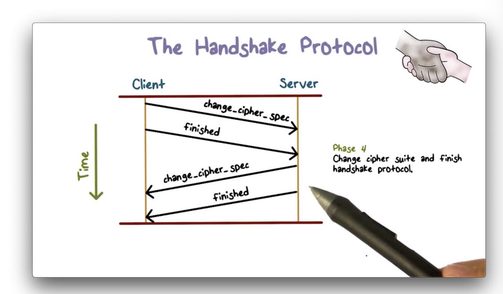

At this point, the handshake is complete, and the client and server can begin to exchange application layer data, which will be protected using the negotiated security parameters.
