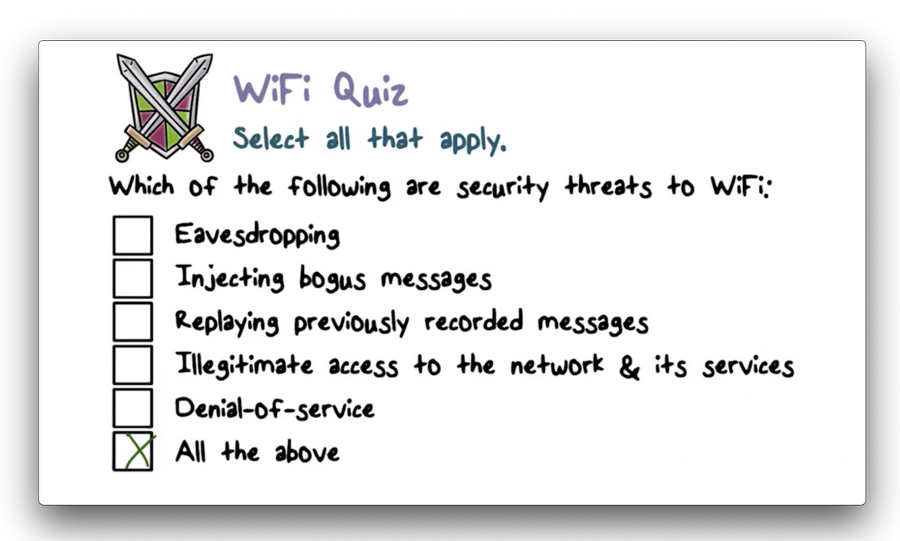
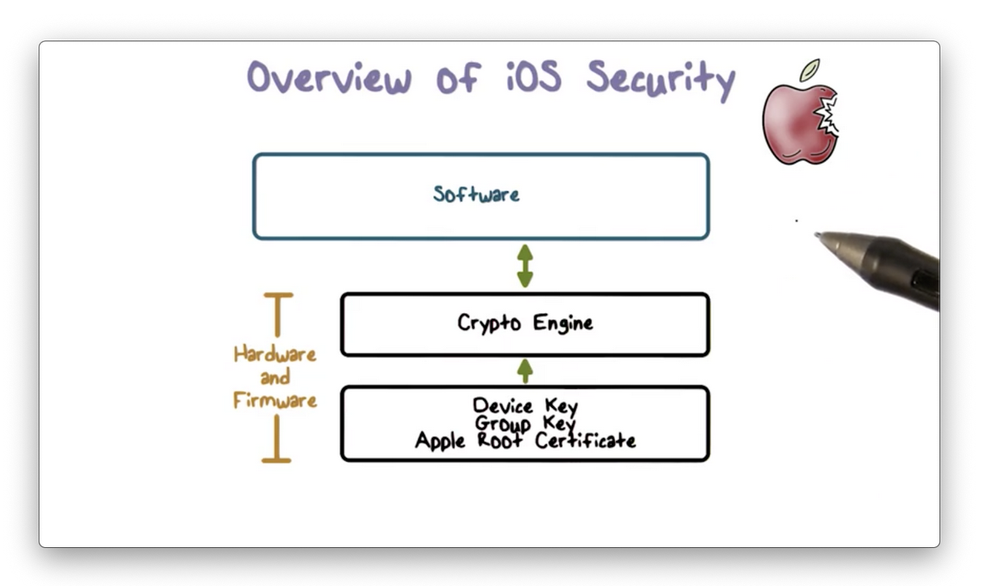
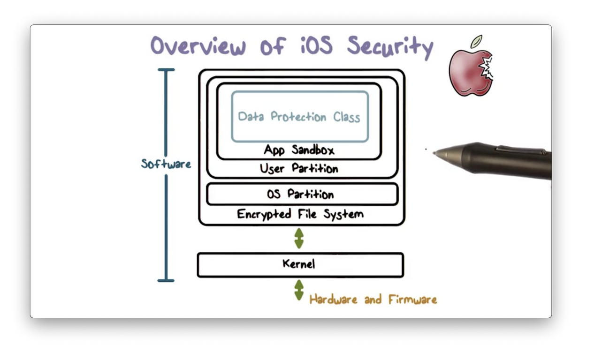
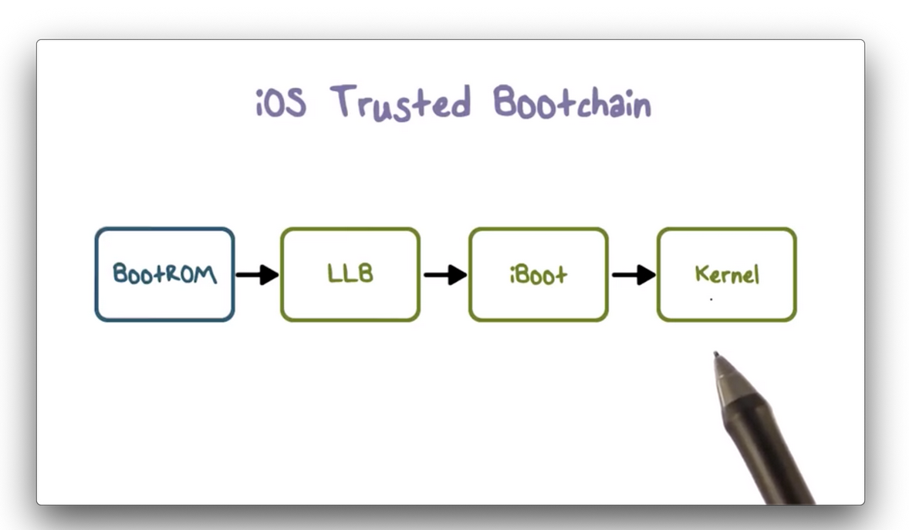
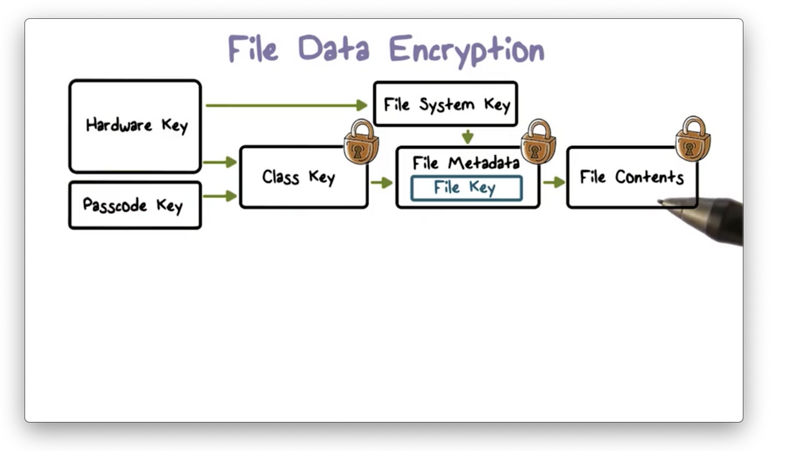
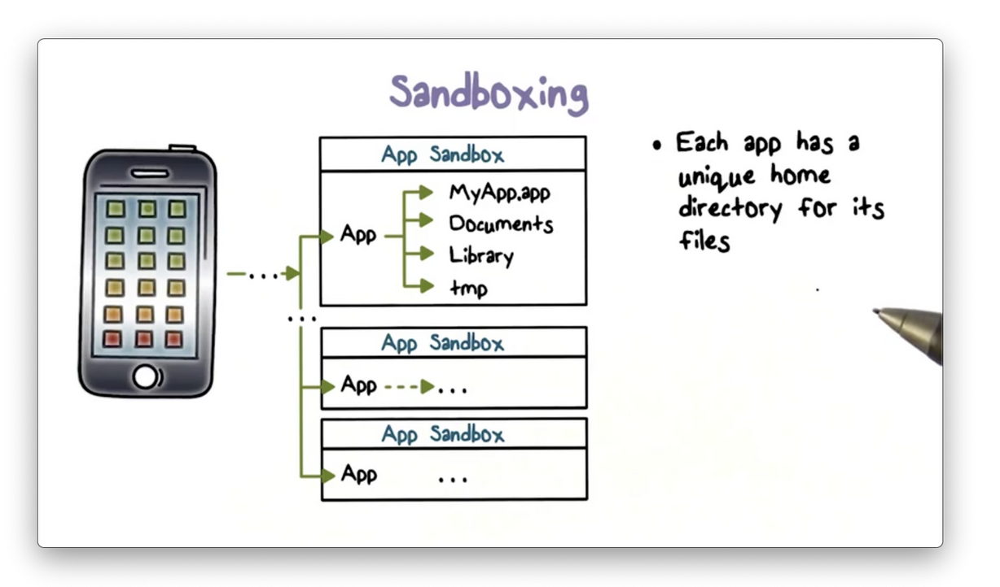
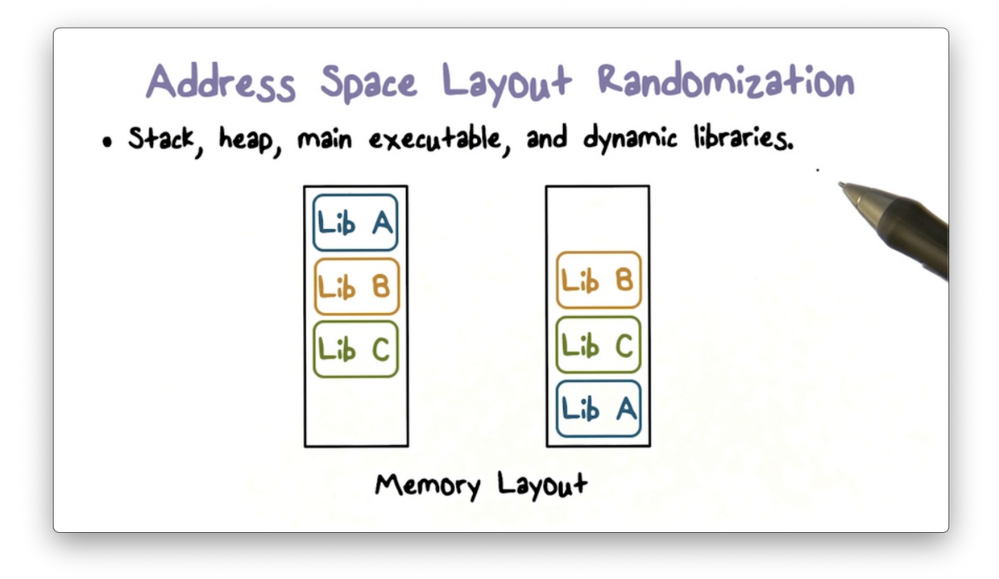
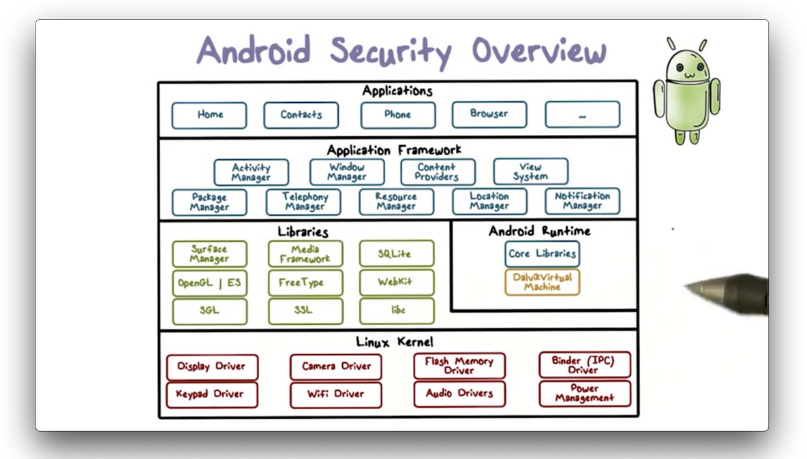
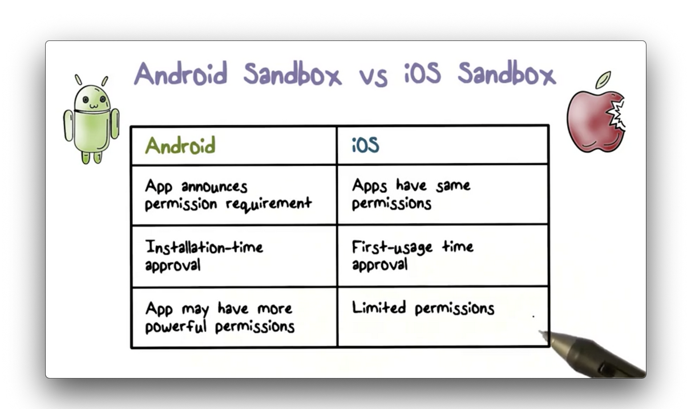

# Week 12 - Wireless and Mobile Security

**Introduction to WiFi**

A typical use of WiFi is to allow WiFi-enabled personal computers to access the internet through a wireless access point (AP).

Devices connect to the AP wirelessly, and the AP connects to the internet through physical wiring, often through a router provided by the ISP.

In wireless networking, data is not transmitting through the physical wiring, but rather, through the air, which is an open medium. There is thus no physical protection in wireless communications.

Without hard wiring two devices for direct communication, devices in a wireless environment must use broadcasting, that is, a sender must broadcast a message, and a receiver must be listening for a broadcast.

**Overview of 802.11i**

**802.11i **is the new secure standard which **WiFi Protected Access 2 (WPA2)** implements.

This standard enforces access control, and the underlying access control is based on another standard (802.1x). 802.1x is based on the **Extensible Authentication Protocol (EAP)**.

EAP is designed as a carrier protocol whose purpose is to transport the messages of "real" authentication protocols, such as TLS. 

The more advanced EAP methods, such as TLS, provide mutual authentication, which limits man-in-the-middle attacks by authenticating both the server and the client. 

Additionally, 802.11i follows strong security practices. For example, it uses different keys for encryption and integrity protection, and also uses more secure encryption schemes - AES in particular.

**Security of Smartphones (iOS)**

The iOS security architecture combines both hardware and software features to provide security to iOS devices.

The architecture contains** built-in cryptographic capabilities** - for example,** the cryptographic engine and keys are embedded into the hardware** - for supporting data protection via confidentiality and integrity.

The architecture also provides powerful isolation mechanisms. For example, it uses app sandboxing to protect app security. These sandboxes enable apps to run in isolation, free from interference from other apps. Additionally, sandboxing helps to ensure the integrity of the overall system.

**Hardware Security Feature**

Each iOS device has a dedicated AES-256 cryptographic engine built into the direct memory access path between the flash storage and the main system, memory, which makes file encryption/decryption highly efficient.

The device's id (UID) and group id (GID) are AES 256-bit keys fused into the secure enclave hardware component during manufacturing. Only the cryptographic engine, itself a hardware component, can read these keys directly. All other firmware and software components can only see the result of the encryption or decryption operation.

A UID is unique to the device and is not recorded by Apple or its suppliers. GIDs are common to all processors in a class of devices, and are used for tasks such as deliver system installations and updates.

**iOS Trusted Bootchain**

iOS uses a trusted bootchain to establish the security of an iOS device on boot. Each step in the bootchain only executes once the previous step has verified it.

**

**

When an iOS device is turned on, each application processor immediately executes code from a section of read-only memory known as the BootROM. This immutable implicitly-trusted code, known as the hardware root of trust, is burned into the hardware during chip fabrication.

The BootROM code contains the Apple root CA public key, which is used to verify that Apple has signed the low-level boot loader (LLB) before allowing it to load. When the LLB finishes its tasks, it verifies and runs the next stage boot loader, iBoot, which in turn verifies and runs the iOS kernel.

This secure bootchain helps ensure that the lowest levels of software are not tampered with.

**File Data Encryption**

In addition to the cryptographic capabilities built into the hardware of each iOS device, Apple uses a technology called data protection to further secure data stored in flash memory.

Data protection enables a high level of encryption for user data. Critical system apps, such as Messages, use data protection by default, and third-party applications receive this protection automatically.

Data protection constructs and manages a hierarchy of keys, such as class, file and filesystem keys - that build off the hardware encryption technologies built into each iOS device.

Each time a file is created, the data protection system generates a new 256-bit file key, which is given to the hardware AES engine. The engine encrypts the file using this key, via the CBC mode of AES - every time the file is written to flash memory.

Every file is a member of one or more file classes, and each class is associated with a class key. A class key is protected by the hardware UID and for some classes, the user's passcode as well. The file key is encrypted with one or more class keys, depending on which classes the file belongs to, and the result is stored in the file's metadata.

The metadata of all files in the filesystem is encrypted using the same random key: the filesystem key. The system generates this key when iOS is first installed.

When a file is opened, its metadata is decrypted first using the filesystem key, which reveals the encrypted file key. Next the file key is decrypted using one of the class keys. Finally the file key is used to decrypt the file as it is read from flash memory.

**Mandatory Code Signing**

The iOS kernel controls which user processes and apps are allowed to run. iOS requires all executable code to be signed with an Apple-issued certificate to ensure that all apps come from a known and approved source and have not been modified.

By requiring all apps on the device to be signed, iOS extends the concept of _chain of trust_ from the kernel to the apps and prevents third-party apps from uploading unauthorized code or running self-modifying code.

A user-space daemon examines executable memory pages as they are loaded by an app to ensure that the app has not been modified since it was installed or explicitly updated.

**Restricted App Distribution Model**

A developer must first register with Apple and join the iOS developer program if they want to develop apps for iOS devices. Apple verifies the real-world identity of each developer - whether an individual or business - before issuing a certificate.

Developers use their certificates to sign their apps before submitting them to the App Store for distribution, which means that every app in the App Store can be traced back to an identifiable entity. Associating apps with the real-world identities of their developers serves as a deterrent to submitting malicious code.

Furthermore, Apple reviews all apps in the App Store to ensure that they operate as described and requires iOS devices to download apps exclusively from the official Apple App Store.

The restricted app distribution model, combined with app signing, makes it very difficult to upload malware to the App Store.

**Sandboxing**

Once an app resides on a device, iOS enforces additional security measures to prevent it from compromising other apps of the rest of the system.

Each app receives a unique home directory for its files, which is randomly assigned when the app is installed. This directory serves as a sandbox, that is **iOS restricts apps from accessing information outside the directory**.

If a third-party app needs to access external information, it must use services explicitly provided by iOS. This prevents unauthorized access of modification of information it does not own.

Additionally, the majority of iOS processes, including third-party apps, **run as a non-privileged user, ****mobile****,** which does not have access to crucial system files and resources. The iOS APIs do not allow apps to escalate their own privileges to modify other apps or iOS itself.

Finally, the entire iOS partition is mounted as read-only, and unnecessary tools such as remote login services are not included in the system software.

**Address Space Layout Randomization (ASLR)**

iOS has several other runtime security measures. One such measure is [address space layout randomization](https://en.wikipedia.org/wiki/Address_space_layout_randomization) (ASLR), which protects against the exploitation of memory corruption bugs.

A common class of attack - which includes the [return-to-libc](https://en.wikipedia.org/wiki/Return-to-libc_attack) attack - involves an attacker estimating the addresses of nearby system functions and calling these functions to perform malicious actions or escalate privileges.

As a countermeasure, iOS randomly arranges the different program components in memory upon app initialization. This randomization makes it virtually impossible for an attacker to locate a useful library function to exploit.

**Data Execution Prevention**

Another runtime security feature that iOS provides is data execution prevention. Data execution prevention is an implementation of the policy that makes writeable and executable pages mutually exclusive. This prevents code-injection attacks.

**Android Security Overview**

Android is implemented as a software-stack architecture, consisting of a Linux kernel, a runtime environment with corresponding libraries, an application framework, and a set of applications.

The Linux Kernel sits at the lowest level of the architecture stack and provides a level of abstraction between device hardware and the upper layers of the stack.

Apps are commonly written in Java, which is first compiled to JVM bytecode and then translated to bytecode that runs on the [Dalvik Virtual Machine (DVM)](https://www.javatpoint.com/dalvik-virtual-machine) (an android virtual machine optimized for memory, batterylife and performance in mobile devices).

The Android core libraries are Java-based libraries that are used for application development. Most of these libraries do not perform any work but instead serve as thin Java wrappers around a set of C and C++ based libraries.

The application framework is a set of services that collectively form the environment in which Android apps run. This framework allows apps to be constructed using reusable, interchangeable and replaceable components.

Furthermore, an individual app can publish components and data for use by other apps.

**Application Sandbox**

Apps that run in virtual machines are essentially sandboxed in runtime. Sandboxed apps cannot directly interfere with the OS or other apps. Each app is granted a set of permissions at install time and can only perform operations permitted by these permissions.

Android assigns a unique ID (UID) to each app and runs it with that UID in a separate process. The kernel enforces security between apps and the system at the process level through standard Linux facilities.

**Code Signing**

Android also takes a very different approach than iOS in terms of code signing. In particular, all Android apps are self-signed by developers. A developer can create a public key, self-sign it to create a certificate, and then use the key to sign apps.

There is no central authority that signs third-party Android apps, and there is no vetting process for third-party app developers. Anybody can become an Android app developer, self-sign their apps, and upload them to the Google Play Store.

While Apple uses code signing to identify developers and verify app executables, Android uses code signing for different purposes.

Specifically, Android devices use code signing to ensure that updates for an app are coming from the same developer that created the app. Additionally, code signing helps manage the trust relationship between apps so that they can share code and data.
