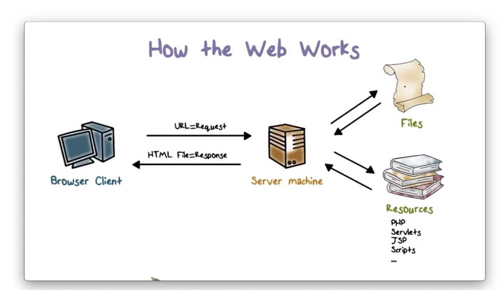
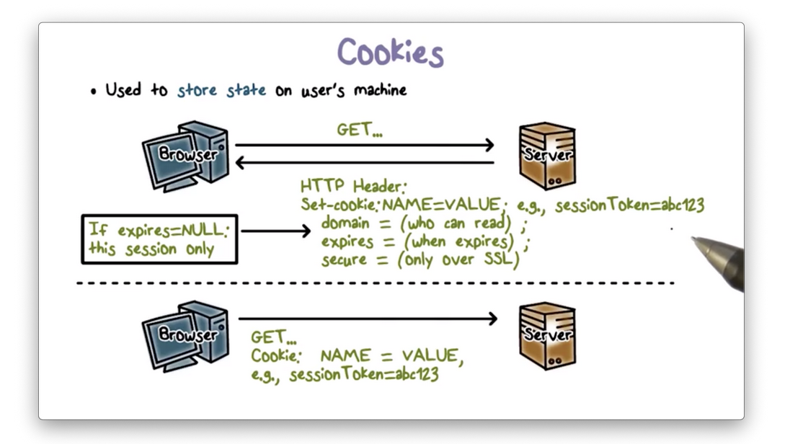
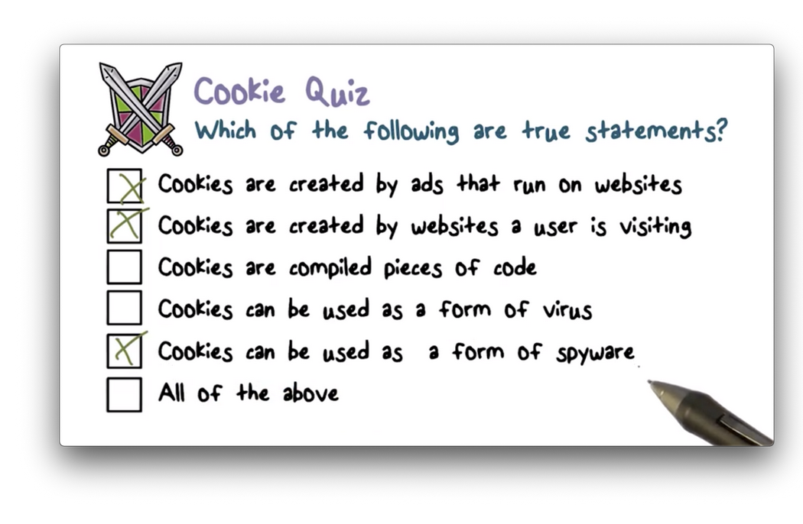
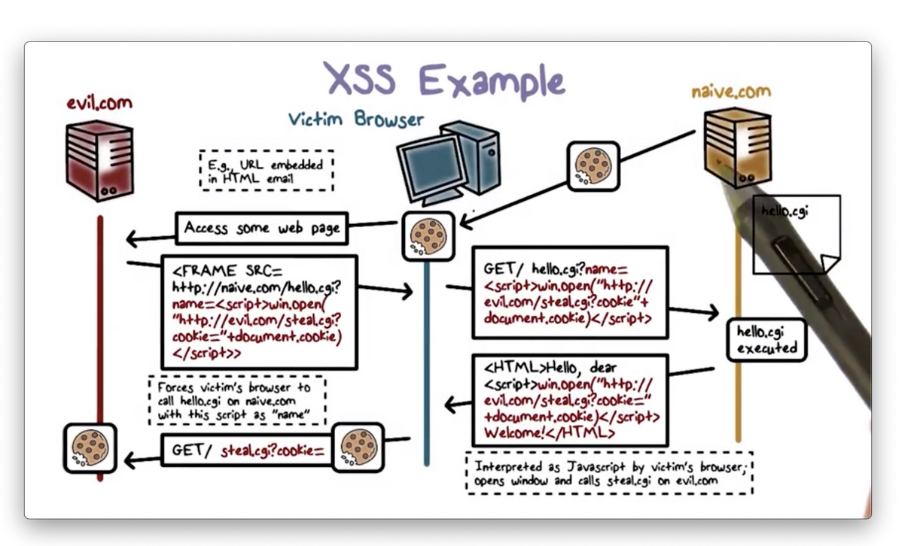
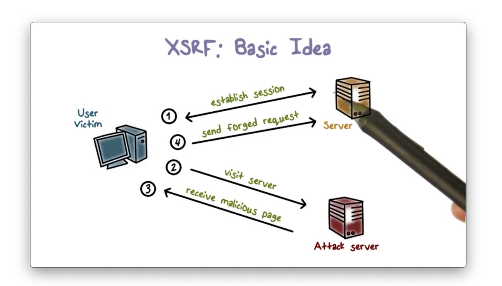
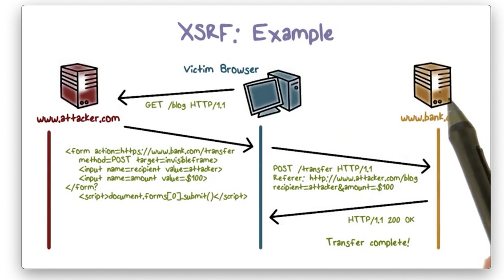
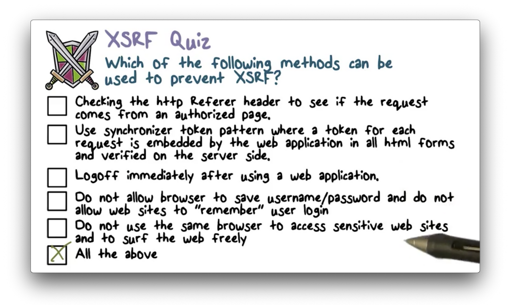
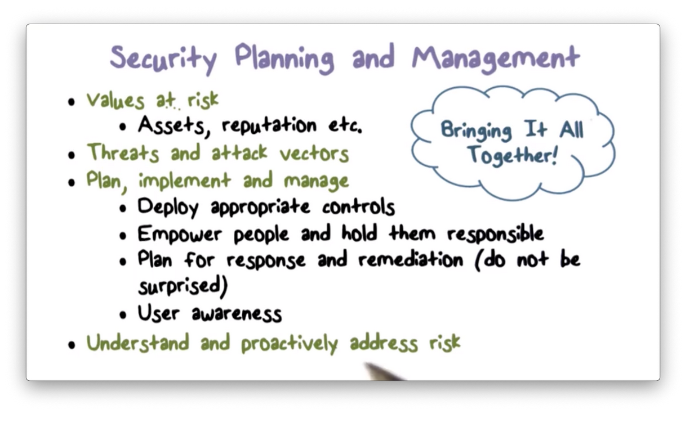

# Week 13 - Web Security and Security Management, Law and Ethics

**Web Security**

**

**

**

**

**

**

Each HTTP request uses its own HTTP connection, that is, **HTTP is a stateless protocol**.** Browsers and servers use cookies** as a way of carrying information, such as user authentication/session state, across multiple HTTP requests.

**Cookies are small strings of text** that web server can create as part of an HTTP response using the **Set-cookie **HTTP header. They are essentially key-value pairs.

In addition to the key-value pair itself, a cookie also contains some metadata including expiration information, domain information and security requirements for transmission.

Browsers store cookies and include them in subsequent requests as a way to create and preserve state over stateless connections.

**Cross-Site Scripting (XSS)**

**

**

Many websites, including social networking sites, blogs, forums, and wikis display user-supplied data. Hackers can exploit this feature to inject malicious code into the browser. If the input is not scrubbed, the browser will run the malicious code.

In a **cross-site scripting (XSS) attack**, an attacker tricks the browser into executing malicious scripts without the user's knowledge.

1. The user logs into a vulnerable site, naive.com.
2. The attacker directs the user to evil.com, which returns a page containing a hidden iframe.
3. The iframe forces the browser to visit 
4. hello.cgi at naive.co then echos the malicious script into the HTML page sent to the user's browser.
5. The browser displays the HTML page and executes the malicious script, which steals the users's cookie to

**

**

**Cross-Site Request Forgery (CSRF)**

**

**

When a user logs in to a site, the server usually writes a cookie to the user's browser that contains session authentication information for that user on that site.

The cookie lives in the user's browser as long as they keep the session alive. Once they log out of the website, the server resets the cookie.

If a user browses to a malicious site in the middle of their session with a trusted site, a script on the malicious site can potentially read the user's cookie to the trusted site and use ti to forge a request to that site. This is a cross-site request forgery.

The user never sees the malicious request, since the malicious site often triggers it from a hidden iframe. 

1. The user logs in to 
2. When the user visits attacker.com, their browser downloads and executes the malicious page. The scripts on this page direct the browser to make a request to 
3. Since the user is still logged into bank.com, their browser also sends the

**CSRF vs XSS**

**

**

In cross-site scripting, an attacker injects a script into a badly-implemented website that does not validate user input. As a result, when a user visits this website, their browser downloads and executes a malicious script.

In cross-site request forgery, an attacker forges user requests to a website. As a result, the website executes the attacker's malicious actions as if they were initiated and authorized by the user. 

**Structured Query Language (SQL)**

**

**

Many websites contain forms that users fill out with information that they want the database to persist. When a user submits form data, the web server typically runs a program to transform the data into a SQL query, and then sends the query to the database server for execution.

The security threat here is that **specially crafted input can generate malicious SQL queries that can lead to compromise of data confidentiality and integrity**.

**Cyber Security**

**

**

A business must take inventory of their assets to understand which assets are valuable. These assets include servers, routers, switches, laptops, and mobile devices.

In addition to the physical assets themselves, a business needs to consider the software utilized by these assets; for example, the operating systems running on the servers, laptops and mobile devices; the databases that store large amounts of data, and; the services and applications running on these devices.

The organization must concern themselves with the data stored in the system, whether structured data that lives in databases or unstructured data in files in the filesystem. Some of this data, such as intellectual property, financial records, or customer information, can be sensitive and, therefore, may require additional security measures.

**Security Controls**

**Identity and Access Management** (IAM) is a popular security control. The “identity” part of IAM serves to identify a user who is requesting any type of resource present in the system. The “access management” component of IAM serves to perform access control on the resource, ensuring that a user has sufficient permission to access the resource they have requested.

Credentialing is another security measure that concerns resource access. When a business provides a user with a credential, the credential serves as a proxy for the user’s identity, allowing them to access resources without explicitly identifying themselves each time.

Firewalls, MFA, and VPNs are other examples of security controls.

**Quantifying Cyber Risk**

For a probability P and impact I, we can define **risk exposure** R = PI. For example, given a 50% chance of an adverse security event that is going to cost $10 million, the risk exposure is $5 million.

Given a pre-implementation risk pre and a post-implementation risk post and an implementation cost cost for a particular security measure, we can define **risk leverage**L = (post - pre) / cost.

Naturally, a business wants to choose controls that maximize their risk leverage. Any control under consideration should have a risk leverage higher than one; otherwise, the cost of the control is higher than the amount of risk it reduces

A cybersecurity champion, such as a CISO, needs to make their case to upper management to **justify the security policies they want to implement**. This task can be difficult for two reasons: first, **risk is difficult to quantify, and, second, cybersecurity does not make money.**

The primary economic argument for cybersecurity is based on return on investment (ROI), not revenue generation. For example, an investment of $5 million in cybersecurity that shields an organization from a $10 million security incident is a worthwhile spend.

**Law, Ethics and Privacy**

**

**

The first U.S. law related to cybercrime and illegal online activities is the **U.S Computer Fraud and Abuse Act** (CFAA). The goal of this act was to define what types of online actions constitute criminal activity and then outline sanctions against those actions.

The CFAA primarily focuses on unauthorized access to computers and the data contained therein. Attackers who break into systems can alter the confidentiality, integrity, or availability of the data on these systems. Additionally, they can tamper with the integrity and availability of the service itself, rendering it unable to carry out its functions on behalf of its user. Since computer systems and computer data are valuable, we would like to protect them from these kinds of activities.

Additionally, the CFAA makes it illegal to distribute malware or other software that allows a user to gain unauthorized access to a computer system.

**DMCA**

**

**

The **Digital Millennium Copyright Act** (DMCA) concerns intellectual property and digital content. The problem it helps to address is **piracy** - the illegal copying and theft of digital objects.

DMCA says that content creators can copyright their digital objects. As a result, these objects can now receive the same protections as copyrighted objects in the non-digital world.

Additionally, DMCA makes it a crime to circumvent or disable any measures concerning copyright protection and anti-piracy. Not only that, but DMCA also makes it a crime to manufacture and distribute any software or device that can disable anti-piracy protections.

The DMCA does have space for some exceptions, primarily for research and educational purposes. For example, if you are researching the strength and security of an anti-piracy measure, you may need to tamper with that measure deliberately. Additionally, libraries can generally make some limited number of copies of digital objects without being considered in violation of the law.

**Privacy**

**Privacy** refers to the ability of an individual to control the data about them that is collected and shared.
