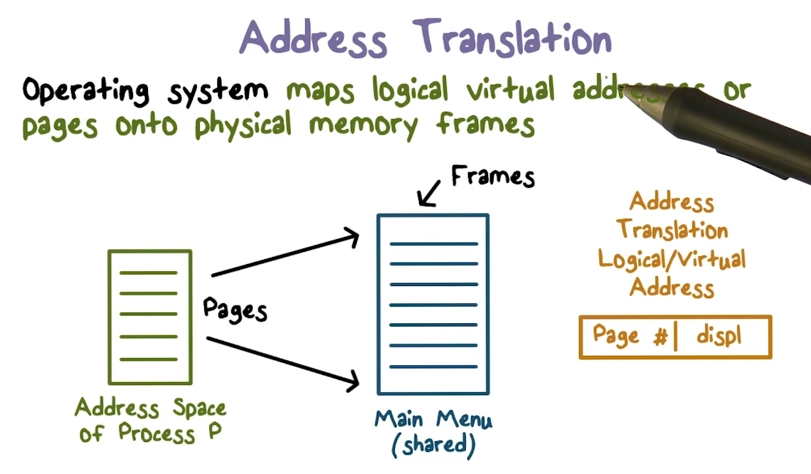

# Week 2 - Operating System Security and Authentication

Watch Lectures

* Operating Systems
* Authentication

Read OMSCS Notes

* Operating Systems
* Authentication

Take Quiz 2 by Sunday

**Operating System Lectures**

The OS plays a critical role in protecting resources in a computing system. It makes use of hardware functionality to isolate itself from untrusted user code.

Hardware is where we have our real or physical resources, the operating system controls access to the hardware resources, and the resources are made available to the applications.

The Operating System

* provides 
* provides 
* provides

**Why do we need to trust the operating system?** The trusted computing base. 

* Because we give it direct control to all of the physical resources.

The requirements that need to be met for a trusted computing base are:

1. **Complete mediation**
2. **Tamper-proof**
3. **Correct**

How does the Operating system grant access to protected resources?

* First it establishes the source (
* Check if the user is 
* Mechanisms that allow various

How can we trust an Operating System?

* Hardware support for 
* Hardware support for 
* **Privileged instructions**

**Operating System Review**

**System Calls** allow you to go (transfer control) from user mode to OS/System mode. System calls are a set of calls that user level programs are allowed to make and they are defined by the API presented by the Operating System. The privilege ring changes when call and return happens.

In x86, there are explicit instructions: **sysenter/sysexit**, that execute or exit a system call. 

System calls are accompanied by a processor privilege ring change on system entry or exit. Crossing the boundary means that the OS will have to change some data structures to keep track of memory mappings, because we will be able to access memory now that we couldn't before.

Untrusted user code has to be isolated from the system code. **Isolation is achieved using hardware support for memory protection**.

**Attacking firmware** is one of the best ways to exploit modern computer systems. An example of this is the Thunderstrike attack which attacks the thunderbolt interface in OS X. This attack injects new firmware. 

**Address Spaces **are a unit of isolation. It is an abstraction of physical memory, and it is the running program's/processes view of the memory in the system.

**Logical****addresses** are the virtual address in an address space that map to some type of actual physical memory space. Often times, OS give processes the illusion that they have access to all of memory, when in reality other processes are using it as well.

In the context of isolation within processes, we don't want processes to be able to access the memory allocated to other processes.

**Paging** is a technique that splits up address spaces by certain-sized chunks. You can think of a logical address as a page number and a displacement in bytes. Which will correspond to where it exists in the chunk of memory that is the page. 

A **page table** is what is used to map logical addresses to physical addresses. Page tables are managed by the OS. **The translation to a physical place in memory is only possible through the page table, so in effect, it defines what areas of physical memory are accessible.**

An OS will not map a** virtual page of process A to a physical page of process B** unless explicit sharing is desired. Why? because it's page table will not have a mapping to process B's pages.

The hardware that supports this behavior is called the Processor **Memory Management Unit (MMU)**, which uses page tables to resolve virtual address spaces to physical addresses.

**RWX bits **on pages **limit the type of access** to addressable memory.

**

**

**Non-executable stack** is one valid way to reduce code exploitation from stack overflow. How does this work? The page table entries have execution permission turned off.

We can i**solate the operating system from untrusted user code** using the same memory isolation principles that we've been discussing. 

**The Kernel resides in a portion of each process's address space. **This is true for every process. The only way for processes to interact with the kernel is to use system calls. 

For 32-bit linux systems: the address space is 4GB. The lower 3GB are for user code/data, the top 1GB is for the kernel.  These two spaces correspond to x86 privilege ring transitions.

**Memory protection and isolation relies entirely on page table management.** This should only be done by the operating system. 

How do we implement complete mediation? We **make sure that no protected resource can be accessed without going through the Trusted Computer Base** (kernel). The TCB acts as a reference monitor that cannot be bypassed.

**User code cannot access physical resources because they require privileged instructions **which can only be executed in system mode. 

At the user level, the OS virtualizes physical resources and provides an API for these resources.

* File - an abstraction for storing persistent data on disk.

Virtual resources must be translated to physical resource handles which can only be done by the OS. This translation ensures complete mediation. 

One way to **limit the damage to a hacked OS** is to use a Hypervisor to sit between the hardware and the operating system. If a guest operating system is hacked, it limits the damage to only applications running on the virtual machine for that guest OS. 

This is an example of isolation between virtual machines. The trusted computing base is no longer the operating system, it is the Hypervisor. 

**Authentication**

Int he last lesson, we observed that the role of the operating system in computer security is to be a request monitor. It must check what the source of the request is. 

**Authentication** helps us answer this question. **It tells us on whose behalf a process is running that is making a request from the OS**.

An OS or the TCB needs to know who is making a request for a protected resource. A process that makes a request does it for a certain user. 

**Authentication** helps us answer the question, **on whose behalf is the requesting process runs**. 

Typically, the claims about identity of the user come from when you log into your computer. 

**How is Authentication implemented?**

**

**

1. Something a user knows (password)
2. Something a user has (token, smartcard, key fob)
3. Something the user is (fingerprint, voice, biometric)

The hardware/os must provide a trusted path  (an ability to verify that you are interacting with who you think you are interacting). 

How do we **implement password authentication**? We use a** one-way hash function** and store this result associated with the user. 

One of the main security threats with hashed password files is that that they will be stolen/exfiltrated and then hackers can use brute force methods to guess the passwords.

The smartest way to brute force passwords is to do a frequency analysis of the hashes and create a rainbow table. 

A r**ainbow table** is potential passwords and the corresponding hash values. 

One way to avoid frequency analysis is to add a random value to the password before the hashing. This is called **salting**. We will need to store the salt. 

With touch screen passwords, there is a bias in starting at a point near the top left of the screen. Also, the ease of moving from current to next point also introduces a bias.

There are plenty of problems with passwords

* as password length and complexity increases, usability suffers
* phishing and social engineering, users do not authenticate who is asking for a password
* Once a password is stolen, it can be used many times, this is why we have policies that say passwords must be changed frequently.
* Humans have a hard time remembering lots of passwords

Avoid hash functions, why? Brute force attackers have to run the hash again and again. The system admin only needs to run it once when they are saving the user's password initially. Using a slow hash function will make brute forcing a pilfered file much harder.

Authentication with token-based methods uses secrets to authenticate a user. 

**Multi-factor authentication** combines many different methods. 
