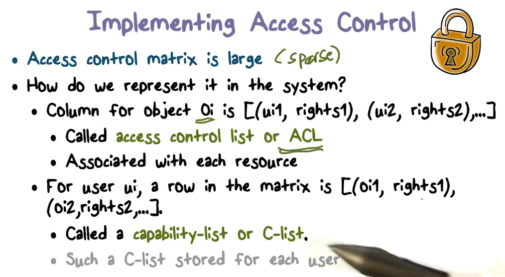
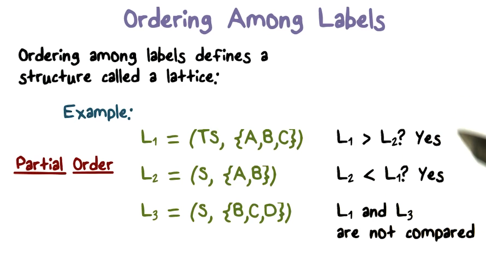
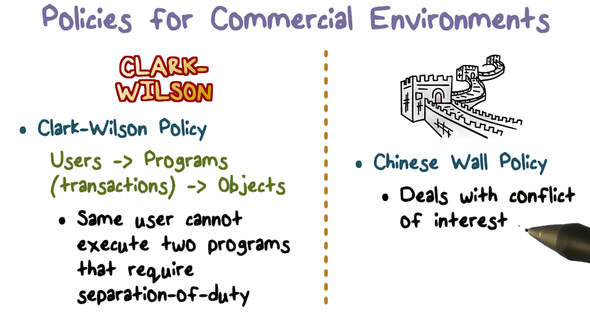

# Week 3 - Access Control and Mandatory Access Control

Watch Lectures

* Access Control
* Mandatory Access Control

 Read Recommended Reading

* Trusted Computing and Multilevel Security

Read OMSCS Notes

* Access Control
* Mandatory Access Control

Project 1 - Part 2

* Read Assignment
* Slice Up Responsibilities
* Submit

 Quiz 3

**Access Control Lectures**

**Access Control** is the **process of verifying whether a user has access to what they are requesting**.

So how does a TCB decide whether or not a request should be granted? It needs to see what the **source** of the request is and what the **target** is. 

**Authentication** establishes the source of a request. 

**Authorization **or access control answers the question if a certain source of a request (User ID, PID, etc) is allowed to read the file.

In many systems, a subject who creates a resource should be able to control access to it. 

**Controlling Access to Resources**

There are two parts to the access control problem:

1. Someone has to decide who should have access to certain resources (
2. **Enforcement**

**Complete mediation is essential** for successful enforcement.

**Access Control Matrix (ACM)**

An access control matrix abstracts the state relevant to access control. 

* Rows of ACM correspond to users/subjects/groups.
* Columns correspond to resources that need to be protected.

ACM thus defines who can access what! 

* ACM[U,O] defines what access rights user U has for object O.

In **discretionary access control**, the owner of a resource decides who can access the resource.

**Implementing Access Control**

Access control matrix is large but sparse (many of the entries will be null). **How should we represent it in the system**?

One way to model the matrix is with a list for an object (column). This is called an **access control list**, and it defines the users that have access to it.

Another way is to focus on the rows, and define a list of objects for each user. This is called **a capability list or a C-list**. 

Both Access Control List and C-lists can be implemented with Linked Lists.

**Comparing ACL to C-list**

ACLs **should be stored in the trusted part of the system** (probably the OS). ACLs are sometimes stored with object meta-data. Remember, **checking access requires traversal of the ACL**. 

**Most operating systems use ACLs over C-lists. **

The natural place of a C-list is not where an ACL is stored. The system needs to store a catalogue of capabilities that defines what a certain user can access. Sharing requires propagation of capabilities. **A capability is an unforgeable reference/handle for a resource**. When you have a capability, you don't need to do an access check, you have the handle to the resource.

* **Efficiency**
* **Accountability**
* **Revocation**

**A negative access right trumps positive access rights.**

**Access Control in Unix-like Systems**

In Unix, **each resource looks like a file.**

**Each file has an owner** (UID) and access is possible for **owner, group** and everyone.

**Permissions** are some subset of **read, write or executed **(access control policy).

**Setuid** is a special type of file permission that permits users to run certain programs with escalated privileges. It's a way to give temporary permission to the resource. When a setuid file is set, during execution, the effective uid is the owner of the file. 

When you try to open a file, the file either needs to be present in the file meta-data table, or it needs to be loaded into it. If a file is active, there will be a file control block (the metadata table).

The open file table is a per process entity that stores the block from the file-metadata table. The** file descriptor passed by the open system call will actually be an index into the open file table**.

The ACL lives in the block in the file-metadata table. **The ACL is checked before the file handle is returned**. 

The **descriptors point to a per-process file table**. Other users will not be able to see this table.

**Role-based Access Control**

A **role is your function in an organization** and it governs what kind of files you can access.  This is called **role-based access control**.

One benefit of RBAC, is that the policy is static, and not tied to users. Thus when a user leaves or joins the organization, they can automatically be assigned a policy. 

Roles are typically resource-related, while groups are more user-related.

**Mandatory Access Control**

The access control we talked about last session was **discretionary access control**, where the user creates the resources and decides who you want to share it with, today we will talk about** mandatory access control**, where organizations determine the use of resources is accessed. 

There are two main **problems with Discretionary Access Control**:

1. You 
2. In many organizations,

Mandatory Access Control helps address these problems.

The users who create information should not decide who gets access to the information. A hospital is a good example, the scribe shouldn't be owner of the patient's information.

**Implementing MAC**

MAC requires **labels**. Both resources and users should have labels attached to them. They **indicate the sensitivity/category of data or the clearance/need-to-know requirements of users**.

In MAC, the TCB associates labels with each user and object and checks them when access requests are made. The exact nature of labels depends on what kind of model/policy is implemented.

**Comparing labels**

**

**

The mathematical structure that models labels is a **lattice**.

**Using Labels for MAC: Confidentiality - The Bell and La Padua Model**

**

**

**Why write-up?** More sensitive information should not flow to users who are not cleared at that level. It does not specify anything about writing.  I**f however, you have a high-level of clearance, you should not be able to write anything below your clearance, because you might share information that other's below you don't have**.

The **tranquility principle** in the BLP model states that **classification of a subject does not change during a session**.

**Other MAC models**

**Biba model **is similar to BLP except it focuses on **integrity instead of confidentiality**. The rules are opposite of BLP, Read-up and Write-down.

User clearance is not a common model for commercial environments. Other requirements however exist, and these are detailed above.

The **Clark-Wilson policy** makes sure that separation of duty is enforced by only giving users access to certain programs/applications.

In the **Chinese Wall Policy**, objects are put into **conflict classes**. They are separated and a user cannot access objects if they are part of the same conflict classes (i.e Chase and Wells Fargo). 

The set of all hardware and software trusted to operate securely is required to be secure in order to be a trusted security base. It is required for all other trust in the system security.

**TCB Design Principles**

1. **Least privilege**
2. **Economy**
3. **Open Design**
4. **Complete mediation**
5. **Fail-safe defaults**
6. **Ease of use**

**Data Protection**

The OS must be able to protect itself. Some security features of trusted OS's are:

* **Object reuse protection**
* **Secure file deletion**
* **Secure disk destruction - **

**Trusted Paths**

The OS must have complete mediation of access. A **trusted path** is needed from **user to secure system**. A trusted path **would prevent programs from spoofing an interface to secure components** (key-logger).

An** Audit log that shows object access**. 

**Kernel Design**

The **security kernel enforces all security mechanisms**. It needs good **isolation**, **small size** for verifiability. 

* reference monitor controls access to objects
* tamperproof, impossible to break or disable
* Un-bypassable, always invoked, complete mediation
* Analyzable, small enough to analyze and understand.

**

**

**Assurance **is the means of convincing others that a model, design and implementation are correct. Some methods of assurance validation are:

* Testing/ Penetration testing
* Formal verification validation

Regression testing is essential for changes made to the TCB.

