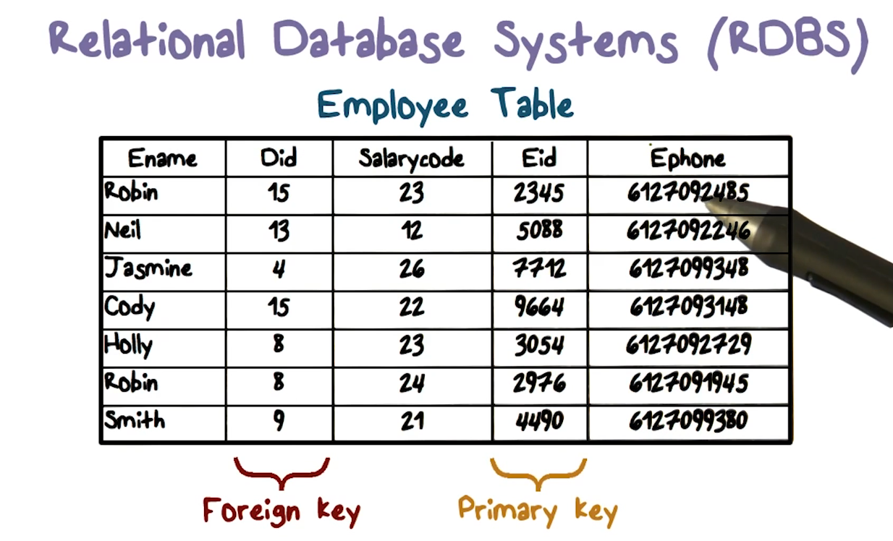
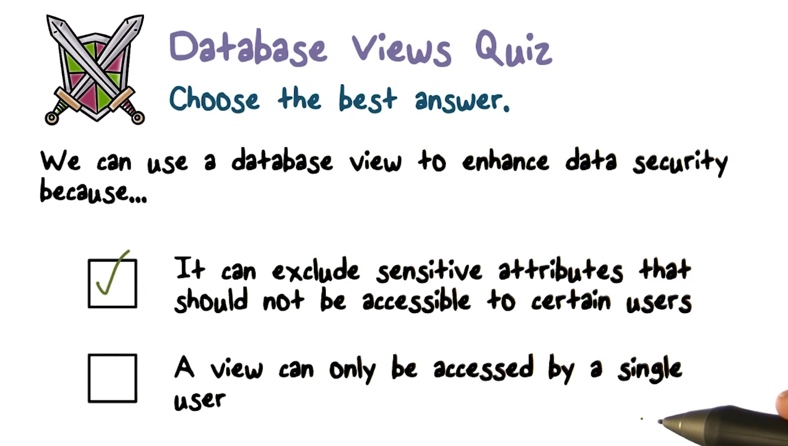
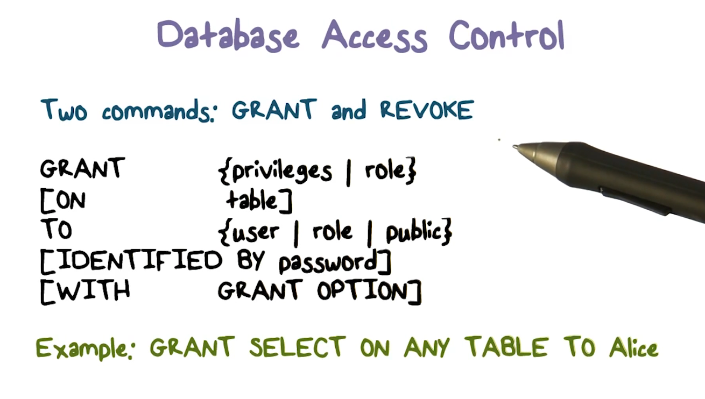
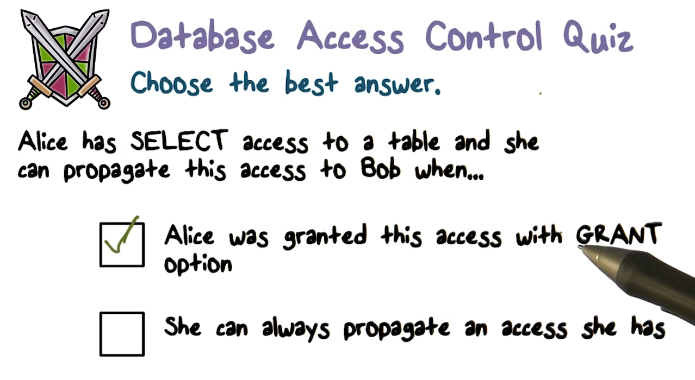
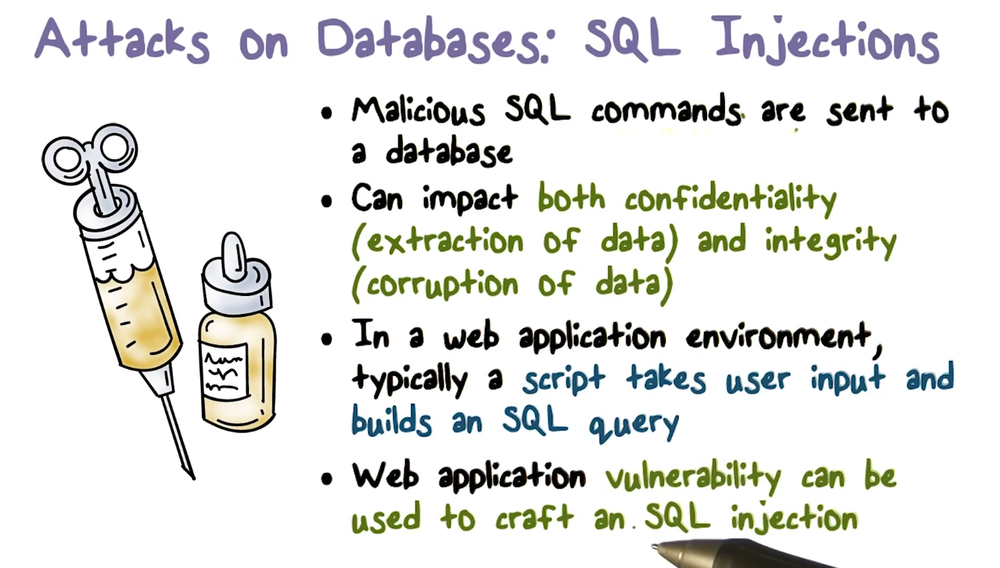
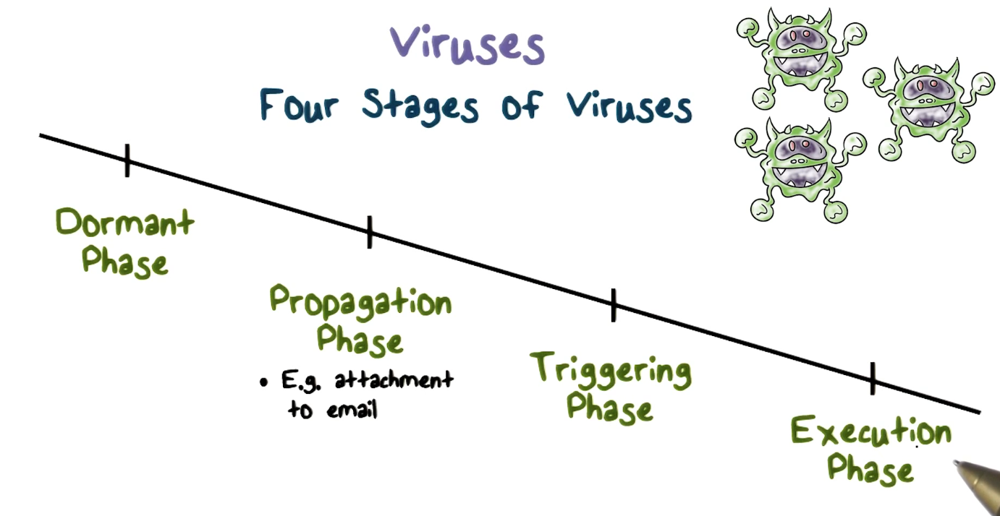
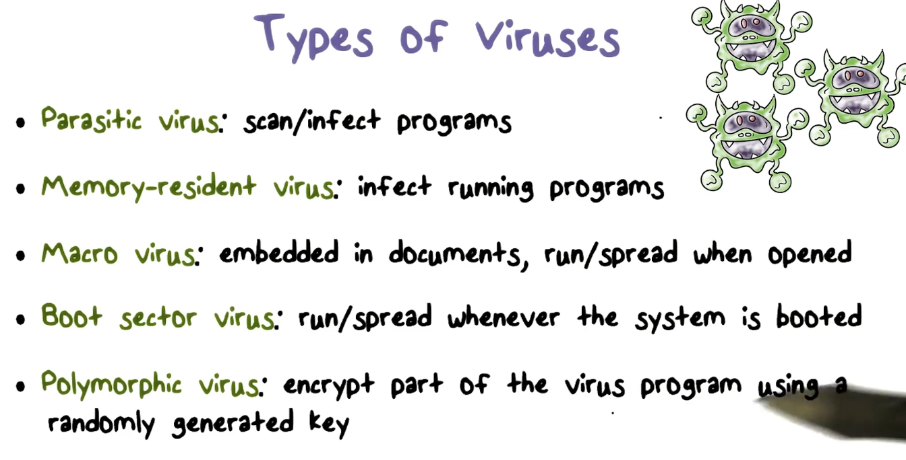
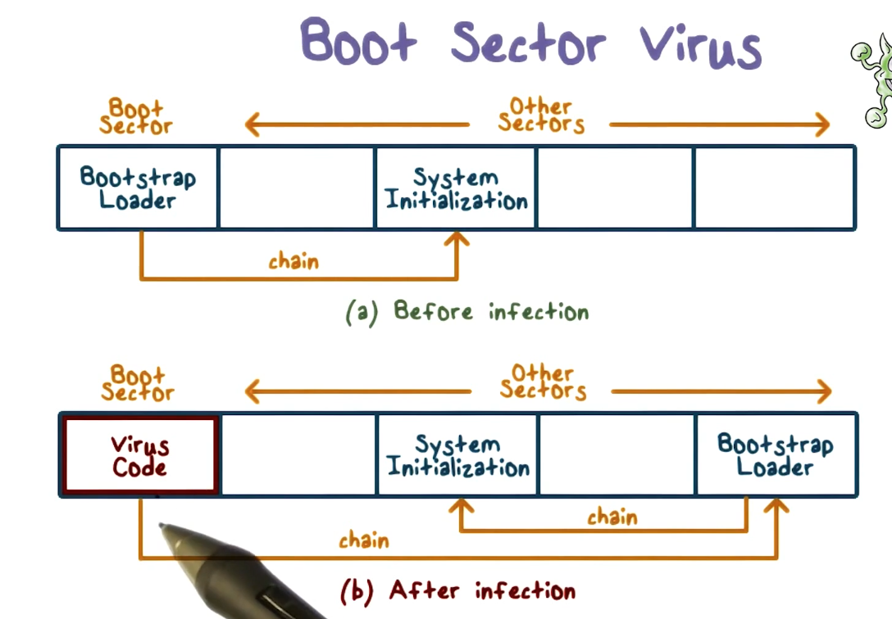
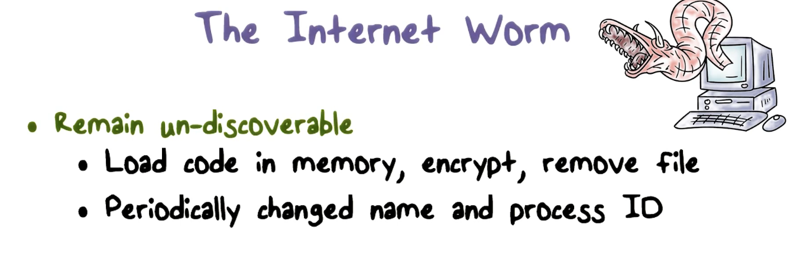
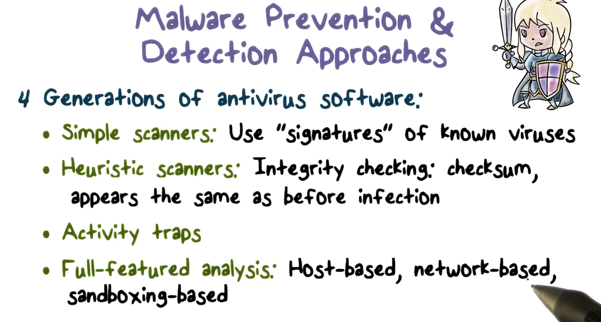

# Week 4 - Database Security and Malicious COde

**

**

**

**

**Database Security Lectures**

**

**

Major data leaks are usually caused by compromised databases.

Databases store massive amounts of sensitive data. The data is **structured** and this **influences how it is accessed**. Usually it is accessed via queries with SQL. 

Databases store persistent data. **Integrity** is established using **transactions**. 

**Relational Database Systems**

**

**

RDBS are widely used.  They consist of tables that are organized into rows and columns. Tables are defined by a schema and consist of tuples. Keys can be used to access data in the tuples.

A **foreign key** is a reference to the primary key of another table.

The operations possible on a table and its relations are

* Create
* Select
* Insert
* Update
* Join
* Delete

The big takeaway here is that a database allows you to interact with data in a slightly different way than if you are just using files (where you might only have access to creating/deleting the data). 

These operations are performed using a query language, like SQL.

**Database Access Control**

**

**

**

**

Two commands are useful for **Access Control in Databases**: **GRANT AND REVOKE**.

**Granting** can be used to give privileges or assign a role to a certain user. 

Revocations of grants should cascade.

**Database SQL Injection Attacks**

**

**

**

**

**

**

Input checking is the solution to malicious SQL injection attacks. 

**Inference attacks on Databases**

**

**

inference attacks occur when **someone who is authorized** to make queries is able to **gain access to information that they are not authorized for**. 

This can be achieved using certain aggregate/statistical queries. 

So how do you defend against inference attacks? Often times these are just clever workarounds of authorized queries.

One method is to **not allow aggregate query results when the set of tuples selected is too large or too small**.  When the tuples returned are too small, information can be "leaked" inadvertently. The example for this is if the query allows for querying based on a field that is indicative of an identity.

Another defense is transforming data by removing identifying information. This is called **de-identification/anonymization**. This means combining fields that could lead to the identification of a single person.

Example: you are taking a senior level class as a junior. What if you can filter exam grades by grade. It would be pretty easy to identify your exam score. This is a silly example, but you can image how you could this using zipcode or other seemingly non-identifying information. 

**Malicious Code Lectures**

**

**

There are two major types of malware:

1. **Needs a host program**
    1. Trap Doors
    2. Logic Bombs
    3. Trojan Horses
    4. Viruses
    5. Browser plug-ins and extensions

2. Independent malware, does not need a host program.
    1. Worms
    2. Botnets
    3. APTs (advanced persistent threats)

T**rapdoors** -** a secret entrypoint into a system**. A sequence of instructions that have been embedded by a hacker that can be activated that allows access to the vulnerable computer. They typically work by recognizing a special sequence of input. 

**Logic bomb** is essentially a trigger planted into a program. They perform malicious activities whenever certain conditions are met.

**Trojan Horse** is a piece of malicious code embedded in a utility program that a user will run. It performs some unwanted/harmful function when the host program is executed. A classic example is a keylogger.

Viruses infect a program by modifying the source code so that when the program runs, it will also run. Additionally, it will spread copies of itself into other programs.

1. **Dormant**
2. **Propagation**
3. **Triggering**
4. **Execution**

Typically, for a **virus**. **the first line of an infected program will direct to the virus program**. It is also important that there is a flag that indicates whether or not the program has been infected. If this flag doesn't exist, the program can be infected multiple times.  Then in the main program it will try to find uninfected programs, do something damaging to the system, and **then finally go to the first line of the host program so that the normal work will be done** and the user will not notice. 

A boot sector is a special sector on the hard drive of the system. When a system is loaded, a certain set of instructions are always run, the** bootstrap loader. The bootstrap loader starts the operating system.**

**

**

**

**

**

**

A boot sector virus will be run any time the system is running.

**A macro** is an executable program embedded in a document, such as a MS word document. A **macro virus **is dangerous because users don't typically suspect documents are compromised.

**Memory resident viruses** begin on the operating system level. A **rootkit **modifies OS code and data structures to do malicious things. One example is a rootkit modifies "ls" or "os" to hide malware.

**Worms** are independent malicious programs that use network connections to spread form system to system.

