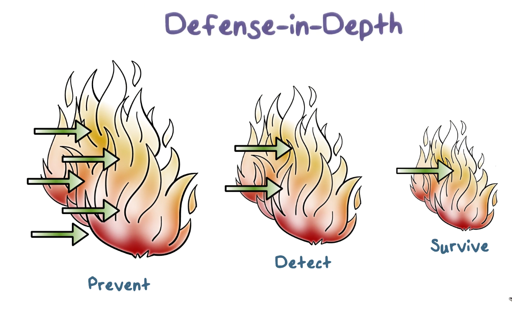

# Week 5 - Modern Malware and Firewalls

Modern Malware is sophisticated and profit-driven. It is efficient, robust and evasive.

A **botnet** is a collection of compromised computers under the control of an attacker to perform coordinated malicious activities.

Some activities of botnets are the following:

1. **Spamming**
2. **Click Fraud**
3. **Phishing**
4. **Distributed Denial of Service**
5. **Key logging**
6. **Password Cracking**

**Amplified attacks** can be very damaging. Because of their **asymmetric** nature, a couple thousand bots can launch a many gigabit attack.

How do botnets obscure the command and control address?

Many** botnets use DNS** for command and control. The malware typically hardcodes a domain. 

Botmasters prefer **dynamic DNS providers** because they allow the frequent changes of the mapping between the domain and IP addresses. This allows them to easily change  

CnC servers. 

**Anomaly detection** can be used at DNS providers to identify CnC servers. Look for high-traffic domains that are unknown by google search, this is a good sign that something shady is going on.  

**APT attacks** are typically one-off attacks on a specific target to steal very valuable information.

The most dangerous APTs are ones that use zero-day exploits. Another common pattern is to monitor network traffic for emails and use it to craft highly-specific spear-phishing emails.

Typically APTs make small-incremental changes so that they blend in.

There are two typical approaches to malware analysis.

1. **Static Analysis **
2. **Dynamic Analysis **

Most modern malware uses packing. Identifying runtime instructions that don't exist in packed code, might help us identify malicious code.

**Firewalls Lectures**

Firewalls are part of defense-in-depth, they filter-out malicious packets. 

**Defense-in-depth**, means that **multiple layers of defense** should exist in a system. 

1. **Prevention**
2. **Detection and response**
3. **Attack-resilient technologies**

**What is a firewall?**

An enterprise network is part of the internet. It is typical for an enterprise network to have an internal intranet that only employees can access. It is also typical for there to be a public-facing part, these servers live in a so-called demlitarized zone (DMZ), which is a part of the enterprise network that is separate from the trusted network. These servers don't have access to the intranet.

**A firewall is a device that provides secure connectivity between networks**. It is used to implement and enforce a security policy between networks. 

All attacks against a firewall can be considered violations of security policies. A policy is what is allowed by the organization.

In regards to firewalls, all traffic from internal network to the Internet and vice versa, must pass through the firewall. Only traffic authorized by policy will be allowed to pass.

The **Firewall Access Policy** lists the types of traffic authorized to pass through the firewall. This includes **address ranges, protocols, applications and content-types**.

Firewalls** cannot protect against traffic that doesn't pass through** it. 

Some additional useful features of firewalls are traffic volume and destination logging, they can also do network address address translation, and encryption services.

**Traffic filtering**

The main mechanism in firewalls is traffic filtering. Packets are checked against security policy and then they are either passed through or discarded.

There are two main types of filtering:

1. **Packet Filtering**
2. **Session Filtering**

**Typical Firewall Configuration**

If **dynamic protocols** are in use, entire ranges of ports must be allowed. That means ports > 1024 are left open.

This is an example of a firewall rule set that would allow Email usage. Unfortunately, there are some problems. Rule number 4 should only allow connections that are are associated with the email application. Here is  a better ruleset.

The main **advantages** of packet filtering is its **simplicity and efficiency.**

The main **weakness** of packet filtering are that it **cannot prevent application specific vulnerabilities or functions**. There is also limited logging functionality. They can also not see attacks that need a connection, because they work on a packet-by-packet basis.

In a **source IP address spoofing** attack, the attacker sends packets from an outside host but with a falsified source IP address matching an internal host. Since firewalls are typically configured to forward traffic from one internal host to another, the attacker hopes that using a spoofed internal source IP address will make untrusted external traffic look like safe internal traffic.

To counter this attack, the firewall must discard all packets with an internal source IP address that arrive on an external interface. This countermeasure is often implemented at the router external to the firewall.

In a **source routing attack**, an attacker specifies the route a packet should take as it crosses the Internet. The hacker hopes that their selected route will bypass security measures and checks along the way. The countermeasure for this attack is to configure the firewall or router to discard all packets that use this option.

In a **tiny fragment attack**, the attacker uses [IP fragmentation](https://en.wikipedia.org/wiki/IP_fragmentation) to create extremely small packet fragments and then splits the TCP header information across separate fragments. This attack is designed to circumvent filtering rules that depend on TCP header information.

Typically, a packet filter will make decisions based on the first fragment of a packet. The attacker hopes that the firewall only examines the first fragment and that the remaining fragments - containing header information that would normally cause a packet to be dropped - are passed through.

This attack can be defeated by forcing the first fragment of a packet to contain a predefined minimum amount of transport header information. If the first fragment is rejected, all of the subsequent fragments should also be rejected.

**Stateful inspection firewall**

**

**

In a stateful firewall, a packet is analyzed within a larger context. This context often consists of the other packets present in the TCP connection through which the packet is transmitted.

To evaluate an incoming packet within its context, the firewall must record and maintain information about active connections. When a new packet arrives, the firewall updates the information about the connection accordingly and then decides whether the packet should be forwarded based on this context.

An **application-level gateway** also referred to as an application proxy, is an application-specific firewall that essentially acts as a relay of application-level traffic.

To use an application proxy, a user first contacts the gateway using an application protocol. The gateway then asks the user for the name of the remote server, and then the user responds with the authentication information which the gateway relays. When the server responds, the gateway will analyze the response and potentially deliver it to the user.

The advantage of using an application proxy is that we can restrict certain application features. For example, a web proxy can prevent active scripts in web pages by removing them from the HTML returned by the remote server.

The main disadvantage of proxies is that they incur additional overhead since they must examine and forward all traffic in both directions.

Application-level gateways typically reside on a dedicated machine called a **bastion host**. These machines are made to be very secure. Bastion hosts execute a secure version of the operating system and are configured to only allow essential network traffic. Proxies running on the bastion host are configured to only direct traffic to specific destinations internally so that if one of them gets compromised it doesn't lead to attacks on the entire internal network.

A **host-based firewall** is a software module used to filter and restrict inbound and outbound traffic on a specific machine.

* One advantage of a host-based firewall is that the filtering rules for each host can be tailored to the applications that it protects.

**Personal firewalls** are often deployed at home routers to protect home networks. These firewalls tend to be simpler than host-based firewalls or network-perimeter firewalls.

An external firewall is placed at the edge of the LAN, just inside of the boundary router that connects the corporate network to the internet. Additionally, one or more internal firewalls protects the bulk of the enterprise network.

Between the internal firewall and the external firewall is a network known as a demilitarized zone (DMZ). Systems that require external connectivity but need some protections are typically located in the DMZ.

Compared with the external firewall, the internal firewall performs more stringent filtering. This is because the internal network requires more protection than the public-facing systems in the DMZ. 

