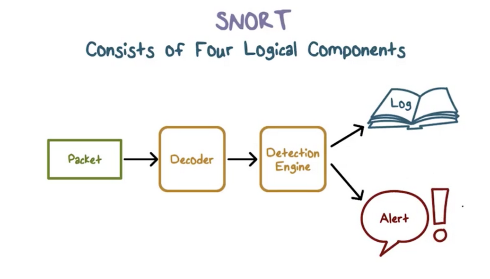
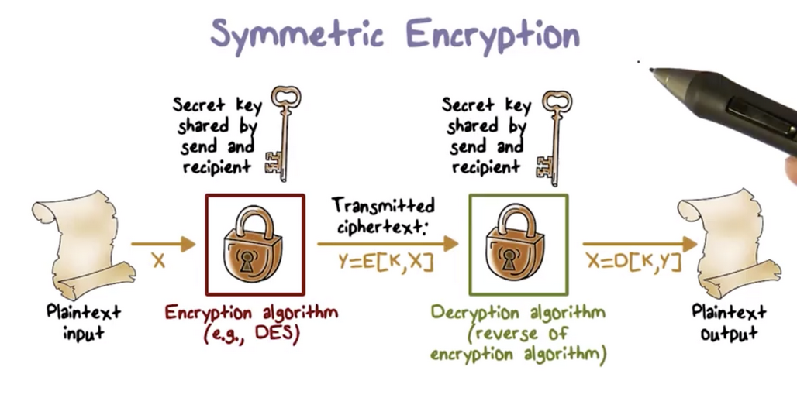
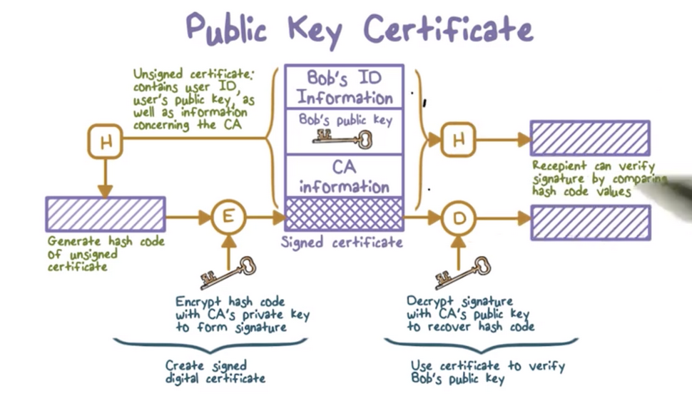

# Week 7 - Intrusion Detection and Introduction to Cryptography

The following notes are going to be different from past notes. I am not going to use the video lectures, but use the summaries provided by omscs-notes and notes from readings in the Stallings book.

omscs-notes - Intrusion Detection

Ch-8 Computer Security, Stallings and Brown

omscs-notes - Cryptography

Ch-2 Cryptographic Tools, Stallings and Brown

Quiz 7

**OMSCS-Notes: Intrusion Detection**

The **defense in depth **principle suggests that we need multiple layers of defense mechanisms. We typically deploy prevention systems to block attacks, but some intrusion attempts are always going to get through. If we can't stop an attack, at the very least we can detect it. Intrusion detection systems are great for this!

An **intrusion detection system (IDS)** can be quite effective against well-known or less sophisticated attacks such as large scale phishing email attacks. However, as attack techniques become more sophisticated, IDS's become less effective. 


Because IDS's are not completely effective, they need to be part of the broader defense-in-depth strategy for an organization. Other standard security strategies include:

1. Encrypting sensitive information
2. Providing detailed activity audit trails
3. Using robust authentication and access control practices
4. Actively managing operating system/application security

**Typical intruder behavior**

* **Target acquisition and information gathering**
    * An attacker identifies the target systems using publicly available technical (network tools) and non-technical information (email patterns).

* **Initial Access**
    * An attacker gains access by exploiting a remote network vulnerability or through social engineering

* **Privilege Escalation**
    * An attacker tries to use a local exploit to escalate their privilege from an unprivileged user to a root user on the target system.

* **Information gathering or system exploit**
    * After the attacker gains sufficient privilege on a system, they can find out more about the network and the organization.

* **Maintain Access**
    * An attack might not be a one-time action, the attacker might install backdoors or other malicious software on the system to maintain access.

* **Covering their tracks**
    * By editing or disabling the system audit logs, or using a rootkit, the attacker hides their activity.


**Components of Intrusion Detection Systems**

The **input to an IDS** is **network and system data** that provides a snapshot of the activity currently taking place within a computer system. The **data preprocessor reads this data** and extracts activity records that are important for security analysis.

The **detection engine** analyzes the activity records using detection models packaged with the IDS. If a detection rule determines that an intrusion is happening, the IDS produces an alert.

The **decision engine** responds to the alert and decides the appropriate action according to a decision table. In one case, an action might be tearing down a particular network connection while, in another case, the action might be sending a report to the security admin.


From a modeling and analysis perspective, there are two different approaches to intrusion detection. The **misuse detection (signature-based) **strategy **models known intrusions**, while **anomaly detection** looks for **abnormal behavior**, regardless of whether they have been seen.

For anomaly detection, there are two phases. In an initial training/profiling phase, the anomaly-based IDS collects system data corresponding to ordinary activity and uses data analysis algorithms to construct a model representing this baseline state. After, the model continuously analyzes live system activity relative to the baseline to determine whether system activity is anomalous.

IDS developers can use a variety of approaches to construct these models. The statistical approach applies univariate, multivariate, or time-series models to observed metrics. The knowledge-based approach encodes legitimate behavior into a set of rules using expert knowledge. The machine learning approach uses data mining and machine learning techniques to learn a model from training data automatically.

**Statistical Approaches**

Statistical approaches use captured system data as training input to develop a model of normal behavior. Older systems used univariate or multivariate models that consider the relations between variables. 

More recent systems incorporate time-series models that consider the order and timing between observed events. **The main advantage of statistical approaches **is that they are** relatively simple, easy to compute, and they don't have to make many assumptions. **On the other hand, the effectiveness of these approaches relies on selecting the right set of metrics to examine and correlate. 

**Knowledge-based Approaches**

Knowledge based approaches require experts to develop a set of rules that describe the normal, legitimate behaviors observed during training. 

These approaches are relatively easy to update and improve, however they rely on manual efforts of experts, and these experts must have strong knowledge of the data and the domain.

**Machine Learning Approaches**

Machine learning approaches can build a model automatically using the labeled, normal training data. A machine learning algorithm takes as input examples of normal data and outputs a model that is then able to classify subsequently observed data as either normal or anomalous.

For these approaches to be effective, the normal training data must be representative of normal behaviors, otherwise the learned model can produce many false positives.

**Bayesian networks** - encode the conditional probabilities between observed events, an example would be the probability that a user is sending an email if the current time is 2 AM. 

**Markov models **- are sets of states connected by transitional probabilities. For example, a system can use Markov models to model legitimate website names. The transitional probabilities from one letter to the next in a URL should be similar to that of real dictionary words.

**Neural networks** - are powerful and can do stuff.

**Clustering** - groups training data into clusters based on some similarity or distance measure and then identifies subsequently observed data as either a member of a cluster or an outlier.

One fundamental limitation of Anomaly Detection is that they train only using normal or legitimate data. Since these models do not see any intrusion data during training, they cannot be sure that a general anomaly is evidence specifically of an intrusion.

**Signature Approaches**

Signatures are typically straightforward to understand, and signature matching is very efficient. This means they are widely used. On the other hand, significant manual effort must be spent to create new signatures every time a new malware or attack method appears.

\


An IDS typically performs passive monitoring, which means it records and analyzes data about system and network activities while these activities continue to take place. 

**Network IDS**

We can deploy an intrusion detection system at the perimeter of a network or subnet to** monitor the inbound and outbound network traffic**. This is called a **network intrusion detection system (NIDS)**.

NIDS' typically use a packet-capturing tool like **libpcap** to **obtain network traffic data**. 

Since a NIDS can see all the data sent and received by a user's machine, it can raise an alert if it detects something has gone awry. These systems monitor traffic in real-time or close to real-time. They can analyze traffic in multiple layers of the network stack (network, transport, application). 

**Inline sensors can block an attack upon detection.** To do this, we must place the sensor at a network point where traffic must pass through it. You should never use a Network IDS as a firewall. Traffic analysis can overload an IDS, preventing it from detecting intrusion in a timely manner. We call this situation** fail-open**, meaning that the network is open to intrusion when the IDS fails.

A firewall performs active filtering, which means all traffic must pass through the firewall, and the firewall performs relatively simpler and more efficient analyses. FIrewalls typically **fail-close**, meaning that when they fail, they stop the traffic flow.

More **commonly, network IDS's are passive sensors** which receive a copy of live traffic, and therefore cannot provide any intrusion prevention. The sensors connect to the network transmission medium, such as an ethernet cable, through a direct physical tap that provides the sensor with a copy of all network traffic carried by the medium.

**Host IDS**

We can deploy an IDS in an end host. Most host-based IDS's use **ptrace** to obtain the system calls made by a program as a way to monitor program behavior. System call data is crucial for security monitoring because the operating system manages critical system resources. 

**An Example NIDS deployment**

A common location for an IDS sensor is just inside the external firewall. An IDS here has an excellent advantage point. It can see attacks from the outside world aimed at the internal network as well as public-facing servers in the DMZ. It can also monitor outgoing traffic for attacks originating from a compromised server.


Another location for an IDS is before the external firewall. Here the IDS can see all attempted attacks aimed at the enterprise network, including those attacks that might be filtered by the external firewall. Another location would be at a subnet boundary. This is useful because it doesn't have to filter all traffic, and it can detect intrusions from inside the network.

**Snort** is an open-source, easily configurable, lightweight network IDS that can be easily deployed on most nodes of a network. It can perform real-time packet capture, protocol analysis, and packet content-searching. It can be configured to be inline or passive.

**Snort Components**

The snort system has four logical components:

1. The 
2. The 
3. Each rule specifies what



Snort rule actions tell Snort what to do when a packet matches a rule. 


**Honeypots**

**Honeypots** are decoy systems designed to lure attackers away from critical systems. By diverting them from valuable systems to honeypots, we can observe what they are trying to do to our systems and networks.

Typically, a honeypot is filled with fabricated information to make it appear as if it is a valuable system on the network.The honeypot system is instrumented with monitors and event loggers so that any access to or activity on the honeypot system is logged.

A **low-interaction honeypot** typically emulates some network services, but does not provide a full version of a service. These are easy to detect by sophisticated attackers. A **high-interaction honeypot** essentially replicates a real server or work station. They look and feel realistic.


**Evaluating IDS**

We typically use accuracy metrics to evaluate an IDS. We use **detection rate** or **true positive rate** to measure how well an IDS can detect an intrusion. This measures **how likely an IDS is to output an alert given that an intrusion is present**.

Alternatively, we could look at **false alarm rate**, the **probability that the IDS generates an alert, given there is no intrusion**.

Another alternative is the **Bayesian detection rate**, which is **the probability that an intrusion has occurred, given that an alert is raised**.


Typically, the volume of packet data in a network is enormous, and only a few might relate to intrusion. Production systems typically filter out packet data unlikely to be intrusion activity.

1. First filters are applied, using libpcap, or another utility to only capture packets destined for certain services.
2. An event engine analyzes the filtered packet data and summarizes them into security-related events, such as failed logins
3. Finally, the system applies detection models tot he data contained in each security-related event.

**Evading IDS**

One clever way attackers can avoid monitoring is to exploit differences in host OS's. In particular, the TCP/IP protocol specs have ambiguities that lead to different implementations in different OSs. As a result an IDS running on Unix and a host running on WIndows might not process packets int he same way.

An **insertion attack** is a network attack where an attacker sends out-of-order packets that both the IDS and the end host reassemble according to sequence numbers. One of the packets X has a bad checksum value. The IDS accepts X and sees the packet stream as benign. On the otherhand, the end host rejects X and as a result sees the attack.


An **evasion attack **sends out-of-order packets that both the IDS and the host reassemble according to sequence numbers. In this scenario, the attacker sends packets that overlap. As a result, the IDS drops the second packet and sees a benign stream. On the other hand, the host accepts both fragments, even though they overlap. 


Attackers can also use denial of service (DOS) attacks to disrupt NIDS.

An Intrusion Prevention System (IPS) tries to block an attack when it detects malicious activity.

**OMSCS-Notes: Introduction to Cryptography**

**Encryption **is the process of converting data into a form that is unintelligible to an unintended or unauthorized party. The original data is called **plaintext**, and the encrypted data is called **ciphertext**. An authorized party can reverse this process, that is they can decrypt the ciphertext to reveal the plaintext.


**Encryption****provides data confidentiality** because only the authorized party with the proper secret key can read the data. It can also be used for **integrity checking** to ensure that no one has tampered with a message. Encryption also can serve as a method for **authentication**.

**Ciphers** are encryption schemes. They have been used for thousands of years. All ciphers used until the 1970s have been** symmetric ciphers**. Much newer, **asymmetric ciphers** were invented in the 1970s.

Most **modern security protocols use both types of encryption**. Parties wishing to communicate typically** use asymmetric ciphers to authenticate** themselves with one another and to** establish and exchange a symmetric encryption key.** Each party will then encrypt and decrypt subsequent communications using this key. Senders may also use asymmetric ciphers to sign the data and prove authenticity.

**Attacks on Encryption**

The goal of attacks is to recover our plaintext, or uncover the encryption key we used to create our ciphertext.

1. **Brute-force**
2. **Cryptanalysis**
3. **Implementation attacks**
4. **Social-engineering attacks**

**Simple Ciphers**

**Caesar's cipher** is an example of a **shift cipher**, which maps each letter to another letter by shifting it a fixed amount.

```
(letter + shift) mod 26
```

The** secret key in this scheme is the value of shift**. Since there are only 26 possible keys, an attacker only needs to try at most 26 keys before being able to decrypt any message encrypted with Caesar's cipher.

A generalization of this scheme allows arbitrary mapping of one letter to another. These ciphers are referred to as **substitution ciphers** or **monoalphabetic ciphers**.

The **substitution alphabet is the secret key** in this scheme. The number of possible alphabets is vast (26! = 2^88). An attacker cannot brute-force this scheme.

Instead of attempting to try every key, an attacker can analyze the statistical frequency of letters in the ciphertext. For example, in English, the most frequently used letter is "E". If the most common letter in the ciphertext is "X", then there is high probability that "E" maps to "X".

**Frequency of Letters in English**


**Vigenere Cipher**

While a substitution cipher uses a single alphabet, a **polyalphabetic cipher** uses **multiple substitution alphabets**. The Vigenere cipher is the most well-known polyalphabetic cipher.

Suppose we want to encrypt the plaintext "ATTACKATDAWN" using the Vigenere cipher with "LEMON" as the key. Vigenere encryption proceeds characterwise, so the **key must be as long as the plaintext**. We generate the **keystream** "LEMONLEMONLE" by repeating the key until the required number of characters are present.


Now, matching column "A" to row "L", the first character is "L". To encrypt "T" to row "E", we see the second character is "X". And so on.

"ATTACKATDAWN" becomes "LXFOPVEFRNHR"

**What should be kept secret?**

An encryption algorithm should be public. **Kerckhoff's principle** states that a cryptosystem should be secure even if everything about the system, except the key, is public.

**Types of Cryptography**

**Secret key cryptography** uses a single key for encryption and decryption, which means that the sender and receiver must possess the same key.

**Public key cryptography** uses two keys, one public and one private, that are linked together mathematically. A user keeps their private key secret and announces their public key to others. The **public key is used for encryption**, and the **private key is used for decryption**. The private key can also be used to sign a message, and the public key can be used to verify the signature

**Hash Functions**

Hash functions are a third class of cryptographic functions. A **hash function** computes a fixed-length output from a message of any size. They do not use keys. We typically use hash functions for **authentication and message authenticity/integrity**.

Hash functions need to have the following properties:

1. **Efficiency**
2. **One-way function**
3. **Weak collision resistance**
4. **Strong collision resistance**

Even though weak and strong collision resistance seem similar, there is a subtle difference between the two. Weak collision resistance is bound to a particular input, whereas strong collision resistance applies to any two arbitrary inputs.

**Hash Functions for Passwords**

The **one-way property** of hash functions make them **a great candidate for password verification**.


The advantage of this scheme is that the system only has to store the hashed passwords. The **avalanche effect** states that a small change in the input to a hash function causes a large change to the output. We want this in place to obscure similar passwords. Another strategy is to incorporate a random chunk of data into the password called a salt. 

**Symmetric Encryption**

Symmetric encryption uses the same key for both encryption and decryption. The encryption algorithm takes the plaintext and the key as input and produces the ciphertext using substitution and permutation.



The most important symmetric algorithms are **Data Encryption Standard (DES)** block cipher and the **Advanced Encryption Standard (AES)** block cipher.  A **block cipher** encrypts plaintext in fixed-size blocks and produces ciphertext blocks of equal size. DES and AES use different key sizes and block lengths


DES is breakable within an hour using a supercomputer. Ciphers with key lengths of 128 bits or greater are effectively unbreakable using modern processing power.

**Asymmetric Encryption**

Asymmetric encryption uses two keys: one for encryption and the other for decryption. The two keys are paired mathematically such that if one key encrypts a message, only the other key can decrypt it.

To communicate using asymmetric encryption, a user must first generate a pair of keys. The public key can be sent to other uses, while the private key must be known only to the user. 

If Bob wants to send a private message to Alice, Bob must first obtain Alice’s public key. With Alice’s public key in hand, Bob encrypts his message to Alice using an asymmetric encryption algorithm such as [RSA](https://en.wikipedia.org/wiki/RSA_(cryptosystem)). Bob then transmits the ciphertext to Alice, which she can decrypt using her private key.


**Digital Signatures**

One problem with public keys is that they are public. An attacker can pretend to be Bob and send a public key to Alice. When she goes to send a message to the real Bob using the imposter's key, the attacker can intercept and decrypt the message. 

Bob can **prevent the forgery by obtaining a public key certificate** from a **certification authority** (CA). Bob can contact the CA and provide them with his authentication information, the CA will then construct Bob's certificate using his identification. Finally the CA hashes and signs this information with their private key and then appends this hash to the certificate.

Now Bob can send his public key certificate to Alice. When Alice receives the certificate, she can extract the key as well as the information about Bob and the certificate itself. **Alice can then hash the certificate and use the CA's public key to decrypt the signed appended hash**. If the two hashes match, she can be sure that no one has tampered with the certificate. 



The underlying assumption is that the CA is a trusted party by everyone involved.

**Digital Envelopes**

Public-key encryption is typically used to establish a symmetric key, which is then used to encrypt subsequent communications amongst parties.

Suppose Alice and Bob wish to communicate securely.

1. Alice creates a random symmetric key that she wants to share with Bob.
2. She encrypts the message she wants to send with this key.
3. She then encrypts the symmetric key with Bob's public key.
4. She then transmits a digital envelope containing both the message and the encrypted key to Bob.
5. When Bob receives the envelope, he can use his private key to decrypt the encrypted symmetric key
6. He can then decrypt the actual message.

1. 
