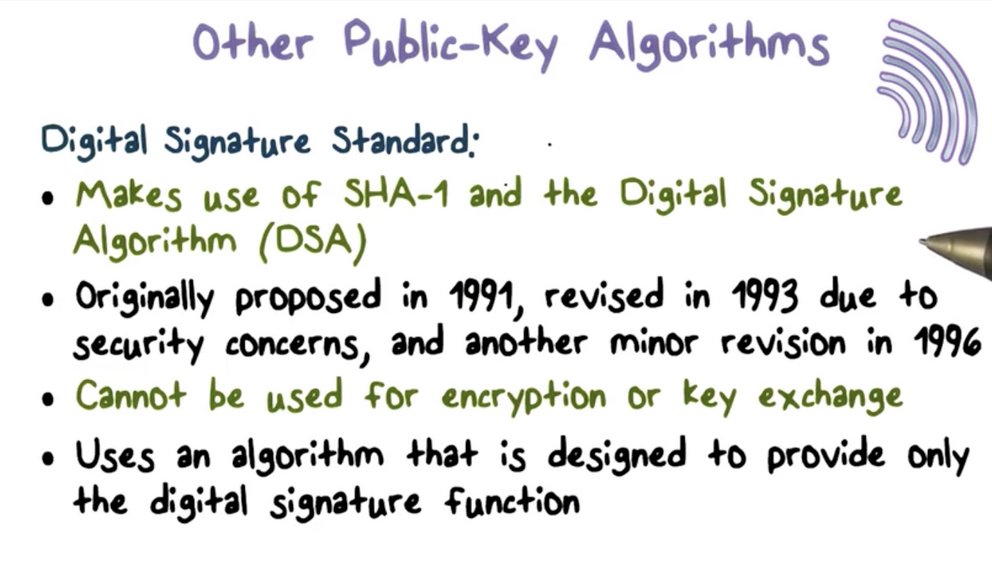

# Week 8 - Symmetric Encryption and Public Key Cryptography

**Symmetric Encryption ****🔐 **

Most symmetric encryption schemes are block ciphers. A **block cipher** encrypts a plaintext block of length n into a ciphertext block of length n using a secret key k and decrypts the ciphertext using the same k.

The goal of encryption is to transform plaintext into an unintelligible form. Since we assume that an attacker can obtain the ciphertext, we **don't want the ciphertext to convey any information** about they key or the plaintext.

**Confusion** obscures the relationship between the key and the ciphertext and is typically **achieved with substitution**. Confusion alone is not sufficient. Even when a letter can be mapped to any other letter, an attacker can perform statistical analysis of letter frequencies to break the scheme.

The second principle that we need is diffusion. **Diffusion** spreads the influence of one plaintext bit over many ciphertext bits to hide the statistical properties of the plaintext. We can **achieve diffusion with permutation**.

We need this combination -- confusion and diffusion -- to affect every bit in the ciphertext, so a block cipher typically runs for multiple rounds. The initial round affects some parts of the ciphertext, and subsequent rounds further propagate these effects into other parts of the ciphertext. Eventually, all bits are affected.

**Data Encryption Standard**

A widely used symmetric scheme is based on the Data Encryption Standard (DES), which was standardized in 1979.

In DES, the key is 64 bits (8 bytes) long. For each byte, there is one parity bit, so the actual value of the key is only 56 bits.  DES receives a 64-bit plaintext block as input and produces a 64-bit ciphertext block.

DES contains an initial and final permutation step that remaps the positions of the bits to achieve diffusion.

In between the permutation steps, DES performs 16 rounds of operations using 16 48-bit subkeys generated from the original 56-bit key. Each round receives as input the ciphertext produced by the previous round and outputs the ciphertext used as input by the next round.

A round proceeds as follows. First, the 64-bit input is divided into two 32-bit halves. The output left half is simply the input right half. The output right half is the XOR of the input left half, and the output of a mangler function applied to the input right half. 

The mangler function receives a 32-bit input, expands it to 48-bits, XORs it with the 48-bit per-round key, and then passes it to an S-box to substitute the 48-bit value back into a 32-bit value.

The decryption process performs the same operations as the encryption process but uses the keys in reverse order. 

**Decryption**

DES is a **Fiestel cipher**, which means the **encryption and decryption differ only in key schedule**. Since each encryption round swaps the right and left halves of the input, the input to each decryption round is the swap of the input. However, since each decryption round performs the same operations as encryption, the decryption input is swapped to recover the original encryption input.

After 16 rounds of decryption, the algorithm has recovered the right and left halves of the original plaintext, and the final swap arranges the halves in the correct order.

**Mangler Function**

The mangler function performs the bulk of the processing in a DES round. It expands the right half of the input from 32 bits to 48 bits and XORs it with the per-round key. The result is substituted back into a 32-bit value, which the function then permutates. 

**S Box**

An S-box substitutes a 6-bit value with a 4-bit value using a predefined lookup table. DES uses 8 such S-boxes to substitute a 48-bit value with a 32-bit value. We can perform the substitution of a 6-bit value by using the outer two bits to look up the row of the S-box and the inner four bits to look up the column.

**Security of DES**

The key size in DES is 56 bitys, so there are only 2 ^ 56 possible keys. This keyspace is too small and an attacker can brute-force to the find the correct key relatively easily using today's computers. 

Another issue with DES is the the design criteria for S-boxes have been kept secret. 

**Triple DES**

To overcome the small keyspace that renders DES insecure, we can run DES multiple times, using a different key each time. The standard is to run it three times, and the resulting scheme is called triple DES.

To encrypt plaintext using triple DES, we first run the encryption process with key k1, followed by the decryption process with a second key k2, followed by the encryption process with a third key, k3. To decrypt a ciphertext, we run the process in reverse, decrypting with k3, encrypting with k2, and decrypting again with k1. 

This order of operations is advantageous because it supports multiple key lengths. For example, if k1 and k3 are equal, the result is 112-bit DES. If all three keys are different, the effective key length is 168 bits.

Additionally, if we set k2 equal to k1, then triple DES has essentially become single DES using k3. Using this configuration, we can allow DES and triple DES to communicate with one another.

**Advanced Encryption Standard**

Key length is a significant shortcoming of DES. at 56 bits long, the keyspace for DES is too small, and an attacker can brute force it. The r**eplacement for DES is the Advances Encryption Standard (AES)**. Like DES, AES is a block cipher. Whereas in DES, the input plaintext block is 64-bit, it is 128-bit in AES. In DES, the key length is only 56-bit, but in** AES, the key can be 128, 192, or 256 bits long**. 

Each block of plaintext that AES operates on is represented as a square matrix called the state array. This array is first XORed with a per-round key before going through multiple rounds of encryption. 

In each round, the state array passes through several operations: SubBytes, ShiftRows, and MixColumns, which represent substitution and permutation. The transformed value of the state array is then XORed with the per-round key and then passed as input to the next round. The final round excludes the MixColumns step.

In AES, the decryption process runs the encryption process in the reverse direction, which means that each of the **applied operations must be reversible**.

**AES Round**

Let's take a closer look at each round of AES and the transformations the algorithm performs on the state matrix S. Each operation updates the value of S directly.

**

**

1. First SubBytes uses S-boxes to perform byte-to-byte substitution. 
2. Next ShiftRows permutates S by shifting the bytes in each row of S a specified amount. 
3. Then MixColumns substitutes each byte in a column as a function of all the bytes in the column. 
4. Finally, AddRoundKey XORs S with the per-round key, passing the final value of S to the next round.

**Encrypting a large message**

**

**

A block cipher takes in a fixed-length data block as input: 64-bits in DES and 128-bits in AES. IF we want to encrypt a much bigger message, the solution seems obvious: break the message into fixed-size blocks, apply the cipher to each block and then combine the resulting ciphertexts.

The simplest method for **encrypting large messages** is to use an **electronic codebook** (ECB). 

First, the original large message is broken down into fixed-size blocks. The final block is potentially padded if it is smaller than the block size. Each plaintext block is then encrypted using the same key, and the collection of ciphertext blocks is the ciphertext of the original message.

For a given key, there is a unique ciphertext block for every plaintext block. We can construct a large codebook, in which there is an entry mapping every possible plaintext block to its ciphertext. In practice, the codebook only contains entries for the plaintext blocks used by the application.

**Electronic Codebook Shortcomings**

**

**

There are significant shortcomings with the ECB approach, which makes it a **weak candidate for ensuring confidentiality**. 

For a givenj key, two identical plaintext blocks produce identical ciphertext blocks. As long as the same key is in use, this parity exists within a message and across distinct messages.

Cryptanalysts can exploit this consistency, for example, if an analyst knows that a message always starts with specific predefined fields, then they might immediately have several known plaintext/ciphertext pairs to aid their analysis.

Another problem is that the plaintext blocks are independently encrypted. An attacker can potentially rearrange inflight ciphertext blocks or substitute in a previously captured block for one currently being transmitted. Either way, an attacker can compromise message integrity as a result of the independent encryption scheme.

**Cipher Block Chaining**

**

**

The most widely-used approach for encrypting a large message is **cipher block chaining (CBC)**. 

In CBC, the input to the encryption algorithm is the result of XORing the previous ciphertext block with the current plaintext block. To encrypt the first plaintext block, we XOR the block with an initialization vector (IV), which we then encrypt to produce the first ciphertext block.

This process is structured such that each ciphertext block incorporates information from all the previous ciphertext blocks. As a result, determining the plaintext block just by looking at the corresponding ciphertext block becomes very difficult. 

More importantly, if two plaintext blocks are the same, the ciphertext blocks are not likely to be the same. Additionally, if an attacker tries to rearrange the ciphertext blocks or substitute on for another, the message will not decrypt correctly. 

Decryption works similarly, CBC decrypts a ciphertext block and then XORs the result with the previous ciphertext block to produce the current plaintext block.

**Protecting Message Integrity**

**

**

While we usually discuss encryption as a method for providing confidentiality, we can also use encryption to ensure message integrity. 

One approach for providing message integrity is to send the last block of CBC (residue) along with the plaintext. IF the attacker intercepts the message and modifies the plaintext, they cannot recompute the CBC since they do not have the encryption key. Thus, they are forced to send the modified plaintext with the original CBC.

When the authorized recipient receives the message, they will run the message through CBC to produce the last block. Since the plaintext has been modified, but the residue has not, the recipient's computed residue will not match the received residue. Therefore the receiver will know that the message has been modified.

To protect both message confidentiality and integrity, we should use two separate keys and two encryption rounds: one key produces the ciphertext, and the other key produces the CBC residue. 

Public Key Cryptography 🔑 

******Modular Arithmetic**

**

**

Both **RSA and DIffie-Helman** - the most widely-used public-key algorithms - **are based on number theory **and use modular arithmetic - modular addition, multiplication, and exponentiation.

In modular addition, a number k has an inverse k', such that k + k' mod M = 0. For example, for M = 10 and k = 2, k' = 8. Every number has an inverse under modular addition.

The **presence of an additive inverse means that modular addition is reversible**. That is, given c = a + b mod M, a = c + b' mod M and b = c + a' mod M . This reversibility is very convenient for encryption because we want the decryption process ideally to be the reverse of the encryption process.

**Modular Multiplication**

**

**

In modular multiplication, a number k, ha an inverse k' such that k * k' mode M = 1. For example, for M = 10, and k =3, K' = 7 because 3 * 7 mode 10 = 21 mod 10 = 1.

Not all numbers have multiplicative inverses for a given M.

**Totient Function**

**

**

Given a modulus M, **only the numbers that are relatively prime to M have multiplicative inverses in mod M**. 

Two numbers are **relatively prime** to one another **if they share no common factors other than 1**. For example, 3 and 10 are relatively prime, whereas 2 and 10, which share 2 as a common factor are not. 

Given n, we can calculate **how many integers are relatively prime** to n using the **totient function ****φ(n)**. If n is prime, φ(n) = n - 1, because every number smaller than n is relatively prime to n, because n itself is prime.

If n = p * q and p and q are prime, then φ(n) = (p - 1) * (q - 1). If n = p * q and p and q are relatively prime, φ(n) = φ(p) * φ(q).

If n = 21, what is **φ(n)?**

**

**

If n = p * q and p and q are prime, then φ(n) = (p - 1) * (q - 1). For n = 21, p = 3 and q = 7, φ(n) = (3 - 1) * (7 - 1) = 2 * 6 = 12.

**Modular Exponentiation**

**

**

In modular exponentiation, x^y mod n = x^(y mod φ(n)) mod n. If y = 1 mod φ(n), then x^y mod n = x mod n.

**RSA (Rivest, Shamir, Adelman)**

**

**

RSA is named after its three creators. **It is the most widely-used public-key algorithm**. It supports but public-key encryption and digital signature.

RSA bases the strength of its security on the hypothesis that factoring a massive number into two primes is a computationally infeasible problem to solve on a reasonable timescale using modern computers.

RSA supports variable key lengths, and in practice, most people use a 1024, 2048, or a 4096-bit key. The plaintext block size can be variable, but the value of the block represented as a binary integer must be smaller than the value of the key. The length of the ciphertext block will be the same as the key length.

**RSA Algorithm Key Generation**

1. First we select two primes, p and q, that are at least 512 bits in size.
2. Next we compute n = p * q and φ(n) = (p - 1) * (q - 1).
3. Then we select an integer e that is smaller than φ(n) and relatively prime to φ(n).
4. Finally, we calculate d: the multiplicative inverse of e, mod φ(n). 
5. The public key is {e, n}, the private key is {d, n}.

**RSA Encryption and Decryption**

1. Bob can encrypt a message m, using Alice's public key, {e, n} by computing m^e (mod n). 
2. On receipt of ciphertext C, Alice can use her private key, {d, n} and compute C^d (mod n) to recover m.

**Digital Signature Creation**

1. To create a signature s for a message m, Alice uses her private key, {d, n} to compute m^d mod n
2. Bob can verify Alice’s signature by using her public key,

Remember from the rules of modular exponentiation that, for a base x, a power y, a modulus n, x^y mod n = x^(y mod φ(n)) mod n. If y = 1 mod φ(n), then x^y mod n = x mod n.

Also recall that, for a given public key, {e, n} and its private key {d, n}, d * e = 1 mod φ(n). Thus, x^(e * d) mod n = x mod n.

To encrypt a message m, we compute c = m^e mod n. To decrypt c, we compute m = c^d mod n. We can substitute the first expression in for c in the second to get m = (m^e mod n)^d mod n. The right-hand side of the equation simplifies to m^(ed) mod n, which is equivalent to m mod n, which equals m since m < n.

The key generation step proceeds as follows. First, we select two prime numbers, p = 17 and q = 11. From these values, we can compute n and φ(n), as p * q = 187 and (p - 1) * (q - 1) = 160, respectively. We select 7 as our public key e, as 7 and 160 are relatively prime. The private key is the multiplicative inverse of e, mod φ(n). The multiplicative inverse of 7 mod 160 is 23, which is our private key d.

To encrypt a plaintext m = 88, we compute ciphertext C = m^e mod n = 88^7 mod 187 = 11. To decrypt C, we perform C^d mod n = 11^23 mod 187 = 88, which returns m.

**RSA Security**

RSA bases its security on the hypothesis that factoring a very large number - at least 512 bits - takes an inordinately large amount of time.

If someone finds an efficient way to factor a large number into primes, then the security of RSA is effectively broken. Given the public key, {e, n}, an efficient factorization of n into p and q allows an attacker to compute φ(n) and the multiplicative inverse of e mod φ(n), this inverse is d, the public key.

One **issue with RSA is that the algorithm is deterministic**. For a given key, the same plaintext message always encrypts to the same ciphertext. This means that an attacker can induce predictable transformations in plaintext by modfiying the ciphertext in specific ways.

In practice, the standard is to **prepend m with padding**, a step which addresses this issue. 

**Diffie-Hellman Key Exchange**

In the Diffie-Hellman key exchange algorithm there are two publicly known numbers q and α. q is a large prime number - at least 300 digits long - and α is a small **primitive root(****[https://youtu.be/Ef6YcpmnIqs](https://youtu.be/Ef6YcpmnIqs))** of q. 

In modular arithmetic, a number g is a **primitive root modulo n**, if every number m from 1 to n-1 can be expressed in the form . As an example, 3 is a primitive root modulo 7. %!(EXTRA markdown.ResourceType=, string=, string=)

Suppose that two users want to exchange a key using Diffie-Hellman. A selects a random integer X_A < q, and computes Y_A = α^X_A mod q. Likewise, B selects a random integer X_B < q and then computes Y_B = α^X_B mod q. Each side keeps its X_* value private and sends their Y_* value to the other side. 

Upon receiving Y_B from B, A computes the key k = Y_B^X_A mod q. Similarly, B computes the key k = Y_A^X_B mod q upon receiving Y_A from A. **The expressions used to compute k by each party are equivalent**; that is Y_B^X_A mod q = Y_A^X_B mod q. As a result of this exchange, both sides now share a secret encryption key.

The values of X_A and X_B are private while α, q, Y_A, and Y_B are public. If an attacker C wants to compute the shared key, they must first compute either X_B or X_A. The attacker can compute X_B, for example, by computing dlog(α,q)(Y_B), where dlog is the [discrete logarithm](https://en.wikipedia.org/wiki/Discrete_logarithm). If C can retrieve X_B, they can compute the shared key using Y_A and q.

The security of Diffie-Hellman lies in the fact that it is infeasible to compute discrete logarithms for large primes such as q using modern computers.

**

**

Let’s walk through the Diffie-Hellman key exchange using q = 353 and α = 3.

First, user A selects a random number, X_A < q = 97, which they keep secret, and they compute Y_A = 3^97 mod 353 = 40. Similarly, user B selects a random number X_B < q = 233, which they also keep secret, and they compute Y_B = 3^233 mod 353 = 248. Next, A sends 40 to B and B sends 248 to A.

Upon receiving Y_A, B computes k = Y_A^X_B mod 353 = 40^233 mod 353 = 160. Similarly, A computes k = Y_B^X_A mod 353 = 248^97 mod 353 = 160. Through this exchange, both A and B have computed the same secret value, which they can now use to encrypt their communications.

**Diffie-Hellman Security**

In Diffie-Hellman, neither party ever transmits the shared secret encryption key S, nor the locally generated secrets X_A and X_B. 

One potential security vulnerability of Diffie-Hellman is denial of service. This is because computing the local secret from Y_B is computationally expensive. An attacker can request multiple Diffie-Hellman sessions and tie up the CPU. 

The sole purpose of Diffie-Hellman is key exchange, it does not offer encryption and cannot produce digital signatures.

**Bucket Brigate Attack (Man in the middle)**

**

**

In this attack, Trudy intercepts the message Y_A that Alice sends to Bob, and instead sends her own Y_X to Bob, fooling Bob to accept this as Y_A. Likewise, Trudy intercepts Y_B that Bob sends to Alice and instead sends her own Y_X to Alice, fooling Alice to believe that Y_X is actually Y_B.

The result is that the shared key that Alice computes is the shared key between Alice and Trudy. Similarly, the shared key that Bob computes is the shared key between him and Trudy. In other words, Trudy plays Bob to Alice and Alice to Bob.

This man-in-the-middle attack is possible because the Diffie-Hellman key exchange protocol does not authenticate Alice or Bob. There is no way for Alice to know that the message that she has received is from Bob, and vice versa.

There are several ways to fix this problem. For example, everyone can publish their public key to a trusted, public repository instead of sending it and risking interception and forgery.

Alternatively, if Alice has already published her RSA public key, she can sign Y_A when she sends it to Bob. Bob can verify that Y_A is really from Alice using her RSA public key.

**Other Public Key Algorithms**

**

**

**Elliptic-Curve Cryptography (ECC)** has recently begun to challenge RSA. The main advantage of ECC over RSA is that it **offers the same security with smaller bit size**.
