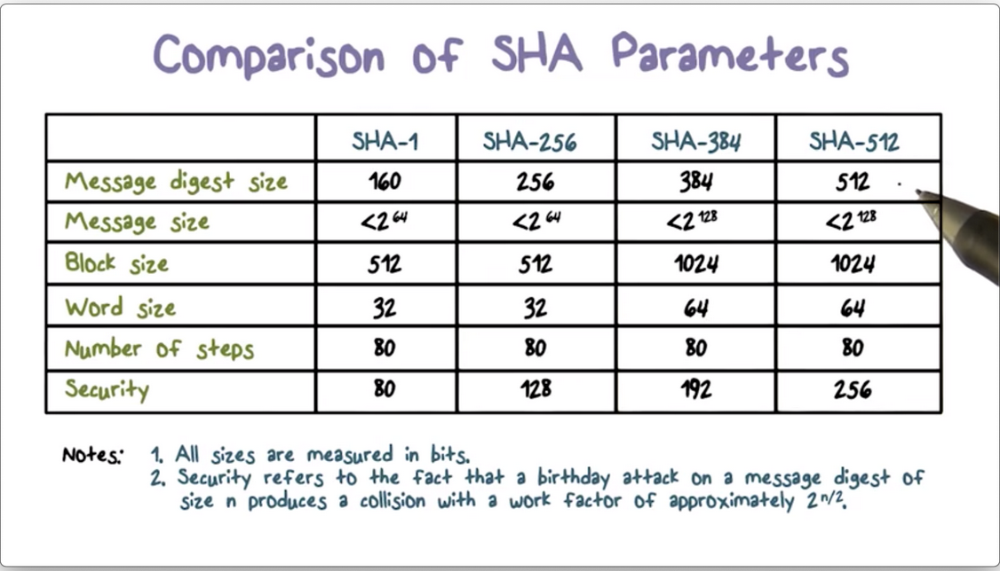
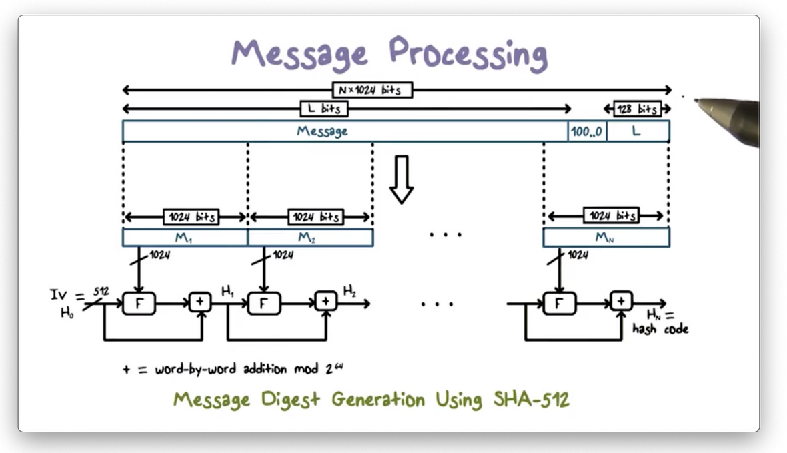
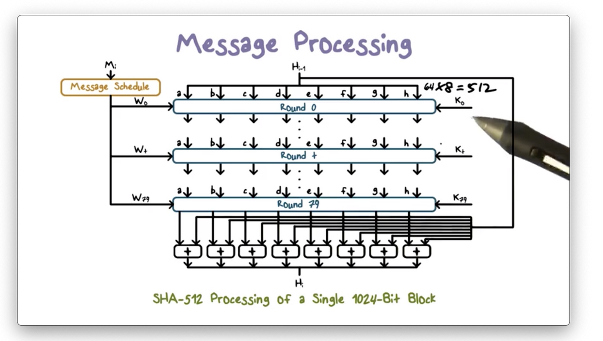
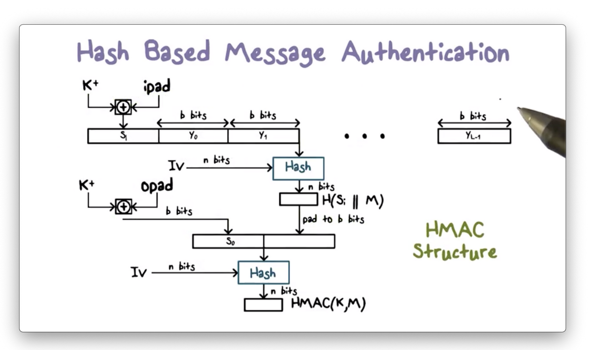

# Week 9 - Hashes

A **hash function** can be applied to a block of data of any size and produces a **fixed-size output**, typically in the range of 128-512 bits. They are easy to compute.

These properties make hash functions practical for security applications.

The following properties are required for hash functions to be secure:

1. **One-Way Function**
2. **Weak Collision-Resistant Property**
3. **Strong Collision-Resistant Property**

**Hash Function Weaknesses**

1. **Pigeonhole Principle**
    1. Remember, a hash function produces a fixed-size output from an input of arbitrary size. Since there are an infinite number of arbitrarily-sized inputs, and a finite number of fixed-size hash codes, many inputs can be mapped to the same output hash value. This setup seems to violate the property of collision resistance. However, the collision resistance properties only speak to infeasibility, not impossibility.

2. **Birthday Paradox **
    1. To reduce the chance of collision we need hash functions that produce longer hash values, but how many bits is enough? Suppose a hash function produces hash codes that are l bits long. As a result, this function can produce 2^l possible hash values. According to the birthday paradox, we have 50% chance of finding a collision after processing 2^(l/n) messages. Therefore if l = 64, then there are 2 ^ 64 hash values, and an attacker only needs to search 2 ^ 32 messages to find a collision, which is quite feasible!

**Secure Hash Algorithm**

The original secure hash algorithm is SHA-1, which produces a hash value of 160 bits. The subsequent SHA-2 family of algorithms, which operate similarly to SHA-1, produces hashes of 256, 384 and 512 bits long.

The **message digest size** refers to the **length of the hash value**.

**Message size is the size limit on the input**. These limits do not have any effect in practice, because most if not all messages are smaller.

**Message Processing**

**

**

Before any processing can start, we must pad the message to a multiple of 1024 because the hash function processes the message in 1024-bit blocks.

1. First, we store the length of the original message in the final 128 bits of the last block.

1. Next, we fill in the space between the end of the original message and the last 128 bits with 1 followed by as many zeros as necessary. 
2. After padding, the message is processed on 1024-bit block at a time. The output of processing the current block becomes the input to processing the next block.
3. For the first block, the input includes an

The following figure shows the processing of a single message block.

Processing a single block involves 80 rounds of operations that **operate on both the current message block m, and the output of processing the previous block, k**.

The inputs to each round include the result from the previous round, some constant k, and some words w derived from m, k provides randomized values to eliminate any regularities in m. 

The operations at each round include circular shifts and primitive boolean functions based on AND, OR, NOT and XOR.

**Hash Based Message Authentication**

Using hash values for message authentication has several advantages. One, hash functions are very efficient to compute, and libraries for hash functions are widely available. On the other hand, a hash function such as **SHA cannot be used directly for message authentication because it does not rely on a secret**.

**HMAC** has received the most support thus far and has been adopted for use in other protocols such as **IPSec and TLS**.

HMAC involves a hash function H and a secret key, k. The message consists of multiple blocks of b bits.

1. First, k is padded to b bits, which is accomplished by appending zeroes to k. The padded key is then XORed with ipad, a constant designed to eliminate any regularities in the key.
2. The result is a b-bit value s1, s1 is then prepended to m, and the combination of s1 + m is hashed using H to produce an n-bit hash value.
3. Next, the n-bit hash value is added to b bits. The padded key is then XORed with opad, another constant designed to eliminate regularities in the key. The result is a b-bit value s0. 
4. The padded hash h is then appended to s0, and the entire message s0 + h is hashed. The n-bit result is the output of the HMAC procedure.

**HMAC Security**

The security of HMAC depends on the cryptographic strength of the underlying hash function. For HMAC to be secure, the underlying hash function must satisfy the properties of non-invertibility and collision resistance.

Furthermore, compared with a cryptographic hash function, it is much harder to launch a successful collision attack on HMAC because HMAC uses a secret key.
