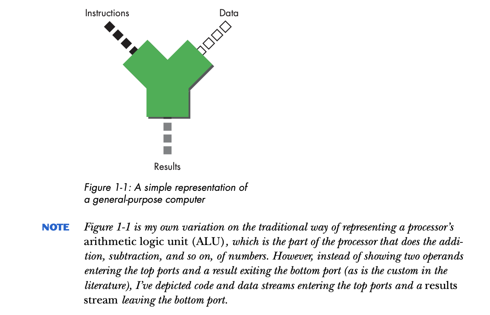
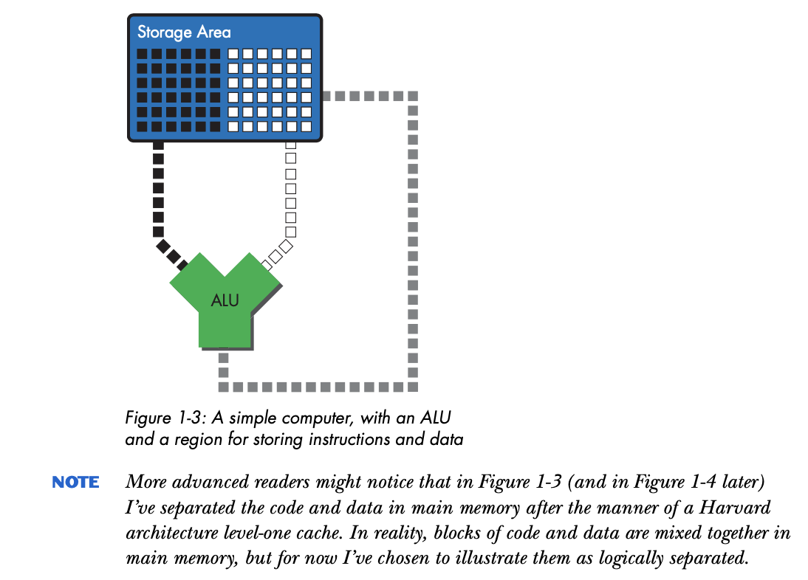
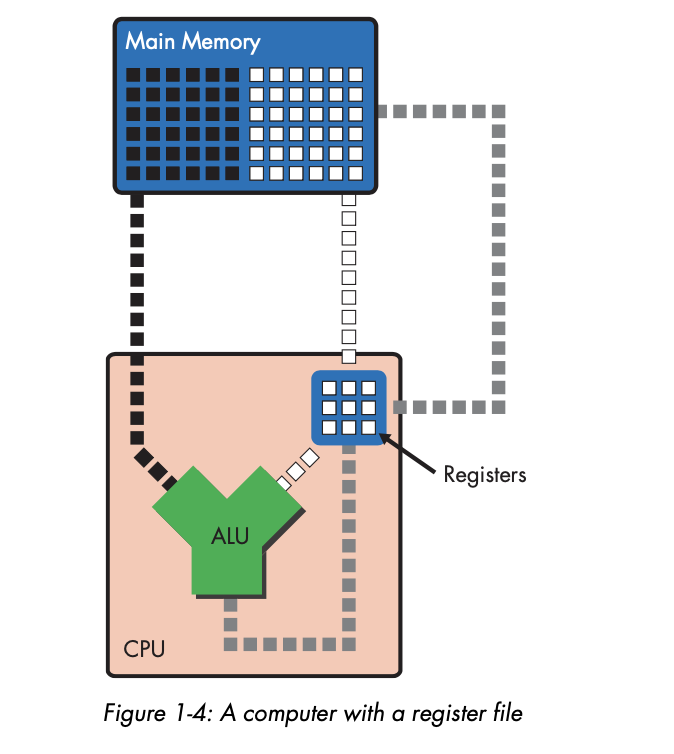
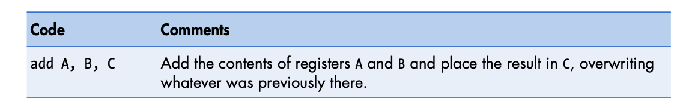
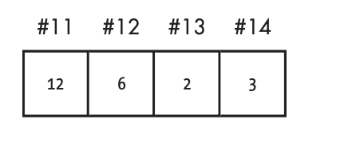
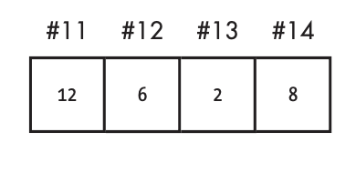
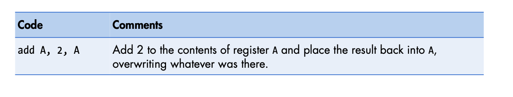
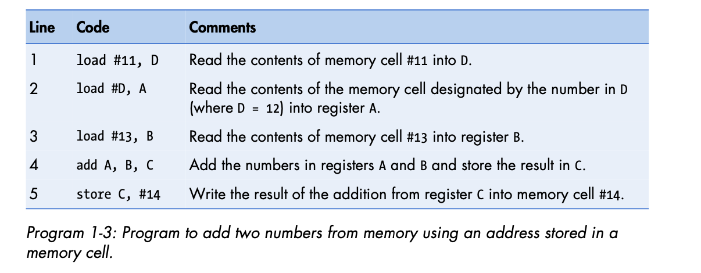
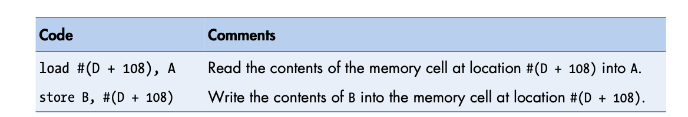

# Basic Computing Concepts

## Table of Contents
* [Introduction](#introduction)
* [The Calculator Model of Computing](#the-calculator-model-of-computing)
* [The File-Clerk Model of Computing](#the-fileclerk-model-of-computing)
* [The Stored-Program Computer](#the-storedprogram-computer)
* [Refining the File-Clerk model](#refining-the-fileclerk-model)
* [The Register File](#the-register-file)
* [RAM: When Registers Alone Won't Cut it](#ram-when-registers-alone-wont-cut-it)
* [The File-Clerk Model: Part 3](#the-fileclerk-model-part-3)
* [Adding Two Numbers Again](#adding-two-numbers-again)
* [A Look at the Code Stream](#a-look-at-the-code-stream)
* [General Instruction Types](#general-instruction-types)
* [DLW-1](#dlw1)
* [DLW-1 Arithmetic Instruction Format](#dlw1-arithmetic-instruction-format)
* [DLW-1 Memory Instruction Format](#dlw1-memory-instruction-format)
* [An Example DLW-1 Program](#an-example-dlw1-program)
* [Immediate Addressing](#immediate-addressing)
* [Register-Relative Addressing](#registerrelative-addressing)
### Introduction

Computers do a vast array of things and yet all of them rely on a limited repertoire of technologies.

At the heart of the modern computer is the **microprocessor (CPU)**, a tiny square of silicon that's etched with a network of gates and channels through which electricity flows.

The gates (transistors) and channels (wires) are a miniature version of the kind of circuitry that you might have seen when opening up old electronics.

**Once you understand how a microprocessor works, you'll have a thorough grasp of the fundamental concepts that underlie all of modern computing.**

### The Calculator Model of Computing

A computer **takes a stream of instructions (code) and a stream of data as input**, and it **produces a stream of results as an output**.

For the purpose of an initial discussion, let's say that the code stream consists of different types of arithmetic operations and the data stream consists of data on which those operations operate. The results stream is thus the results of these operations. The results flow when the operators in the code stream are carried out on the operands in the data stream. 

Like a calculator, the computer takes numbers and operators as input, performs the requested operation, and then displays the results. These results might be in the form of pixel values that make up a rendered scene in a game, or they might be the dollar values in a financial spreadsheet.

### The File-Clerk Model of Computing

While the calculator model is useful, it **isn't the only or even the best way to think about what computers do**.

Let's look at another definition.

A computer is **a device that shuffles numbers around from place to place**, reading, writing, erasing, and rewriting different numbers in different locations **according to a set of inputs, a fixed set of rules for processing those inputs, and the prior history** of all the inputs that the computer has seen since it was last reset, until a predefined set of criteria are met that cause the computer to halt. 

We might call this idea of the computer the "file-clerk" model of computing.

In the **file-clerk model**, **the computer accesses a large store of sequentially arranged numbers for the purpose of altering the store** to achieve a desired result. Once the result is achieved, the computer stops so that a human can now read and interpret the store.

This model is useful because it emphasizes the end product of the computation not the computation itself. **The purpose of computers is to produce usable results from a given data set.**

Once we understand computers not in terms of the math they do, but in terms of the numbers they move and modify, we can begin to get a fuller picture of how they operate.

In a nutshell, **a computer is a device that reads, modifies, and writes sequences of numbers**. These functions: read, modify and write, are the **most fundamental functions that a computer performs**.

### The Stored-Program Computer

All computers consist of at least three fundamental types of structures needed to carry out the read-modify-write sequence:

1. **Storage** - All computers have **a place to put numbers**, a place to read from and write to.
2. **Arithmetic Logic Unit** - The device that **performs arithmetic operations** on numbers in the storage area. 

* First numbers are read from the storage in the ALU's data input port. Once inside the ALU, they're modified by means of an arithmetic calculation, and then they're written back to storage via the ALU's output port.

3. **Bus** - The means or transmitting numbers between the ALU and storage. The bus is **a network of transmission lines for shuttling numbers inside the computer**.

The figure below depicts the code stream as a prerecorded list of instructions that is stored in a special area just like the data stream. 

A modern **computer's ability to store and reuse prerecorded sequences of commands makes it fundamentally different** from the simpler calculating machines that preceded it.

Prior to the invention of the first stored-program computer, all computing devices had to be manipulated by an operator or group of operators who manually entered a particular set of commands each time they wanted to perform a calculation.

### Refining the File-Clerk model

Let's take a look at the relationship between the code, data and results streams by means of an example:

The code stream consists of a single instruction, an `add`, which tells the ALU to add two numbers togethers.

The `add` instruction travels from code storage to the ALU. The ALU goes through the following sequence of steps:
1. Obtain the two numbers to be added (input operands) from data storage
2. Add the numbers
3. Place the results back into data storage.

This is **the basic manner in which all computers operate**. Computers are fed a sequence of instructions one by one, and in order to execute them, the computer must first obtain the necessary data, then perform the calculation specified by the instruction, and finally write the result into a place where the end user can find out.

In a modern CPU, these three steps are carried out a billion times per second.

To return back to the file-clerk analogy - a computer is like a file clerk who sits at his desk and waits for messages from his boss. Each message tells him to perform a calculation on a pair of numbers. The message tells him which calculation to perform and where in the filing cabinets the numbers are located. 

### The Register File

We'd like for the ALU to have quick access to the numbers it needs to operate on. This means storing the operands as close as possible to the ALU so it can read the operands almost instantaneously. 

Practical considerations like the CPU's limited surface area limit the size of the storage area we put next to the ALU. This means that in real life, **most computers have a relatively small number of very fast data storage locations attached to the ALU**.

These **storage locations are called registers**. The registers, which are arrayed in a storage structure called a **register file**, store only a small subset of the data that the code stream needs.

Building on the previous three step description of what goes on when a computer's ALU is commanded to add two numbers we can modify it to add a little more detail:

1. Obtain the two numbers to be added from two source registers.
2. Add the numbers.
3. Place the results back in a destination register.

### RAM: When Registers Alone Won't Cut it

In order to make a computer that does useful work, you need to be able to **store very large data sets**. This is where the computer's main memory comes in. **Main memory**, which is always some type of **random access memory (RAM)**, stores the data set on which the computer operates, and only a small portion of that data set at a time is moved to the registers for easy access from the ALU.

Main memory is **situated a quite a bit farther way from the ALU than the registers**. The **ALU and the registers are an internal part of the microprocessor**, but main memory is a completely separate component.

Main **memory is connected to the microprocessor** via the **memory bus**.

If computers didn't have registers and the ALUs had to read data directly from memory the computations would be much slower.

### The File-Clerk Model: Part 3

We can think of main memory as a document storage room located on another floor and the registers as a small, personal filing cabinet where the file clerk places the papers on which he's currently working. The clerk doesn't really know anything about the document storage room -- what it is or where it's located -- because his desk and his personal filing cabinet are all that he concerns himself with. 

There is another office worker who is responsible for fetching the files in the storage room for the clerk. We can think of this office worker as a secretary. When the boss wants the clerk to work on a file that's not in the clerk's personal filing cabinet, the secretary must first be ordered, via a message from the boss to retrieve the file from the storage room and place it into the clerk's cabinet so the clerk can access it.

### Adding Two Numbers Again

To add two numbers stored in main memory, a computer must perform the following steps:

1. Load the two operands from main memory into the two sources registers.
2. Add the contents of the source registers and place the results in the destination register using the ALU. This consists of the following substeps:
    1. Read the contents of registers A and B into the ALU's input ports.
    2. Add the contents of A and B in the ALU.
    3. Write the result to register C via the ALU's output port.
3. Store the contents of the destination register in main memory.

The sub-steps of point 2 take a trivial amount of time to complete relative to steps 1 and 3.

The existence of main memory means that the user (the boss in the file-clerk analogy), **must manage the flow of information between main memory and the CPU's registers**. 

This means that the user must issue instructions to more than just the processor's ALU. Specifically the user must issue instructions to the parts of the CPU that handle memory traffic. 

### A Look at the Code Stream

Earlier, a code stream was defined as one of the inputs into the ALU. The code stream is an ordered sequence of operations. The term operation suggests a series of simple arithmetic operations, but the code stream consists of more than just arithmetic operations.

It is better to say that the **code stream consists of an ordered sequence of instructions**. These instructions **tell the whole computer, not just the ALU, exactly what actions to perform**.

#### General Instruction Types

Instructions are grouped into ordered lists that when taken as a whole, tell the different parts of a computer to work together to perform a task. These ordered lists of instructions are called **programs**.

In modern RISC microprocessors, the act of moving data between memory and the registers is under the explicit control of the program.

If a programmer wants to add two numbers that are located in main memory and then store the result back in main memory, he or she must write a list of instructions to tell the computer exactly what to do. The following instructions must be used:

1. a `load` instruction moves the two numbers from memory into the registers.
2. an `add` instruction tells the ALU to add the two numbers.
3. a `store` instruction tells the computer to place the result of the addition back into memory, overwriting what was previously there.

These operations fall into two main categories:
1. **Arithmetic instructions** - tell the ALU to perform a calculation (`add`, `sub`, `mul`, `div`, `AND`, `OR`, etc.)
2. **Memory-access instructions** - tell the parts of the processor that deal with main memory to move data from and two main memory (`load`, `store`).

### DLW-1

To show how different instructions work we are going to use a simple hypothetical computer as an example: the DLW-1.

For our purposes in this chapter, the DLW-1 microprocessor consists of 
1. an ALU
2. four registers, named A, B, C, and D. 
3. main memory that has 256 cells numbered #0 to #255 (**the number that identifies an individual memory cell** is called an **address**).

#### DLW-1 Arithmetic Instruction Format

`instruction source1, source2, destination`

There are four parts to this instruction format, each of which is called a field:
1. instruction field - specifies the type of operation being performed (addition, substraction, etc.)
2. The two source fields -  tell the computer which registers hold the numbers being operated on.
3. The destination field - tells the computer which register to place the result in.

#### DLW-1 Memory Instruction Format

`instruction source destination`

For all memory accesses:
1. the instruction field - specifies the type of memory operation to perform (load, store, etc.) 

In the case of `load`, the source tells the computer which memory address to fetch the data from, while the destination field specifies which register to put it in. 

Conversely in the case of `store`, the source field tells the computer which register to take the data from, and the destination field specifies which memory address to write to. 

#### An Example DLW-1 Program

### Immediate Addressing

The example used thus far presumes that the programmer knows the exact memory location of every number he or she wants to load and store. This is quite impractical in a real-world environment.

To resolve this problem, **modern computers allow the contents of a register to be used as a memory address**.

All of the arithmetic instructions so far have required two source registers as input. However, it is possible to replace one or both of the source registers with an explicit numerical value. Let's look at an example.

In this example we increase whatever number is in register A by 2. We don't need to load the value 2 into a second source register.

Immediate values can be used to specify memory addresses as well. If you look at the previous examples the instruction:

`load #12 A`

uses the regular whole number 12, plus the # sign to let the computer know that this particular immediate value is a memory address.

Memory addresses are just regular whole number that are marked with the # sign. Because they are whole numbers they can be stored in registers (and memory). This means that the contents of a register, like D, could be construed as representing a memory address.

The first instruction in this program loads the number 12 from memory cell #11 into register D. The second instruction then uses the content of D (the value 12) as a memory address in order to load register A into memory location #12.

### Register-Relative Addressing

In real-world programs, `load` and `store` most often use **register-relative addressing**, which is a way of specifying memory addresses relative to a register that contains a fixed base address.

For example, we've been using D to store memory addresses. So let's say that on DLW-1 we can assume that unless it is explicitly told to do otherwise, the OS always loads the starting address of a program's data segment into D.

The computer carves up main memory into multiple segments, some of which store code and some of which store data.

A data segment is a block of contiguous memory cells that a program stores all of its data in, so if a programmer knows a data segment's starting address ( ase address) in memory, he/she can access all the other locations using the following pattern:

`base address + offset`

where offset is the distance in bytes of the desired memory location.

This technique requires that a quick addition operation be part of the execution of the load instruction, so this is why the load-store units in modern processors contain very fast integer addition hardware.

By using register-relative addressing instead of absolute addressing, a programmer can write programs without knowing the exact location of data in memory. All the programmer needs to know is which register the OS will place the data segment's base address in.

Because both memory addresses and regular integer numbers are stored in the same registers, these registers are called general-purpose registers (GPRs)