# Mechanics of Program Execution

## Table of Contents

## Opcodes and Machine Languages

Both memory addresses and instructions are ordinary numbers that can be stored in memory. All of the instructions in a program are represented inside the computer as list of numbers. Indeed, a program is one long list of numbers stored in a series of memory locations.

So how is a program like 

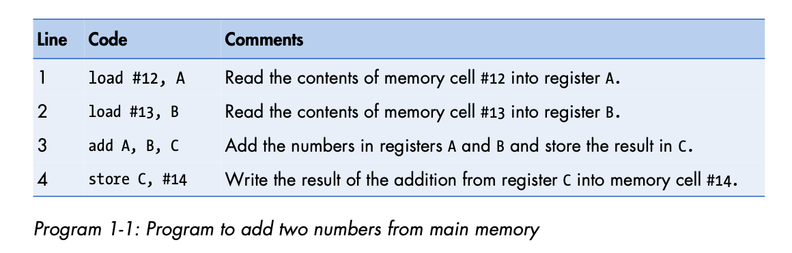

rendered in numerical notation so that it can be stored in memory and executed by the computer?

A computer actually only understands 1s and 0s (more precisely high and low electric voltages), not English words like `add`, `load`, and `store` or letters and base-10 numbers like A,B, 12, and 13.

In order **for a computer to run a program** all of its **instructions must be rendered in binary notation**.

### Machine Language on the DLW-1

The translation of programs of any complexity into binary-based machine language is a massive undertaking that's meant to be done by a computer, but we will look at the basics nonetheless.

The English words in a program like `add`, `load`, and `store`are **mapped to strings of binary numbers called opcodes**. Each opcode designates a different operation that the processor can perform.

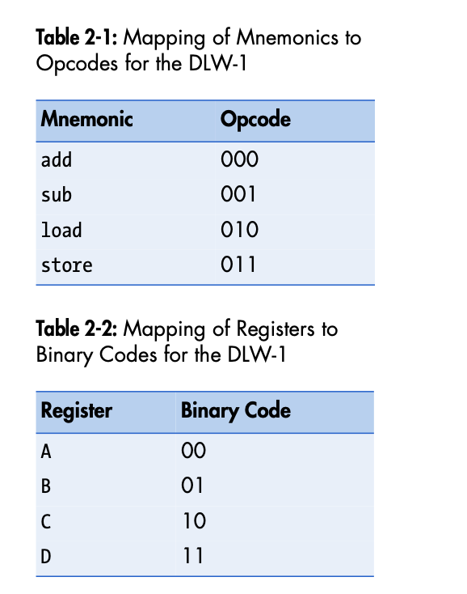

The binary values representing both the opcodes an the register codes are arranged in one of a number of 16-bit formats to get a complete machine language instruction, which is a binary number that can be stored in RAM and used by the processor. Let's look at some examples.

### Binary Encoding of Arithmetic Instructions

Arithmetic instructions have the simplest machine language instruction formats. The following figure shows the format for the machine language encoding of a *register-type* arithmetic instruction (an arithmetic instruction that uses only registers and no immediate values).

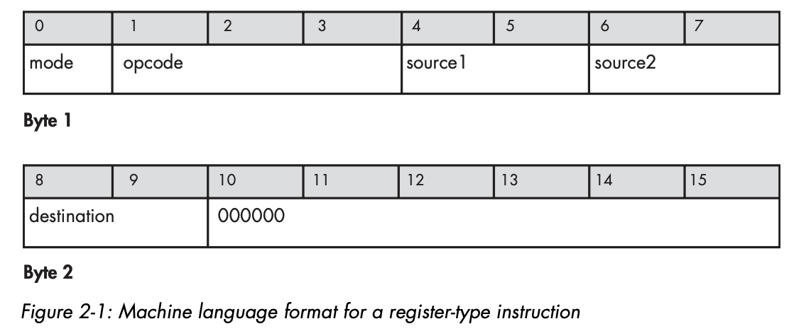

In a register-type arithmetic instruction, the first bit of the instruction is the **mode bit**. If this bit is set to 0, then the instruction is a register-type. If it is set to 1, then the instruction is of immediate type.

Bits 1-3 of the instruction specify the opcode which tells the computer what type of operation the instruction represents.

Bits 4-5 specify the instruction's first source register.

Bits 6-7 specify the second source register.

Bits 8-9 specify the destination register.

The last six bits are not needed by the register-to-register arithmetic instructions, so they are padded with 0s.

Let's use some of the binary-values in the tables introduced earlier to create some machine-language instructions.

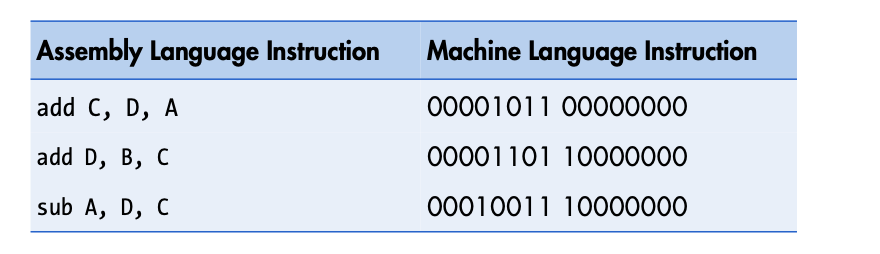

Arithmetic instructions containing an immediate value use an *immediate-type* instruction format. In the immediate-type format, the first byte contains the opcode, the source register, and the destination register, while the second byte contains the immediate value.

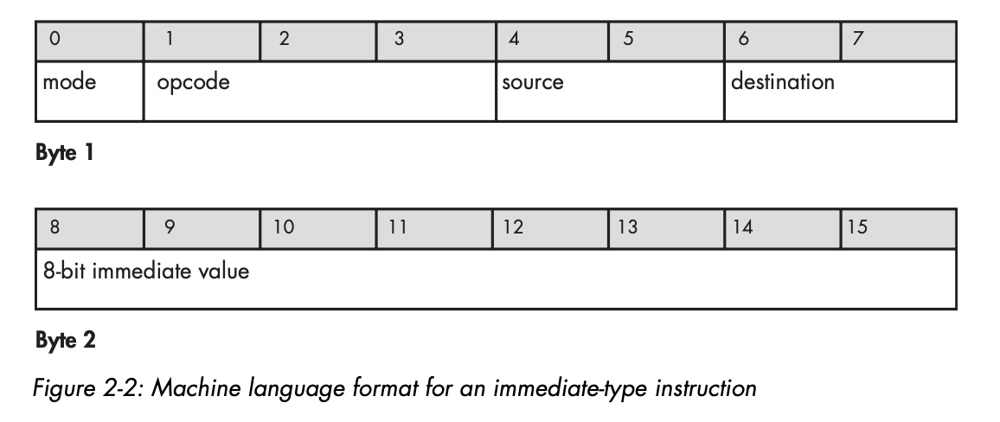

Here are a few immediate-type arithmetic instructions translated from assembly language to machine language.

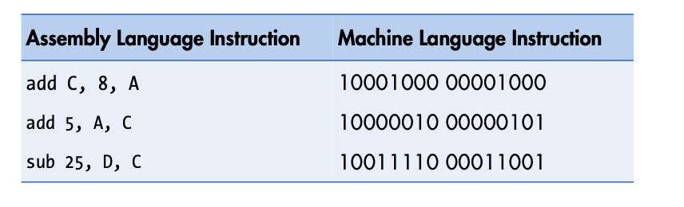

### Binary Encoding of Memory Access Instructions

Memory-access instructions use both register and immediate-type instruction formats exactly like those for arithmetic instructions. The only difference is in how they use them.

#### Load Instruction

An immediate-type `load` uses the immediate-type instruction format, but because the `load`'s source is an immediate value (a memory address) and not a register, the source field is unneeded and must be zeroed out.

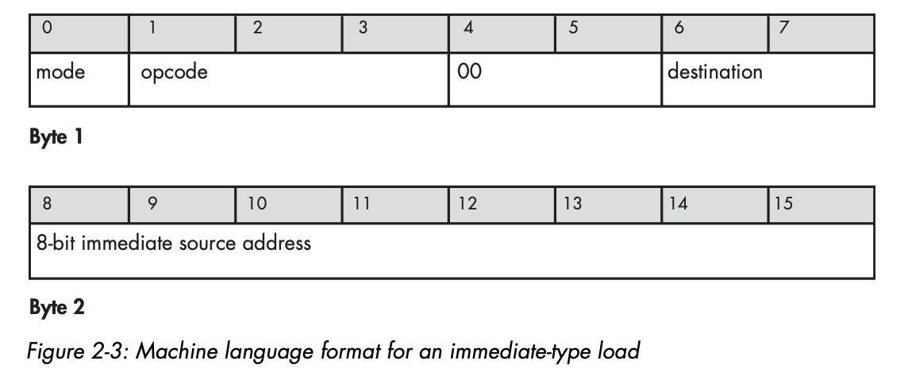

Now let's translate it into the machine language instruction.

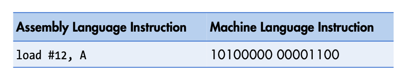

The first byte corresponds to an immediate-type `load` instruction that takes register A as its destination. The second byte is the binary representation of the number 12, which is the source address in memory that the data is to be loaded from.

The second type of load we've seen is the register type. The register-type load uses the register-type instruction format, but with the second source field zeroed out.

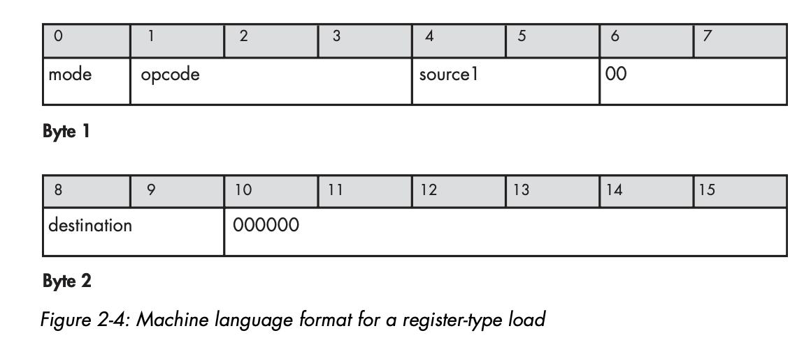

The first source field specifies the register containing the memory address that the processor is to load data from, and the destination field specifies the register that the loaded data is to be placed in.

For a register-relative addressed `load`, we use a version of the immediate-type instruction format, with the base field specifying the register that contains the base address and the offset stored int he second byte of the instruction.

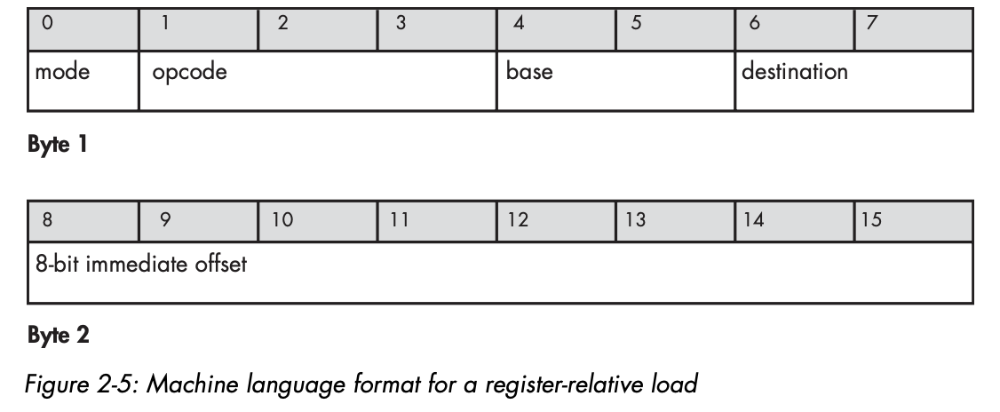

#### The store instruction

The register-type binary format for a `store` instruction is the same as it is for a `load` except that the destination field specifies a register containing a destination memory address, and the source field specifies the register containing the data to be stored in memory.

The immediate-type machine language format for a store is also similar tot he immediate-type format for load, except that since the destination register is not needed (the destination is the immediate memory address), the destination field is zeroed out, while the source field specifies which register holds the data to be stored.

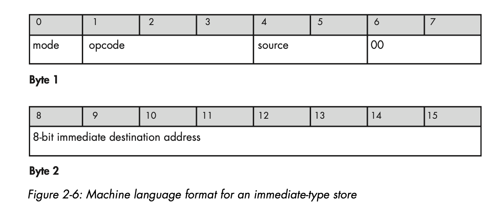

The register-relative `store`, on the other hand, uses the same immediate-type instruction format used for the register-relative `load`, bu the destination field is set to a nonzero value, and the offset is stored in the second byte. 

### Translating an Example Program into Machine Language

Now let's translate Program 1 into machine-readable binary representation using the previous tables and instruction formats.

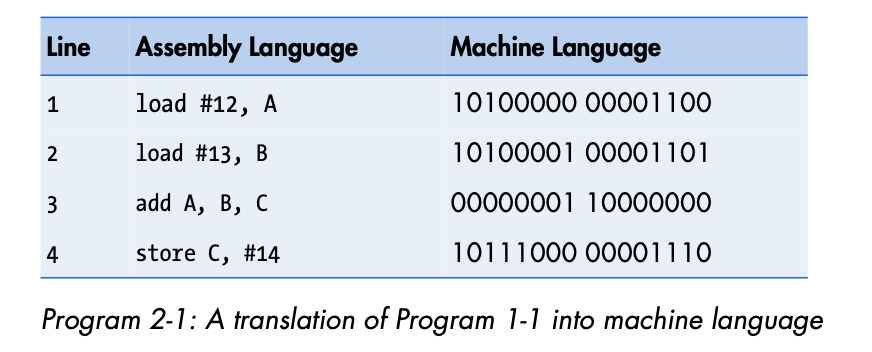

Real machine language instructions are usually longer and more complex than the simple ones given here, but the basic idea is exactly the same. 

## The Programming Model and ISA

Back in the bad old days, programmers had to program computers with machine language directly. Once memory sizes and processing power increased to the point where programmer time was valuable enough, computer scientists devised ways of allowing the computer to use a portion of its power and memory to take on some of the burden of making its cryptic input and output a little more friendly.

This was the birth of assembly language programming. Programs could now be written using mnemonics, register names, and memory locations, before being converted by an **assembler** into machine language for processing.

### The Programming Model

In order to write assembly language for a machine, you have to understand the machine's available resources: how many registers it has, what instructions it supports, etc.

The **programming model** is the **programmer's interface to the microprocessor**. It hides the processor's complex implementation details behind a relatively simple, clean layer of abstraction that exposes the programmer to the processor's functionality. You can think of the programming model as the **API of the microprocessor**. 

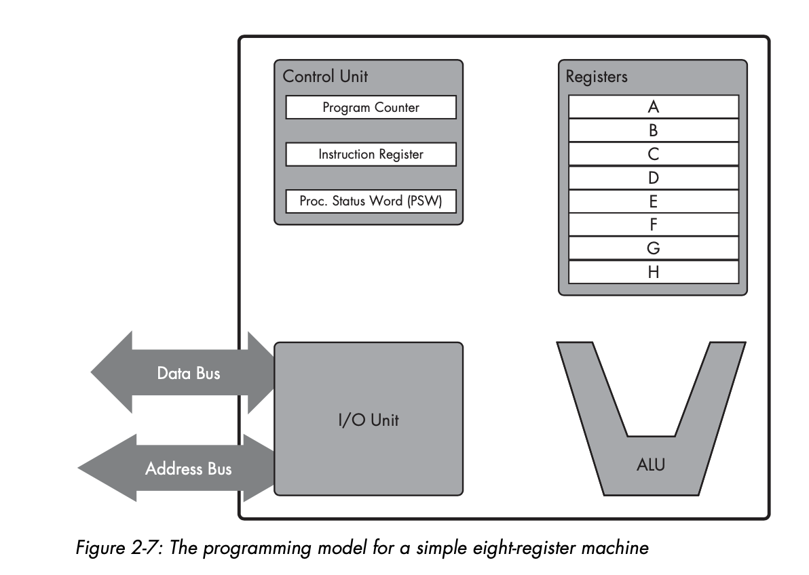

This figure shows a programming model for an eight-register machine. The following components exist in the programming model:
1. ALU - performs arithmetic operations
2. Registers - store numbers
3. I/O unit - responsible for interacting with memory via `load`s and `store`s.
4. Control unit - The program counter and the instruction register, which we will discuss now.

### The Instruction Register and the Program Counter

Because programs are stored in memory as ordered sequences of instructions and memory is arranged as a linear series of addresses, each instruction in a program lives at its own memory address.

In order to step through and execute the lines of a program, the computer simply beings at the program's starting address and then steps through each successive memory location, fetching each successive instruction from memory, placing it in a special register, and executing it. 

The **instructions in our DLW-1 computer are two bytes long**. If we assume that each memory cell holds one byte, then the **DLW-1 must step through memory by fetching instructions from two cells at a time.**

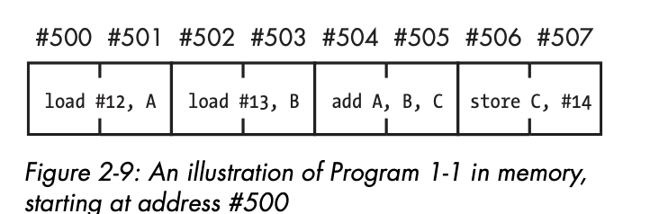

If the starting address in Program 1 were #500, it would look like the figure above.

### Instruction Fetch

An **instruction fetch** is a **special type** of   `load` that **happens automatically for every instruction**. It always takes the address that's currently in the **program counter register as its source** and the **instruction register as its destination**.

The control unit uses a fetch to load each instruction of a program from memory into the instruction register, where the instruction is decoded before being executed. 
 
The decoding process allows the CPU to determine what instruction is to be performed so that the CPU can tell how many operands it needs to fetch in order to perform the instruction. The opcode fetched from the memory is decoded for the next steps and moved to the appropriate registers. The decoding is typically performed by binary decoders in the CPU's Control Unit. (from Wikipedia)

While the instruction is being decoded, the processor places the address of the next instruction into the program counter by incrementing the address that's currently in the program counter.

In the case of the DLW-1, the program counter is incremented by two every time an instruction is fetched because the instructions are two-bytes long.

### Running a Simple Program: The Fetch-Execute Loop

Let's look at the steps the processor takes in order to fetch a series of instructions and feed them either to the ALU or the memory access hardware.

1. Fetch the next instruction from the address stored in the program counter, and load that instruction into the instruction register. Increment the program counter.
2. Decode the instruction in the instruction register
3. Execute the instruction in the instruction register using the following rules
    1. If the instruction is an arithmetic instruction, execute it using the ALU and register file.
    2. If the instruction is a memory access instruction, execute it using the memory-access hardware.

Computer scientists often refer to these steps as the fetch-execute loop or the fetch-execute cycle. This cycle is repeated for as long as the computer is powered on. The machine iterates through the entire loop over and over millions or billion times per second.

## The Clock

The steps in the fetch-execute cycle don't take an arbitrary amount of time to complete. Rather, they're performed according to the pulse of the clock that governs every action that the processor takes.

The clock pulse is generated by a clock generator module on the motherboard and is fed into the processor from the outside.

In the DLW-1, all three steps of the fetch-execute loop can be completed in exactly one beat of the clock.

## Branch Instructions

**Branch** instructions **allow the processor to jump to a program line that is out of sequence.** 

Branches can be categorized as either being **conditional** or **unconditional**.

### Unconditional Branch

An unconditional branch instruction consists of two parts:
1. The branch instruction
2. The target address

`jump #target`

For an unconditional branch `#target` can either be an immediate value or an address stored in a register.

Unconditional branches are fairly easy to execute since all that the computer needs to do upon decoding such a branch in the instruction register is to **have the control unit replace the address currently in the program counter with the branch's target address**.

The next time the processor goes to fetch the instruction at the address given by the program counter, it'll fetch the address at the branch target.

### Conditional Branch

The conditional branch instruction has the same structure as the unconditional branch instruction, but it is a little more complicated because it involves **jumping to the target address only if a certain condition is met**.

So, what makes this complicated? Let's discuss an example. Let's say we want to jump to a new line of a program only if the previous arithmetic instruction's result is zero. To do this we would use a conditional branch instruction that first checks to see if the previously executed instruction yielded a zero result and write the branch target into the program counter if it did. 

We **need a special register or set of registers in which to store information about the results of arithmetic instructions**.

Different architectures handle this in different ways, but in the DLW-1, this is a function of the **processor status word (PSW) register**. ON the DLW-1 every arithmetic operation stores different types of data about its outcome in the PSW upon completion.

To execute a conditional branch, the DLW-1 must first evaluate the condition on which the branch depends by checking the appropriate bit in the PSW to see if that condition is true or false.

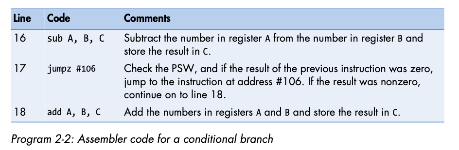

The `jumpz` instruction causes the processor to check the PSW to determine whether a certain bit is 1 or 0. If the bit is 1, the result of the subtraction instruction was 0 and the program counter must be loaded with the branch target address.

There are other bits in the PSW that specify other types of information about the result of the previous operation. As such, there are also other types of conditional branch instructions:
1. `jumpn` - jumps to the target address if the result of the preceding operation was negative.
2. `jumpo` - jumps to the target address if the result of the previous operation was too large and overflowed the register.

### Branch Instructions and the fetch-execute loop

The fetch-execute loop from earlier needs a small modification to reflect branches:

1. Fetch the next instruction from the address stored in the program counter, and load that instruction into the instruction register. Increment the program counter.
2. Decode the instruction in the instruction register
3. Execute the instruction in the instruction register using the following rules
    1. If the instruction is an arithmetic instruction, execute it using the ALU and register file.
    2. If the instruction is a memory access instruction, execute it using the memory-access hardware.
    3. If the instruction is a branch instruction, then execute it using the control unit and the program counter.

Branch instructions allow programmers to redirect the processor as it travels through the instruction stream.

### Branch Instructions as a special type of Load

An instruction fetch is a special type of `load` that happens automatically for every instruction and that always takes the address int he program counter as its source and the instruction register as its destination.

With this in mind, you can think of a branch instruction as a similar kind of load but under the control of the programmer instead of the CPU.

### Branch Instructions and Labels

In programs written for real-world architectures, branch targets don't usually take the form of either immediate values or register-relative values. Rather the programmer places a label ont he line of code to which he or she wants to jup and then puts that label in the branch's target field.

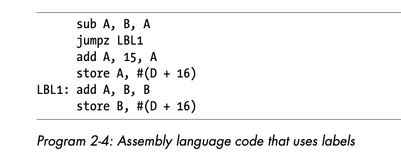

### How does a computer start up?

The microprocessor, in its power-on default state, is hard-wired to fetch that first instruction from a predetermined address in memory. This first instruction, which is loaded into the processor’s instruction register, is the first line of a program called the BIOS that lives in a special set of storage locations—a small read-only memory (ROM) module attached to the computer’s motherboard. It’s the job of the BIOS to perform basic tests of the RAM and peripherals in order to verify that everything is working properly.

At the end of the BIOS program lies a jump instruction, the target of which is the location of a bootloader program. By using a jump, the BIOS hands off control of the system to this second program, whose job it is to search for and load the computer’s operating system from the hard disk. The operating system (OS) loads and unloads all of the other programs that run on the computer.