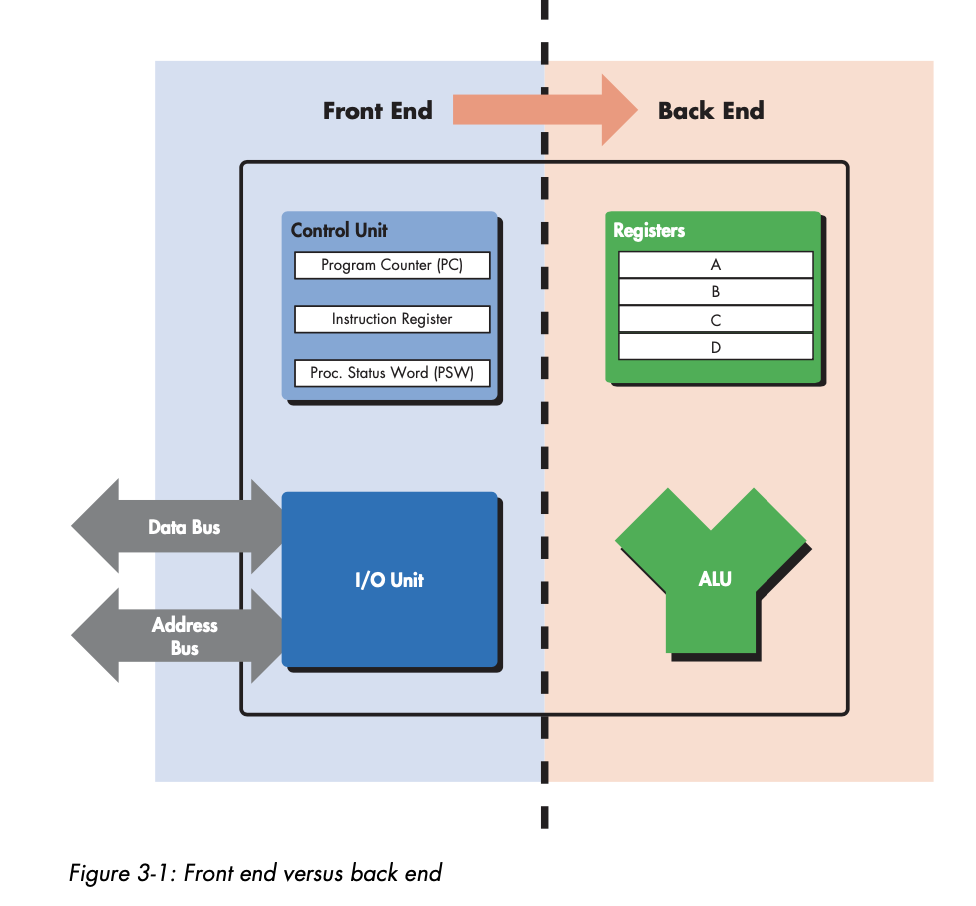
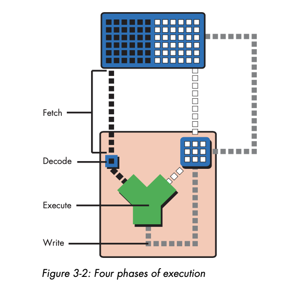
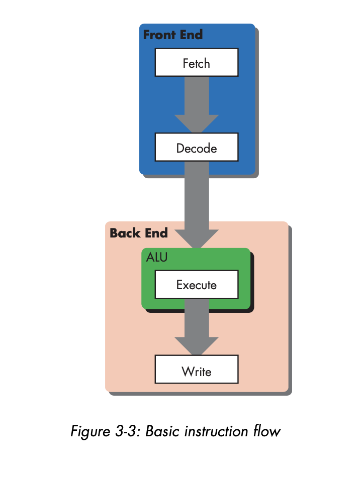
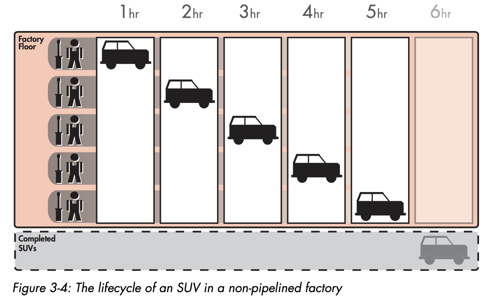
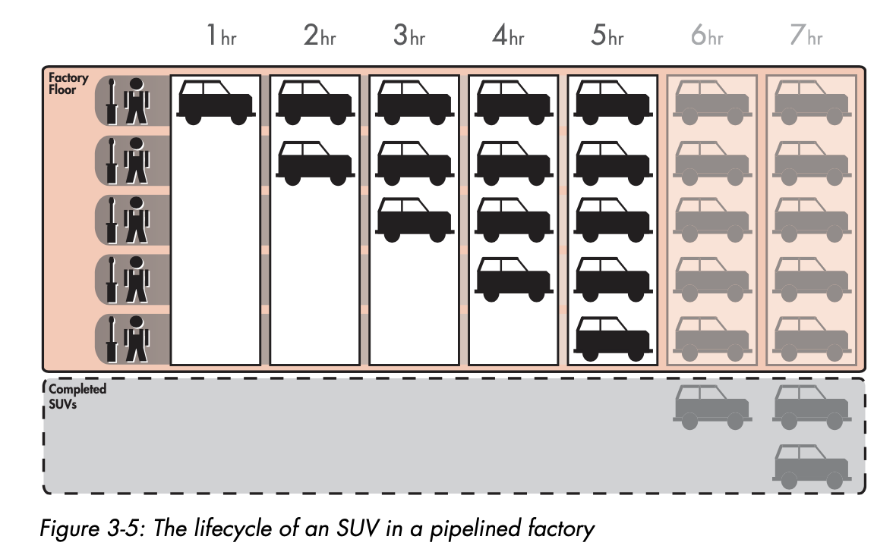
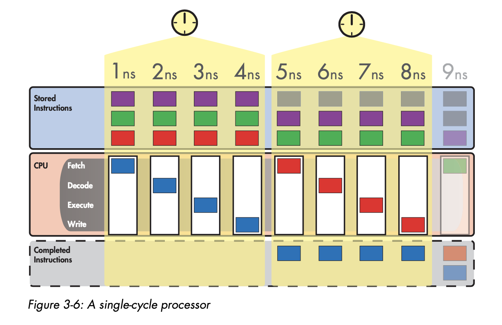
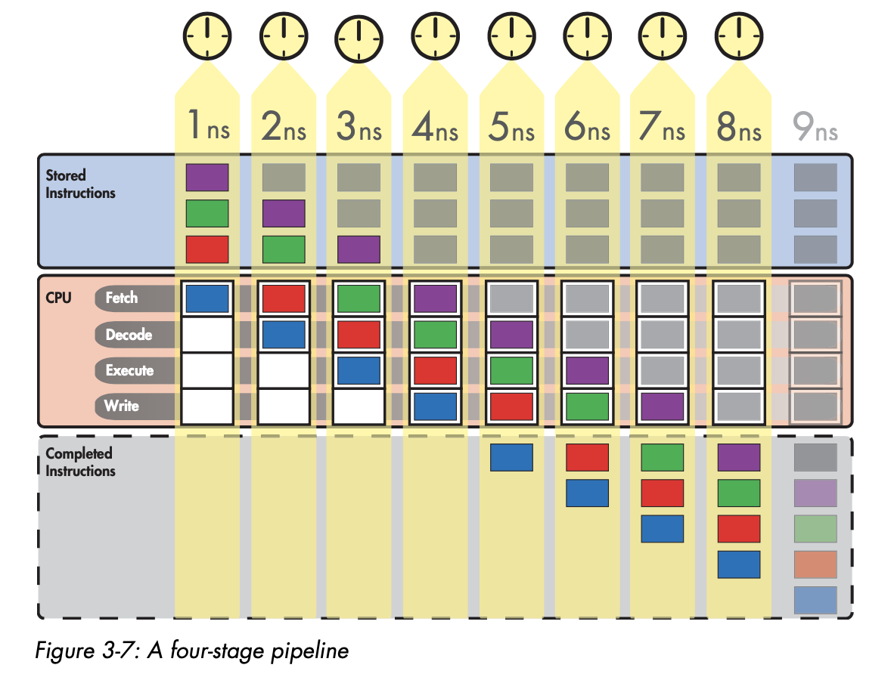
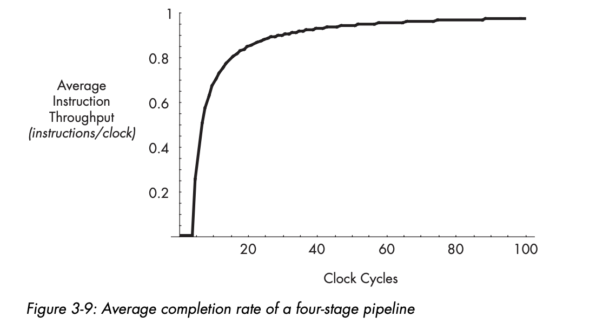

# Pipelined Execution

## Table of Contents

### Introduction

**Pipelined execution** is a technique that enables microprocessor designers to **increase the speed at which a processor operates**.

This chapter will first introduce the concept of pipelining with a factory analogy. This chapter focuses solely on the execution of arithmetic instructions. Memory and branch instructions use the same fundamental principles, but their pipelining is explored more in further chapters.

## The Lifecycle of an Instruction

In the previous section, you learned that a computer repeats three basic steps over and over again in order to execute a program:

1. **fetch** the next instruction from the address stored in the program counter and load that instruction into the instruction register. Increment the program counter.
2. **decode** the instruction in the instruction register (determine what instruction is to be performed).
3. **execute** the instruction in the instruction register.

The execute step itself consists of multiple sub-steps depending on the type of instruction being executed. In the case of an arithmetic instruction: `add A B C`:

1. Read the contents of registers A and B
2. Add the contents of A and B
3. Write the result back to register C.

Thus the expanded list of actions required to execute an arithmetic instruction is:

1. **fetch** the next instruction from the address stored int he program counter and load that instruction into the instruction register. Increment the program counter.
2. **decode** the instruction in the instruction register (determine what instruction is to be performed).
3. **execute** the instruction in the instruction register. Because the instruction is not a branch instruction but an arithmetic instruction, send it to the ALU.
    1. Read the contents of registers A and B
    2. Add the contents of A and B
    3. Write the result back to register C. 

Okay, so this isn't exactly right. Most modern processors treat sub-steps 3a and 3b as a group, while they treat 3c (the register write) as a separate step. Thus the list should actually look like:

1. **fetch** the next instruction from the address stored in the program counter and load that instruction into the instruction register. Increment the program counter.
2. **decode** the instruction in the instruction register (determine what instruction is to be performed).
3. **execute** the instruction in the instruction register. Because the instruction is not a branch instruction but an arithmetic instruction, send it to the ALU.
    1. Read the contents of registers A and B
    2. Add the contents of A and B
4. **Write** the result back to register C. 

In a modern processor, these four steps are repeated over and over again until the program is finished executing. These are the **four stages in the classic RISC pipeline**. Think of a pipeline as a series of stages that each instruction in the code stream must pass through when the code stream is executed. Here are the four stages in an abbreviated form:

1. Fetch
2. Decode
3. Execute
4. Write

Each of these stages can be said to represent one phase in the lifecycle of an instruction. **Each phase takes a fixed but by no means equal amount of time.**

## Basic Instruction Flow

One useful division that computer architects often employ when talking about CPUs is that of the **front end versus the back end**. 

When instructions are fetched from main memory, they must be decoded for execution. This **fetching and decoding** takes place in the **processor's front end**. 

The front end roughly corresponds to the control and I/O units. The ALU and registers constitute the back end. Below is a figure that shows all four phases of the processor execution.

For the rest of the chapter, we are going to focus primarily on the code stream, on how instructions enter and flow through the microprocessor. This means we will leave out the data and results streams.

## Pipelining Explained

To explain pipelining, we will use a factory analogy. Let's say we want to build an automotive manufacturing business. In the spirit of our Lord Ford, we determine there are five stages to build our first product, a truck:

1. Build the chassis
2. Drop the engine into the chassis
3. Put the doors, hood, and coverings on the chassis
4. Attach the wheels
5. Paint the truck

Each of these stages requires the use of highly trained workers with very specialized skill sets. So when we make our first attempt at putting together our factory, we hire and train five crews of specialists, one for each stage of the process. Because the crews are so specialized and efficient, each stage takes exactly one hour to complete.

The first attempt at organizing this labor was to do one truck at a time. First the chassis team builds the chassis, while they are doing this the engine folk clock in, the chassis team hands it off to the engine folks and then they go on break. The engine folk do their work for an hour, and sometime during this work, the doors, hood and coverings team clocks in. Etc, you see how this pattern goes.

The truck moves down the line through all five stages in this way with only one crew working on one stage at any time. At this rate, it takes exactly five hours to finish a single truck, and our factory completes one truck every five hours.

The most intuitive way to go about increasing our factory's truck completion rate is to try and decrease the production time for each truck. IF we can get the crews to work twice as fast, our factory can produce twice as many trucks in the same amount of time. Unfortunately, our specialists are already working as fast as they can. 

Since we can't speed up our teams, we can always hire a new assembly line, this doubles our completion rate. However, this isn't very scalable.

The solution is a revised work flow

1. the chassis team builds a chassis
2. once the chassis is complete, they send it to the engine folk
3. the engine folk receive the chassis while the chassis team receives a new chassis
4. the engine folk pass along their product to the coverings team, and they receive a new chassis.

Visually, the workflow looks like this:

With this strategy, the crews can work simultaneously. If we can keep the assembly line full, we can produce a truck every hour. A fivefold improvement in the completion rate. This idea is called **pipelining**. While the total amount of time each individual truck spends in production has not changed, the rate at which the factory completes the trucks has increased drastically.

## Applying the Analogy

Let's look back at microprocessors now. We should think about using this same technique in the four phases of an instruction's lifecycle. Microprocessor designers are always looking for ways to increase the number of instructions a CPU can complete.

### A Non-pipelined processor

The previous chapter briefly described how simple processors use the clock to time internal operations.

These non-pipelined processors work on one instruction at a time, moving each instruction through all four phases of its lifecycle during the course of a one clock cycle. This is why non-pipelined processors are called single cycle processors. Because all instructions take one clock cycle to execute.

Because the processor completes instructions at a rate of one per clock cycle, you want the CPU's clock to run as fast as possible. To do this you need to calculate the maximum amount of time it takes to complete an instruction (remember not all instructions take the same time to execute) and make the clock cycle equivalent to this length of time.

In the figure above, the blue instruction leaves the code storage area, enters the processor, and then advances through the phases of the lifecycle until at the end of the fourth nanosecond, it completes the last phase and its lifecycle is over.

The end of the fourth nanosecond is also the end of the first clock cycle, so now the red instruction can enter the processor at the start of the new clock cycle. After a total of 16 ns, the processor has completed all four instructions at a rate of .25 instructions/ns.

These types of processors are simple to design, but they waste a lot of resources.

### A pipelined processor

Pipelining a processor means breaking down its instruction execution process into a series of discrete pipeline stages that can be completed in sequence by specialized hardware. Because an instruction's lifecycle consists of four fairly distinct phases, you can start by breaking down the single-cycle processor's instruction execution process into a sequence of four discrete pipelined stages.

1. Fetch the instruction from storage
2. Decode the instruction
3. Execute the instruction
4. Write the results to the register file

The number of pipeline stages is called the **pipeline depth**. Let's say that each of these stages takes 1 ns to complete.

At the start of the fifth nanosecond, the pipeline is now full, and the processor can begin completing instructions at a rate of one instruction per nanosecond. This is a fourfold improvement over the previous example.

### Shrinking the clock

As you can see, the role of the CPU clock changes slightly in the pipelined processor. Because all pipeline stages must not work together simultaneously and be ready at the start of each new nanosecond to hand over the results of their work, **the clock is needed to coordinate the activity of the whole pipeline**.

The clock cycle time is shrunk to match the time it takes each stage to complete its work. This new method of clocking the processor means that a new instruction is not necessarily completed at the close of each clock cycle, as was the case in the single-cycle processor. Instead, a new instruction will be completed at the close of only those clock cycles in which the write stage has been working on an instruction.
### Shrinking program execution time

The total execution time for each individual instruction is not changed by pipelining. It still takes an instruction 4 ns to make it through the processor. **Pipelining doesn't speed up instruction execution time**, but **it does speed up program execution time** (the number of nanoseconds it takes to execute an entire program).

### The speedup from pipelining

In general, **the speedup in completion rate** versus a single-cycle implementation **that's gained from pipelining** is ideally **equal to the number of pipeline stages**. This speedup is possible because the more pipeline stages there are in a processor, the more instructions the processor can work on simultaneously. 

Some processors have a five-stage pipeline, some have a six-stage pipeline, and many have 10 or 20 stages. In such cases, the CPU designer must slice up the instruction lifecycle into the desired number of stages in such a way that all the stages are equal in length.

### Program Execution Time and Completion Rate

If the program that the single-cycle processor is running consisted of only four instructions, that program would have a program execution time of 16ns, or 
`4 instructions / 0.25 instructions/ns`.

In general, a program's execution time is equal to the total number of instructions divided by the processor's instruction completion rate.

`program execution time = number of instructions / instruction completion rate`

Most of the time **when we are talking about processor performance** we are talking about **program execution time**.

From the equation, we can see that program execution time can be reduced in one of two ways:
1. by a reduction in the number of instructions per program
2. by an increase in the processor's completion rate.

With pipelined processors, the relationship between instruction execution time and completion rate is more complex. Pipelined processors allow you to increase the processor's completion rate without altering the instruction execution time. 

Strangely enough, **pipelining improvements on completion rate often come at the price of increased instruction execution times**. This means for pipelining to improve performance, the processor's completion rate must be as high as possible over the course of program execution.

### The relationship between completion rate and program execution time

Let's take a look back at the single-cycle processor and the four-stage processor we introduced earlier.

If we look at the ninth nanosecond, we can see that the non-pipelined processor has two completed instructions, and the pipelined processor has four completed instructions. This is not a fourfold improvement in the amount of complete instructions.

The important point here is that it takes the pipelined processor some time to fill up with instructions. The processor's average completion rate will approach the theoretical maximum completion rate only if it can go for long stretches with its pipeline full on every clock cycle.

## Instruction throughput and pipeline stalls

Pipelining isn't totally free. It adds complexity to the control logic of the microprocessor because all the stages need to be kept in sync, and more importantly it adds complexity to the ways we assess processor performance.

### Instruction Throughput

Up until now we've talked about microprocessor performance mainly in terms of instruction completion rate, or the number of instructions that the processor's pipeline can complete each nanosecond. 

A more common performance metric is the pipeline's **instruction throughput**: **the number of instructions that the processor completes each clock cycle**. You will see this referred to as **instructions per clock (IPC)**.

**Maximum theoretical instruction throughput**: The theoretical maximum number of instructions that the processor can finish executing on each clock cycle.

**Average instruction throughput**: The average number of instructions per clock (IPC) that the processor has actually completed over a certain number of cycles.

### Pipeline Stalls