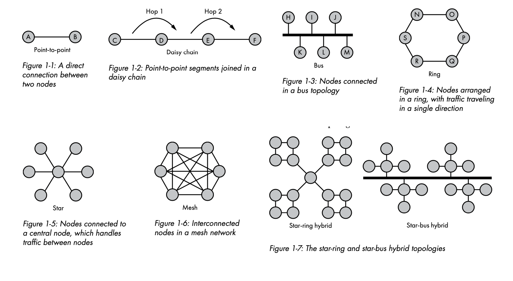
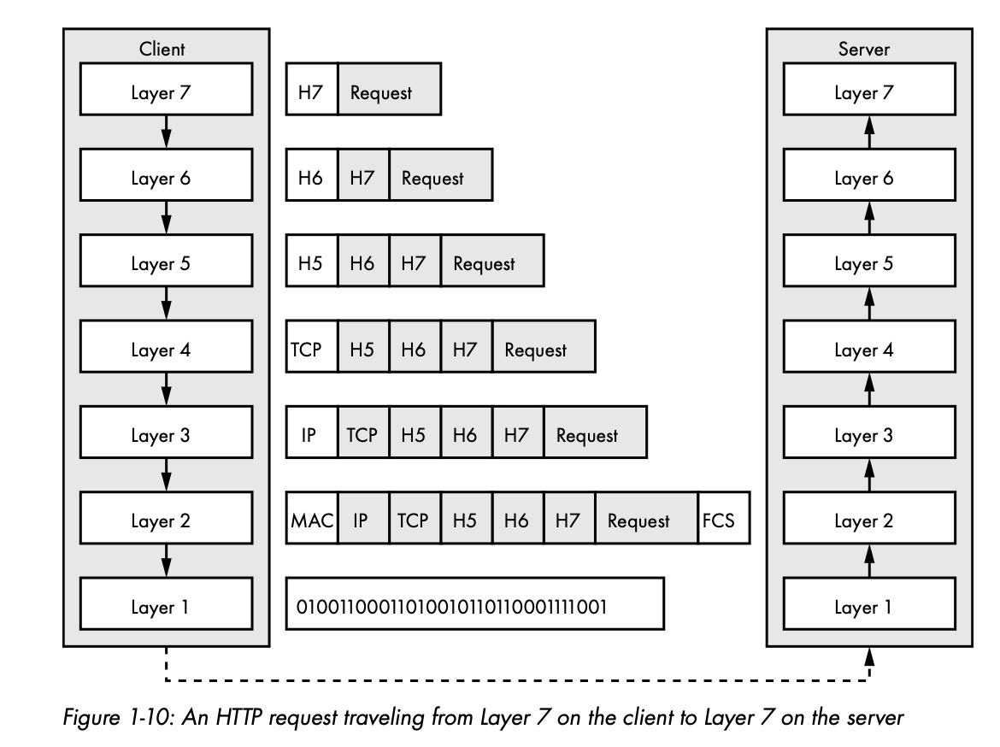
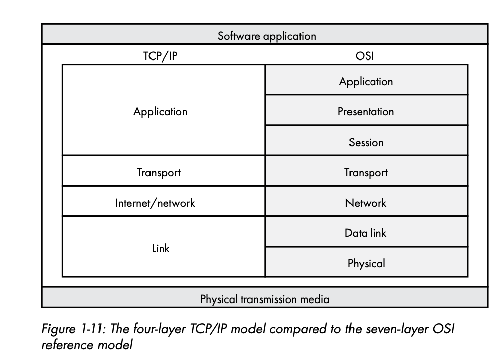

# Network Architecture

## Table of Contents
* [Topology](#topology)
* [Bandwidth vs Latency](#bandwidth-vs-latency)
* [Data Encapsulation](#data-encapsulation)

## Topology

The birds-eye view of nodes in a network is called the topology. A network's topology can be very simple (your LAN), to mind-bogglingly complex graph (the Internet). Some topologies don't share a direct connection between nodes but are able to exchange data.

Topology types can be reduced to six basic categories: point-to-point, daisy chain, bus, ring, star and mesh.

Here are some brief notes about certain topologies that are worth noting:

1. **Bus topology** nodes **share a common network link**. This type of topology is the basis of wireless networks. The nodes on a wireless network see all the traffic and selectively ignore it depending on whether the traffic is intended for them. Although wireless clients can see each other's traffic, traffic is usually encrypted.

2. In a **star topology**, a central node has individual **point-to-point connections to all other nodes**. This central node is often a network switch, which is a device that accepts data from the sending node and retransmits it to the correct destination node. There is a single point of failure in this topology, the switch.

3. In a **mesh network**, each node has a **direct connection to every other node**. The topology eliminates single point of failure, however it adds cost and complexity.

Most real world systems use a hybrid network topology that combines two or more basic topologies. Hybrid topologies are meant to improve reliability, scalability and flexibility by taking advantage of each basic topology's strengths and by limiting their disadvantages.

## Bandwidth vs Latency

Network **bandwidth** is the **amount of data we can send over a network connection in an interval of time**.

I like to think about this with an analogy of running. If you run a couple of miles, the most common metric for measuring your run is your average mile pace. Your bandwidth is your average mile pace. The amount of distance you can cover in an interval of time. 

Often network bandwidths are advertised as their idealized bandwidth, ie, your internet service might be advertised as 250Mbps download, which means you should theoretically be able to download data at 250 megabits every second when connected to your internet service.

A common confusion when discussing network transmission rates is using bytes per second instead of bits per second. **Network transmission rates are measured in bits per second**. We use bytes per second when discussing the amount of data transferred. Thus, if your ISP advertises 100Mbps download rate, that doesn't mean you can download a 100MB file in one second. It means it will take 8 seconds, because 12.5 MB per second will be downloaded.

Do you run at your top mile pace every time you go running, you wish! It's your best performance so it is usually only reached in rare occasions. Similarly, the bandwidth advertised by your ISP is under ideal conditions.

Another important metric when thinking about computer networks is **latency**, the **measure of time** that passes **between sending a network resource and receiving a response**.

Latency can be underappreciated by software engineers, but usually that's because it is complex to divvy up all the possible contributing factors to latency. Let's briefly address how latency can be contributed to in visiting a website:
1. The network latency between the client and server.
2. The time it takes to retrieve data from a data store.
3. The time it takes to compile dynamic content on the server/client.

**Keeping latency to a minimum will pay dividends by improving user experience.**

A web programmer can address latency in several ways:
1. **Reduce the distance** and number of hops ***between users and your service*** by using a CDN or cloud infrastructure to locate your service near your users.
2. Optimize the request and response sizes.
3. Incorporate a caching strategy.
4. Take advantage of concurrency to reduce server-side blocking.

## Data Encapsulation

**Encapsulation** is the method of hiding implementation details or only making the relevant details available. As data travels down the network stack, it's encapsulated by the layer below. Typically this involves wrapping the current payload of data with some data that identifies it for the travel it will make across the network. Typically, a payload travels down the client's network stack, over physical media to the server, and up the server's network stack to its corresponding layer.

There are specific names for the data at each layer of the network stack:

1. Layer 4 - segments or datagrams, add just a header.
2. Layer 3 - packet, adds just a header.
3. Layer 2 - frames, translates the recipient's IP address into a media access control (MAC) address. Uses a header and footer. The footer contains a frame check sequence (FCS), a checksum to aid error detection.

## The TCP/IP Model

The TCP/IP model was designed using the **end-to-end principle**, whereby **each network segment includes only enough functionality to properly transmit the route bits**, all other functionality belongs to the endpoints. You can contrast this design with modern cellular networks, where more network functionality must be provided by the network between cell phones to allow for a cell phone connection to jump between towers without disconnecting a call.

1. **Application Layer** - interacts directly with software applications. Most of the software we write use protocols in this layer: HTTP, FTP, SMTP, DHCP, DNS.
2. **Transport Layer** - handles the transfer of data between two nodes. Most of our network applications rely on transport protocols to handle error detection, flow control, retransmission, and transport acknowledgement. TCP and UDP are the main transport protocols.
3. **Internet Layer** - responsible for routing packets of data from upper layers between the origin node adn the destination node often over multiple networks and heterogenous media. Examples include IPv4, IPv6, ICMP, BGP, IPsec.
4. **Link Layer** - Interface between the core TCP/IP protocols and physical media. The link layer's **Address Resolution Protocol (ARP)** translates a node's IP address to the MAC address of its network interface. The linnk layer embeds the MAC address in each frame's header before passing the frame onto the physical network.