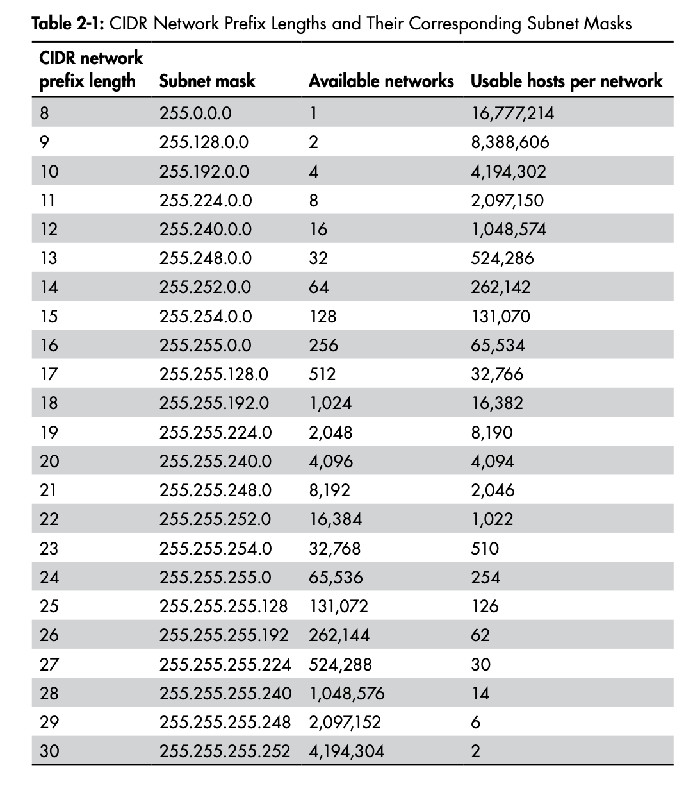

# Network Architecture and Resource Location

## Table of Contents
* [Network Architecture](#network-architecture)
    * [Topology](#topology)
    * [Bandwidth vs Latency](#bandwidth-vs-latency)
    * [Data Encapsulation](#data-encapsulation)
    * [TCP/IP Model](#tcp-ip-model)
* [Resource Location](#resource-location)
* [IP addressing](#ip-addressing)
    * [Network and Host IDs](#network-and-host-ids)
    * [Subnets and CIDR](#subnets-and-CIDR)
    * [Ports and Socket Addresses](#ports-and-socket-addresses)
    * [Network Address Translation](#network-address-translation)
    * [Unicasting, Multicasting and Broadcasting](#unicasting-multicasting-and-broadcasting)
    * [Resolving the MAC address](#resolving-the-mac-address)
* [IPv6 Addressing](#ipv6-addressing)
    * [Network and Host Addresses](#network-and-host-addresses)
    * [IPv6 Address Categories](#ipv6-address-categories)
    * [Why use IPv6?](#why-use-ipv6)

## Network Architecture
## Topology

The birds-eye view of nodes in a network is called the topology. A network's topology can be very simple (your LAN), to mind-bogglingly complex graph (the Internet). Some topologies don't share a direct connection between nodes but are able to exchange data.

Topology types can be reduced to six basic categories: point-to-point, daisy chain, bus, ring, star and mesh.

Here are some brief notes about certain topologies that are worth noting:

1. **Bus topology** nodes **share a common network link**. This type of topology is the basis of wireless networks. The nodes on a wireless network see all the traffic and selectively ignore it depending on whether the traffic is intended for them. Although wireless clients can see each other's traffic, traffic is usually encrypted.

2. In a **star topology**, a central node has individual **point-to-point connections to all other nodes**. This central node is often a network switch, which is a device that accepts data from the sending node and retransmits it to the correct destination node. There is a single point of failure in this topology, the switch.

3. In a **mesh network**, each node has a **direct connection to every other node**. The topology eliminates single point of failure, however it adds cost and complexity.

Most real world systems use a hybrid network topology that combines two or more basic topologies. Hybrid topologies are meant to improve reliability, scalability and flexibility by taking advantage of each basic topology's strengths and by limiting their disadvantages.

## Bandwidth vs Latency

Network **bandwidth** is the **amount of data we can send over a network connection in an interval of time**.

I like to think about this with an analogy of running. If you run a couple of miles, the most common metric for measuring your run is your average mile pace. Your bandwidth is your average mile pace. The amount of distance you can cover in an interval of time. 

Often network bandwidths are advertised as their idealized bandwidth, ie, your internet service might be advertised as 250Mbps download, which means you should theoretically be able to download data at 250 megabits every second when connected to your internet service.

A common confusion when discussing network transmission rates is using bytes per second instead of bits per second. **Network transmission rates are measured in bits per second**. We use bytes per second when discussing the amount of data transferred. Thus, if your ISP advertises 100Mbps download rate, that doesn't mean you can download a 100MB file in one second. It means it will take 8 seconds, because 12.5 MB per second will be downloaded.

Do you run at your top mile pace every time you go running, you wish! It's your best performance so it is usually only reached in rare occasions. Similarly, the bandwidth advertised by your ISP is under ideal conditions.

Another important metric when thinking about computer networks is **latency**, the **measure of time** that passes **between sending a network resource and receiving a response**.

Latency can be underappreciated by software engineers, but usually that's because it is complex to divvy up all the possible contributing factors to latency. Let's briefly address how latency can be contributed to in visiting a website:
1. The network latency between the client and server.
2. The time it takes to retrieve data from a data store.
3. The time it takes to compile dynamic content on the server/client.

**Keeping latency to a minimum will pay dividends by improving user experience.**

A web programmer can address latency in several ways:
1. **Reduce the distance** and number of hops ***between users and your service*** by using a CDN or cloud infrastructure to locate your service near your users.
2. Optimize the request and response sizes.
3. Incorporate a caching strategy.
4. Take advantage of concurrency to reduce server-side blocking.

## Data Encapsulation

**Encapsulation** is the method of hiding implementation details or only making the relevant details available. As data travels down the network stack, it's encapsulated by the layer below. Typically this involves wrapping the current payload of data with some data that identifies it for the travel it will make across the network. Typically, a payload travels down the client's network stack, over physical media to the server, and up the server's network stack to its corresponding layer.

There are specific names for the data at each layer of the network stack:

1. Layer 4 - segments or datagrams, add just a header.
2. Layer 3 - packet, adds just a header.
3. Layer 2 - frames, translates the recipient's IP address into a media access control (MAC) address. Uses a header and footer. The footer contains a frame check sequence (FCS), a checksum to aid error detection.

## The TCP/IP Model

The TCP/IP model was designed using the **end-to-end principle**, whereby **each network segment includes only enough functionality to properly transmit the route bits**, all other functionality belongs to the endpoints. You can contrast this design with modern cellular networks, where more network functionality must be provided by the network between cell phones to allow for a cell phone connection to jump between towers without disconnecting a call.

1. **Application Layer** - interacts directly with software applications. Most of the software we write use protocols in this layer: HTTP, FTP, SMTP, DHCP, DNS.
2. **Transport Layer** - handles the transfer of data between two nodes. Most of our network applications rely on transport protocols to handle error detection, flow control, retransmission, and transport acknowledgement. TCP and UDP are the main transport protocols.
3. **Internet Layer** - responsible for routing packets of data from upper layers between the origin node adn the destination node often over multiple networks and heterogenous media. Examples include IPv4, IPv6, ICMP, BGP, IPsec.
4. **Link Layer** - Interface between the core TCP/IP protocols and physical media. The link layer's **Address Resolution Protocol (ARP)** translates a node's IP address to the MAC address of its network interface. The linnk layer embeds the MAC address in each frame's header before passing the frame onto the physical network.

## Resource Location

## IP Addressing

The **Internet Protocol (IP)** is a **set of rules that dictate the format of data sent over a network** -- specifically the Internet. **IP addresses** **identify nodes on a network at the internet layer** of the TCP/IP stack.

**IPv4** is the fourth version of the Internet Protocol. IPv4 addresses are **32-bit numbers** arranged in four groups of 8 bits, called octets. The total range of 32-bit numbers limits us to just over four billion possible IPv4 addresses.

We usually write IPv4 addresses in decimal format because it is easier to read as a human. Computers don't work with IP addresses this way though.

### Network and Host IDs

The 32 bits that compose an IPv4 address **represent two components: a network ID and a host ID.** 

The **network ID** informs the network devices (routers) responsible for shuttling packets toward their destination about **the next appropriate hop in the forwarding**. A good analogy for the network ID is that it is like the US postal service's ZIP code. 

Once the data reaches the destination network, the router uses the **host ID** to **deliver the data to the correct recipient**. A good analogy for the host ID is that it is like a street address.

The network ID portion of an IPv4 address always starts with the left-most bit, and its size is determined by the network it belongs to. The remaining bits designate the host ID.

### Subnets and CIDR

IPv4's network and host IDs allow engineers to subdivide the four billion IPv4 addresses into smaller groups. These smaller networks are called **subnets**, and the IP addresses in these networks share the same network ID but have unique host IDs.

You can allocate networks using a method known as **Classless Inter-Domain Routing (CIDR)**. In CIDR, you indicate the number of bits in the network ID of an address by appending a network prefix to each IP address, consisting of a forward slash and an integer.

Though it's appended to the end of the IP address, **we call it a prefix** rather than a suffix because it indicates **how many of the IP address's most significant bits constitute the network ID**.

Let's take a simple example. The address 127.32.14.5/16 indicates that the first 16 bits are the network ID, and the last 16 bits are the host ID. 

If you look at the image above you might notice that the number of usable hosts is two less than expected in each row. That's because **each network has two special addresses**. The first IP address in the network is the **network address** and the last IP address is the **broadcast address**.

Take the address 127.168.0.0/16, the first IP address is 127.168.0.0, this is the network address. The last IP address is 127.168.255.255, this is the broadcast address. These special addresses are used for routing data between networks and broadcasting, respectively.

It's important to remember that **these splits don't have to be clean**. Let's look at the network ID and host ID for 192.168.156.97/19.

The network ID is 192.168.128.0, the host ID is 0.0.28.97.

Lastly, there are some **specific IP addresses that you should remember**. 
1. 10.0.0.0/8
2. 172.16.0.0/12
3. 192.168.0.0/16
**Have all been designated for use in local networks.**

In addition, each host has the **127.0.0.0/8** subnet designated as its local subnet. Addresses in this subnet are local to the host and simply called **localhost**.  **Even if a computer is not on a network, it should still have ann address on the 127.0.0.0/8 subnet.**

### Ports and Socket Addresses

The operating system uses **ports** to **uniquely identify data transmission** between nodes **for the purpose of multiplexing the outgoing application data and demultiplexing the incoming data** back to the proper application. Ports are unsigned 16-bit integers.

The combination of an **IP address and a port** number is a **socket address**.

### Network Address Translation

**Network Address Translation (NAT)** is a process that **allows numerous nodes to share the same public IPv4 address**. It requires a device that can keep track of incoming and outgoing traffic and properly route incoming traffic to the correct node.

In the figure above, a NAT device receives a connection from the client socket address 10.0.0.3:50926 destined for a host on the internet. The NAT device opens up its own connection to the destination host using public IP address 1.2.3.4, preserving the client's socket address port.

Then the NAT sends the request from the internal client to the destination host. It will receive the response on 1.2.3.4:50926 if port 50926 is not busy on the destination host.

The NAT device keeps a table that maps internal IP to external request. This allows it forward the received request to the correct client.

The important thing to remember here is that an internal node's IPv4 address is not visible to any nodes outside the NAT network segment.

### Unicasting, Multicasting and Broadcasting

Sending packets from **one IP address to another IP address** is known as **unicast addressing**. 

TCP/IP also supports **IP multicasting**. This means **sending a single message to a group of nodes**. Routers and switches will do the work of replicating the message that is sent.

**Broadcasting** is the ability to concurrently **deliver a message to all IP addresses in a network**. To do this, nodes on a network send packets to the broadcast address of a subnet. A network switch or router will then propagate the packets out to all IPv4 addresses in the subnet.

Unlike multicasting, the nodes in a subnet don't first need to opt in to receive broadcast messages.

### Resolving the MAC address

Every network interface has a **MAC address** uniquely **identifying the node's physical connection to the network**.

The MAC address is only relevant to the local network. **Routers cannot use a MAC address to route data across network boundaries.** Instead, they **route traffic across network boundaries using an IPv4 address.** Once a packet reaches the local network of a destination node, the router sends the data to the destination node's MAC address, and finally to the destination node's physical network connection.

The **Address Resolution Protocol (ARP)**, finds **the appropriate MAC address for a given IPv4 address**. Nodes maintain ARP tables that map an IPv4 address to a MAC address. If a node does not have an entry in its ARP table for a destination IPv4 address, the node will send a request to the local network's broadcast address asking "who has this address?". 

The destination node will receive the ARP request and respond with an ARP reply to the originating node. The originating node will then use the returned MAC address to send data.

## IPv6 Addressing

In order to make space for the massive number of machines that are about to come online, some folks recommend moving to an extended form of IP addressing, known as **IPv6 addressing**. Please don't ask about IPv5. You will be black-holed.

IPv6 addresses are **128-bit numbers** arranged in eight groups of 16-bits (hextets). There are more thann 340 [undecillion](https://en.wikipedia.org/wiki/Names_of_large_numbers) IPv6 addresses!

This looks slightly different from IPv4 addresses because we are using the hex representation of the numbers instead of the decimal representation.

IPv6 addresses can be made more readable by removing leading zeros in each hextet. This simplifies the address without changing the value.

fd00:4700:0010:0000:0000: 0000:6814:d103

becomes

fd00:4700:10:0:0:0:6814:d103

Another rule is to replace the leftmost group of consecutive, zero-value hextets with double colons, producing:

fd00:4700:10::6814:d103

If your address has more than one group of consecutive zero-value hextets, you can remove only the leftmost group.

### Network and Host Addresses

Like IPv4 addresses, IPv6 addresses have a network address and a host address. The IPv6 host address is commonly known as the **interface ID**.  The network and host addresses are both 64-bits. 

The first 48-bits of the network address are known as the global routing prefix (GRP), and the last 16 bits of the network address are the subnet ID. The GRP is used for globally subdividing the IPv6 address space, and routing traffic between these groups. The subnet ID is used to further subdivide each GRP-unique network into site-specific networks.

The GRP gets determined when you request a block of IPv6 addresses from your ISP. IANA assigns the first hextet of the GRP to a regional internet registry (an organization that handles the allocation of addresses for a global region). The registry then assigns the second GRP hextet to an ISP. The ISP finally assigns the the third GRP hextet before assigning a 48-bit subnet of IPv6 addresses to you.

### IPv6 Address Categories

IPv6 addresses are divided into three categories: anycast, multicast, and unicast. There is no broadcast type.

A **unicast IPv6 address** uniquely identifies a node. If an originating node sends a message to a unicast address, only the node with that address will receive the message.

A multicast IPv6 address represents a group of nodes. A multicast address will deliver a message to a subset of network addresses. This is similar to what we've already discusses with multicast.

IPv6 includes **support for multiple nodes using the same network address**. This is NOT the case in IPv4 addressing where each node must be unique per network segment. An **anycast address** represents a **group of nodes listening to the same address**. The sender can transmit to any of the nodes in the group, but it should send to the **nearest node**. This might might not always be the physically closest node. It is up to the router to determine which node will receive the message, and that is usually the node with the least latency.

Aside from reducing latency, anycast addressing increases redundancy and can geolocate services.

### Why use IPv6?

There are a few advantages:

1. **Headers** 
    1. **The header format of IPv6 packets is streamlined.** IPv6 makes many headers optional that IPv4 required, even if those header fields were rarely used.
    2. The **IPv6 header is extensible**, functionality can be added without breaking backwards compatibility.
    3. Lessens the loads on routers by ensuring that **headers require minimal processing**, eliminating the need for checksum calculations. If using TCP, the IP packet relies on layer-2 and layer-4 for checksumming. UDP requires a layer-3 checksum.
2. **Automated Address Configuration**
    1. Administrators have to manually assign IPv4 addresses to each node on a network or rely on a service to do so. Nodes in IPv6 can automatically configure their addresses to **reduce administrative overhead**. 
    2. When connected to an IPv6 network, a node can solicit the router for its network address parameters using the **Neighbor Discovery Protocol (NDP)**. NDP uses ICMP and **performs the same duties as IPv4 ARP**. Once the node receives a reply from the router with the 64-bit network address, the node can derive the 64-bit host portion of its address by itself using the 48-bit MAC address assigned to its network interface.
    3. How does it do this? The node appends the 16-bit hex FFFE to the first three octets of the MAC address (these three octets are known as the Originally Unique Identifier (OUI)). It then appends the remaining three octets of the MAC address which is the Network Interface Controller (NIC) identifier. This might concern you if you value privacy because a MAC address is a unique fingerprint that betrays your hardware. People raised concerns about this and this process now has privacy extensions which randomize the interface ID.

    

    4. This process will only work in the presence of a router who can respond with router advertisement packets.
3. **Native IPsec support**
    1. IPv6 has native support fo IPsec, a technology that allows nodes to encrypt IP traffic.

