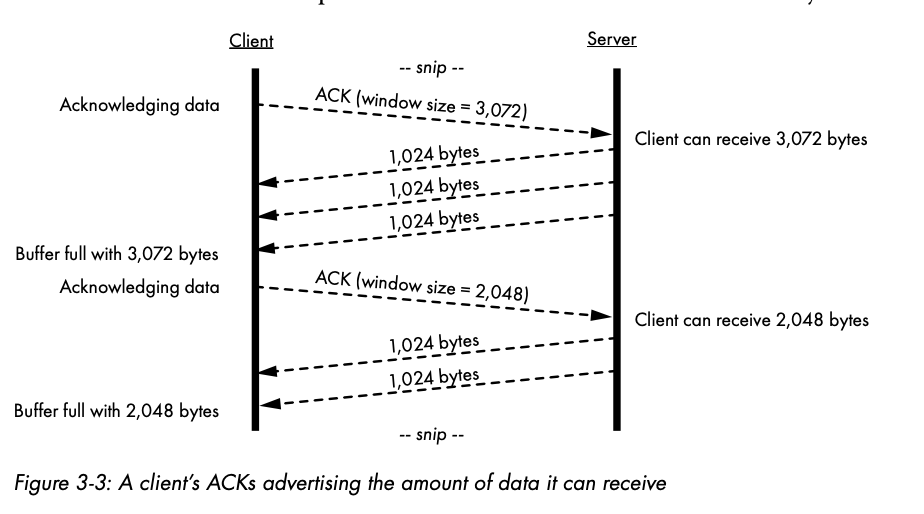

# Socket Programming

## Table of Contents

## Reliable TCP Streams

TCP allows a computer to reliably stream data between nodes on a network. Go's stdlib allows programmers to write robust TCP-based network applications.

### Reliability and flow control

TCP is **reliable** because it was built to **handle packet loss and receiving packets out of order**. Packet loss can occur because of data transmission errors or network congestion. 

Routers are computers that handle the transfer of packets from node to node. They, like all computers, have a limited memory, and they use this memory to temporarily store packet info before forwarding traffic out of the correct port. If a network link is oversubscribed/congested, it means that the router is unable to keep up with the pace of incoming packets. When a router runs out of memory, it starts to discard packets.

One interesting thing about **TCP** is that it **adapts its data transfer rate** to make sure it transmits data as fast as possible while keeping dropped packets to a minimum even if the network conditions change. This process is called **flow control**.

TCP also **keeps track of received packets and retransmits unacknowledged packets**. Recipients can receive packets out of order and TCP will handle putting them in the correct order.

### TCP Sessions

A **TCP session** allows a computer to **deliver a stream of data of any size** to a recipient and **receive confirmation** that the recipient received the data.

You can think of a session as a conversation between two nodes. One node sends data, the other acknowledges that it has received the data so that the sending node can correct any errors in real time.

TCP sessions are established with a **three-way handshake**. The handshake will create an established TCP session.

1. Before a server can establish a TCP session, it must **listen for incoming connections**.
2. As the first step of the handshake, the client sends a packet with the **synchronize (SYN) flag**. The SYN packet informs the server of the **client's capabilities and preferred window settings** (size of buffer to send).
3. The server will respond with a packet with the **acknowledgement (ACK) and synchronization (SYN) flags** set. The ACK flag tells the client that the server acknowledges receipt of the client's SYN packet. The **server's SYN packet tells the client what settings it has agreed to** for the conversation.
4. The client replies with an ACK packet to acknowledge the server's SYN packet.

Completion of the three-way handshake **establishes the TCP session**, and nodes may then exchange data. The TCP session remains idle until either side has data to transmit. Unmanaged and lengthy TCP sessions may result in wasteful consumption in memory, in fact, this is the vector of some cybersecurity attacks. An attacker will attempt to create numerous TCP sessions with your server without the intent of sending data just to limit your ability to server other clients.

### Sequence Numbers

Each TCP packet contains a **sequence number**, which the receiver **uses to acknowledge receipt of each packet** and to **properly order the packets** for presentation.

A client's operating system (OS) determines the initial sequence number and sends it to the server during the handshake. The server acknowledges receipt of the packet by including the sequence number plus 1 in its ACK packet. Similarly, the server will include its own sequence number in its SYN packet.

The ACK packet uses the sequence number to **tell the sender that it has received all packets up to and including the packet** with this sequence number. You might notice **selective acknowledgements (SACKs)** being exchanged. These are ACK packets used to acknowledge the receipt of a subset of sent packets.

### Receive Buffers and Window Sizes

Because TCP allows a single ACK packet to acknowledge more than one incoming packet, the receiver must advertise to the **sender how much space it has available in its receive buffer**.

The **receive buffer** is a **block of memory reserved for incoming data** on a network connection. This memory allows a host to receive data without having the application that requested it immediately read the incoming data.

ACK packets include a **window size**, which is the **number of bytes the sender can transmit to the receiver without requiring an acknowledgement**. A window size of zero indicates that the receiver's buffer is full and can no longer receive additional data.  Both the client and the server keep track of each other's window size and do their best to completely fill each other's receive buffers. 

Depending on how slow or how fast the application is reading from the receive buffer, the available space in the receive buffer may vary. This free space is what is communicated in the ACK window size. **The sending system cannot send more bytes than space that is available in the receive buffer on the receiving system**. TCP on the sending system must wait to send more data until all bytes in the current send buffer are acknowledged by TCP on the receiving system. This system is used for **flow control**, it ensures that connections are not swamped with data that cannot be received.

The changing window size is known as the **sliding window**. Two factors determine the size of this value:
1. The size of the send buffer.
2. The available space on the receive buffer.

### Terminating TCP Sessions

Terminating a TCP session involves exchanging a sequence of packets. Either side of the connection may initialize the termination sequence by sending a FIN packet.

The figure above shows a gracefully-terminated connection.

1. The client sends a FIN packet and changes its state to FIN_WAIT1.
2. The server changes its connection state to CLOSE_WAIT.
3. The server sends an ACK to the originating FIN packet which changes the client's state to FIN_WAIT2.
4. The server sends its own FIN packet and changes its state to LAST_ACK.
5. The client acknowledges the FIN and enters a TIME_WAIT state whose purpose is to allow the client's final ACK packet to reach the server.
6. Upon receiving the client's ACK packet, the server immediately changes its connection state to CLOSED.

Not all connections politely terminate. In some cases a TCP connection might crash. When this happens, the TCP connection is immediately closed. Any packets sent from the still healthy side will prompt the closed side to return a reset (RST) packet. The RST packet informs the sender that the receiver's side is closed and will no longer accept data. The server should close its side of the connection.

## Establishing a TCP connection using Go

The `net` package in Go's standard library includes good support for creating TCP-based servers and clients.

