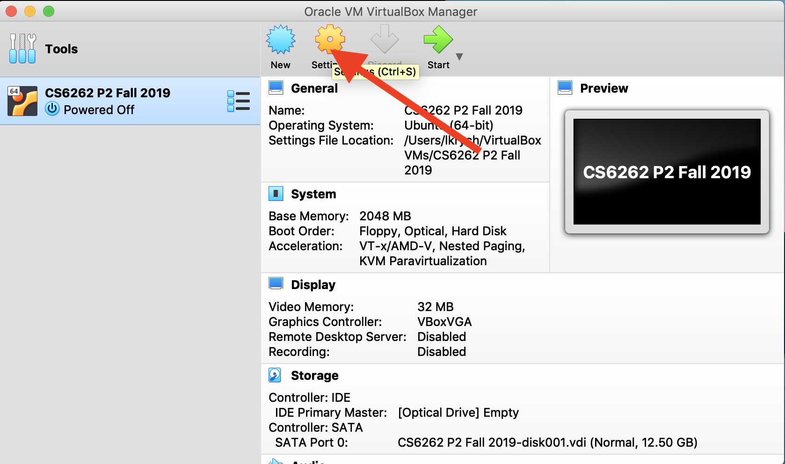
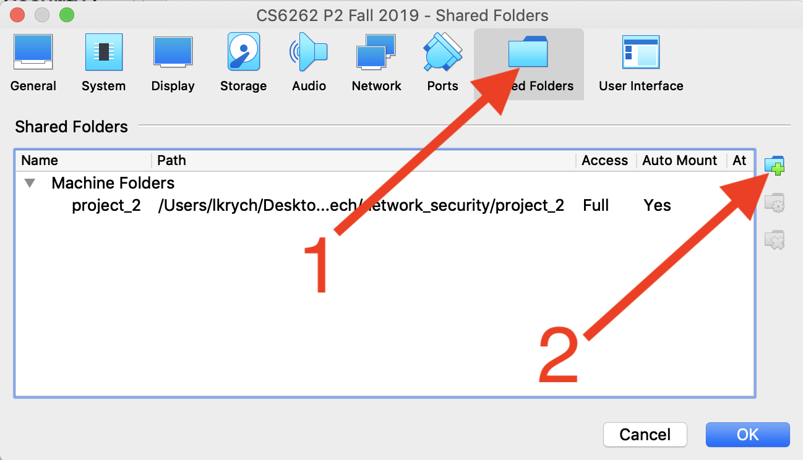
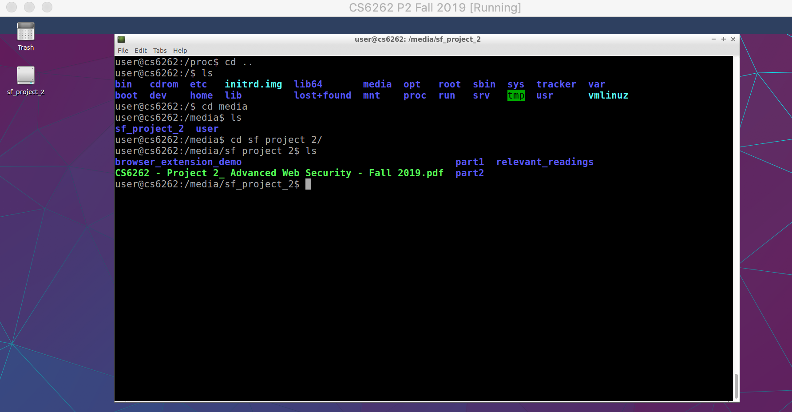

# Share Files Between Host and VM

1. Click settings

1. In the dialog, click shared folders, and then add a new folder

1. Find the folder you want to share and select auto-mount
2. Navigate to /root/media to find your shared files!

