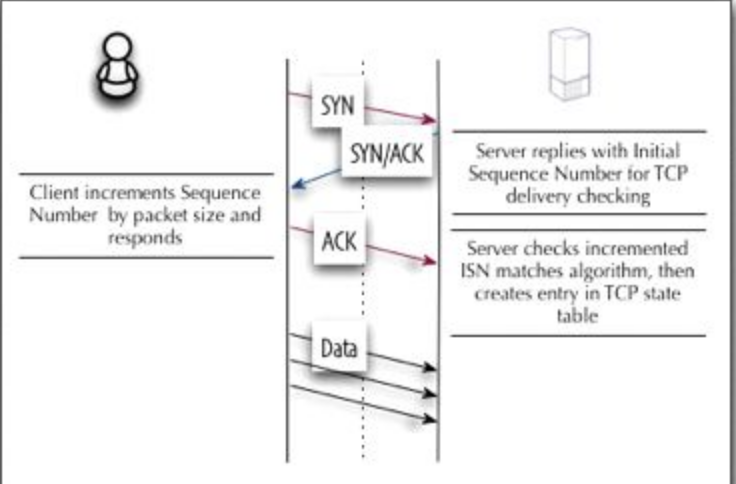

# Week 1 - DDoS Attacks and Cybercrimes

Video Lectures

**Random Scanning** - Each compromised computer probes random addresses

**Permutation Scanning - **All compromised computers share a common pseudo-random permutation of the IP address space

**Signpost Scanning - **Uses the communication patterns of the compromised computer to find new targets

**Hitlist Scanning -** a portion of a list of targets is supplied to a compromised computer

**Subnet Spoofing - **Generate random addresses within a given address space

**Random Spoofing - **Generate 32-bit numbers and stamp packets with them

**Fixed Spoofing - **The spoofed address is the address of the target

**Network DoS**: Take out a large site with little computing. How? With amplification. Can happen at any layer.

What are the two types of **amplification attacks**?

1. DoS bug
2. DoS flood: Flood of packets to a server.

**Network Time Protocol **(NTP) - UDP-based, Used to synchronize machines and their clocks. _Why is this protocol especially vulnerable to amplification attacks?_

* NTP is client-server based, and the request for the time is much smaller than the response. The data sent/received is 
* It is vulnerable to source IP spoofing
* It is difficult to ensure that clients only communicate with legitimate NTP servers

What is a DNS amplification attack?

* Similar to NTP, there is an asymmetry in data sent/received from DNS clients and DNS servers. A DNS query of 60 bytes can trigger an EDNS (extended DNS) response of 3000 bytes from a server.
* In a DNS amplification attack, a malicious user spoofs a DNS request to many open DNS  servers across the internet. The requests then get redirected to an unwitting victim

What about the **IP protocol** makes it susceptible to attack?

* There is no authentication of the source IP address in the IP header

What about the **TCP protocol **makes it susceptible to attack?

* The TCP handshake requires the exchange of three messages, the SYN from the client, the SYN/ACK from the server, and the final ACK from the client to let the server know the connection has been established

* In a TCP SYN Flood - Many connections are established by a malicious user, causing the server to set aside memory for each connection. The servers memory can get filled up and no more connections can be made

How do you defend against low-rate SYN Flood attacks?

* SYN cookies. What is a SYN Cookie?
* A SYN Cookie is a specific choice of initial TCP sequence number by TCP software. In normal operation, a Client sends a SYN and the server responds with a SYN/ACK message, the server will then hold state information in the TCP stack while waiting for the Client ACK. By specifically calculating the TCP sequence number with a specific, secret math function in the SN/ACK response, the server does not need to maintain the TCP stack state table. On receipt of the ACK from the client, the TCP sequence number is checked against the function to determine if it is a legitimate reply. If the check is successful, the server will create the TCP session. 
* 

* SYN cookies: remove state from server, this comes with small performance overhead.
* SYN cookies do not require modified version of TCP or lead to overall slower performance
* SYN cookies cause the server to reject all TCP options because the server discards the SYN queue entry

TCP SYN Floods can also be used to initiate **Distributed Denial of Service **(DDoS) attacks.

* These attacks can use large botnets to generate huge amounts of traffic that can saturate websites and even network routers.
* It is difficult to prevent these attacks because with spoofed IPs they look like real SYNs

How do you defend against DDoS attacks?

* Use powerful
* The fatal flaw of this solution is that the botnet can set up a complete TCP connection and then flood the site with application-level (HTTP) requests
* However, if the attacker chooses this path, because it has made a full connection, it has to use the IP of the bots. Then the proxy can rate-limit and block these IPs

Can firewalls stop a UDP flood attack?

* Only if they block all UDP traffic. Otherwise the UDP packets could have spoofed IP addresses and look legitimate.

What is route high-jacking?

* When routers direct traffic to the wrong place. This can happen if legitimate routers publish incorrect addresses and other routers see these mistakes and advertise them (BGP)

Above is a diagram of how key exchange happens to set up secure connections. Everything is legitimate from a crypto point-of-view. Why then is it susceptible to DoS attacks?

* RSA Decrypt is 10 times more computationally-intensive than RSA encrypt. Attackers can flood servers with handshakes.
* Similarly, at the application level, clients can ask for really large PDF/JPEG files with a simple HTTP request.

WTF is a Client Puzzle?

* The idea of CPs is to require all clients connecting to a server to correctly solve a mathematical puzzle before establishing a connection if the server is under attack. The puzzle is simple and easily solvable but requires at least a minimal amount of computation on the client side.

* A form of DoS mitigation
* They should be stateless
* Puzzle complexity should increase as the strength of an attack increases
* Ex: CAPTCHA?
* During a DoS, a server can generate CAPTCHAs/puzzles and only process requests if a valid solution is presented

Source Identification is another type of DoS mitigation. Can you explain some different means of source identification?

    Note: information is from _Practical Network Support for IP Traceback (2000)_

* **Ingress Filtering - **
* **Input Debugging - **A victim recognizes an attack signature that describes a common feature in all the attack packets, it then contacts the network operator to filter particular packets and determine which ingress port they arrived in. This helps isolate  an upstream router. This solution is used recursively on the upstream router to track down the attacker. This approach has considerable management overhead.
* **Controlled Flooding - **
* **Logging - **log packets at key routers and 
* **ICMP Traceback - **
* **Packet marking -** Probabilistically mark packets with partial path information as they arrive at routers. Reconstruct the path attacker packets has traversed using these labels.

What is the **edge-sampling traceback algorithm**?

* An algorithm that probabilistically marks packets as they traverse routers through the internet. With edge-sampling, two nodes that make up an edge (connection between two routers) mark the path with their IP addresses along with the distance between them. This makes convergence of the traceback faster

What is a **reflector attack**? How can they avoid traceback?

* Traceback requests will be traced back to the reflectors (DNS, Web, Gnutella servers), these servers probably didn't mark where the incoming request came from.

What is** Capability-Based Defense**?

* A token-based defense that requires each packet sent to a receiver to demonstrate that it was requested by a receiver. In this defense, routers can identify wanted packets and discard unwanted ones.

Assigned Reading
