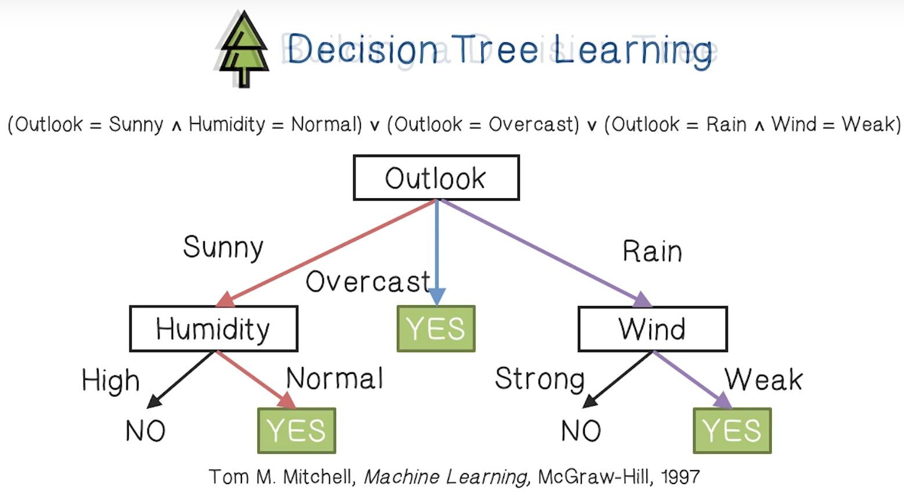
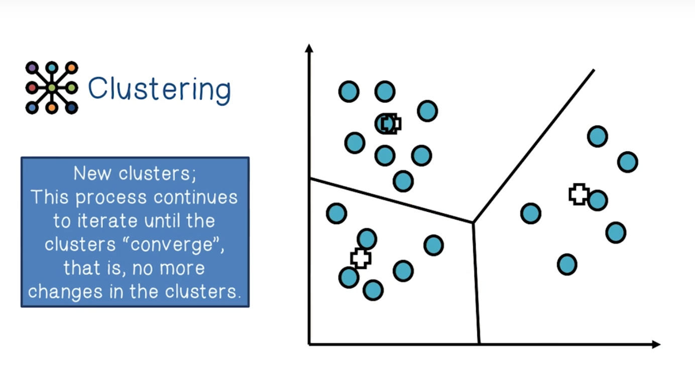
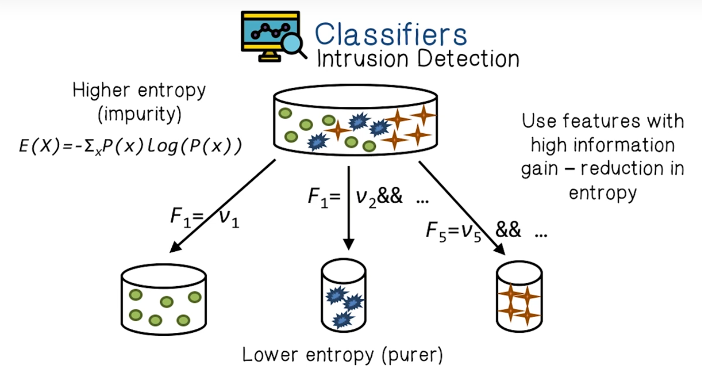
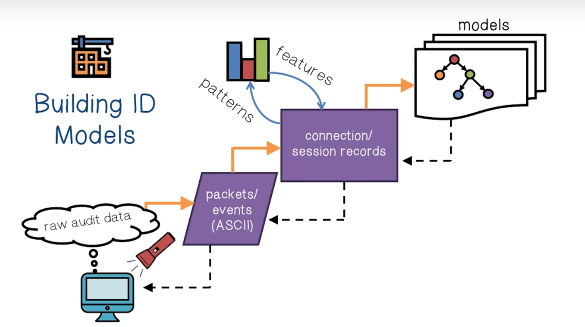
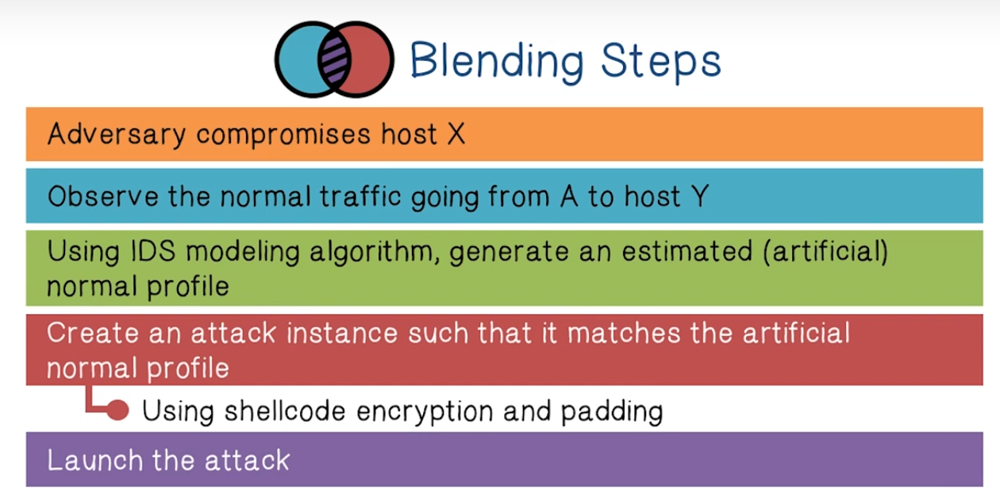
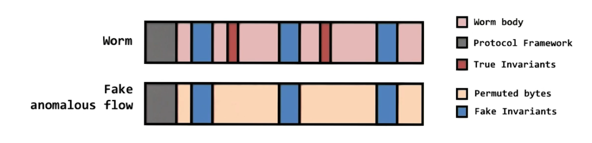
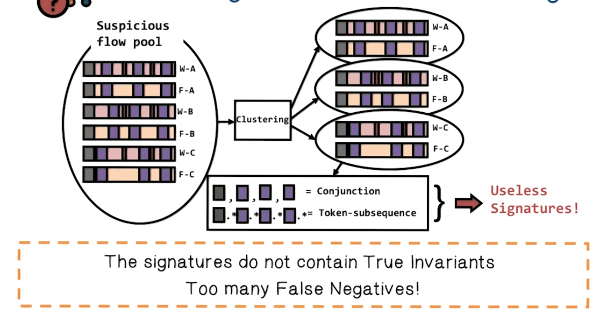
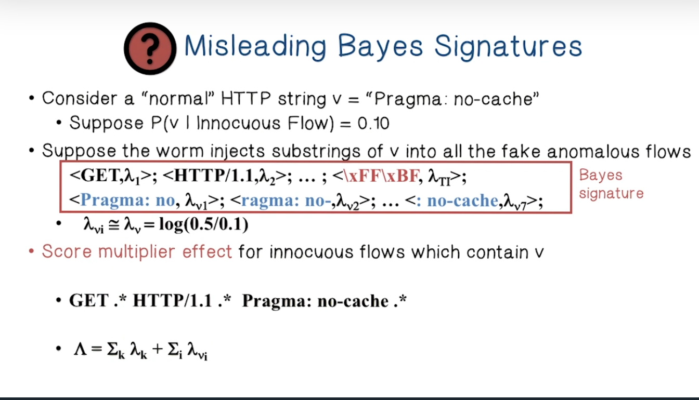

# Week 10 ML for Security

Quiz 9 - Nov 11

ML for Security Lectures

Data Poisoning and Model Evasion Lectures

Reading Constructing features for IDS

**ML for Security Lectures**

The goal of machine learning in network security is to automatically identify new attacks.

Machine Learning is the process of creating a prediction function concerning a certain output. We create the function by minimizing the prediction error on a training set. 

In the real world a commonly used process for segmenting data involves drawing from the data randomly and segmenting it into either training data or test data. 

**Features** are a measurable property of a dataset and they are applications dependent. For images they could be raw pixels, histograms, etc.

Performance Measures in Machine Learning

* Error Rate -  Fraction of false predictions
* Accuracy - Fraction of correct predictions
* Precision - Fraction of correction predictions among all examples predicted to be positive
* Recall - Fraction of correct predictions among all real positive examples.

Decision Tree Learning - A set of training examples is repeatedly partitioned until all the examples in each partition belong to one class. It can be thought of as a set of rules that organize the data. 

The process of building a decision tree involves selecting the best features to serve as a root. Then we break up the training set into subsets based on the branch of the root node. We then recursively generate new branches by determining which remaining features are most determinative.

How do we determine which attribute is best?

* **Entropy **

In order to determine which attribute is best at partitioning a set we compute its **information gain, **how good it is at separating samples  according to their classification. 

Clustering - can also be used for classification. They construct categories that optimize the distance or similarity function between categories. That is, examples in a cluster are more similar to each other than examples from different clusters.

What is the process of creating classifiers for Intrusion detection?

1. Capture Raw Data (tcpdump packet data could be used)
2. Summarize the data into connection records
3. Construct features with high information gain, use temporal and statistical patterns.

Importantly, when designing features, we need to find ones that are "relevant". There are many associated events in network activity, but not all of them are useful for detecting malicious events.

We classify our features/attributes as **axis** attributes or **reference** attributes.

An **axis** attribute is the** most important** attribute. 

A **reference** attribute is a sequence of **related** attributes to the axis attribute

**Attacking Machine Learning Lectures**

There are two types of attacks on Machine Learning:

* **Exploratory Attack**
* **Causative (Data poisoning) Attack**

**PAYL (Payload-based anomaly detection system) **measures and models the frequency distribution of n-grams in payloads of each network service. The intuition here is that each service delivered to a host has unique characteristics and that a malicious attack would look very different from typical network traffic.

**Polymorphic Attacks** can change appearance with each instance, they do not have a predictable signature. The Attack body which contains the malicious code can be transformed or encrypted, and typically the attack bundles a decryptor so the code can be transformed back into its malicious nature. However, the network payloads that contain the attack code/decryptor tend to be large, so an anomaly detection engine can sometimes detect them.

**Polymorphic Blending Attacks **try to evade this detecting by mimicking legitimate traffic and distributing the byte frequency of their payload as such. The most important step is to transform the attack code into unsuspicious bytes so that they match a desired byte frequency.

Clever malware designers use fake anomalous flows to create noise in IDS systems. This is known as a noise injection attack.

Injecting fake invariants defeats hierarchical clustering. 

Injecting normal substrings into fake anomalous flows artificially inflates innocuous flows.

