# Week 11 Bitcoin and Cryptographic functions

**Hash functions...**

* Are easy to compute
* Can compute message digest of data of any size
* Produce a fixed length output
* **One-way**
* Designed to be collision resistant

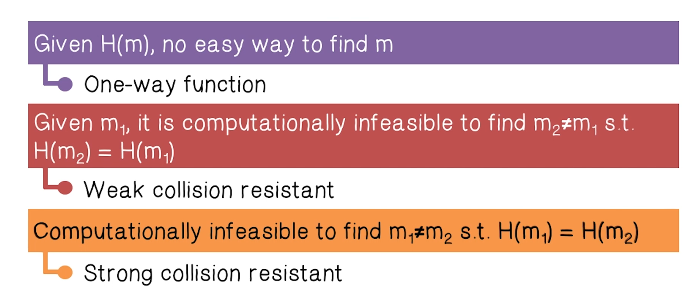

**Hash Pointe**r is a data structure that contains a pointer to where some info is stored (like a normal pointer), but also a cryptographic hash of the info that is stored. 

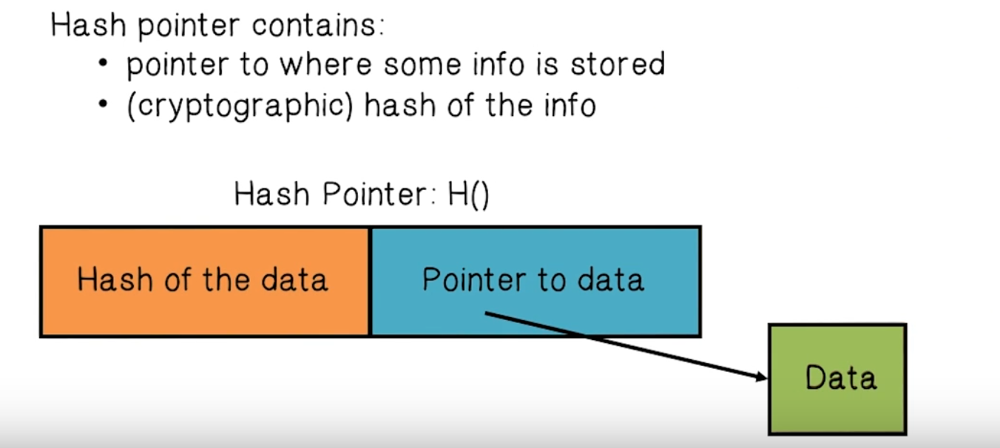

The hash allows us to** verify** that the data that is being pointed to **hasn't changed**.

The "**Block Chain**" is a linked list of Hash Pointers.

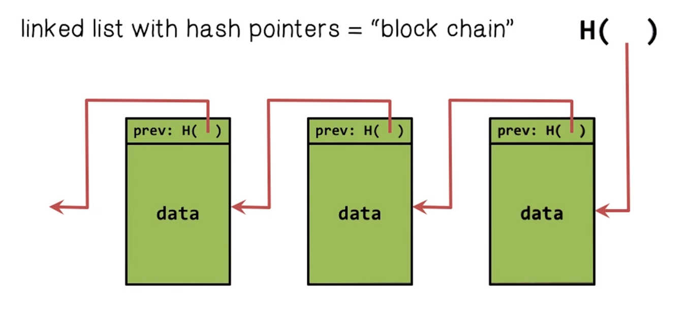

The genius of this setup is that modifying any piece of the block chain will require requisite changes to all the other components for it to be valid. 

With **Digital Signatures **only the owner of the private key can sign, but anyone can verify that the owner signed (because they can use the owners public key). 

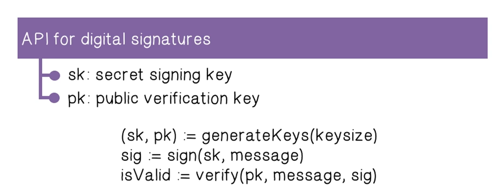

The requirements for Digital signatures are that they can be verified and that you can't forge the signatures. 

Public Keys can be used as **identities**. 

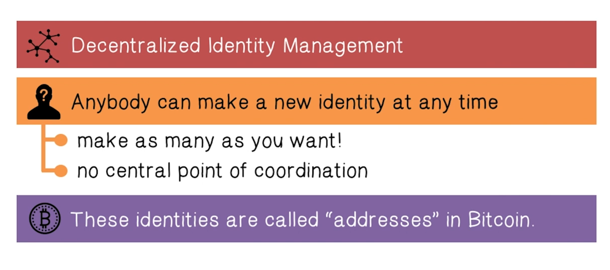

How cryptocurrency is made: Goofycoin

There are two rules to goofy coin, Goofy can create new coins, and goofy gets to keep the coins.

Goofy computes the digital signature of the string CreateCoin[uniquecoinId] using his private signing key. Now anyone can verify with his public key that he created the coin.

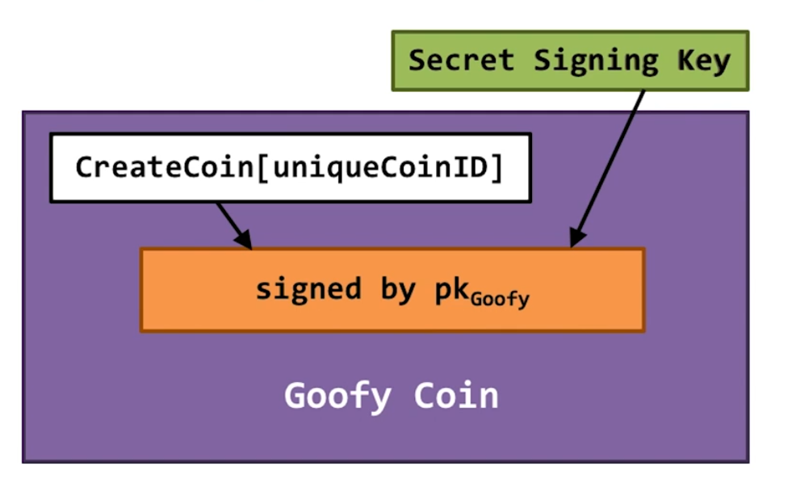

To send a coin to someone else Goofy creates a new statement that includes the public key to whoever he wants to transfer to and a hash pointer to the coin that he created. He signs it with his private key.

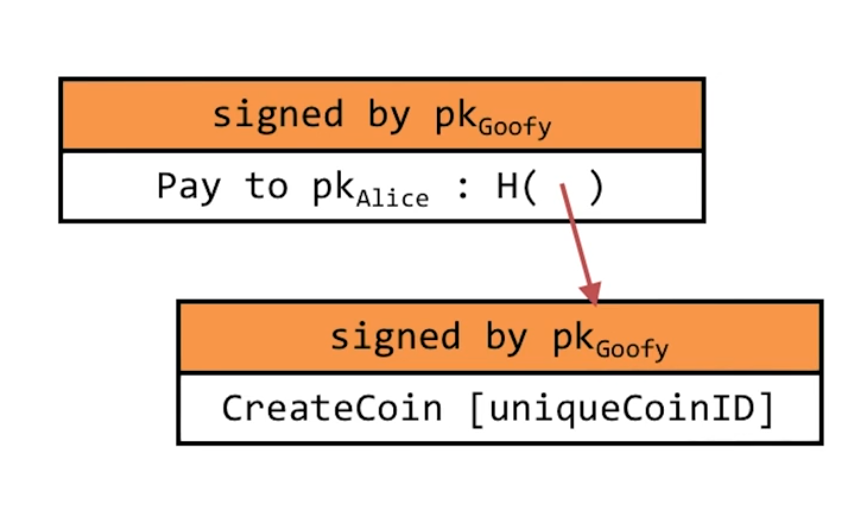

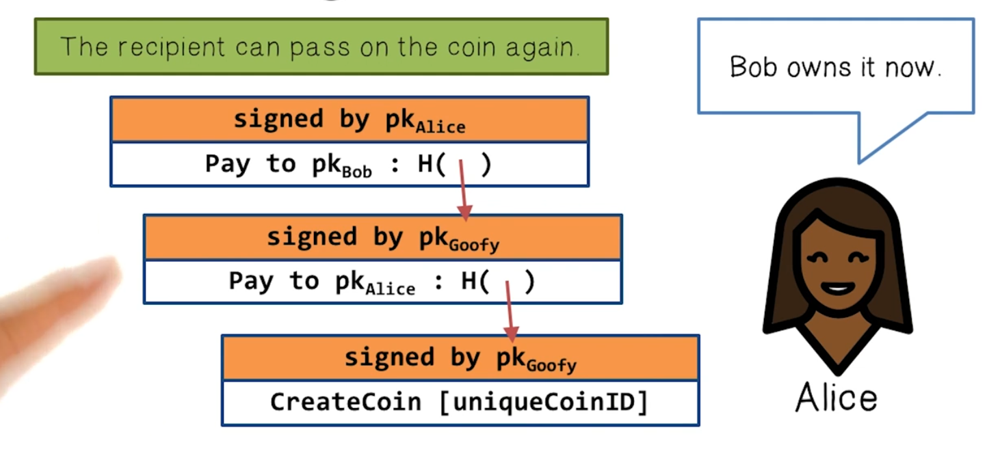

At each step, you can verify that someone owned the coin.

**Double spending attacks** are one of the main design challenges in digital currency.

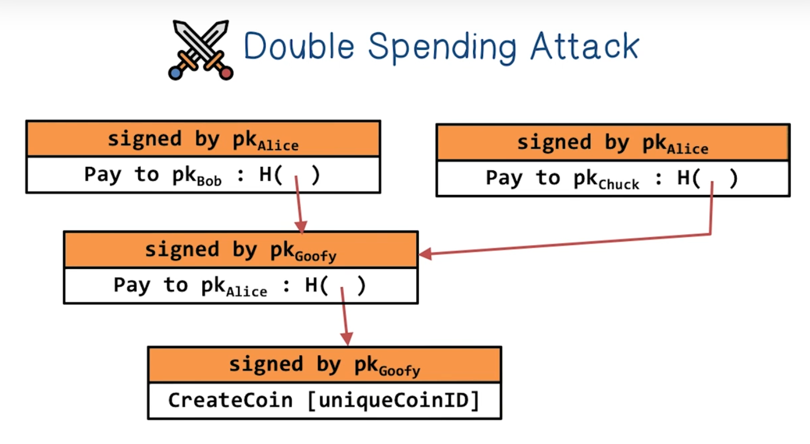

So how do you solve the double spending problem?

Let's talk about Scrooge Coin. With Scrooge Coin a designated entity publishes an **append-only ledger** containing the history of all the transactions that have happened. To prevent the double-spending attack, we require that all transactions are written to the ledger before they are accepted. That way it will be visible to everyone if a coin has already been spent. 

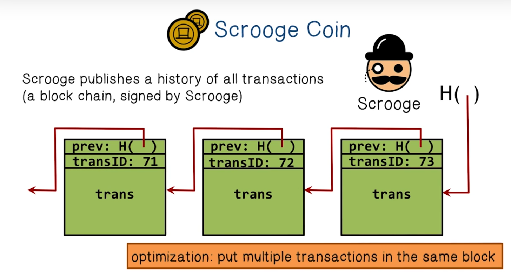

In Scrooge Coin there are two kinds of transactions:

* Creating coins
* Payments

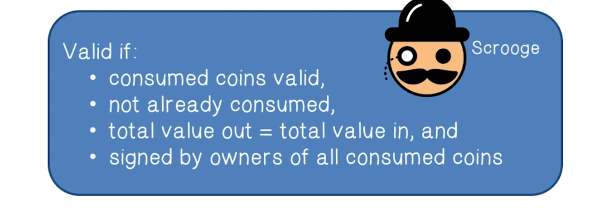

The core problem with Scrooge Coin is that Scrooge has **too much influence**. Can we **decentralize** cryptocurrencies? To do this we have to have all users agree on a single published blockchain and agree on which transactions are valid. There needs to be decentralization of ID assignment and mining of new coins.

Since there is no centralized authority bitcoin, **distributed consensus** is critical. When Alice wants to pay Bob, she broadcasts the transaction to all bitcoin nodes. The consensus usually takes about an hour to compute.

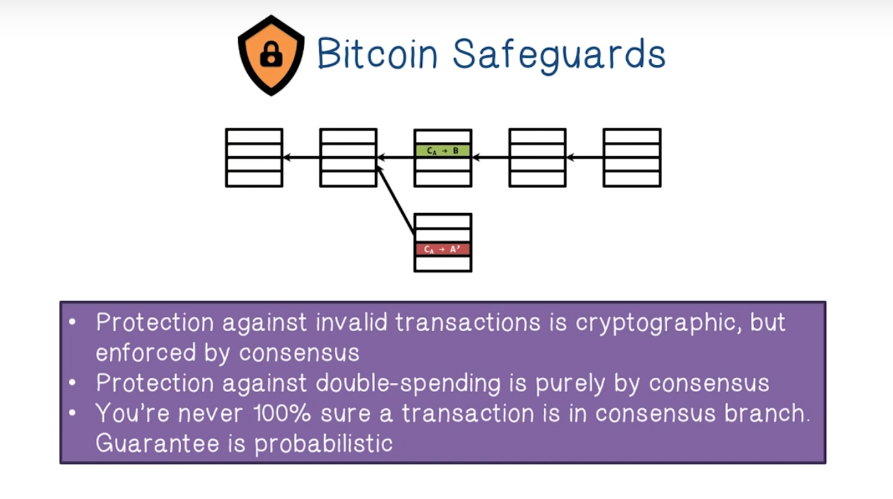

Bitcoin rewards nodes for behaving honestly.

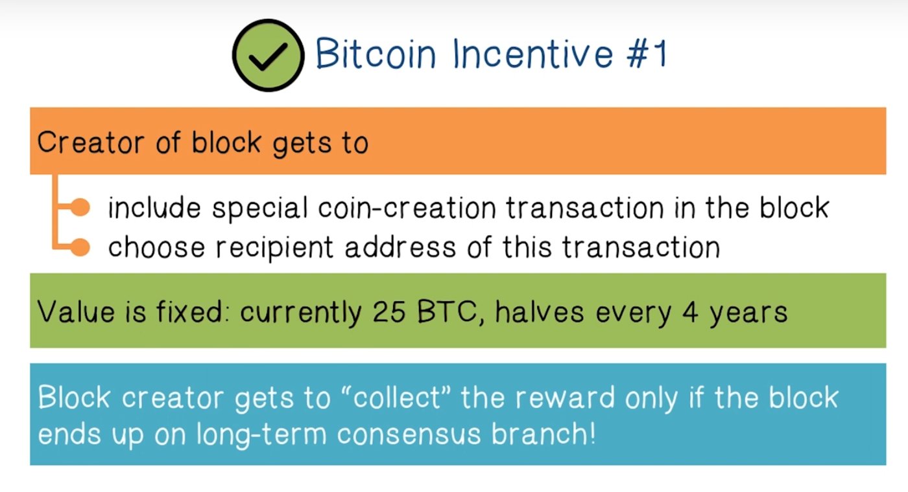

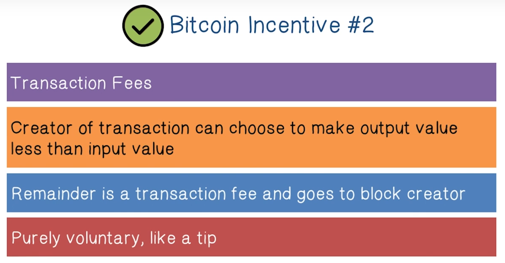

Fundamentally, security with Bitcoin is all about **key management**. Your key pair is your way of verifying that coins belong to you. Your key store is as secure as your device.

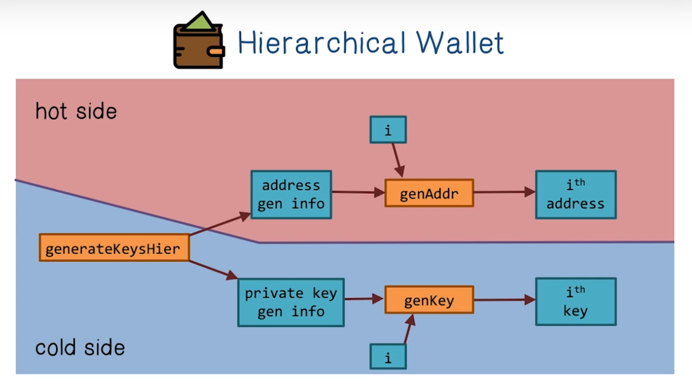

The hot side generates a new address when it wants to store a coin offline (cold side).  It can also generate a key so that it can send coins back to the hot side.

A **Merkle Tree** is a binary tree that is built with hash pointers. 

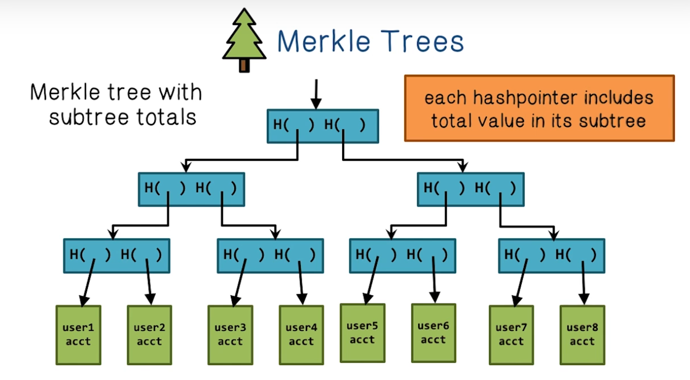

An exchange uses Merkle Trees to claim the proof of reserve, or that certain people have exchanged bitcoins there. 

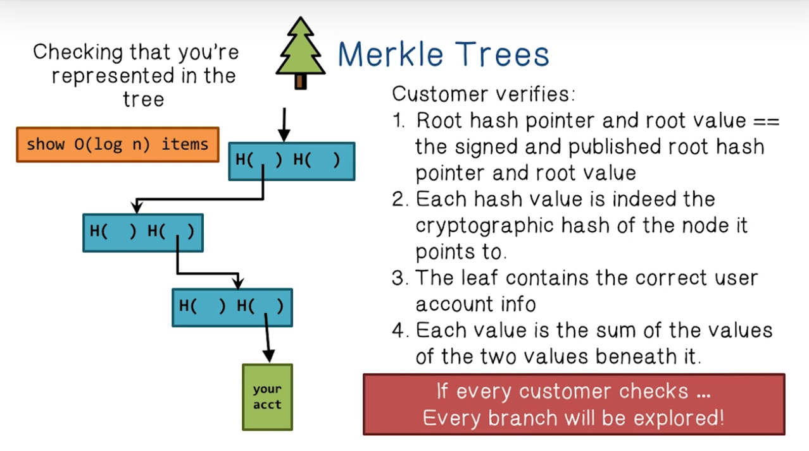

**Decentralized Mixing** is a technique used to reduce the likability of bitcoin transactions. The basic idea is to pool transactions into a single transaction.

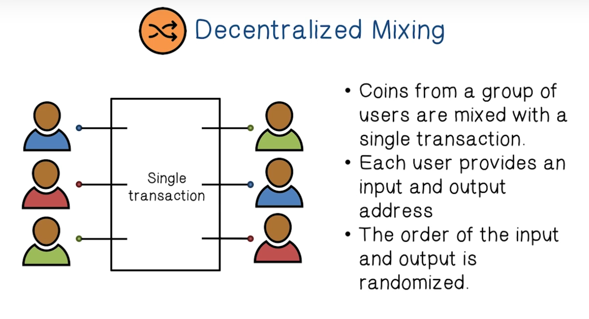
